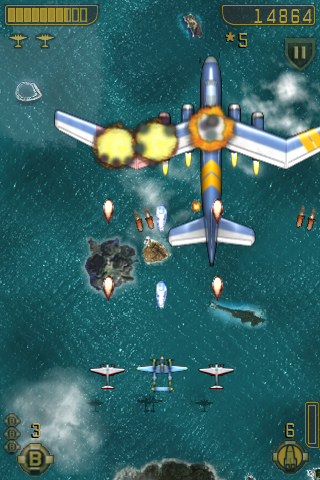

# Adaptación a móviles

Una de las principales problemáticas en el desarrollo de dispositivos móviles es la
gran diferencia de tamaños de pantalla existentes, con distinta resolución y relación de aspecto. 
Esto plantea diferentes problemas:

* **Tamaño de los recursos**: Con esto nos referimos a la resolución que deberían tener recursos como los _sprites_ o _tilemaps_. Un enfoque sencillo podría ser proporcionar 
estos recursos a resolución máxima, para así aprovechar las pantallas de mayor resolución. 
El problema es que los dispositivos con menor resolución disponen también de una menor
memoria de vídeo, por lo que es probable que no puedan albergar las texturas necesarias en resolución
máxima. Por este motivo será conveniente proporcionar diferentes versiones de los recursos
para diferentes resoluciones de pantalla.
* **Sistema de coordenadas**: Debemos evitar utilizar un sistema de coordenadas
en pixels, ya que el tamaño de la pantalla cambiará en cada dispositivo. Lo que se hará es utilizar 
siempre un sistema de coordenadas del mismo tamaño independientemente de la resolución
del dispositivo en el que se vaya a ejecutar el juego. Hablaremos en este caso de un sistema de coordenadas en puntos (en lugar de pixels). El tamaño de cada punto dependerá de la resolución real de la pantalla del dispositivo utilizado.
* **Relación de aspecto**: A pesar de trabajar en puntos para que las dimensiones del sistema de coordenadas utilizado sean siempre las mismas, tenemos el problema
de que la relación de aspecto puede ser distinta. Para resolver esto podemos añadir un borde cuando la relación de aspecto del dispositivo no coincide con la que se ha utilizado en el diseño, estirar la pantalla a pesar de deformar la imagen, o bien recortarla en alguna de sus dimensiones. Esta última opción será la más adecuada, pero deberemos llevar cuidado de hacerlo de forma correcta y diseñar el juego de forma que sobre suficiente espacio como para que se pueda aplicar el recorte sin problemas.

Vamos a ver a continuación cómo implementar todo lo anterior en Cocos2d-x.

## Resoluciones de recursos, diseño y pantalla

Para resolver el problema de los distintos tamaños de pantalla en Cocos2d-x lo que haremos será definir tres resoluciones distintas:

* **Resolución de recursos**: Resolución para la que están preparados los recursos utilizados.
* **Resolución de diseño**: Resolución para la que hemos diseñado el juego. Será esta resolución la que utilizaremos en el código del juego (resolución en puntos).
* **Resolución de pantalla**: Resolución real de la pantalla del dispositivo.

En el objeto `AppDelegate` se inicializa el juego. Este es un buen punto para configurar las resoluciones anteriores. Por ejemplo, podemos definir esta configuración de la siguiente forma:

```cpp
CCSize screenSize = CCEGLView::sharedOpenGLView()->getFrameSize();
CCSize designSize = CCSizeMake(480, 320);
CCSize resourceSize = CCSizeMake(960, 640);

// Establecemos la resolución de recursos
pDirector->setContentScaleFactor(resourceSize.width / designSize.width);

// Establecemos la resolución de diseño (puntos)
cocos2d::Director::getInstance()->getOpenGLView()->setDesignResolutionSize(320, 480, ResolutionPolicy::FIXED_WIDTH);
```

En este ejemplo hemos especificado:

* **Resolución de recursos**: 960 x 640
* **Resolución de diseño**: 480 x 320

Las reglas que seguiremos para trabajar con estas resoluciones son:

* En el código del juego siempre utilizaremos la **resolución de diseño**. Es decir, en el ejemplo anterior consideraremos que siempre tenemos una resolución de 480 x 320 puntos al posicionar _sprites_, ubicar elementos del HUD, mostrar elementos del escenario, etc. El contenido que hayamos dibujado en el espacio de diseño se estirará para ocupar toda la pantalla. 
* La **resolución de recursos** nos indica la resolución de pantalla para la que están preparados los recursos en el caso ideal, es decir, en el que cada píxel de la imagen del recurso corresponde exactamente a un píxel en pantalla. En el caso de nuestro ejemplo, la resolución para la que están preparados los recursos es el doble que la resolución de diseño. Es decir, un _sprite_ cuya imagen tenga 128 x 128 pixels está pensado para que se dibuje con su tamaño original en una pantalla de 960 x 640, por lo que en el espacio de diseño de 480 x 320 ocupará un espacio de 64 x 64 puntos. Si la resolución real de pantalla es de 480 x 320, coincidiendo con la resolución de diseño, el _sprite_ tendrá que escalarse a mitad de tamaño, en caso de tener una resolución de pantalla de 960 x 640 el _sprite_ se mostraría en su tamaño real con todos sus _pixels_ (aunque en el código lo posicionemos y obtengamos su tamaño en puntos), mientras que con una pantalla de 1920 x 1280 tendría que escalarse al doble de su tamaño. 

Con esto podemos ver que aunque trabajemos con una resolución de diseño pequeña, esto no implica que el juego se vaya a ver con poca resolución. Ésta resolución de diseño simplemente es un sistema de coordenadas de referencia para situar los objetos en la escena. La resolución que realmente determinará la definición de los gráficos del juego es la resolución de recursos. 

Con el método `Director::setContentScaleFactor` estableceremos la relación existente entre la relación de recursos y la de diseño. Por ejemplo, si la resolución de recursos es el doble que la de diseño, el factor de escala será 2. En caso de que la relación de aspecto de estas resoluciones no coincidiese, tendríamos que decidir si tomar como referencia el alto o el ancho de la imagen a la hora de calcular el factor de escala.

```cpp
// Tomamos como referencia el ancho
pDirector->setContentScaleFactor(resourceSize.width / designSize.width);

// Tomamos como referencia el alto
pDirector->setContentScaleFactor(resourceSize.height / designSize.height);
```

## Gestión de recursos

En el apartado anterior hemos visto cómo establecer la resolución de los recursos. Sin embargo, como ya hemos comentado anteriormente, es difícil tener una única resolución de recursos que sea adecuada para todos los dispositivos: dispositivos de alta densidad necesitan recursos con mayor resolución para aprovechar la densidad de pantalla, y dispositivos con menor densidad de pantalla normalmente tienen una memoria de vídeo más limitada donde puede que no quepan los recursos necesarios. Por ello es conveniente suministrar diferentes versiones de los recursos.

Para soportar distintas versiones de un mismo recurso lo que haremos es guardarlo en diferentes directorios pero con el mismo nombre de fichero.
Por ejemplo, podemos crear un directorio `sd` para la versión normal y otro directorio `hd` para la versión para dispositivos de alta resolución. Ambos directorios tendrán los mismos ficheros de texturas, pero con distintas resoluciones. Lo que deberemos hacer es indicar al motor dónde buscar los recursos en función de la resolución:

```cpp
CCSize screenSize = CCEGLView::sharedOpenGLView()->getFrameSize();

std::vector<std::string> searchPaths;

if (screenSize.height > 320) { // iPhone retina
    searchPaths.push_back("hd");
    searchPaths.push_back("comun");
}
else { // iPhone
    searchPaths.push_back("sd");
    searchPaths.push_back("comun");
}
CCFileUtils::sharedFileUtils()->setSearchPaths(searchPaths);
```

En el ejemplo anterior, en el caso del iPhone retina buscará primero los recursos en el directorio `hd`, y si no los encuentra ahí buscará en `comun`. En caso caso de tener menor resolución buscará primero en `sd` y después en `comun`.

Una vez decidida la versión de los recursos que se va a utilizar, deberemos indicar al motor la resolución de recursos correcta para que así los escale de forma adecuada:

```cpp
CCSize screenSize = CCEGLView::sharedOpenGLView()->getFrameSize();
CCSize designSize = CCSizeMake(480, 320);
CCSize resourceSize;
std::vector<std::string> searchPaths;

if (screenSize.height > 320) { // iPhone retina
    searchPaths.push_back("hd");
    searchPaths.push_back("comun");
    resourceSize = CCSizeMake(960, 640);          
}
else { // iPhone
    searchPaths.push_back("sd");
    searchPaths.push_back("comun");
    resourceSize = CCSizeMake(480, 320);
}
CCFileUtils::sharedFileUtils()->setSearchPaths(searchPaths);
pDirector->setContentScaleFactor(resourceSize.width / designSize.width);

cocos2d::Director::getInstance()->getOpenGLView()->setDesignResolutionSize(320, 480, ResolutionPolicy::FIXED_WIDTH);
```


## Estrategias de adaptación

Con el método `setDesignResolutionSize` establecemos la resolución de diseño a utilizar en el juego. Además el tercer parámetro permite indicar la forma de adaptar la resolución de diseño a la resolución de pantalla cuando la relación de aspecto de ambas resoluciones no coincida. Encontramos las siguientes estrategias:

* `ResolutionPolicy::SHOW_ALL`: Hace que todo el contenido de la resolución de diseño quede dentro de la pantalla, dejando franjas negras en los laterales si la relación de aspecto no es la misma. Estas franjas negras hacen que desperdiciemos espacio de pantalla y causan un efecto bastante negativo, por lo que a pesar de la sencillez de esta estrategia, **no será recomendable** si buscamos un producto con un buen acabado.
* `ResolutionPolicy::EXACT_FIT`: Hace que el contenido dentro de la resolución de diseño se estire para adaptarse a la resolución de pantalla, deformando el contenido si la relación de aspecto no es la misma. Aunque en este caso se llene la pantalla, la deformación de la imagen también causará muy mal efecto y por lo tanto debemos **evitar utilizar esta técnica**.
* `ResolutionPolicy::NO_BORDER`: Ajusta el contenido de la resolución de diseño a la resolución de pantalla, sin dejar borde y sin deformar el contenido, pero dejando parte de éste fuera de la pantalla si la relación de aspecto no coincide. En este caso no habrá problema si implementamos el juego de forma correcta, ayudándonos de los métodos `Director::getInstance()->getVisibleSize()` y `Director::getInstance()->getVisibleOrigin()` que nos darán el tamaño y el origen, respectivamente, de la zona visible de nuestra resolución de diseño. De esta forma deberemos asegurarnos de dibujar todos los componentes del HUD dentro de esta zona, y a la hora de implementar _scroll_ lo alinearemos de forma correcta con el origen de la zona visible. 
* `ResolutionPolicy::FIXED_HEIGHT`, `ResolutionPolicy::FIXED_WIDTH` modifican la resolución de diseño para que tenga la misma relación de aspecto que la resolución de pantalla, manteniendo fija la altura o la anchura de diseño respectivamente. Podremos consultar la resolución de diseño con `Director::getInstance()->getWinSize()`. En estos casos toda la resolución de diseño es visible en pantalla, pero ésta puede variar en altura o en anchura, según la estrategia indicada. 

¿Qué estrategia debemos utilizar? Dependerá de lo que busquemos en nuestro juego, pero normalmente nos quedaremos con `NO_BORDER`, `FIXED_HEIGHT` o `FIXED_WIDTH`. Por ejemplo, si tenemos un plataformas de avance lateral, normalmente querremos que la altura sea fija, por lo que `FIXED_HEIGHT` podría ser la opción más adecuada. Si por el contrario es un juego de naves que avanza hacia arriba, será más adecuado `FIXED_WIDTH`. En un juego de rol con vista cenital con _scroll_ en cualquier dirección y el personaje centrado en pantalla podría venir bien `NO_BORDER`, nos da igual la parte que quede cortada siempre que en el caso de haber HUD nos aseguremos de dibujarlo dentro de la zona visible. 




## Depuración del cambio de densidad de pantalla

Para comprobar que nuestra aplicación se adapta de forma correcta podemos utilizar diferentes tamaños de ventana durante el desarrollo. Sin embargo, también será necesario comprobar lo que ocurre al tener diferentes densidades de pantalla, teniendo algunos dispositivos resoluciones superiores a la de nuestra máquina de desarrollo. 


Para resolver este problema podemos utilizar la función `GLView::setFrameZoomFactor`. Con esta función podemos aplicar un factor de _zoom_ al contenido de la ventana. De esta forma podemos tener altas resoluciones, como los 2048x1536 pixeles de un iPad retina, dentro del espacio de nuestra pantalla.

Esta función deberá invocarse únicamente en el código específico de la plataforma de desarrollo (Windows, Linux o Mac). Por ejemplo, en el caso de Mac añadiremos las siguientes líneas al fichero `AppDelegate.cpp`:

```cpp
bool AppDelegate::applicationDidFinishLaunching() {
    // initialize director
    auto director = Director::getInstance();
    auto glview = director->getOpenGLView();
    if(!glview) {
        glview = GLViewImpl::create("Mi Juego");
        director->setOpenGLView(glview);
    }

    // Depuracion multi-resolucion
    GLView* eglView = Director::getInstance()->getOpenGLView();
    eglView->setFrameSize(1536, 2048);
    eglView->setFrameZoomFactor(0.4f);
    
    // Soporte multi-resolucion
    cocos2d::Director::getInstance()->getOpenGLView()->setDesignResolutionSize(768, 1024, ResolutionPolicy::FIXED_WIDTH);
    
    // turn on display FPS
    director->setDisplayStats(true);

    // set FPS. the default value is 1.0/60 if you don't call this
    director->setAnimationInterval(1.0 / 60);

    // create a scene. it's an autorelease object
    auto scene = TitleScene::createScene();

    // run
    director->runWithScene(scene);

    return true;
}

```

## Compilación condicional

En muchos casos tendremos que poner código que sólo queremos que se incluya para una plataforma determinada. Podemos hacer que se determine en tiempo de compilación si se debe incluir dicho código o no. Para ello podemos incluir bloques condicionales que hagan que sólo se incluya el código al compilar si compilamos para la plataforma indicada.

```cpp
#if (CC_TARGET_PLATFORM == <plataforma>)
    ... // Código condicional
#endif
```

Por ejemplo, en el caso anterior en el que buscábamos emular diferentes resoluciones de móvil en la plataforma Mac para así depurar la adaptación al tamaño de pantalla, podemos hacer que este código para la depuración sólo se incluya para la plataforma Mac:

```cpp
#if (CC_TARGET_PLATFORM == CC_PLATFORM_MAC)
    // Depuracion multi-resolucion
    GLView* eglView = Director::getInstance()->getOpenGLView();
    eglView->setFrameSize(320, 480);
    eglView->setFrameZoomFactor(1.0f);
#endif
```

Podemos introducir código condicional para las diferentes plataformas soportadas:

* `CC_PLATFORM_IOS`
* `CC_PLATFORM_ANDROID` 
* `CC_PLATFORM_WP8` 
* `CC_PLATFORM_BLACKBERRY`  
* `CC_PLATFORM_WIN32`  
* `CC_PLATFORM_LINUX`  
* `CC_PLATFORM_MAC`  

Esto nos permitirá por ejemplo incluir servicios que sólo estarán disponibles en una determinada plataforma, como es el caso de Game Center en iOS.