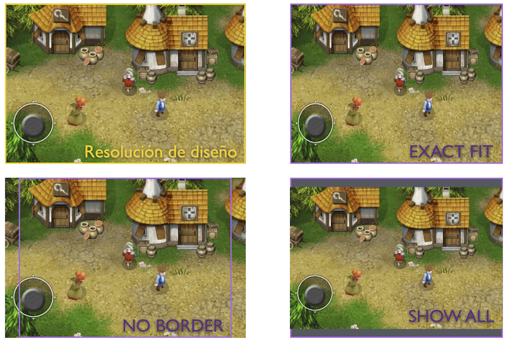
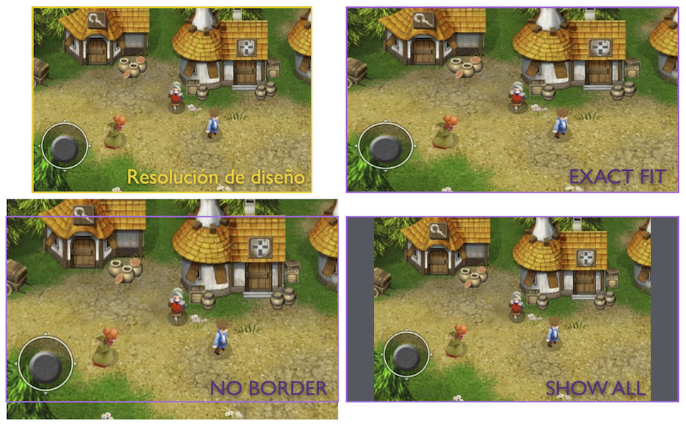
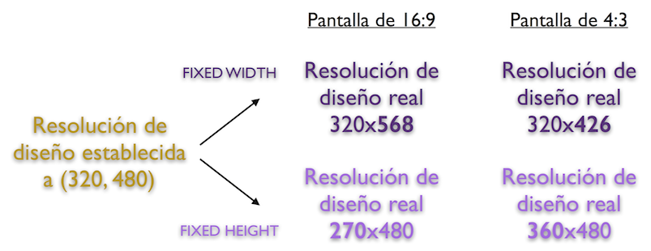
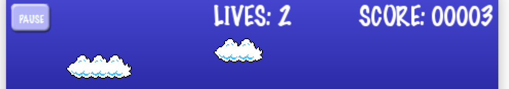
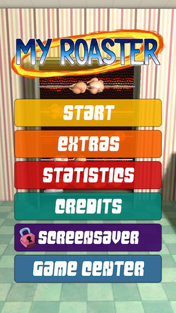
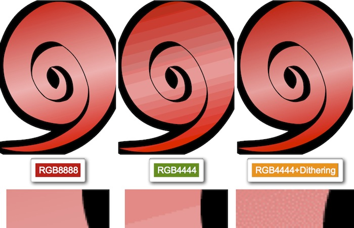

# Adaptación a móviles

Una de las principales problemáticas en el desarrollo de dispositivos móviles es la
gran diferencia de tamaños de pantalla existentes, con distinta resolución y relación de aspecto. Esto plantea diferentes problemas:

* **Tamaño de los recursos**: Con esto nos referimos a la resolución que deberían tener recursos como los _sprites_ o _tilemaps_. Un enfoque sencillo podría ser proporcionar estos recursos a resolución máxima, para así aprovechar las pantallas de mayor resolución. El problema es que los dispositivos con menor resolución disponen también de una menor memoria de vídeo, por lo que es probable que no puedan albergar las texturas necesarias en resolución máxima. Por este motivo será conveniente proporcionar diferentes versiones de los recursos para diferentes resoluciones de pantalla.
* **Sistema de coordenadas**: Debemos evitar utilizar un sistema de coordenadas en pixels, ya que el tamaño de la pantalla cambiará en cada dispositivo. Lo que se hará es utilizar siempre un sistema de coordenadas del mismo tamaño independientemente de la resolución del dispositivo en el que se vaya a ejecutar el juego. Hablaremos en este caso de un sistema de coordenadas en puntos (en lugar de pixels). El tamaño de cada punto dependerá de la resolución real de la pantalla del dispositivo utilizado.
* **Relación de aspecto**: A pesar de trabajar en puntos para que las dimensiones del sistema de coordenadas utilizado sean siempre las mismas, tenemos el problema de que la relación de aspecto puede ser distinta. Para resolver esto podemos añadir un borde cuando la relación de aspecto del dispositivo no coincide con la que se ha utilizado en el diseño, estirar la pantalla a pesar de deformar la imagen, o bien recortarla en alguna de sus dimensiones. Esta última opción será la más adecuada, pero deberemos llevar cuidado de hacerlo de forma correcta y diseñar el juego de forma que sobre suficiente espacio como para que se pueda aplicar el recorte sin problemas.

Vamos a ver a continuación cómo implementar todo lo anterior en Cocos2d-x.

## Resoluciones de recursos, diseño y pantalla

Para resolver el problema de los distintos tamaños de pantalla en Cocos2d-x lo que haremos será definir tres resoluciones distintas:

* **Resolución de recursos**: Resolución para la que están preparados los recursos utilizados.
* **Resolución de diseño**: Resolución para la que hemos diseñado el juego. Será esta resolución la que utilizaremos en el código del juego (resolución en puntos).
* **Resolución de pantalla**: Resolución real de la pantalla del dispositivo.

En el objeto `AppDelegate` se inicializa el juego. Este es un buen punto para configurar las resoluciones anteriores. Por ejemplo, podemos definir esta configuración de la siguiente forma:

```cpp
Size screenSize = director->getOpenGLView()->getFrameSize();
Size designSize(480, 320);
Size resourceSize(960, 640);

// Establecemos la resolución de recursos
director->setContentScaleFactor(resourceSize.width / designSize.width);

// Establecemos la resolución de diseño (puntos)
cocos2d::Director::getInstance()->getOpenGLView()->setDesignResolutionSize(
                                     320, 480, ResolutionPolicy::FIXED_WIDTH);
```

En este ejemplo hemos especificado:

* **Resolución de recursos**: 960 x 640
* **Resolución de diseño**: 480 x 320

Las reglas que seguiremos para trabajar con estas resoluciones son:

* En el código del juego siempre utilizaremos la **resolución de diseño**. Es decir, en el ejemplo anterior consideraremos que siempre tenemos una resolución de 480 x 320 puntos al posicionar _sprites_, ubicar elementos del HUD, mostrar elementos del escenario, etc. El contenido que hayamos dibujado en el espacio de diseño se estirará para ocupar toda la pantalla. 


* La **resolución de recursos** nos indica la resolución de pantalla para la que están preparados los recursos en el caso ideal, es decir, en el que cada píxel de la imagen del recurso corresponde exactamente a un píxel en pantalla. En el caso de nuestro ejemplo, la resolución para la que están preparados los recursos es el doble que la resolución de diseño. Es decir, un _sprite_ cuya imagen tenga 80 x 80 pixels que esté pensado para que se dibuje con su tamaño original en una pantalla de 960 x 640, en un espacio de diseño de 480 x 320 ocuparía un espacio de 40 x 40 puntos. Decimos en este caso que su _factor de escala_ es 2.0, ya cada punto de nuestro espacio de diseño corresponde a 2 x 2 pixels de la imagen del recurso. Si la resolución real de pantalla fuera de 480 x 320, coincidiendo con la resolución de diseño, la imagen del _sprite_ tendrá que escalarse a mitad de tamaño (reduciendo la definición de la imagen original a la mitad, ya que la definición del _sprite_ es mayor de lo que nos permite mostrar la pantalla); en el caso de tener una resolución de pantalla de 960 x 640 el _sprite_ se mostraría en su tamaño real con todos sus _pixels_ (aunque en el código lo posicionemos y obtengamos su tamaño en puntos); y si contamos con una pantalla de 1920 x 1280 el _sprite_ tendría que escalarse al doble de su tamaño (en este caso la resolución del _sprite_ no sería suficiente para aprovechar toda la definición de la pantalla). 


Con esto podemos ver que aunque trabajemos con una resolución de diseño pequeña, esto no implica que el juego se vaya a ver con poca resolución. Ésta resolución de diseño simplemente es un sistema de coordenadas de referencia para situar los objetos en la escena. La resolución que realmente determinará la definición de los gráficos del juego es la resolución de recursos. 

Con el método `Director::setContentScaleFactor` estableceremos la relación existente entre la relación de recursos y la de diseño. Por ejemplo, si la resolución de recursos es el doble que la de diseño, el factor de escala será 2. En caso de que la relación de aspecto de estas resoluciones no coincidiese, tendríamos que decidir si tomar como referencia el alto o el ancho de la imagen a la hora de calcular el factor de escala.

```cpp
// Tomamos como referencia el ancho
director->setContentScaleFactor(resourceSize.width / designSize.width);

// Tomamos como referencia el alto
director->setContentScaleFactor(resourceSize.height / designSize.height);
```

## Gestión de recursos

En el apartado anterior hemos visto cómo establecer la resolución de los recursos. Sin embargo, como ya hemos comentado anteriormente, es difícil tener una única resolución de recursos que sea adecuada para todos los dispositivos: dispositivos de alta densidad necesitan recursos con mayor resolución para aprovechar la densidad de pantalla, y dispositivos con menor densidad de pantalla normalmente tienen una memoria de vídeo más limitada donde puede que no quepan los recursos necesarios. Por ello es conveniente suministrar diferentes versiones de los recursos.

Para soportar distintas versiones de un mismo recurso lo que haremos es guardarlo en diferentes directorios pero con el mismo nombre de fichero.
Por ejemplo, podemos crear un directorio `sd` para la versión normal y otro directorio `hd` para la versión para dispositivos de alta resolución. Ambos directorios tendrán los mismos ficheros de texturas, pero con distintas resoluciones. Lo que deberemos hacer es indicar al motor dónde buscar los recursos en función de la resolución:

```cpp
Size screenSize = director->getOpenGLView()->getFrameSize();

std::vector<std::string> searchPaths;

if (screenSize.height > 320) { // iPhone retina
    searchPaths.push_back("hd");
    searchPaths.push_back("comun");
}
else { // iPhone
    searchPaths.push_back("sd");
    searchPaths.push_back("comun");
}
FileUtils::getInstance()->setSearchPaths(searchPaths);
```

En el ejemplo anterior, en el caso del iPhone retina buscará primero los recursos en el directorio `hd`, y si no los encuentra ahí buscará en `comun`. En caso caso de tener menor resolución buscará primero en `sd` y después en `comun`.

Una vez decidida la versión de los recursos que se va a utilizar, deberemos indicar al motor la resolución de recursos correcta para que así los escale de forma adecuada:

```cpp
Size screenSize = director->getOpenGLView()->getFrameSize();
Size designSize = Size(480, 320);
Size resourceSize;
std::vector<std::string> searchPaths;

if (screenSize.height > 320) { // iPhone retina
    searchPaths.push_back("hd");
    searchPaths.push_back("comun");
    resourceSize = Size(960, 640);          
}
else { // iPhone
    searchPaths.push_back("sd");
    searchPaths.push_back("comun");
    resourceSize = Size(480, 320);
}
FileUtils::getInstance()->setSearchPaths(searchPaths);
director->setContentScaleFactor(resourceSize.width / designSize.width);

director->getOpenGLView()->setDesignResolutionSize(320, 480, ResolutionPolicy::FIXED_WIDTH);
```


## Estrategias de adaptación

Con el método `setDesignResolutionSize` establecemos la resolución de diseño a utilizar en el juego. Además el tercer parámetro permite indicar la forma de adaptar la resolución de diseño a la resolución de pantalla cuando la relación de aspecto de ambas resoluciones no coincida. Encontramos las siguientes estrategias:

* `ResolutionPolicy::SHOW_ALL`: Hace que todo el contenido de la resolución de diseño quede dentro de la pantalla, dejando franjas negras en los laterales si la relación de aspecto no es la misma. Estas franjas negras hacen que desperdiciemos espacio de pantalla y causan un efecto bastante negativo, por lo que a pesar de la sencillez de esta estrategia, **no será recomendable** si buscamos un producto con un buen acabado.
* `ResolutionPolicy::EXACT_FIT`: Hace que el contenido dentro de la resolución de diseño se estire para adaptarse a la resolución de pantalla, deformando el contenido si la relación de aspecto no es la misma. Aunque en este caso se llene la pantalla, la deformación de la imagen también causará muy mal efecto y por lo tanto debemos **evitar utilizar esta técnica**.
* `ResolutionPolicy::NO_BORDER`: Ajusta el contenido de la resolución de diseño a la resolución de pantalla, sin dejar borde y sin deformar el contenido, pero dejando parte de éste fuera de la pantalla si la relación de aspecto no coincide. En este caso no habrá problema si implementamos el juego de forma correcta, ayudándonos de los métodos `Director::getInstance()->getVisibleSize()` y `Director::getInstance()->getVisibleOrigin()` que nos darán el tamaño y el origen, respectivamente, de la zona visible de nuestra resolución de diseño. De esta forma deberemos asegurarnos de dibujar todos los componentes del HUD dentro de esta zona, y a la hora de implementar _scroll_ lo alinearemos de forma correcta con el origen de la zona visible. 
* `ResolutionPolicy::FIXED_HEIGHT`, `ResolutionPolicy::FIXED_WIDTH` modifican la resolución de diseño para que tenga la misma relación de aspecto que la resolución de pantalla, manteniendo fija la altura o la anchura de diseño respectivamente. Podremos consultar la resolución de diseño con `Director::getInstance()->getWinSize()`. En estos casos toda la resolución de diseño es visible en pantalla, pero ésta puede variar en altura o en anchura, según la estrategia indicada. 





¿Qué estrategia debemos utilizar? Dependerá de lo que busquemos en nuestro juego, pero normalmente nos quedaremos con `NO_BORDER`, `FIXED_HEIGHT` o `FIXED_WIDTH`. 

### Estrategia NO_BORDER

Se trata de una estrategia adecuada por ejemplo para juegos de rol con vista cenital y _scroll_ en cualquier dirección. El personaje estará centrado en pantalla y se podrá mover en cualquier dirección, así que nos da igual la parte que quede cortada siempre que en el caso de haber HUD nos aseguremos de dibujarlo dentro de la zona visible. 

Para conseguir dibujar el HUD de forma adecuada con esta estrategia es importante tener en cuenta las propiedades `visibleOrigin` y `visibleSize`, que nos indicarán la zona de nuestra _espacio de diseño_ que va a ser visible realmente en pantalla. 


### Estrategias FIXED_WIDTH y FIXED_HEIGHT

Estas dos estrategias, a diferencia de todas las demás, tienen la particularidad de modificar la resolución de diseño, manteniendo inalterado siempre al menos el ancho (`FIXED_WIDTH`) o el alto (`FIXED_HEIGHT`). Podemos consultar la resolución de diseño que ha resultado tras la modificación con la propiedad `winSize`. 




Si tenemos por ejemplo un plataformas de avance horizontal, normalmente querremos que la altura sea fija, por lo que `FIXED_HEIGHT` podría ser la opción más adecuada. 


Si por el contrario es un juego que avanza verticalmente (por ejemplo juegos de naves), será más adecuado `FIXED_WIDTH`. 


## Posicionamiento de los elementos de la GUI

Hemos visto diferentes estrategias para adaptar el videojuego al tamaño de la pantalla del móvil, intentando preservar en la medida de lo posible la resolución de diseño. Esto es relativamente sencillo para juegos que cuentan con escenarios con _scroll_ lateral, vertical, o ambos. Sin embargo, un elemento con el que deberemos llevar especial cuidado son los componentes de la GUI, como es el caso del HUD (marcador de puntuación, vidas restantes, energía, etc) y los menús del juego.

### Componentes de la GUI de cocos2d-x

En cocos2d-x encontramos una API bastante completa de elementos para la GUI, a la que tendremos acceso importando el fichero `ui/CocosGUI.h` y que está contenida bajo el espacio de nombres `ui`. En ella encontramos elementos como botones, listas, etiquetas de texto, paneles de _scroll_, imágenes o _sliders_, y podremos utilizarlos de la misma forma que el resto de nodos, aunque en estos casos normalmente contaremos con la posibilidad de programar eventos para las acciones que pueda realizar cada uno de estos _widgets_, como por ejemplo el evento de _click_ de un botón.

```cpp
ui::Button *button = ui::Button::create();
button->loadTextures("boton_normal.png", "boton_pressed.png");
button->setTitleText("Pause");
button->setTitleFontName("Marker Felt");
addChild(button);

button->addTouchEventListener([&](Ref* sender, ui::Widget::TouchEventType type) {
    if(type==ui::Widget::TouchEventType::ENDED) {
        pausar();
    }
});
```

### Imágenes nine-patch

Algunos elementos de la GUI de cocos2d-x, como los botones, soportan trabajar con imágenes _nine-patch_, con lo cual podemos hacer botones independientes del tamaño de su contenido. Para activar el modo _nine_patch_, deberemos proporcionar los límites de la región central (estirable) de la imagen mediante el método `setCapInsets`. Tras esto activaremos el modo _nine-patch_ con `setScale9Enabled`. Ahora podremos cambiar el tamaño del contenido del _widget_ `setContentSize` sin que se deformen las esquinas de la imagen.

```cpp
button->setCapInsets(Rect(8, 8, 26, 26));
button->setContentSize(button->getTitleRenderer()->getContentSize() + Size(16,16));
button->setScale9Enabled(true);
```

### Alineación con los bordes de la pantalla

Muchos elementos del HUD deberán estar alineados con las esquinas de la pantalla. Por ejemplo, nos puede interesar tener un botón de pausa en la esquina superior izquierda, y nuestra puntuación en la esquina superior derecha. Para alinear estos elementos de forma correcta, lo más adecuado será ajustar convenientemente la propiedad `anchorPoint` del nodo, que contendrá unas coordenadas relativas (de 0 a 1) al tamaño del nodo, indicando qué punto del nodo coincidirá con la posición donde lo ubiquemos en pantalla (`position`). En el eje de las _x_, el valor `0` hace referencia al lado izquierda, `0.5` al centro, y `1` al lado derecho. En el eje de las _y_, el valor `0` representa la parte inferior del nodo, `0.5` la mitad, y `1` la parte superior.  



Por ejemplo, para un elemento que vaya a estar en la esquina superior izquierda, un valor correcto para el `anchorPoint` sería `(0,1)`, para que así cuando lo ubiquemos en dicha posición sea su esquina superior izquierda la que coincida con la esquina de la pantalla. 

```cpp
Size visibleSize = Director::getInstance()->getVisibleSize();
Vec2 origin = Director::getInstance()->getVisibleOrigin();
    
button->setAnchorPoint(Vec2(0.0, 1.0));
button->setPosition(Point(origin.x + 5, origin.y + visibleSize.height - 5));    
```

Por otro lado, si queremos que el elemento quede alineado en la esquina superior derecha, será mejor especificar como `anchorPoint` el valor `(1,1)`, para que así al ubicarlo en dicha posición sea su esquina superior derecha. Aunque el nodo cambie de tamaño, su esquina superior derecha siempre se mantendrá en el mismo punto en pantalla.

Para los elementos con texto variable, como por ejemplo la puntuación, cuando los ajustemos a la derecha será conveniente que reservemos espacio suficiente para todos los valores que queramos que pueda tomar, para que así al ir aumentando el número de dígitos de la puntuación no se vaya desplazando el texto. En este caso puede ser recomendable utilizar una fuente monoespaciada y rellenar con ceros el número máximo de dígitos que queramos que pueda tener. Por ejemplo, `SCORE: 00010`. 

### Menús

A parte del HUD, los menús del juego son otro elemento con el que deberemos llevar especial cuidado. En este caso lo normal será tener centrados los _items_ del menú en pantalla, habitualmente con una disposición vertical. Los botones del menú (y todos los botones de la interfaz en general) deberán tener un tamaño suficiente para abarcar la yema del dedo en cualquier dispositivo. Esto nos llevará a tener en el móvil botones que ocuparán gran parte de la pantalla. Si trasladamos la aplicación a un _tablet_, la estrategia de cocos2d-x será la de escalar la pantalla, lo cual puede producir que los menús se vean innecesariamente grandes. 

Podemos plantearnos la posibilidad de implementar menús alternativos para teléfonos y _tablets_, que aprovechen en cada caso la pantalla de forma adecuada, o limitar el tamaño de los elementos del menú cuando el tamaño físico de la pantalla sea mayor al de un móvil, para así evitar ocupar más espacio de pantalla que el necesario para poderlos pulsar fácilmente.




## Depuración del cambio de densidad de pantalla

Para comprobar que nuestra aplicación se adapta de forma correcta podemos utilizar diferentes tamaños de ventana durante el desarrollo. Sin embargo, también será necesario comprobar lo que ocurre al tener diferentes densidades de pantalla, teniendo algunos dispositivos resoluciones superiores a la de nuestra máquina de desarrollo. 


Para resolver este problema podemos utilizar la función `GLView::setFrameZoomFactor`. Con esta función podemos aplicar un factor de _zoom_ al contenido de la ventana. De esta forma podemos tener altas resoluciones, como los 2048x1536 pixeles de un iPad retina, dentro del espacio de nuestra pantalla.

Esta función deberá invocarse únicamente en el código específico de la plataforma de desarrollo (Windows, Linux o Mac). Por ejemplo, en el caso de Mac añadiremos las siguientes líneas al fichero `AppDelegate.cpp`:

```cpp
bool AppDelegate::applicationDidFinishLaunching() {
    // initialize director
    auto director = Director::getInstance();
    auto glview = director->getOpenGLView();
    if(!glview) {
        glview = GLViewImpl::create("Mi Juego");
        director->setOpenGLView(glview);
    }

    // Depuracion multi-resolucion
    GLView* eglView = Director::getInstance()->getOpenGLView();
    eglView->setFrameSize(1536, 2048);
    eglView->setFrameZoomFactor(0.4f);
    
    // Soporte multi-resolucion
    cocos2d::Director::getInstance()->getOpenGLView()->setDesignResolutionSize(
                                         768, 1024, ResolutionPolicy::FIXED_WIDTH);
    
    // turn on display FPS
    director->setDisplayStats(true);

    // set FPS. the default value is 1.0/60 if you don't call this
    director->setAnimationInterval(1.0 / 60);

    // create a scene. it's an autorelease object
    auto scene = TitleScene::createScene();

    // run
    director->runWithScene(scene);

    return true;
}

```

## Compilación condicional

En muchos casos tendremos que poner código que sólo queremos que se incluya para una plataforma determinada. Podemos hacer que se determine en tiempo de compilación si se debe incluir dicho código o no. Para ello podemos incluir bloques condicionales que hagan que sólo se incluya el código al compilar si compilamos para la plataforma indicada.

```cpp
#if (CC_TARGET_PLATFORM == <plataforma>)
    ... // Código condicional
#endif
```

Por ejemplo, en el caso anterior en el que buscábamos emular diferentes resoluciones de móvil en la plataforma Mac para así depurar la adaptación al tamaño de pantalla, podemos hacer que este código para la depuración sólo se incluya para la plataforma Mac:

```cpp
#if (CC_TARGET_PLATFORM == CC_PLATFORM_MAC)
    // Depuracion multi-resolucion
    GLView* eglView = Director::getInstance()->getOpenGLView();
    eglView->setFrameSize(320, 480);
    eglView->setFrameZoomFactor(1.0f);
#endif
```

Podemos introducir código condicional para las diferentes plataformas soportadas:

* `CC_PLATFORM_IOS`
* `CC_PLATFORM_ANDROID` 
* `CC_PLATFORM_WP8` 
* `CC_PLATFORM_BLACKBERRY`  
* `CC_PLATFORM_WIN32`  
* `CC_PLATFORM_LINUX`  
* `CC_PLATFORM_MAC`  

Esto nos permitirá por ejemplo incluir servicios que sólo estarán disponibles en una determinada plataforma, como es el caso de Game Center en iOS.


## Optimización de texturas


Aunque utilicemos un motor o librería de alto nivel para implementar nuestro videojuego, como puede ser Unity o Cocos2d-x, por debajo estas librerías siempre estarán utilizando OpenGL. Concretamente, en los dispositivos móviles utilizarán OpenGL ES, una versión reducida de OpenGL pensada para este tipo de dispositivos. Según las características del dispositivo se utilizará OpenGL ES 1.0 o OpenGL ES 2.0. Las primeras generaciones de iPhone soportaban únicamente OpenGL ES 1.0, mientras que actualmente se pueden utilizar ambas versiones de la librería. Actualmente podemos encontrar OpenGL ES 2.0 en prácticamente la totalidad de dispositivos Android e iOS disponibles. Por este motivo será importante tener algunas nociones sobre cómo gestiona los gráficos OpenGL.

Los gráficos a mostrar en pantalla se almacenan en memoria de vídeo como texturas. La memoria de vídeo es un recurso crítico (se suele compartir con la RAM del dispositivo), por lo que deberemos optimizar las texturas para ocupar la mínima cantidad de memoria posible. Para aprovechar al máximo la memoria, se recomienda que las texturas tengan de tamaño una potencia de 2 (por ejemplo 128x128, 256x256, 512x512, 1024x1024, o 2048x2048), ya que son las dimensiones con las que trabaja la memoria de vídeo. En OpenGL ES 1.0 el tamaño máximo de las texturas es de 1024x1024, mientras que en OpenGL ES 2.0 este tamaño se amplía hasta 2048x2048, 

Existen diferentes formatos de textura:

* `RGB8888`: 32 bits por pixel. Contiene un canal _alpha_ de 8 bits, con el que podemos dar a cada pixel 256 posibles niveles de transparencia. Permite representar más de 16 millones de colores (8 bits para cada canal RGB).
* `RGB4444`: 16 bits por pixel. Contiene un canal _alpha_ de 4 bits, con el que podemos dar a cada pixel 16 posibles niveles de transparencia. Permite representar 4.096 colores (4 bits para cada canal RGB). Esto permite representar colores planos, pero no será capaz de representar correctamente los degradados.
* `RGB565`: 16 bits por pixel. No permite transparencia. Permite representar 65.536 colores, con 6 bits para el canal verde (G), y 5 bits para los canales rojo (R) y azul (B). Este tipo de textura será la más adecuada para fondos.
* `RGB5551`: 16 bits por pixel. Permite transparencia de un sólo bit, es decir, que un pixel puede ser transparente u opaco, pero no permite niveles intermedios. Permite representar 32.768 colores (5 bits para cada canal RGB).


Debemos evitar en la medida de lo posible utilizar el tipo `RGB8888`, debido no sólo al espacio
que ocupa en memoria y en disco (aumentará significativamente el tamaño del paquete), sino también a que el rendimiento del videojuego disminuirá al utilizar este tipo de texturas. Escogeremos un tipo u otro según nuestras necesidades. Por ejemplo, si nuestros gráficos utilizan colores planos, `RGB4444` puede ser una buena opción. Para fondos en los que no necesitemos transparencia la opción más adecuada sería `RGB565`. Si nuestros gráficos tienen un borde sólido y no necesitamos transparencia parcial, pero si total, podemos utilizar `RGB5551`.


En caso de necesitar utilizar `RGB4444` con texturas en las que tenemos degradado, podemos 
aplicar a la textura el efecto _dithering_ para que el degradado se represente de una forma más adecuada utilizando un reducido número de colores. Esto se consigue mezclando píxeles de distintos colores y modificando la proporción de cada color conforme avanza el degradado, evitando así el efecto de degradado escalonado que obtendríamos al representar las texturas con un menor número de colores.




También tenemos la posibilidad de utilizar formatos de textura comprimidos para aprovechar al máximo el espacio y obtener un mayor rendimiento. En iPhone el formato de textura soportado es PVRTC. Existen variantes de 2 y 4 bits de este formato. Se trata de un formato de compresión con pérdidas.


En Android los dispositivos con OpenGL ES 1.0 no tenían ningún formato estándar de compresión. Según el dispositivo podíamos encontrar distintos formatos: ATITC, PVRTC, DXT. Sin embargo, todos los dispositivos con soporte para OpenGL ES 2.0 soportan el formato ETC1. Podemos convertir nuestras texturas a este formato con la herramienta `$ANDROID_SDK_HOME/tools/etc1tool`, incluida con el SDK de Android. Un inconveniente de este formato es que no soporta canal _alpha_.

Además de seleccionar el formato adecuado para la textura, deberemos aprovechar al máximo el espacio disponible dentro de ella (dentro de una textura podemos incluir imágenes de diferentes _sprites_ y fotogramas de los mismos). Herramientas especializadas como Texture Packer nos permitirán al mismo tiempo empaquetar nuestros _sprites_ de forma óptima en una textura, y especificar el formato de textura a utilizar. En motores como Unity encontramos herramientas integradas que nos permiten realizar esta tarea.
