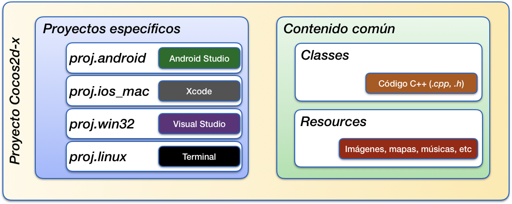
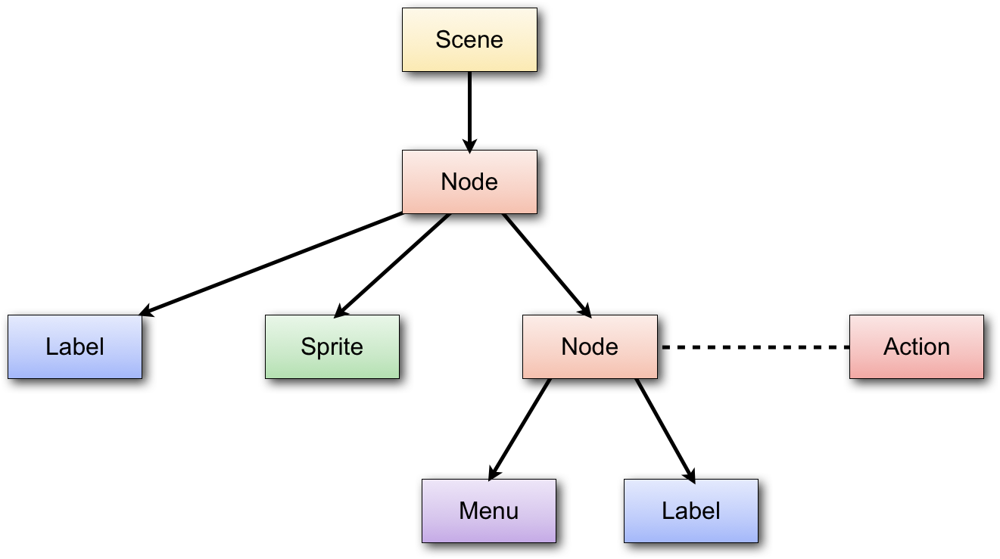

# El motor cocos2d-x

Uno de los motores más conocidos y utilizados para desarrollo de videojuegos para
dispositivos móviles es **Cocos2D**. Existe gran
cantidad de juegos para iOS implementados con este motor. Aunque inicialmente se trataba de un motor escrito en Objective-C únicamente para iOS, actualmente contamos con [Cocos2d-x](https://www.cocos.com/en/) que es la versión multiplataforma de este motor. 

El juego se desarrolla con C++, y puede ser portado directamente a distintos tipos de dispositivos (Android, iOS, y plataformas de escritorio). 

Vamos a comenzar viendo cómo instalar el motor Cocos2d-x y crear un nuevo proyecto con él. 

## Instalación de Cocos2d-x

Si entramos en la [página web de Cocos](https://www.cocos.com/en/), veremos que ofrecen dos productos principales:

* **Cocos**. Herramienta visual de creación de videojuegos. Podremos introducir _scripts_ con lenguajes como Javacript o LUA.
* **Cocos2d-x**. _Framework_ escrito en C++ para el desarrollo de videojuegos. El videojuego se implementará en clases C++, y dentro de ellas tendremos la opción de cargar contenidos creados con la herramienta anterior o con otras herramientas de terceros.

Nos decantaremos por la segunda opción, para crear videojuegos en C++. Veremos que la API de este motor es muy similar a la que encontramos en motores como SpriteKit y SceneKit, en este caso centrada en contenido 2D.


### Instalación de Cocos2d-x

Para instalar Cocos2d-x simplemente deberemos:

1. **[Descargar](https://www.cocos.com/en/cocos2dx) y descomprimir** Cocos2d-x en el directorio donde queramos tenerlo instalado.
2. En un _Terminal_, ir al directorio donde hayamos descomprimido el motor y ejecutar:
    ```bash
    ./setup.py
    ```
3. Nos preguntará por las rutas donde tengamos instalado `ANDROID_SDK` y `ANDROID_NDK`. Estas rutas en macOS por defecto son las siguientes, aunque podría cambiar:
    ```bash
    ANDROID_SDK=~/Library/Android/sdk/
    ANDROID_NDK=~/Library/Android/sdk/ndk-bundle/
    ```


De esta manera tendremos acceso a un script llamado `cocos`que permite entre otras cosas crear la plantilla para un nuevo proyecto Cocos2d-x multiplataforma. 

Deberemos proporcionar la siguiente información:

```bash
cocos new MiJuego   -p es.ua.eps.MiJuego
                    -l cpp
```

Esto nos creará un proyecto (carpeta) `MiJuego` en el directorio donde nos encontremos, con _bundle ID_ `es.ua.eps.MiJuego`. El lenguaje utilizado será C++ (`-l cpp`). 

Dentro del directorio generado encontraremos los siguientes directorios:

* `Classes`: Código fuente C++ de nuestro juego
* `Resources`: Recursos y _assets_ del videojuego (_sprites_, efectos de sonido, fuentes, ficheros de datos, etc)

El contenido de los dos directorios anteriores será común para **todas las plataformas** soportadas por Cocos2d-x. Será en ellos donde introduciremos los distintos componentes del videojuego. 

Además, encontraremos una serie de carpetas adicionales con recursos propios de cada plataforma específica:

* `proj.ios_mac`: Recursos para las versiones iOS y Mac basadas en el entorno Xcode. 
* `proj.android`: Recursos para la plataforma Android (entorno Android Studio)
* `proj.linux`: Recursos para la compilación para Linux (se compila desde línea de comando)
* `proj.win32`: Recursos para la compilación para Windows (proyecto Visual Studio)




#### Configuración CMake

Para la construcción de los proyectos se utiliza la herramienta [CMake](https://cmake.org), por lo que es necesario tenerla instalada. 

Encontramos además en la raíz del proyecto un fichero `CMakeLists.txt` en el que se indica la forma de construir el proyecto multiplataforma. En dicho fichero simplemente tendremos que actualizar la lista de clases a compilar. En la plantilla veremos un bloque como el siguiente:

```
# add cross-platforms source files and header files 
list(APPEND GAME_SOURCE
     Classes/AppDelegate.cpp
     Classes/HelloWorldScene.cpp
     )
list(APPEND GAME_HEADER
     Classes/AppDelegate.h
     Classes/HelloWorldScene.h
     )
```

Deberemos ir actualizando este bloque conforme añadamos o eliminemos clases de nuestro proyecto.

#### Compilación en línea de comando

Tenemos también la opción de compilar y ejecutar el proyecto desde la consola con el comando `cocos`. 

Por ejemplo, si queremos compilar el proyecto para la plataforma macOS, desde el directorio del proyecto podemos hacer:

```bash
cocos compile -p mac
```

Podemos también ejecutar el proyecto en dicha plataforma con:

```bash
cocos run -p mac
```

En este caso previamente lo compilará, si fuera necesario. 

Podemos compilar y ejecutar para el resto de plataformas disponibles.  Puedes ver la [documentación de la herramienta de consola de Cocos](https://docs.cocos.com/cocos2d-x/v4/manual/en/editors_and_tools/cocosCLTool.html) para más información.

Esta forma de trabajar en línea de comando será la habitual si estamos en **entorno Linux** y queremos probar el proyecto como aplicación de escritorio Linux. 

Pero tenemos la opción de trabajar en otros entornos, como Android Studio (para probar en **Android**), Xcode (para probar en **iOS** y **Mac**) y Visual Studio (para probar en **Windows**). 

Podremos elegir el entorno de desarrollo que nos resulte más conveniente. Hemos de destacar que podremos cambiar de uno a otro sin problemas, ya que el código que introduzcamos estará siempre en carpetas compartidas por todas las plataformas. Podremos elegir el entorno en el que nos encontremos más cómodos, y utilizar el resto sólo cuando queramos hacer pruebas en plataformas específicas.

A continuación vamos a ver cómo trabajar con cada entorno.


#### Proyecto Android

Desde Android Studio podremos abrir directamente el proyecto que se encuentra en el directorio `proj.android`. 

Podremos construir y ejecutar el proyecto directamenter desde Android Studio, aunque para que la construcción funcione debemos [tener instalado el sistema de construcción Ninja](https://ninja-build.org). En caso contrario, obtendremos un error durante el proceso de construcción. 

#### Proyecto iOS / Mac

En **Cocos2d-x 3.X**, dentro del directorio `proj.ios_mac` encontraremos un proyecto Xcode que podremos abrir directamente con este IDE. 

Sin embargo, en **Cocos2d-x 4.X** será necesario generar un proyecto para las plataformas iOS y Mac utilizando la herramienta CMake:

```bash
# Generación del proyecto Xcode para MacOS
mkdir mac-build && cd mac-build
cmake .. -GXcode

# Generación del proyecto Xcode para iOS 
mkdir ios-build && cd ios-build
cmake .. -GXcode -DCMAKE_SYSTEM_NAME=iOS -DCMAKE_OSX_SYSROOT=iphoneos
```

Una vez creado el proyecto (directorio `mac-build` o `ios-build`) podremos abrirlo con Xcode y trabajar de forma normal con este entorno. 


#### Proyecto Windows

Tenemos también la opción de trabajar en Windows con Visual Studio. Al igual que en el caso de Xcode, con **Cocos2d-x 3.X** disponemos de dicho proyecto directamente, pero en **Cocos2d-x 4.X** deberemos generarlo con:

```bash
# Generación del proyecto Visual Studio para Windows
mkdir win32-build && cd win32-build
cmake .. -G"Visual Studio 15 2017" -Tv141

```

Puedes ver la [documentación de CMake en Cocos2d-x 4.0](https://docs.cocos.com/cocos2d-x/v4/manual/en/installation/CMake-Guide.html) para más detalles. 


## Organización del motor

En el apartado anterior hemos visto cómo crear un nuevo proyecto Cocos2d-x. Vamos ahora a ver cómo están estructuradas las clases de esto motor.

### El _singleton_ `Director`

El **elemento central del motor** es un _singleton_ de tipo `Director`, al que podemos acceder de la siguiente forma:

```cpp
Director::getInstance()
```

El **director** será el encargado de gestionar toda la ejecución del juego, y entre sus funciones se encuentran:

* Tiene una **escena activa**, y permite realizar transiciones a otras escenar, representadas todas ellas con la clase `Scene`.
* Gestiona el **ciclo del juego**, actualizando y _renderizando_ la escena activa en cada iteración. Sólo se actualizará y se mostrará la escena que esté actualmente activa.


### Creación de escenas

En Cocos2d-x la escena se representa con la clase `Scene`, y contendrá un árbol de nodos, los cuales están representados por la clase `Node`. La propia escena es un nodo (`Scene` es subclase de `Node`), y tendrá como papel siempre hacer de nodo raíz del árbol de nodos de la escena.

Antes de entrar a estudiar el árbol de la escena, vamos a ver cómo crear una escena. Para crear cada escena (pantalla) del videojuego, crearemos una clase que herede de `Scene`, como la que vemos a continuación (fichero `.h`):

```cpp
// MenuScene.h

class MenuScene : public cocos2d::Scene {
public:
    static cocos2d::Scene* createScene();

    virtual bool init();
    
    CREATE_FUNC(MenuScene);
};
```

Todos los objetos de Cocos2d-x se instanciarán mediante un método `create`, incluyendo la escena. Este _método factoría_ se genera de forma estática con la macro `CREATE_FUNC`, por ese motivo está declarada en la clase anterior. 

Ya en la implementación de la clase (fichero `.cpp`), podemos implementar el método estático `createScene` que hemos declarado anteriormente de la siguiente forma:

```cpp
// MenuScene.cpp

Scene* MenuScene::createScene()
{
    return MenuScene::create();
}
```

Recordamos que podemos utilizar este método `create` porque lo hemos declarado previamente con `CREATE_FUNC`. Dicho método instanciará la clase y reservará memoria para el nuevo objeto, sin que tengamos que hacerlo nosotros, pero para inicializarlo llamará al método `init()` donde nosotros podremos indicar la forma en la que se inicializan nuestros objetos. Este método tendrá habitualmente la siguiente forma:

```cpp
bool MenuScene::init()
{
    if ( !Scene::init() )
    {
        return false;
    }
    // Inicializar componentes de la escena
    
    return true;
}
```

Lo primero que hacemos es inicializar la superclase (en nuestro caso `Scene`). Si todo va bien, inicializaremos todos los componentes de la escena (etiquetas, menús, _sprites_, etc) y los añadiremos al árbol de nodos.

Más adelante veremos cómo crear estos nodos, pero antes vamos a ver cómo cambiar la escena que se muestra en el motor.


### Transiciones entre escenas

Al ejecutar el motor deberemos indicar la escena que mostraremos inicialmente como escena activa. Esto lo haremos con el método `runWithScene` del director:

```cpp
Director::getInstance()->runWithScene(MenuPrincipal::scene());
```

Con esto pondremos en marcha el motor del juego mostrando la escena indicada. Si el motor ya está en marcha y queremos cambiar de escena, deberemos hacerlo con el método `replaceScene`:

```cpp
Director::getInstance()->replaceScene(Creditos::scene());
```

También podemos implementar transiciones entre escenas de forma animada utilizando como escena una serie de clases todas ellas con prefijo `Transition*`, que heredan de `TransitionScene`,
y que a su vez hereda de `Scene`. 

Podemos mostrar una transición animada reemplazando la
escena actual por una escena de transición:

```cpp
Scene *puntuacionesScene = Puntuaciones::scene();
TransitionCrossFade *transition = 
    TransitionCrossFade::create(0.5, puntuacionScene);
Director::getInstance()->replaceScene(transition);
```

Podemos observar que la escena de transición se construye a partir de la duración de la transición, y de la escena que debe mostrarse una vez finalice la transición.


### Árbol de la escena

El contenido de la escena se definirá como un árbol de nodos, todos ellos subclases de `Node`. Entre las subclases encontramos:

* `Scene`: Hará siempre de nodo raíz del árbol.
* `Label`: Etiquetas de texto
* `Sprite`: Personajes y otros elementos que podremos mover por pantalla y animar.
* `TMXTiledMap`: Mapa que podremos utilizar para el fondo del escenario.
* `Layer`: Nodo que implementa eventos de la pantalla táctil y al que podremos añadir contenido como hijos.



Podemos añadir un nodo como hijo de cualquier nodo de la escena con:

```cpp
_fondo->addChild(_personaje);
```

Al añadirlo podemos también especificar el _orden Z_ del nodo (orden de dibujado entre sus hermanos). También podremos establecer o modificar este orden mediante el método `setLocalZOrder()`.

Podremos eliminar un nodo de la escena eliminandolo de su padre:

```cpp
_personaje->removeFromParent();
```

También podremos buscar un nodo dado su nombre, o listar todos los hijos de un determinado nodo:

```cpp
_fondo->getChildByName(“personaje”);
_fondo->getChildren();
```


### Tipos de datos

Como hemos comentado, Cocos2d-x proviene del motor Cocos2d para iOS. Este motor estaba  implementado en Objective-C, sobre la API Cocoa Touch, y por lo tanto estaba muy vinculado a sus tipos de datos. 

Por este motivo Cocos2d-x implementa sus propios tipos de datos equivalentes a los de Cocoa Touch para poder trabajar de la misma forma. Vamos a ver cuáles son estos tipos de datos.

Por un lado tenemos la clase `Ref`. Todos los objetos de la librería
heredan en última instancia de esta clase. En ella se define por ejemplo el mecanismo de gestión de memoria que utilizan todos los objetos de la librería.

Tenemos una serie de colecciones como `Vector<>`, `Map<>` especiales de Cocos2d-x que tienen en cuenta su modelo particular de memoria, pero con los que podremos utilizar la sintaxis de C++ para este tipo de colecciones. También tenemos los tipos `Value`, `ValueVector` y `ValueMap` para la representación de estructuras de datos, que nos permiten por ejemplo cargar ficheros `.plist` de forma automática. El primero de ellos es un _wrapper_ que permite almacenar tipos básicos (`bool`, `int`, `string`, etc) o complejos, mientras que los otros dos representan las listas y diccionarios respectivamente.

Encontramos también una serie de tipos de datos geométricos: `Point`, 
`Rect` y `Size`. Estos tipos de datos incorporan también algunas
operaciones, por ejemplo para comprobar si dos rectángulos intersectan.


## Gestión de la memoria

La memoria en Cocos2d-x se gestiona mediante cuenta de referencias, siguiendo el mismo mecanismo de gestión de memoria que se utilizaba antiguamente en iOS. 

### Contador de referencias

Este mecanismo consiste en que los objetos de la librería (todos  derivan en última instancia de `Ref`) tienen un contador de referencias que existen hacia ellos.  Cuando el contador de referencias llegue a cero, el objeto se eliminará de memoria.

Podemos incrementar el número de referencias sobre un objeto llamando a su método  `retain`, y decrementarlo llamando a `release`. En caso de que al hacer `release` el contador de referencias llegue a `0`, el objeto será eliminado inmediatamente de la memoria.

Existe un tercer método para manipular dicho contador de referencias: `autorelease`. Dicho método no decrementa el contador inmediatamente, sino que deja programado el decremento para el final del ciclo actual del juego. Es decir, podremos seguir utilizando el objeto mientras dure el ciclo, pero al final de éste, si el contador llegase a cero, se eliminará el objeto. 

Deberemos asegurarnos de que el número de llamadas a `retain` sobre un objeto sea igual al número de llamadas a `release` / `autorelease`. Si el primero fuese superior al segundo,  entonces tendríamos una fuga de memoria. Si fuese inferior tendríamos un error de acceso a memoria cuando intentemos decrementar las referencias de un objeto que ha sido ya liberado. 

### Quien retiene, debe liberar

Si no organizamos bien el código de gestión de memoria puede ser complicado garantizar que el número de llamadas a`retain` y a `release` / `autorelease` esté equilibrado. Para evitar este problema la regla fundamental es que quien incremente el número de referencias (`retain`) será responsable de decrementarlo (`release` /  `autorelease`). Vemos a continuación con mayor detalle las implicaciones que esta regla tiene en el uso de la librería:

Cuando instanciamos un objeto con el método factoría `create`, éste método lo inicializa con una referencia, pero él mismo es responsable de eliminarla. Si lo hiciese antes de devolver el objeto, éste se eliminaría de la memoria antes de que alguien pudiera usarlo, mientras que si no lo hace en ese momento ya no tendrá más oportunidades de liberarlo. Para solucionar este problema hará uso del método `autorelease`, dejando programado que la referencia se librere automáticamente cuando termine el ciclo actual. De esta forma, el código que haya llamado a `create` tendrá la oportunidad de retener el objeto recibido, y entonces se mantendría en memoria, pero si nadie lo retuviese sería eliminado al final del ciclo.

### Estructuras de Cocos2d-x

Cuando añadimos un nodo como hijo de otro en la escena 2D, o cuando se añade un objeto a otras estructuras como los tipos `Vector` o `Map` de Cocos2d-x, o alguna de las cachés de objetos que gestiona el motor, estas estructuras se encargarán de retener el objeto en memoria, y cuando se elimine de ellas lo liberarán. 

Es decir, podemos por ejemplo crear un nodo con `create` y en ese momento añadirlo como hijo a otro con `addChild`, y no tendremos que preocuparnos de retenerlo ni de liberarlo nosotros. El propio grafo de la escena será el encargado de gestionar la memoria en este caso.

```
Node *nodo = Node::create();
this->addChild(nodo);
```

Esta será la forma más habitual de trabajar, y que hará que la gestión de la memoria sea totalmente transparente, sin tener que hacer nada nosotros.

### Referencias fuertes

Si queremos guardar un nodo como campo de nuestro objeto con una **referencia fuerte** hacia él, tras instanciarlo con  `create` deberemos reternarlo con `retain` para que no se libere automáticamente. De esta forma, aunque no estuviera retenido por otros objetos, nosotros lo mantendremos en memoria.

```cpp
// .h

private:
    cocos2d::Node *_hud;

// .cpp

Game::init() {
    ...

    _hud = Node::create();
    _hud->retain();
}
```

Como lo hemos retenido, nosotros seremos responsables de liberarlo, por lo que  deberemos llamar a `release` sobre dicho campo cuando nuestro objeto sea destruido (en el destructor de la clase), o cuando vayamos a cambiar el valor del campo y el antiguo deba ser liberado. 

```cpp
// .cpp

Game::~Game() {
    if(_hud!=NULL) {
        _hud->release();
        _hud = NULL;
    }
}
```

Es recomendable, como vemos en el código anterior, poner a `NULL` el objeto cuando lo hayamos liberado, para así saber que ya está liberado y evitar liberar dos veces por error. Hay una macro de Cocos2d-x que implementa este comportamiento. El siguiente código sería equivalente al anterior, pero usando dicha macro:

```cpp
// .cpp

Game::~Game() {
    CC_SAFE_RELEASE_NULL(_hud);
}
```


## Interfaz de usuario

Encontramos distintos tipos de nodos que podemos añadir a la escena para crear nuestra interfaz de usuario, como por ejemplo menús y etiquetas de texto, que nos pueden servir por ejemplo para mostrar
el marcador de puntuación, o el mensaje _Game Over_. 

### Etiquetas

Tenemos dos formas alternativas de crear una etiqueta de texto:

* Utilizar una fuente _TrueType_ predefinida.
* Crear nuestro propio tipo de fuente _bitmap_.

La primera opción es la más sencilla, ya que podemos crear la cadena directamente a partir de un tipo de fuente ya existen y añadirla a la escena con `addChild` (por ejemplo añadiéndola como hija
de la capa principal de la escena). Se define mediante la clase `LabelTTF`:

```cpp
LabelTTF* label = LabelTTF::create("Game Over", "Arial", 24);
this->addChild(label);
```

Sin embargo, en un videojuego debemos cuidar al máximo el aspecto y la personalización de los gráficos.
Por lo tanto, suele ser más adecuado crear nuestros propios tipos de fuentes. La mayoría de motores de
videojuegos soportan el formato `.fnt`, con el que podemos definir fuentes de tipo
_bitmap_ personalizadas. Para crear una fuente con dicho formato podemos utilizar herramientas
como **Angel Code** o [**Hiero**](http://www.n4te.com/hiero/hiero.jnlp).
Una vez creada la fuente con este formato, podemos mostrar una cadena con dicha fuente mediante
la clase `LabelBMFont`:

```cpp
LabelBMFont *label = LabelBMFont::create("Game Over", "fuente.fnt");
this->addChild(label);
```


### Menús

Por otro lado, también podemos crear menús de opciones. Normalmente en la pantalla principal del juego
siempre encontraremos un menú con todas las opciones que nos ofrece dicho juego. Los menús se crean con
la clase `Menu`, a la que añadiremos una serie de _items_, de tipo `MenuItem` (o subclases suyas), 
que representarán las opciones del menú. Estos _items_ pueden ser etiquetas de texto, pero también
podemos utilizar imágenes para darles un aspecto más vistoso. El menú se añadirá a la escena como cualquier
otro tipo de _item_:

```cpp
MenuItemImage *item1 = MenuItemImage::create(
      "nuevo_juego.png", "nuevo_juego_selected.png", CC_CALLBACK_1(MenuPrincipal::menuNuevoJuegoCallback, this));
      
MenuItemImage *item2 = MenuItemImage::create(
      "continuar.png", "continuar_selected.png", CC_CALLBACK_1(MenuPrincipal::menuContinuarCallback, this));

MenuItemImage *item3 = MenuItemImage::create(
      "opciones.png", "opciones_selected.png", CC_CALLBACK_1(MenuPrincipal::menuOpcionesCallback, this));
  
Menu* menu = Menu::create(item1, item2, item3, NULL);
menu->alignItemsVertically();    

this->addChild(menu);  
```

Vemos que para cada _item_ del menú añadimos dos imágenes. Una para su estado normal, y otra
para cuando esté pulsado. También propocionamos la acción a realizar cuando se pulse sobre cada opción,
mediante un par _target-selector_: el _target_ es el objeto sobre el que se 
va a llamar a la acción (normalmente nuestro propio objeto `this`), y el _selector_ es la forma de indicar
el método al que se va a invocar. Los métodos indicados como _selectores_ de tipo menú
deberán tener la siguiente forma:

```cpp
void MenuPrincipal::menuNuevoJuegoCallback(Ref* pSender)
{
    Director::getInstance()->replaceScene(Game::scene());
}
```

Una vez creadas las opciones, construirmos un menú a partir de ellas,
organizamos los _items_ (podemos disponerlos en vertical de forma automática como vemos en el ejemplo), y
añadimos el menú a la escena.


## Sprites

Podemos crear un _sprite_ en Cocos2D con la clase `Sprite` a partir de la textura de dicho _sprite_:

```cpp
Sprite *sprite = Sprite::create("personaje.png");
```

El _sprite_ podrá ser añadido a la escena como cualquier otro nodo, añadiéndolo
como hijo de alguna de las capas con `addChild:`.


### Posición

Al igual que cualquier nodo, un _sprite_ tiene una posición en pantalla
representada por su propiedad `position`, de tipo `Vec2` (también podemos utilizar como tipo `Point`, ya que es un alias de `Vec2`). 

Por ejemplo, para posicionar un _sprite_ en unas determinadas coordenadas
le asignaremos un valor a su propiedad `position` (esto es aplicable a 
cualquier nodo):

```cpp
sprite->setPosition(Vec2(240, 160));
```

La posición indicada corresponde al punto central del _sprite_, aunque 
podríamos modificar esto con la propiedad `anchorPoint`, de forma similar
a las capas de CoreAnimation. El sistema de coordenadas de Cocos2D es el mismo que el
de CoreGraphics, el origen de coordenadas se encuentra en la esquina inferior 
izquierda, y las _y_ son positivas hacia arriba.

Podemos aplicar otras transformaciones al _sprite_, como rotaciones 
(`rotation`), escalados (`scale`, `scaleX`, `scaleY`), o desencajados
(`skewX`, `skewY`). También podemos especificar su orden Z (`zOrder`). 
Recordamos que todas estas propiedades no son exclusivas de los _sprites_, sino que son
aplicables a cualquier nodo, aunque tienen un especial interés en el caso de los _sprites_.


### Fotogramas

Estos objetos pueden estar animados. Para ello deberemos definir los distintos 
  fotogramas (o _frames_) de la animación. Podemos definir varias 
  animaciones para cada _sprite_, según las acciones que pueda hacer. 
  Por ejemplo, si tenemos un personaje podemos tener una animación para 
  andar hacia la derecha y otra para andar hacia la izquierda.
El _sprite_ tendrá un determinado tamaño (ancho y alto), 
  y cada fotograma será una imagen de este tamaño.
  
Cambiando el fotograma que se muestra del _sprite_ en cada momento podremos 
  animarlo. Para ello deberemos tener imágenes para los distintos fotogramas del _sprite_.
  Sin embargo, como hemos comentado anteriormente, la memoria de vídeo es un recurso crítico, y 
  debemos aprovechar al máximo el espacio de las texturas que se almacenan en ella. Recordemos
  que el tamaño de las texturas en memoria debe ser potencia de 2. Además, conviene evitar
  empaquetar con la aplicación un gran número de imágenes, ya que esto hará que el espacio
  que ocupan sea mayor, y que la carga de las mismas resulte más costosa.

Para almacenar los fotogramas de los _sprites_ de forma óptima, utilizamos lo que se conoce como
_sprite sheets_. Se trata de imágenes en las que incluyen de forma conjunta todos los fotogramas
de los _sprites_, dispuestos en forma de mosaico.
  


Podemos crear estos _sprite sheets_ de forma manual, aunque encontramos herramientas que nos
facilitarán enórmemente este trabajo, como [**TexturePacker**](http://www.texturepacker.com), [**Shoebox**](https://renderhjs.net/shoebox/) o [**FreeTexturePacker**](http://free-tex-packer.com).
Esta herramienta cuenta con una versión básica gratuita, y opciones adicionales de pago. Además de organizar
los _sprites_ de forma óptima en el espacio de una textura OpenGL, nos permite almacenar esta textura
en diferentes formatos (RGBA8888, RGBA4444, RGB565, RGBA5551, PVRTC) y aplicar efectos de mejora como 
_dithering_. Esta herramienta permite generar los _sprite sheets_ en varios formatos reconocidos por los diferentes
motores de videojuegos, como por ejemplo Cocos2D o libgdx.


Con esta herramienta simplemente tendremos que arrastrar sobre ella el conjunto de imágenes con los distintos 
fotogramas de nuestros _sprites_, y nos generará una textura optimizada para OpenGL con todos ellos 
dispuestos en forma de mosaico. Cuando almacenemos esta textura generada, normalmente se guardará un fichero
`.png` con la textura, y un fichero de datos que contendrá información sobre los distintos fotogramas
que contiene la textura, y la región que ocupa cada uno de ellos.

Para poder utilizar los fotogramas añadidos a la textura deberemos contar con algún mecanismo que nos permita
mostrar en pantalla de forma independiente cada región de la textura anterior (cada fotograma). En 
prácticamente todos los motores para videojuegos encontraremos mecanismos para hacer esto.

En el caso de Cocos2D, tenemos la clase `SpriteFrameCache` que se encarga de almacenar la
caché de fotogramas de _sprites_ que queramos utilizar. Con TexturePacker habremos
obtenido un fichero `.plist` (es el formato utilizado por Cocos2D) y una imagen `.png`. 
Podremos añadir fotogramas a la caché a partir de estos dos ficheros. En el fichero `.plist` se 
incluye la información de cada fotograma (tamaño, región que ocupa en la textura, etc). Cada fotograma se 
encuentra indexado por defecto mediante el nombre de la imagen original que añadimos a TexturePacker, aunque 
podríamos editar esta información de forma manual en el `.plist`.

La caché de fotogramas se define como _singleton_. Podemos añadir nuevos fotogramas a este
_singleton_ de la siguiente forma:

```cpp
SpriteFrameCache::getInstance()
    ->addSpriteFramesWithFile("sheet.plist");
```

En el caso anterior, utilizará como textura un fichero con el mismo nombre que el `.plist` pero
con extensión `.png`. También encontramos una versión del método anterior que también recibe como
parámetro la textura a utilizar, y de esta forma nos permite utilizar un fichero de textura 
con distinto nombre al `.plist`.

Una vez introducidos los fotogramas empaquetados por TexturePacker en la caché de Cocos2D, podemos crear 
_sprites_ a partir de dicha caché con:

```cpp
Sprite *sprite = Sprite::createWithSpriteFrameName("frame01.png");
```

En el caso anterior creamos un nuevo _sprite_, pero en lugar de hacerlo directamente a partir de una
imagen, debemos hacerlo a partir del nombre de un fotograma añadido a la caché de textura. No debemos confundirnos
con esto, ya que en este caso al especificar `"frame01.png"` no buscará un fichero con este nombre
en la aplicación, sino que buscará un fotograma con ese nombre en la caché de textura. El que los fotogramas
se llamen por defecto como la imagen original que añadimos a TexturePacker puede llevarnos a confusión.

También podemos obtener el fotograma como un objeto `SpriteFrame`. Esta clase no define un 
_sprite_, sino el fotograma almacenado en caché. Es decir, no es un nodo que podamos almacenar en la 
escena, simplemente define la región de textura correspondiente al fotograma:

```cpp
SpriteFrame* frame = SpriteFrameCache::getInstance()
    ->spriteFrameByName("frame01.png");
```

Podremos inicializar también el _sprite_ a partir del fotograma anterior, en lugar de hacerlo directamente
a partir del nombre del fotograma:

```cpp
Sprite *sprite = Sprite::createWithSpriteFrame(frame);
```


### Animación

Podremos definir determinadas secuencias de _frames_ para crear animaciones. Las animaciones se
representan mediante la clase `Animation`, y se pueden crear a partir de la secuencia de
fotogramas que las definen. Los fotogramas deberán indicarse mediante objetos de la clase 
`SpriteFrame`:

```cpp
Animation *animAndar = Animation::create();
animAndar->addSpriteFrame(SpriteFrameCache::getInstance()
    ->spriteFrameByName("frame01.png"));
animAndar->addSpriteFrame(SpriteFrameCache::getInstance()
    ->spriteFrameByName("frame02.png"));
```

Podemos ver que los fotogramas se pueden obtener de la caché de fotogramas definida anteriormente. Además
de proporcionar una lista de fotogramas a la animación, deberemos proporcionar su periodicidad, es decir, el
tiempo en segundos que tarda en cambiar al siguiente fotograma. Esto se hará mediante la propiedad
`delayPerUnit`:

```cpp
animAndar->setDelayPerUnit(0.25);
```

Una vez definida la animación, podemos añadirla a una caché de animaciones que, al igual que la caché
de texturas, también se define como _singleton_:

```cpp
AnimationCache::getInstance()
    ->addAnimation(animAndar, "animAndar");
```

La animación se identifica mediante la cadena que proporcionamos como parámetro
`name`. Podemos cambiar el fotograma que muestra actualmente un _sprite_ con su método:

```cpp
sprite->setDisplayFrameWithAnimationName("animAndar", 0);
```

Con esto buscará en la caché de animaciones la animación especificada, y mostrará de ella
el fotograma cuyo índice proporcionemos. Más adelante cuando estudiemos el motor del juego veremos cómo 
reproducir animaciones de forma automática.


### _Sprite batch_

En OpenGL los _sprites_ se dibujan realmente en un contexto 3D. Es decir, son texturas que se 
mapean sobre polígonos 3D (concretamente con una geometría rectángular). Muchas veces encontramos en
pantalla varios _sprites_ que utilizan la misma textura (o distintas regiones de la misma textura,
como hemos visto en el caso de los _sprite sheets_). Podemos optimizar el dibujado de estos _sprites_ 
generando la geometría de todos ellos de forma conjunta en una única operación con la GPU. Esto será
posible sólo cuando el conjunto de _sprites_ a dibujar estén contenidos en una misma textura. 

Podemos crear un _batch_ de _sprites_ con Cocos2D utilizando la clase 

```cpp
SpriteBatchNode *spriteBatch = 
    SpriteBatchNode::create("sheet.png");
this->addChild(spriteBatch);
```

El _sprite batch_ es un tipo de nodo más que podemos añadir a nuestra capa como hemos visto, 
pero por si sólo no genera ningún contenido. Deberemos añadir como hijos los _sprites_ que queremos 
que dibuje. Es imprescindible que los hijos sean de tipo `Sprite` (o subclases de ésta), y
que tengan como textura la misma textura que hemos utilizado al crear el _batch_ (o regiones de 
la misma). No podremos añadir _sprites_ con ninguna otra textura dentro de este _batch_.

```cpp
Sprite *sprite1 = Sprite::createWithSpriteFrameName("frame01.png");
sprite1->setPosition(Vec2(50,20));
Sprite *sprite2 = Sprite::createWithSpriteFrameName("frame01.png");
sprite2->setPosition(Vec2(150,20));

spriteBatch->addChild(sprite1);
spriteBatch->addChild(sprite2);
```

En el ejemplo anterior consideramos que el _frame_ con nombre `"frame01.png"`
es un fotograma que se cargó en la caché de fotogramas a partir de la textura `sheet.png`.
De no pertenecer a dicha textura no podría cargarse dentro del _batch_.


### Colisiones

Otro aspecto de los _sprites_ es la interacción entre ellos. 
  Nos interesará saber cuándo somos tocados por un enemigo o una bala para 
  disminuir la vida, o cuándo alcanzamos nosotros a nuestro enemigo. Para ello 
  deberemos detectar las colisiones entre _sprites_. La colisión 
  con _sprites_ de formas complejas puede resultar costosa de calcular. 
  Por ello se suele realizar el cálculo de colisiones con una forma aproximada 
  de los _sprites_ con la que esta operación resulte más 
  sencilla. Para ello solemos utilizar el _bounding box_, es decir, un 
  rectángulo que englobe el _sprite_. La intersección de 
  rectángulos es una operación muy sencilla. 
    
La clase `Sprite` contiene un método `getBoundingBox` que
nos devuelve un objeto `Rect` que representa la caja en la que el
_sprite_ está contenido. Con la función `intersectsRect` podemos
comprobar de forma sencilla y eficiente si dos rectángulos colisionan:

```cpp
Rect bbPersonaje = spritePersonaje->getBoundingBox();
Rect bbEnemigo = spriteEnemigo->getBoundingBox();

if (bbPersonaje.intersectsRect(bbEnemigo)) {
    // Game over
    ...
}
```


## Motor del juego

El componente básico del motor de un videojuego es lo que se conoce como ciclo del juego
(_game loop_). Vamos a ver a continuación en qué consiste este ciclo. 


### Ciclo del juego

Se trata de un bucle infinito en el que tendremos el código 
  que implementa el funcionamiento del juego. Dentro de este bucle se efectúan 
  las siguientes tareas básicas:

* **Leer la entrada**: Lee la entrada del usuario para conocer 
    si el usuario ha pulsado alguna tecla desde la última iteración.
  
* **Actualizar escena**: Actualiza las posiciones de los _sprites_ 
    y su fotograma actual, en caso de que estén siendo animados, la posición 
    del fondo si se haya producido _scroll_, y cualquier otro elemento 
    del juego que deba cambiar. Para hacer esta actualización se pueden 
    tomar diferentes criterios. Podemos mover el personaje según la entrada 
    del usuario, la de los enemigos según su inteligencia artificial, o 
    según las interacciones producidas entre ellos y cualquier otro objeto 
    (por ejemplo al ser alcanzados por un disparo, colisionando el _sprite_ 
    del disparo con el del enemigo), etc.
  
* **Redibujar**: Tras actualizar todos los elementos del juego, 
    deberemos redibujar la pantalla para mostrar la escena tal como ha quedado 
    en el instante actual. 
  
* **Dormir**: Normalmente tras cada iteración dormiremos 
    un determinado número de milisegundos para controlar la velocidad a 
    la que se desarrolla el juego. De esta forma podemos establecer a cuantos 
    fotogramas por segundo (_fps_) queremos que funcione el juego, siempre 
    que la CPU sea capaz de funcionar a esta velocidad.


```cpp
while(true) {
    leeEntrada();
    actualizaEscena();
    dibujaGraficos();   
}
```

Este ciclo no siempre deberá comportarse siempre de la misma forma. 
  El juego podrá pasar por distintos estados, y en cada uno de ellos deberán 
  el comportamiento y los gráficos a mostrar serán distintos (por ejemplo, las pantallas
  de menú, selección de nivel, juego, _game over_, etc).
Podemos modelar esto como una máquina de estados, en la que en cada 
  momento, según el estado actual, se realicen unas funciones u otras, 
  y cuando suceda un determinado evento, se pasará a otro estado.


### Actualización de la escena

En Cocos2D no deberemos preocuparnos de implementar el ciclo del juego, ya que de esto
se encarga el _singleton_ `Director`. Los estados del juego se
controlan mediante las escenas (`Scene`). En un momento dado, el ciclo de
juego sólo actualizará y mostrará los gráficos de la escena actual. Dicha escena dibujará
los gráficos a partir de los nodos que hayamos añadido a ella como hijos.

Ahora nos queda ver cómo actualizar dicha escena en cada iteración del ciclo del juego, 
por ejemplo, para ir actualizando la posición de cada personaje, o comprobar si existen
colisiones entre diferentes _sprites_. La escena tiene un método 
`schedule` que permite especificar un método al que
se llamará en cada iteración del ciclo. De esa forma, podremos especificar en dicho método la forma de actualizar la escena:

```cpp
scene->schedule(CC_SCHEDULE_SELECTOR(Game::update));
```

Tendremos que definir un método `update` donde introduciremos el código
que se encargará de actualizar la escena. Como parámetro recibe el tiempo transcurrido desde
la anterior actualización (desde la anterior iteración del ciclo del juego). Deberemos aprovechar
este dato para actualizar los movimientos a partir de él, y así conseguir un movimiento fluido
y constante:

```cpp
void Game::update(float dt)
{
    _sprite->setPosition(_sprite->getPosition() + Vec2(100*dt, 0));
}
```

En este caso estamos moviendo el _sprite_ en _x_ a una velocidad de 100 pixeles por
segundo (el tiempo transcurrido se proporciona en segundos). 

> Es importante remarcar que tanto el dibujado como las actualizaciones sólo se 
llevarán a cabo cuando la escena en la que están sea la escena que está ejecutando actualmente
el `Director`. Así es como se controla el estado del juego.

Existe otra versión del método `schedule` que nos permite proporcionar el método a llamar mediante una función lambda. En este caso deberemos indicar también un identificador para nuestra función, para así poder cancelar su planificación:

```cpp
scene->schedule([=](float dt) {
    ...        
}, "ia");
```

A esta planificación le hemos dado el identificador `"ia"`. Podremos cancelarla llamando a `unschedule("ia")`. 

Si no queremos tener que especificar la función de forma _inline_, también podemos especificarla de la siguiente forma:

```cpp
scene->schedule(CC_CALLBACK_1(Game::update, this), "ia");
```


### Acciones

En el punto anterior hemos visto cómo actualizar la escena de forma manual como se hace habitualmente
en el ciclo del juego. Sin embargo, con Cocos2D tenemos formas más sencillas de animar los nodos de 
la escena, son lo que se conoce como **acciones**. Estas acciones nos permiten definir
determinados comportamientos, como trasladarse a un determinado punto, y aplicarlos sobre un nodo
para que realice dicha acción de forma automática, sin tener que actualizar su posición manualmente
en cada iteración (_tick_) del juego.

Todas las acciones derivan de la clase `Action`. Encontramos acciones instantáneas 
(como por ejemplo situar un _sprite_ en una posición determinada), o acciones con una duración
(mover al _sprite_ hasta la posición destino gradualmente).

Por ejemplo, para mover un nodo a la posición _(200, 50)_ en 3 segundos, podemos definir una 
acción como la siguiente:

```cpp
MoveTo *actionMoveTo = MoveTo::create(3, Vec2(200, 50));
```

Para ejecutarla, deberemos aplicarla sobre el nodo que queremos mover:

```cpp
sprite->runAction(actionMoveTo);
```

Podemos ejecutar varias acciones de forma simultánea sobre un mismo nodo. Si queremos detener todas
las acciónes que pudiera haber en marcha hasta el momento, podremos hacerlo con:

```cpp
sprite->stopAllActions();
```

Además, tenemos la posibilidad de encadenar varias acciones mediante el tipo especial de acción
`Sequence`. En el siguiente ejemplo primero situamos el _sprite_ de forma
inmediata en _(0, 50)_, y después lo movermos a _(200, 50)_:

```cpp
Place *actionPlace = Place::create(Vec2(0, 50));
MoveTo *actionMoveTo = MoveTo::create(3, Vec2(200, 50));

Sequence *actionSequence = 
    Sequence::create(actionPlace, actionMoveTo, NULL);
    
sprite->runAction(actionSequence);
```

Incluso podemos hacer que una acción (o secuencia de acciones) se repita un determinado número
de veces, o de forma indefinida:

```cpp
RepeatForever *actionRepeat = 
    RepeatForever::create(actionSequence);
sprite->runAction(actionRepeat);
```

De esta forma, el _sprite_ estará continuamente moviéndose de _(0,50)_ a _(200,50)_.
Cuando llegue a la posición final volverá a aparecer en la inicial y continuará la animación.

Podemos aprovechar este mecanismo de acciones para definir las animaciones de fotogramas de los
_sprites_, con una acción de tipo `Animate`. Crearemos la acción de animación
a partir de una animación de la caché de animaciones:

```cpp
Animate *animate = Animate::create(
    AnimationCache::sharedAnimationCache()
        ->animationByName("animAndar"));

sprite->runAction(RepeatForever::create(animate));
```

Con esto estaremos reproduciendo continuamente la secuencia de fotogramas definida en la animación,
utilizando la periodicidad (_delayPerUnit_) que especificamos al crear dicha animación.

Encontramos también acciones que nos permiten realizar tareas personalizadas, proporcionando mediante una pareja
_target-selector_ la función a la que queremos que se llame cuando se produzca la acción:

```cpp
CallFunc *actionCall = 
    CallFunc::create(CC_CALLBACK_0(Game::accionCallback, this));
```

Deberemos definir en nuestra clase el método de _callback_ a llamar. En el caso del
ejemplo anterior sería:

```cpp
void Game::accionCallback() {
    ...
}
```

Otra opción es pasar directamente una función _lambda_ como parámetro:

```cpp
CallFunc::create([=] {
    ...            
});
```

También encontramos variantes de esta acción que nos permiten pasarle al _callback_
como parámetro datos propios o el nodo sobre el que se ha ejecutado la acción (`CallFuncN` recibe el nodo como parámetro, y `CallFundND` recibe el nodo y un puntero a datos genéricos). Cuanto tengamos que pasar un _callback_ con parámetros utilizaremos `CC_CALLBACK_1`, `CC_CALLBACK_2` y `CC_CALLBACK_3`, para 1, 2 y 3 parámetros respectivamente.

Encontramos gran cantidad de acciones disponibles, que nos permitirán crear diferentes efectos (fundido, tinte,
rotación, escalado), e incluso podríamos crear nuestras propias acciones mediante subclases de `Action`.

   
      

## _Tilemaps_

El motor Cocos2d-x soporta directamente los mapas creados con la herramienta **Tiled** (http://www.mapeditor.org). 

Podemos leer los ficheros de tipo `.tmx` creados con esta herramienta mediante la clase `TMXTiledMap`:

```cpp
TMXTiledMap *fondo = TMXTiledMap::create("mapa.tmx");
```

Este objeto es un nodo (hereda de `Node`), por lo que podemos añadirlo a la escena (con `addChild`) y aplicar cualquier transformación de las vistas anterioremente.


### Capas de patrones

En un _tilemap_ podemos tener varias capas de patrones, formadas por una matriz de _tiles_. Podemos obtener una capa a partir de su nombre con:

```cpp
TMXLayer *capa = fondo->layerNamed("muros");
```

Cada _tile_ de la capa tendrá un tamaño determinado por el _tilemap_ (por ejemplo, de $16 \times 16$ pixels), y estará ubicado en una coordenada determinada de la matriz (fila y columna), a la que nos referiremos como _tilecoord_, para no confundir con las coordenadas en píxeles de la escena. 

Cada posición de la matriz de cada capa tendrá un número entero, que será el _gid_ del _tile_ que debe mostrar en dicha posición, o `0` en caso de estar vacía. Podemos obtener dicho _gid_ de la siguiente forma:

```cpp
Point tileCoords = Point(fila,columna);
int tileGid = capa->getTileGIDAt(tileCoords);
```

Por ejemplo, si como en el caso anterior estamos consultando la capa `"muros"`, viendo si el _tile_ de cada posición está vacío o no podríamos comprobar si hay un muro en dicha posición.

También desde la herramienta _Tiled_ se le puede dar una serie de propiedades a cada _tile_ del _tileset_. Por ejemplo, podríamos crear una propiedad para indicar si los muros son colisionables o no, y leer dicha propiedad desde el código con:

```cpp
if (tileGid) {
    auto properties = fondo->getPropertiesForGID(tileGid);
    if (!properties.isNull()) {
        bool collision =  properties.asValueMap()
                                    .at("colisionable")
                                    .asBool();
        if(collision) {
            ...
        }
    }
}
```

### Conversion entre coordenadas de la escena y _tilecoords_

Hemos hablado anteriormente de que cada _tile_ se encuentra dentro del mapa en una fila y columna (_tilecoord_), que son distintas al espacio de coordenadas de la escena. Por ello, normalmente será necesario convertir entre las coordenadas de la escena y las _tilecoords_.

A continuación mostramos algunos métodos auxiliares que nos pueden ser últiles para realizar esta tarea.

#### _Tilecoord_ de una posición de la escena

El primero de ellos nos devolverá las coordenadas de una celda a partir de las coordenadas de la escena (dividiendo entre
el tamaño de cada celda):

```cpp
Point Game::tileCoordForPosition(Vec position)
{
    Size tileSize = _tileMap->getTileSize();

    float totalHeight = _tileMap->getMapSize().height * 
                        tileSize.height;
    float x = floor(position.x / tileSize.width);
    float y = floor((totalHeight - position.y) / 
                    tileSize.height);
    return Point(x, y);
}
```

> Hay que destacar que las coordenadas _y_ del mapa están invertidas respecto a las de la escena. Por ese motivo es necesario calcular la altura total y hacer la resta.

#### Rectángulo que ocupa un _tile_ en la escena

También vamos a definir un método que nos devuelva el área (`Rect`) que ocupa en la escena un _tile_ determinado:

```cpp
Rect Game::rectForTileAt(CCPoint tileCoords) {
    Size tileSize = _tileMap->getTileSize();

    float totalHeight = _tileMap->getMapSize().height * 
                        tileSize.height;
    Point origin(tileCoords.x * tileSize.width, totalHeight - 
                 ((tileCoords.y + 1) * tileSize.height));
    return Rect(origin.x, origin.y, 
                tileSize.width, tileSize.height);
}
```


### Modificación del mapa

En muchos casos nos interesará tener en el mapa objetos que podamos modificar. Por ejemplo, monedas u otros _items_ que podamos recolectar, u objetos que podemos destruir. Para conseguir esto podemos definir una capa con dichos objetos, de forma que cuando entremos en una celda ocupada de dicha capa, la modifiquemos para borrar o cambiar su contenido. Por ejemplo, podríamos cargar una capa con _"monedas"_:

```cpp
TMXLayer *monedas = fondo->getLayer("monedas");
```

De esta capa podremos eliminar los _tiles_ cuando nuestro personaje los "recoja". Para hacer esto podemos utilizar el siguiente método:

```cpp
monedas->removeTileAt(tileCoord);
```

También podríamos cambiar el tipo de elemento que se muestra en una celda (por ejemplo para que al tocar una moneda cambie de color). Esto lo haremos especificando el nuevo _gid_ que tendrá
la celda:

```cpp
monedas->setTileGID(GID_MONEDA_ROJA, tileCoord);
```

Para cambiar o modificar los elementos recolectables primero deberemos comprobar si nuestro personaje  "colisiona" con la celda en la que se encuentran, para lo que nos podemos ayudar de los métodos definidos en el punto anterior:

```cpp
Point tileCoords = this->tileCoordForPosition(_sprite->getPosition());

int tileGid = monedas->getTileGIDAt(tileCoords);
if (tileGid) {
    monedas->removeTileAt(tileCoords);
}
```


### Capas de objetos

Además de las capas de patrones, con **Tiled** podemos crear **capas de objetos** que contengan puntos, regiones, u otros objetos geométricos. Podremos acceder también a esta información desde Cocos2d-x.

#### Lectura de la capa de objetos

Cada capa de objetos y cada objeto es identificado mediante un nombre que le damos en Tiled. 

Podemos acceder a una capa de objetos a partir de su nombre: 

```cpp
TMXObjectGroup *objects = fondo->getObjectGroup("objetos");
```

Las capas de objetos están representadas en Cocos2d-x por la clase   `TMXObjectGroup`. Dentro de ella podremos acceder a cada objeto que contenga a partir de su nombre. Por ejemplo, si hemos creado
un objeto con nombre `inicio`, podremos obtenerlo de la siguiente forma:

```cpp
auto inicio = objects->getObject("inicio");
```
        
El objeto se obtiene como un diccionario. De él podemos obtener diferentes propiedades, como por ejemplo sus coordenadas:

```cpp
int x = inicio.at("x").asInt();
int y = inicio.at("y").asInt();

_sprite->setPosition(Vec2(x, y));
```

De esta forma en el código obtenemos la posición que ocupa el objeto y podemos utilizar esta posición para el propósito para el que hubiésemos creado el objeto (por ejemplo para situar en ella inicialmente a nuestro personaje, o hacer que en ese punto aparezcan nuevos enemigos).

Además, a cada objeto podremos añadirle también propiedades personalizadas. Por ejemplo, si es un punto de generación (_spawn_) de enemigos, podríamos especificar cuántos enemigos saldrán y con qué frecuencia. 


#### Formas geométricas

En la capa de objetos podemos incluir formas geométricas, como por ejemplo líneas o polilíneas. Esto puede ser especialmente útil para definir la geometría de colisión del escenario y posteriormente cargarla en el motor de físicas. 

La capa de objetos geométricos se carga de forma similar a los objetos genéricos definidos por el usuario. 

Por ejemplo, si nuestros objetos geométricos de la capa de objetos son todos ellos polilíneas, podemos cargarlos de la siguiente forma:

```objc
TMXObjectGroup *groupEdges = _tiledMap->getTiledMap()->getObjectGroup("MyEdges");
        
ValueVector edges = groupsEdges->getObjects();
        
for(Value edge : edges) {
    ValueVector polyline = edge.asValueMap()
                               .at("polylinePoints")
                               .asValueVector();
            
    // Calculamos la coordenadas absolutas del objeto
    float x = edge.asValueMap().at("x").asFloat() + 
              _tiledMap->getTiledMap()->getPositionX();
    float y = edge.asValueMap().at("y").asFloat() +             
              _tiledMap->getTiledMap()->getPositionY();
            
    for(Value point: polyline) {
        float px = point.asValueMap().at("x").asFloat() + x;
        float py = point.asValueMap().at("y").asFloat() + y;
                
        // Hacemos algo con (px, py)    
        ...
    }
}
```

> Si no conocemos cómo está organizada la capa de objetos, podemos consultar el fuente XML del fichero `.tmx`. También tenemos la opción de imprimir en la consola el objeto que nos devuelve `getObjects`, y de esta forma veremos su estructura en JSON y podremos así escribir el código para leerlo.


## Scroll del escenario

Cuando en el juego tenemos un mapa más extenso que el tamaño de la pantalla, tendremos que implementar _scroll_ para movernos por él. Para hacer _scroll_ podemos desplazar la capa principal del
juego, que contiene tanto el mapa de fondo como los _sprites_:

```cpp
_escenario->setPosition(Vec2(scrollX, scrollY));
```

En este ejemplo anterior, `_escenario` sería nuestra capa principal, que contendría el mapa de fondo y los personajes y elementos de la escena. 

En este caso es importante resaltar que si queremos implementar un HUD (para mostrar puntuaciones, número de vidas, etc) la capa del HUD debería añadirse fuera de dicha capa, ya que de no ser así el HUD se movería con el _scroll_.

Normalmente el _scroll_ deberá seguir la posición de nuestro personaje. Conforme movamos nuestro personaje deberemos centrar el mapa:


```cpp
void Game::centerViewport() {
    Size screenSize = Director::getInstance()->getWinSize();
    
    float x = screenSize.width/2.0 - _sprite->getPosition().x;
    float y = screenSize.height/2.0 - _sprite->getPosition().y;
    
    _escenario_->setPosition(Vec2(x, y));
}
```

El método anterior deberá invocarse cada vez que se cambie la posición del _sprite_. Lo que hará es desplazar todo el escenario del juego de forma que el _sprite_ quede situado justo en el centro de la pantalla. 

Podemos observar que se obtiene el tamaño de la pantalla a partir de `Director`,  y calculamos el desplazamiento _(x,y)_ necesario para que el _sprite_ quede situado justo en el punto central.


### Límites del escenario

El problema de la implementación anterior es que el escenario no es infinito, y cuando lleguemos a sus límites normalmente querremos no salirnos de ellos para no dejar en la pantalla espacio vacío. Deberemos
por lo tanto detener el _scroll_ del fondo cuando hayamos llegado a su límite. Esto podemos resolverlo añadiendo algunos `if` al código anterior:


```cpp
void Game::centerViewport() {
    Size screenSize = Director::getInstance()->getWinSize();
    Size tileSize = _tileMap->getTileSize();
    
    float offsetX =  screenSize.width / 2.0 - 
                     _sprite->getPosition().x;
    float offsetY =  screenSize.height / 2.0 - 
                     _sprite->getPosition().y;

    // Comprueba límites en la dimension x
    if(offsetX > 0) {
        offsetX = 0;
    } else if(offsetX < screenSize.width - 
                        tileSize.width * 
                        _tileMap->getMapSize().width) {
        offsetX = screenSize.width - 
                  tileSize.width * 
                  _tileMap->getMapSize().width;
    }
    
    // Comprueba límites en la dimension y
    if(offsetY > 0) {
        offsetY = 0;
    } else if(offsetY < screenSize.height - 
                        tileSize.height * 
                        _tileMap->getMapSize().height) {
        offsetY = screenSize.height - 
                  tileSize.height * 
                  _tileMap->getMapSize().height;
    }
    
    _escenario->setPosition(Vec2(offsetX, offsetY));
}
```

Con este código evitaremos que en el visor veamos zonas fuera de los límites del mapa. La posición  mínima que se mostrará será `0`, y la máxima el tamaño del mapa (se calcula como el número de celdas `mapSize` por el tamaño de cada celda `tileSize`).

Cuando lleguemos a estos límites nuestro personaje seguirá moviéndose, pero ya no estará centrado en la pantalla, el mapa permanecerá fijo y el personaje se moverá sobre él.


### Scroll parallax

En juegos 2D podemos crear una ilusión de profundidad creando varias capas de fondo y haciendo que las capas más lejanas se muevan a velocidad más lenta que las más cercanas al hacer _scroll_. Esto
es lo que se conoce como _scroll parallax_.

En Cocos2D es sencillo implementar este tipo de _scroll_, ya que contamos con el tipo de nodo `ParallaxNode` que define este comportamiento. Este nodo nos permite añadir varios hijos, y 
hacer que cada uno de ellos se desplace a una velocidad distinta.  


```cpp
ParallaxNode *parallax = ParallaxNode::create();

parallax->addChild(scene, 3, Vec2(1,1), Vec2(0,0));
parallax->addChild(mountains, 2, Vec2(0.25,1), Vec2(0,0));
parallax->addChild(sky, 1, Vec2(0.01,1), Vec2(0,0));

this->addChild(parallax, -1);
```

Podemos añadir cualquier nodo como capa al _scroll parallax_, como por ejemplo _sprites_ o _tilemaps_. Con _parallax ratio_ especificamos la velocidad a la que se mueve la capa. Si ponemos un _ratio_ de 1 hacemos que se mueva a la velocidad real que estemos moviendo la capa
principal de nuestra escena. Si ponemos `0.5`, se moverá a mitad de la velocidad.


## Reproducción de audio

En un videojuego habitualmente reproduciremos una música de fondo, normalmente de forma cíclica, y una serie de efectos de sonido (disparos, explosiones, etc). En Cocos2D-x tenemos la clase  `AudioEngine` que nos permite realizar todo esto. En primer lugar debemos importar la librería:

```cpp
#include "audio/include/AudioEngine.h"
```


### Música de fondo

Podemos reproducir como música de fondo cualquier formato soportado por el dispositivo (MP3, M4A, etc). Para ello utilizaremos el método estático `play2d`: 

```cpp
_id_music = AudioEngine::play2d(“musica.mp3", true);
```

Lo habitual será reproducir la música en bucle (esto lo indicamos poniendo a `true` el segundo parámetro del método anterior), por ejemplo mientras estamos en un menú o en un nivel del juego. 

Este método anterior nos proporciona un _identificador_ del audio que ponemos a reproducir, para así poder detenerlo o modificar la forma en la que se reproduce.

Podemos deterner la reproducción de la música de fondo a partir de su _id_ en cualquier momento con:

```cpp
AudioEngine::stop(_id_music);
```

También podemos detener cualquier audio que hubiese reproduciéndose:

```cpp
AudioEngine::stopAll();
```

Otra cosa que podemos hacer a partir del _id_ es cambiar el volumen de la música de fondo (se debe espeficiar un valor de `0` a `1`):

```cpp
AudioEngine::setVolume(_id_music, 0.9);
```


### Efectos de sonido

Los efectos de sonido sonarán cuando suceda un determinado evento (disparo, explosión, pulsación de un botón), y será normalmente una reproducción de corta duración. Una característica de estos efectos es
que deben sonar de forma inmediata al suceder el evento que los produce. Causaría un mal efecto que un disparo sonase con un retardo respecto al momento en el que se produjo. Sin embargo, la reproducción
de audio normalmente suele causar un retardo, ya que implica cargar las muestras del audio del fichero y preparar los _bufferes_ de memoria necesarios para su reproducción. Por ello, en un videojuego
es importante que todos estos efectos se encuentren de antemano preparados para su reproducción, para evitar estos retardos.

Con Cocos2d-x podremos precargar un fichero de audio de la siguiente forma:

```cpp
AudioEngine::preload("explosion.aif");
```

Esto deberemos hacerlo una única vez antes de comenzar el juego (un buen lugar puede ser el método `init` de nuestra escena del juego). Una vez cargados, podremos reproducirlos de forma inmediata
con `play2d`:

```cpp
AudioEngine::play2d("explosion.aif");
```
 
Una vez no vayamos a utilizar estos efectos de sonido, deberemos liberarlos de memoria:

```cpp
AudioEngine::uncacheAll();
```

Esto se puede hacer cuando vayamos a pasar a otra escena en la que no se vayan a necesitar estos efectos.


