# El motor cocos2d-x

Uno de los motores más conocidos y utilizados para desarrollo de videojuegos para
dispositivos móviles es **Cocos2D**. Existe gran
cantidad de juegos para iOS implementados con este motor. Aunque inicialmente se trataba de un motor escrito en Objective-C únicamente para iOS, actualmente contamos con **Cocos2d-x** 
(http://www.cocos2d-x.org) que es la versión multiplataforma de este motor. El juego se desarrolla con C++, y puede ser
portado directamente a distintos tipos de dispositivos (Android, iOS, Windows Phone, etc). 

Vamos a comenzar estudiando la forma de crear los diferentes componentes de un videojuego mediante el motor Cocos2d-x. 

## Instalación de Cocos2d-x

Existen dos formas de instalar Cocos2d-x: 

* Instalar únicamente el _framework_, con lo que tendremos todo el código fuente de la librería y comandos del terminal para crear nuevos proyectos que la utilicen
* Instalar todo el _kit_ de herramientas de Cocos, que nos proporciona una interfaz para la creación de nuevos proyectos, una herramienta visual para la creación de escenas (_Cocos Studio_), y la posibilidad de utilizar una versión precompilada de la librería, lo cual ahorrará mucho tiempo de compilación en nuestro proyecto. 

Elegiremos la primera opción si queremos modificar el código de la librería y hacer alguna contribución al proyecto, mientras que en otros casos sería más conveniente utilizar la segunda.

### Creación del proyecto con Cocos

Si instalamos el _kit_ completo de herramientas, contaremos con la herramienta _Cocos_ que nos permitirá crear un nuevo proyecto multiplataforma con esta librería, y gestionar los proyectos existentes.

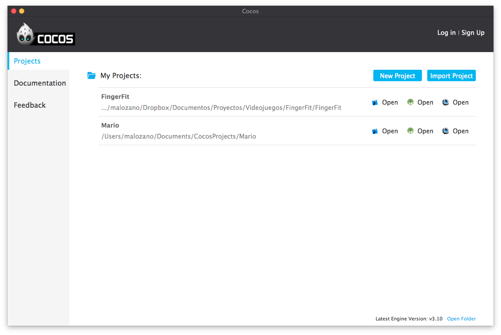

Al crear un nuevo proyecto nos dejará elegir:

* **Nombre del proyecto**. 
* **Ruta del directorio de proyectos**. Ruta del disco donde se almacenará el proyecto Cocos2d-x. Será un directorio con el nombre indicado en el campo anterior.
* **Tipo de motor**. Podemos elegir si queremos que nuestro proyecto integre los fuentes de la librería de Cocos2d-x, o sólo los binarios. Con la primera opción la compilación será más lenta, pero nos permitirá hacer cambios en la librería si es necesario.
* **Lenguaje de desarrollo**. Además de C++, podremos también crear videojuegos mediante lenguajes de _script_ como Lua o Javascript.
* **Editor**. Nos permite indicar si queremos utilizar _Cocos Studio_ para la edición visual de las escenas.
* **SDKs**. Nos permite incluir _plugins_ adicionales para integrar servicios nativos de la plataforma o servicios de terceros, como por ejemplo redes sociales o analíticas.

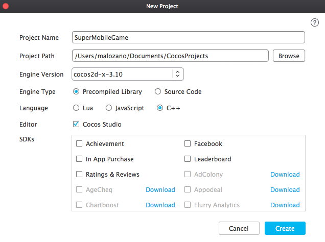


### Creación del proyecto desde la terminal

Tanto si tenemos el _kit_ completo como sólo el _framework_, tendremos la opción de crear un nuevo proyecto desde la terminal. 

Al descargar y descomprimir Cocos2d-x, veremos en el directorio raiz de la libreria un script llamado `setup.py`. Este hay que ejecutarlo una vez después de haber descomprimido la libreria (si utilizamos el instalador esto se hará de forma automática). Este mismo script nos introducira en nuestro fichero `~/.profile` las rutas necesarias para utilizar la libreria desde línea de comandos. De manera manual podríamos cargar dichas variables mediante el comando  `source ~/.profile`, pero eso se realizará de manera automática cada vez que abramos una nueva terminal. 

De esta manera tendremos acceso a un script llamado `cocos`que permite entre otras cosas crear la plantilla para un nuevo proyecto Cocos2d-x multiplataforma. 
Deberemos proporcionar la siguiente información:

```bash
cocos new MiJuego   -p es.ua.dccia 
                    -l cpp
                    -d MisProyectosCocos
```

Esto nos creará un proyecto (carpeta) `MiJuego` en la subcarpeta `MisProyectosCocos` del directorio donde nos encontremos. El lenguaje utilizado será C++ (`-l cpp`). La plantilla del nuevo proyecto será la misma para todos los sistema soportados. Por ejemplo, si queremos
trabajar con la versión de iOS, dentro del directorio de nuestro proyecto entraremos en la
subcarpeta `proj.ios_mac` y abriremos el proyecto Xcode. Todas las plataformas
comparten los mismos directorio de clases (`Classes`) y recursos (`Resources`) 
de nuestro juego. Sólo cambian los ficheros de configuración del proyecto que los "envuelve".

Podremos de esta forma crear un nuevo proyecto que contendrá la base para implementar un videojuego
que utilice las librerías de Cocos2d-x. 
El elemento central de este motor es un _singleton_ de tipo `Director`, al que 
podemos acceder de la siguiente forma:

```cpp
Director::getInstance()
```


## Tipos de datos

Como hemos comentado, Cocos2d-x proviene del motor Cocos2d para iOS. Este motor estaba 
implementado en Objective-C, sobre la API Cocoa Touch, y por lo tanto estaba muy vinculado
a sus tipos de datos. 

Por este motivo Cocos2d-x implementa sus propios tipos de datos equivalentes a los de 
Cocoa Touch para poder trabajar de la misma forma. Vamos a ver cuáles son estos tipos de datos.

Por un lado tenemos la clase `Ref`. Todos los objetos de la librería
heredan en última instancia de esta clase. En ella se define por ejemplo el mecanismo de
gestión de memoria que utilizan todos los objetos de la librería.

Tenemos una serie de colecciones como `Vector<>`, `Map<>` especiales de Cocos2d-x que tienen en cuenta su modelo particular de memoria, pero con los que podremos utilizar la sintaxis de C++ para este tipo de colecciones. También tenemos los tipos `Value`, `ValueVector` y `ValueMap` para la representación de estructuras de datos, que nos permiten por ejemplo cargar ficheros `.plist` de forma automática. El primero de ellos es un _wrapper_ que permite almacenar tipos básicos (`bool`, `int`, `string`, etc) o complejos, mientras que los otros dos representan las listas y diccionarios respectivamente.

Encontramos también una serie de tipos de datos geométricos: `Point`, 
`Rect` y `Size`. Estos tipos de datos incorporan también algunas
operaciones, por ejemplo para comprobar si dos rectángulos intersectan.


## Escena 2D

En Cocos2D cada pantalla se representa mediante un objeto de tipo `Scene`.
  En la pantalla del juego se dibujarán todos los elementos necesarios (fondos, _sprites_, etc) para construir 
  la escena del juego. De esta manera tendremos el fondo, nuestro personaje, los 
  enemigos y otros objetos que aparezcan durante el juego, además de marcadores 
  con el número de vidas, puntuación, etc. Todos estos elementos se representan
  en Cocos2D como nodos del tipo `Node`. La escena se compondrá de una
  serie de nodos organizados de forma jerárquica. Entre estos nodos podemos encontrar
  diferentes tipos de elementos para construir la interfaz del videojuego, como etiquetas
  de texto, menús, _sprites_, fondos, etc. Otro de estos tipos de nodos son las capas.

La escena se podrá componer de una o varias capas. Los _sprites_ y fondos 
  pueden organizarse en diferentes capas para construir la escena. Todas las capas 
  podrán moverse o cambiar de posición, para mover de esta forma 
  todo su contenido en la pantalla. Pondremos varios elementos en una misma capa
  cuando queramos poder moverlos de forma conjunta.

Las capas en Cocos2D se representan mediante la clase `Layer` o `Node` (en las últimas versiones del motor las diferencias entre ambas clases son mínimas, y se recomienda organizar el juego mediante nodos). Las escenas
podrán componerse de una o varias capas, y estas capas contendrán los distintos nodos
a mostrar en pantalla, que podrían ser a su vez otras capas. Es decir, la escena
se representará como un grafo, en el que tenemos una jerarquía de nodos, en la que
determinados nodos, como es el caso de la escena o las capas, podrán contener otros nodos.
Este tipo de representación se conoce como **escena 2D**.

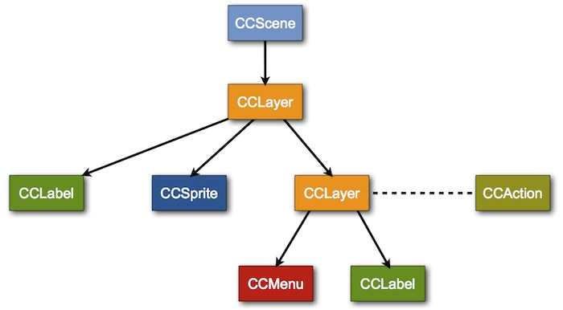


Normalmente para cada pantalla del juego tendremos una capa principal, y encapsularemos
el funcionamiento de dicha pantalla en una subclase de `Layer`, por ejemplo:

```cpp
class MenuPrincipal : public cocos2d::Layer
{
public:
    virtual bool init();
    
    static cocos2d::Scene* scene();
    
    CREATE_FUNC(MenuPrincipal);
};
```

Crearemos la escena a partir de su capa principal. Todos los nodos, incluyendo
la escena, se instanciarán mediante el método de factoría `create`. 
Este método de factoría se genera de forma estática con la macro `CREATE_FUNC`, por
ese motivo está declarada en la interfaz de clase anterior. Podemos añadir
un nodo como hijo de otro nodo con el método `addChild`:

```cpp
Scene* MenuPrincipal::scene()
{
    Scene *scene = Scene::create();
    MenuPrincipal *layer = MenuPrincipal::create();
    scene->addChild(layer, 0);    
    return scene;
}
```

Cuando instanciamos un nodo mediante el método de factoría `create`, llamará
a su método `init` para inicializarse. Si sobrescribimos dicho método en la capa
podremos definir la forma en la que se inicializa:

```cpp
bool MenuPrincipal::init()
{
    // Inicializar primero la superclase
    if ( !Layer::init() )
    {
        return false;
    }
 
    // Inicializar componentes de la capa
    ...

	return true;
}
```

El orden en el que se mostrarán las capas es lo que se conoce como orden Z, 
  que indica la profundidad de esta capa en la escena. La primera capa será 
  la más cercana al punto de vista del usuario, mientras que la última 
  será la más lejana. Por lo tanto, las primeras capas que añadamos 
  quedarán por delante de las siguientes capas. Este orden Z se puede controlar
  mediante la propiedad `zOrder` de los nodos.


## Transiciones entre escenas

Mostraremos la escena inicial del juego con el método `runWithScene` del director:

```cpp
Director::getInstance()->runWithScene(MenuPrincipal::scene());
```

Con esto pondremos en marcha el motor del juego mostrando la escena indicada. Si el motor
ya está en marcha y queremos cambiar de escena, deberemos hacerlo con el método
`replaceScene`:

```cpp
Director::getInstance()->replaceScene(Puntuaciones::scene());
```

También podemos implementar transiciones entre escenas de forma animada utilizando como escena
una serie de clases todas ellas con prefijo `Transition-`, que heredan de `TransitionScene`,
que a su vez hereda de `Scene`. Podemos mostrar una transición animada reemplazando la
escena actual por una escena de transición:

```cpp
Scene *puntuacionesScene = Puntuaciones::scene();
TransitionCrossFade *transition = 
    TransitionCrossFade::create(0.5, puntuacionScene);
Director::getInstance()->replaceScene(transition);
```

Podemos observar que la escena de transición se construye a partir de la duración de la 
transición, y de la escena que debe mostrarse una vez finalice la transición.


## Interfaz de usuario

Encontramos distintos tipos de nodos que podemos añadir a la escena para crear nuestra interfaz de
usuario, como por ejemplo menús y etiquetas de texto, que nos pueden servir por ejemplo para mostrar
el marcador de puntuación, o el mensaje _Game Over_. 

Tenemos dos formas alternativas de crear una etiqueta de texto:


* Utilizar una fuente _TrueType_ predefinida.
* Crear nuestro propio tipo de fuente _bitmap_.


La primera opción es la más sencilla, ya que podemos crear la cadena directamente a partir de un tipo
de fuente ya existen y añadirla a la escena con `addChild` (por ejemplo añadiéndola como hija
de la capa principal de la escena). Se define mediante la clase `LabelTTF`:

```cpp
LabelTTF* label = LabelTTF::create("Game Over", "Arial", 24);
this->addChild(label);
```

Sin embargo, en un videojuego debemos cuidar al máximo el aspecto y la personalización de los gráficos.
Por lo tanto, suele ser más adecuado crear nuestros propios tipos de fuentes. La mayoría de motores de
videojuegos soportan el formato `.fnt`, con el que podemos definir fuentes de tipo
_bitmap_ personalizadas. Para crear una fuente con dicho formato podemos utilizar herramientas
como **Angel Code** o **Hiero** (http://www.n4te.com/hiero/hiero.jnlp).
Una vez creada la fuente con este formato, podemos mostrar una cadena con dicha fuente mediante
la clase `LabelBMFont`:

```cpp
LabelBMFont *label = LabelBMFont::create("Game Over", "fuente.fnt");
this->addChild(label);
```

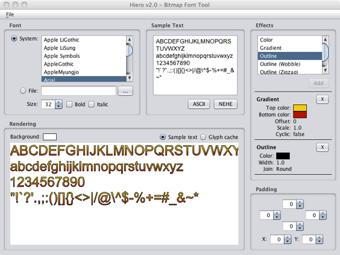


Por otro lado, también podemos crear menús de opciones. Normalmente en la pantalla principal del juego
siempre encontraremos un menú con todas las opciones que nos ofrece dicho juego. Los menús se crean con
la clase `Menu`, a la que añadiremos una serie de _items_, de tipo `MenuItem` (o subclases suyas), 
que representarán las opciones del menú. Estos _items_ pueden ser etiquetas de texto, pero también
podemos utilizar imágenes para darles un aspecto más vistoso. El menú se añadirá a la escena como cualquier
otro tipo de _item_:

```cpp
MenuItemImage *item1 = MenuItemImage::create(
      "nuevo_juego.png", "nuevo_juego_selected.png", CC_CALLBACK_1(MenuPrincipal::menuNuevoJuegoCallback, this));
      
MenuItemImage *item2 = MenuItemImage::create(
      "continuar.png", "continuar_selected.png", CC_CALLBACK_1(MenuPrincipal::menuContinuarCallback, this));

MenuItemImage *item3 = MenuItemImage::create(
      "opciones.png", "opciones_selected.png", CC_CALLBACK_1(MenuPrincipal::menuOpcionesCallback, this));
  
Menu* menu = Menu::create(item1, item2, item3, NULL);
menu->alignItemsVertically();    

this->addChild(menu);  
```

Vemos que para cada _item_ del menú añadimos dos imágenes. Una para su estado normal, y otra
para cuando esté pulsado. También propocionamos la acción a realizar cuando se pulse sobre cada opción,
mediante un par _target-selector_: el _target_ es el objeto sobre el que se 
va a llamar a la acción (normalmente nuestro propio objeto `this`), y el _selector_ es la forma de indicar
el método al que se va a invocar. Los métodos indicados como _selectores_ de tipo menú
deberán tener la siguiente forma:

```cpp
void MenuPrincipal::menuNuevoJuegoCallback(Ref* pSender)
{
    Director::getInstance()->replaceScene(Game::scene());
}
```

Una vez creadas las opciones, construirmos un menú a partir de ellas,
organizamos los _items_ (podemos disponerlos en vertical de forma automática como vemos en el ejemplo), y
añadimos el menú a la escena.


## Gestión de la memoria

La memoria en Cocos2d-x se gestiona mediante cuenta de referencias, siguiendo el mismo
mecanismo de gestión de memoria que utiliza Cocos2d al estar implementado en Objective-C. 
Este mecanismo consiste en que los objetos de la librería (todos aquellos derivan de
`Ref`) tienen un contador de referencias que existen hacia ellos. 
Cuando el contador de referencias llegue a cero, el objeto se eliminará de memoria.

Al instanciar un objeto (con `new`) el objeto se crea con 1 referencia.
Podemos incrementar el número de referencias sobre un objeto llamando a su método 
`retain`, y decrementarlo llamando a `release`. Deberemos asegurarnos
de que el número de llamadas a `new`/`retain` sobre un objeto sea
igual al número de llamadas a `release`. Si el primero fuese superior al segundo, 
entonces tendríamos una fuga de memoria. Si fuese inferior tendríamos un error de acceso a 
memoria cuando intentemos decrementar las referencias de un objeto que ha sido ya liberado. 
Si no organizamos bien el código de gestión de memoria puede ser complicado garantizar que
el número de llamadas esté equilibrado. Para evitar este problema la regla fundamental es
que la unidad que incremente el número de referencias (`new`/`retain`) 
será responsable de decrementarlo (`release`). Vemos a continuación con mayor
detalle las implicaciones que esta regla tiene en el uso de la librería:


* Cuando instanciamos un nodo con el método factoría `create` este método
crea una referencia, pero él mismo es responsable de eliminarla. Para conseguir esto
lo que hace es dejar programado que la referencia se librere automáticamente cuando
termine la llamada de la función en la que estamos. Es decir, si nadie retiene el objeto
que nos ha devuelto el objeto será eliminado de memoria automáticamente.

* Cuando añadimos un nodo como hijo de otro en la escena 2D, o cuando se añade a otras 
estructuras como el director, o alguna de las cachés de objetos que gestiona el motor, estas
estructuras se encargar de retener el objeto en memoria, y cuando se elimine de ellas 
lo liberarán. Es decir, podemos por ejemplo crear un nodo con `create` 
y en ese momento añadirlo como hijo a otro con `addChild`, y no tendremos 
que preocuparnos de retenerlo ni de liberarlo. El propio grafo de la escena será
el encargado de gestionar la memoria.

* Si queremos guardar un nodo como campo de nuestro objeto, tras instanciarlo con 
`create` deberemos reternarlo con `retain` para que no se
libere automáticamente. Nosotros seremos responsables de liberarlo, por lo que 
deberemos llamar a `release` sobre dicho campo cuando nuestro objeto
sea destruido, o cuando vayamos a cambiar el valor del campo y el antiguo deba ser
liberado. 


## Sprites

Podemos crear un _sprite_ en Cocos2D con la clase `Sprite` a partir de la textura de dicho _sprite_:

```cpp
Sprite *sprite = Sprite::create("personaje.png");
```

El _sprite_ podrá ser añadido a la escena como cualquier otro nodo, añadiéndolo
como hijo de alguna de las capas con `addChild:`.


### Posición

Al igual que cualquier nodo, un _sprite_ tiene una posición en pantalla
representada por su propiedad `position`, de tipo `Vec2` (también podemos utilizar como tipo `Point`, ya que es un alias de `Vec2`). 

Por ejemplo, para posicionar un _sprite_ en unas determinadas coordenadas
le asignaremos un valor a su propiedad `position` (esto es aplicable a 
cualquier nodo):

```cpp
sprite->setPosition(Vec2(240, 160));
```

La posición indicada corresponde al punto central del _sprite_, aunque 
podríamos modificar esto con la propiedad `anchorPoint`, de forma similar
a las capas de CoreAnimation. El sistema de coordenadas de Cocos2D es el mismo que el
de CoreGraphics, el origen de coordenadas se encuentra en la esquina inferior 
izquierda, y las _y_ son positivas hacia arriba.

Podemos aplicar otras transformaciones al _sprite_, como rotaciones 
(`rotation`), escalados (`scale`, `scaleX`, `scaleY`), o desencajados
(`skewX`, `skewY`). También podemos especificar su orden Z (`zOrder`). 
Recordamos que todas estas propiedades no son exclusivas de los _sprites_, sino que son
aplicables a cualquier nodo, aunque tienen un especial interés en el caso de los _sprites_.


### Fotogramas

Estos objetos pueden estar animados. Para ello deberemos definir los distintos 
  fotogramas (o _frames_) de la animación. Podemos definir varias 
  animaciones para cada _sprite_, según las acciones que pueda hacer. 
  Por ejemplo, si tenemos un personaje podemos tener una animación para 
  andar hacia la derecha y otra para andar hacia la izquierda.
El _sprite_ tendrá un determinado tamaño (ancho y alto), 
  y cada fotograma será una imagen de este tamaño.
  
Cambiando el fotograma que se muestra del _sprite_ en cada momento podremos 
  animarlo. Para ello deberemos tener imágenes para los distintos fotogramas del _sprite_.
  Sin embargo, como hemos comentado anteriormente, la memoria de vídeo es un recurso crítico, y 
  debemos aprovechar al máximo el espacio de las texturas que se almacenan en ella. Recordemos
  que el tamaño de las texturas en memoria debe ser potencia de 2. Además, conviene evitar
  empaquetar con la aplicación un gran número de imágenes, ya que esto hará que el espacio
  que ocupan sea mayor, y que la carga de las mismas resulte más costosa.

Para almacenar los fotogramas de los _sprites_ de forma óptima, utilizamos lo que se conoce como
_sprite sheets_. Se trata de imágenes en las que incluyen de forma conjunta todos los fotogramas
de los _sprites_, dispuestos en forma de mosaico.
  
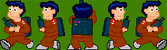


Podemos crear estos _sprite sheets_ de forma manual, aunque encontramos herramientas que nos
facilitarán enórmemente este trabajo, como **TexturePacker** (http://www.texturepacker.com).
Esta herramienta cuenta con una versión básica gratuita, y opciones adicionales de pago. Además de organizar
los _sprites_ de forma óptima en el espacio de una textura OpenGL, nos permite almacenar esta textura
en diferentes formatos (RGBA8888, RGBA4444, RGB565, RGBA5551, PVRTC) y aplicar efectos de mejora como 
_dithering_. Esta herramienta permite generar los _sprite sheets_ en varios formatos reconocidos por los diferentes
motores de videojuegos, como por ejemplo Cocos2D o libgdx.

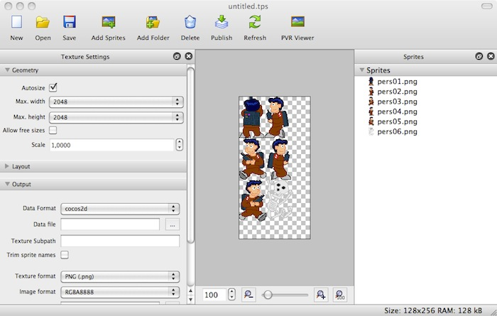


Con esta herramienta simplemente tendremos que arrastrar sobre ella el conjunto de imágenes con los distintos 
fotogramas de nuestros _sprites_, y nos generará una textura optimizada para OpenGL con todos ellos 
dispuestos en forma de mosaico. Cuando almacenemos esta textura generada, normalmente se guardará un fichero
`.png` con la textura, y un fichero de datos que contendrá información sobre los distintos fotogramas
que contiene la textura, y la región que ocupa cada uno de ellos.

Para poder utilizar los fotogramas añadidos a la textura deberemos contar con algún mecanismo que nos permita
mostrar en pantalla de forma independiente cada región de la textura anterior (cada fotograma). En 
prácticamente todos los motores para videojuegos encontraremos mecanismos para hacer esto.

En el caso de Cocos2D, tenemos la clase `SpriteFrameCache` que se encarga de almacenar la
caché de fotogramas de _sprites_ que queramos utilizar. Con TexturePacker habremos
obtenido un fichero `.plist` (es el formato utilizado por Cocos2D) y una imagen `.png`. 
Podremos añadir fotogramas a la caché a partir de estos dos ficheros. En el fichero `.plist` se 
incluye la información de cada fotograma (tamaño, región que ocupa en la textura, etc). Cada fotograma se 
encuentra indexado por defecto mediante el nombre de la imagen original que añadimos a TexturePacker, aunque 
podríamos editar esta información de forma manual en el `.plist`.

La caché de fotogramas se define como _singleton_. Podemos añadir nuevos fotogramas a este
_singleton_ de la siguiente forma:

```cpp
SpriteFrameCache::getInstance()
    ->addSpriteFramesWithFile("sheet.plist");
```

En el caso anterior, utilizará como textura un fichero con el mismo nombre que el `.plist` pero
con extensión `.png`. También encontramos una versión del método anterior que también recibe como
parámetro la textura a utilizar, y de esta forma nos permite utilizar un fichero de textura 
con distinto nombre al `.plist`.

Una vez introducidos los fotogramas empaquetados por TexturePacker en la caché de Cocos2D, podemos crear 
_sprites_ a partir de dicha caché con:

```cpp
Sprite *sprite = Sprite::createWithSpriteFrameName("frame01.png");
```

En el caso anterior creamos un nuevo _sprite_, pero en lugar de hacerlo directamente a partir de una
imagen, debemos hacerlo a partir del nombre de un fotograma añadido a la caché de textura. No debemos confundirnos
con esto, ya que en este caso al especificar `"frame01.png"` no buscará un fichero con este nombre
en la aplicación, sino que buscará un fotograma con ese nombre en la caché de textura. El que los fotogramas
se llamen por defecto como la imagen original que añadimos a TexturePacker puede llevarnos a confusión.

También podemos obtener el fotograma como un objeto `SpriteFrame`. Esta clase no define un 
_sprite_, sino el fotograma almacenado en caché. Es decir, no es un nodo que podamos almacenar en la 
escena, simplemente define la región de textura correspondiente al fotograma:

```cpp
SpriteFrame* frame = SpriteFrameCache::getInstance()
    ->spriteFrameByName("frame01.png");
```

Podremos inicializar también el _sprite_ a partir del fotograma anterior, en lugar de hacerlo directamente
a partir del nombre del fotograma:

```cpp
Sprite *sprite = Sprite::createWithSpriteFrame(frame);
```


### Animación

Podremos definir determinadas secuencias de _frames_ para crear animaciones. Las animaciones se
representan mediante la clase `Animation`, y se pueden crear a partir de la secuencia de
fotogramas que las definen. Los fotogramas deberán indicarse mediante objetos de la clase 
`SpriteFrame`:

```cpp
Animation *animAndar = Animation::create();
animAndar->addSpriteFrame(SpriteFrameCache::getInstance()
    ->spriteFrameByName("frame01.png"));
animAndar->addSpriteFrame(SpriteFrameCache::getInstance()
    ->spriteFrameByName("frame02.png"));
```

Podemos ver que los fotogramas se pueden obtener de la caché de fotogramas definida anteriormente. Además
de proporcionar una lista de fotogramas a la animación, deberemos proporcionar su periodicidad, es decir, el
tiempo en segundos que tarda en cambiar al siguiente fotograma. Esto se hará mediante la propiedad
`delayPerUnit`:

```cpp
animAndar->setDelayPerUnit(0.25);
```

Una vez definida la animación, podemos añadirla a una caché de animaciones que, al igual que la caché
de texturas, también se define como _singleton_:

```cpp
AnimationCache::getInstance()
    ->addAnimation(animAndar, "animAndar");
```

La animación se identifica mediante la cadena que proporcionamos como parámetro
`name`. Podemos cambiar el fotograma que muestra actualmente un _sprite_ con su método:

```cpp
sprite->setDisplayFrameWithAnimationName("animAndar", 0);
```

Con esto buscará en la caché de animaciones la animación especificada, y mostrará de ella
el fotograma cuyo índice proporcionemos. Más adelante cuando estudiemos el motor del juego veremos cómo 
reproducir animaciones de forma automática.


### _Sprite batch_

En OpenGL los _sprites_ se dibujan realmente en un contexto 3D. Es decir, son texturas que se 
mapean sobre polígonos 3D (concretamente con una geometría rectángular). Muchas veces encontramos en
pantalla varios _sprites_ que utilizan la misma textura (o distintas regiones de la misma textura,
como hemos visto en el caso de los _sprite sheets_). Podemos optimizar el dibujado de estos _sprites_ 
generando la geometría de todos ellos de forma conjunta en una única operación con la GPU. Esto será
posible sólo cuando el conjunto de _sprites_ a dibujar estén contenidos en una misma textura. 

Podemos crear un _batch_ de _sprites_ con Cocos2D utilizando la clase 

```cpp
SpriteBatchNode *spriteBatch = 
    SpriteBatchNode::create("sheet.png");
this->addChild(spriteBatch);
```

El _sprite batch_ es un tipo de nodo más que podemos añadir a nuestra capa como hemos visto, 
pero por si sólo no genera ningún contenido. Deberemos añadir como hijos los _sprites_ que queremos 
que dibuje. Es imprescindible que los hijos sean de tipo `Sprite` (o subclases de ésta), y
que tengan como textura la misma textura que hemos utilizado al crear el _batch_ (o regiones de 
la misma). No podremos añadir _sprites_ con ninguna otra textura dentro de este _batch_.

```cpp
Sprite *sprite1 = Sprite::createWithSpriteFrameName("frame01.png");
sprite1->setPosition(Vec2(50,20));
Sprite *sprite2 = Sprite::createWithSpriteFrameName("frame01.png");
sprite2->setPosition(Vec2(150,20));

spriteBatch->addChild(sprite1);
spriteBatch->addChild(sprite2);
```

En el ejemplo anterior consideramos que el _frame_ con nombre `"frame01.png"`
es un fotograma que se cargó en la caché de fotogramas a partir de la textura `sheet.png`.
De no pertenecer a dicha textura no podría cargarse dentro del _batch_.


### Colisiones

Otro aspecto de los _sprites_ es la interacción entre ellos. 
  Nos interesará saber cuándo somos tocados por un enemigo o una bala para 
  disminuir la vida, o cuándo alcanzamos nosotros a nuestro enemigo. Para ello 
  deberemos detectar las colisiones entre _sprites_. La colisión 
  con _sprites_ de formas complejas puede resultar costosa de calcular. 
  Por ello se suele realizar el cálculo de colisiones con una forma aproximada 
  de los _sprites_ con la que esta operación resulte más 
  sencilla. Para ello solemos utilizar el _bounding box_, es decir, un 
  rectángulo que englobe el _sprite_. La intersección de 
  rectángulos es una operación muy sencilla. 
    
La clase `Sprite` contiene un método `getBoundingBox` que
nos devuelve un objeto `Rect` que representa la caja en la que el
_sprite_ está contenido. Con la función `intersectsRect` podemos
comprobar de forma sencilla y eficiente si dos rectángulos colisionan:

```cpp
Rect bbPersonaje = spritePersonaje->getBoundingBox();
Rect bbEnemigo = spriteEnemigo->getBoundingBox();

if (bbPersonaje.intersectsRect(bbEnemigo)) {
    // Game over
    ...
}
```


## Motor del juego

El componente básico del motor de un videojuego es lo que se conoce como ciclo del juego
(_game loop_). Vamos a ver a continuación en qué consiste este ciclo. 


### Ciclo del juego

Se trata de un bucle infinito en el que tendremos el código 
  que implementa el funcionamiento del juego. Dentro de este bucle se efectúan 
  las siguientes tareas básicas:

* **Leer la entrada**: Lee la entrada del usuario para conocer 
    si el usuario ha pulsado alguna tecla desde la última iteración.
  
* **Actualizar escena**: Actualiza las posiciones de los _sprites_ 
    y su fotograma actual, en caso de que estén siendo animados, la posición 
    del fondo si se haya producido _scroll_, y cualquier otro elemento 
    del juego que deba cambiar. Para hacer esta actualización se pueden 
    tomar diferentes criterios. Podemos mover el personaje según la entrada 
    del usuario, la de los enemigos según su inteligencia artificial, o 
    según las interacciones producidas entre ellos y cualquier otro objeto 
    (por ejemplo al ser alcanzados por un disparo, colisionando el _sprite_ 
    del disparo con el del enemigo), etc.
  
* **Redibujar**: Tras actualizar todos los elementos del juego, 
    deberemos redibujar la pantalla para mostrar la escena tal como ha quedado 
    en el instante actual. 
  
* **Dormir**: Normalmente tras cada iteración dormiremos 
    un determinado número de milisegundos para controlar la velocidad a 
    la que se desarrolla el juego. De esta forma podemos establecer a cuantos 
    fotogramas por segundo (_fps_) queremos que funcione el juego, siempre 
    que la CPU sea capaz de funcionar a esta velocidad.


```cpp
while(true) {
    leeEntrada();
    actualizaEscena();
    dibujaGraficos();   
}
```

Este ciclo no siempre deberá comportarse siempre de la misma forma. 
  El juego podrá pasar por distintos estados, y en cada uno de ellos deberán 
  el comportamiento y los gráficos a mostrar serán distintos (por ejemplo, las pantallas
  de menú, selección de nivel, juego, _game over_, etc).
Podemos modelar esto como una máquina de estados, en la que en cada 
  momento, según el estado actual, se realicen unas funciones u otras, 
  y cuando suceda un determinado evento, se pasará a otro estado.


### Actualización de la escena

En Cocos2D no deberemos preocuparnos de implementar el ciclo del juego, ya que de esto
se encarga el _singleton_ `Director`. Los estados del juego se
controlan mediante las escenas (`Scene`). En un momento dado, el ciclo de
juego sólo actualizará y mostrará los gráficos de la escena actual. Dicha escena dibujará
los gráficos a partir de los nodos que hayamos añadido a ella como hijos.

Ahora nos queda ver cómo actualizar dicha escena en cada iteración del ciclo del juego, 
por ejemplo, para ir actualizando la posición de cada personaje, o comprobar si existen
colisiones entre diferentes _sprites_. La escena tiene un método 
`schedule` que permite especificar un método al que
se llamará en cada iteración del ciclo. De esa forma, podremos especificar en dicho método la forma de actualizar la escena:

```cpp
scene->schedule(CC_SCHEDULE_SELECTOR(Game::update));
```

Tendremos que definir un método `update` donde introduciremos el código
que se encargará de actualizar la escena. Como parámetro recibe el tiempo transcurrido desde
la anterior actualización (desde la anterior iteración del ciclo del juego). Deberemos aprovechar
este dato para actualizar los movimientos a partir de él, y así conseguir un movimiento fluido
y constante:

```cpp
void Game::update(float dt)
{
    _sprite->setPosition(_sprite->getPosition() + Vec2(100*dt, 0));
}
```

En este caso estamos moviendo el _sprite_ en _x_ a una velocidad de 100 pixeles por
segundo (el tiempo transcurrido se proporciona en segundos). 

> Es importante remarcar que tanto el dibujado como las actualizaciones sólo se 
llevarán a cabo cuando la escena en la que están sea la escena que está ejecutando actualmente
el `Director`. Así es como se controla el estado del juego.

Existe otra versión del método `schedule` que nos permite proporcionar el método a llamar mediante una función lambda. En este caso deberemos indicar también un identificador para nuestra función, para así poder cancelar su planificación:

```cpp
scene->schedule([=](float dt) {
    ...        
}, "ia");
```

A esta planificación le hemos dado el identificador `"ia"`. Podremos cancelarla llamando a `unschedule("ia")`. 

Si no queremos tener que especificar la función de forma _inline_, también podemos especificarla de la siguiente forma:

```cpp
scene->schedule(CC_CALLBACK_1(Game::update, this), "ia");
```


### Acciones

En el punto anterior hemos visto cómo actualizar la escena de forma manual como se hace habitualmente
en el ciclo del juego. Sin embargo, con Cocos2D tenemos formas más sencillas de animar los nodos de 
la escena, son lo que se conoce como **acciones**. Estas acciones nos permiten definir
determinados comportamientos, como trasladarse a un determinado punto, y aplicarlos sobre un nodo
para que realice dicha acción de forma automática, sin tener que actualizar su posición manualmente
en cada iteración (_tick_) del juego.

Todas las acciones derivan de la clase `Action`. Encontramos acciones instantáneas 
(como por ejemplo situar un _sprite_ en una posición determinada), o acciones con una duración
(mover al _sprite_ hasta la posición destino gradualmente).

Por ejemplo, para mover un nodo a la posición _(200, 50)_ en 3 segundos, podemos definir una 
acción como la siguiente:

```cpp
MoveTo *actionMoveTo = MoveTo::create(3, Vec2(200, 50));
```

Para ejecutarla, deberemos aplicarla sobre el nodo que queremos mover:

```cpp
sprite->runAction(actionMoveTo);
```

Podemos ejecutar varias acciones de forma simultánea sobre un mismo nodo. Si queremos detener todas
las acciónes que pudiera haber en marcha hasta el momento, podremos hacerlo con:

```cpp
sprite->stopAllActions();
```

Además, tenemos la posibilidad de encadenar varias acciones mediante el tipo especial de acción
`Sequence`. En el siguiente ejemplo primero situamos el _sprite_ de forma
inmediata en _(0, 50)_, y después lo movermos a _(200, 50)_:

```cpp
Place *actionPlace = Place::create(Vec2(0, 50));
MoveTo *actionMoveTo = MoveTo::create(3, Vec2(200, 50));

Sequence *actionSequence = 
    Sequence::create(actionPlace, actionMoveTo, NULL);
    
sprite->runAction(actionSequence);
```

Incluso podemos hacer que una acción (o secuencia de acciones) se repita un determinado número
de veces, o de forma indefinida:

```cpp
RepeatForever *actionRepeat = 
    RepeatForever::create(actionSequence);
sprite->runAction(actionRepeat);
```

De esta forma, el _sprite_ estará continuamente moviéndose de _(0,50)_ a _(200,50)_.
Cuando llegue a la posición final volverá a aparecer en la inicial y continuará la animación.

Podemos aprovechar este mecanismo de acciones para definir las animaciones de fotogramas de los
_sprites_, con una acción de tipo `Animate`. Crearemos la acción de animación
a partir de una animación de la caché de animaciones:

```cpp
Animate *animate = Animate::create(
    AnimationCache::sharedAnimationCache()
        ->animationByName("animAndar"));

sprite->runAction(RepeatForever::create(animate));
```

Con esto estaremos reproduciendo continuamente la secuencia de fotogramas definida en la animación,
utilizando la periodicidad (_delayPerUnit_) que especificamos al crear dicha animación.

Encontramos también acciones que nos permiten realizar tareas personalizadas, proporcionando mediante una pareja
_target-selector_ la función a la que queremos que se llame cuando se produzca la acción:

```cpp
CallFunc *actionCall = 
    CallFunc::create(CC_CALLBACK_0(Game::accionCallback, this));
```

Deberemos definir en nuestra clase el método de _callback_ a llamar. En el caso del
ejemplo anterior sería:

```cpp
void Game::accionCallback() {
    ...
}
```

Otra opción es pasar directamente una función _lambda_ como parámetro:

```cpp
CallFunc::create([=] {
    ...            
});
```

También encontramos variantes de esta acción que nos permiten pasarle al _callback_
como parámetro datos propios o el nodo sobre el que se ha ejecutado la acción (`CallFuncN` recibe el nodo como parámetro, y `CallFundND` recibe el nodo y un puntero a datos genéricos). Cuanto tengamos que pasar un _callback_ con parámetros utilizaremos `CC_CALLBACK_1`, `CC_CALLBACK_2` y `CC_CALLBACK_3`, para 1, 2 y 3 parámetros respectivamente.

Encontramos gran cantidad de acciones disponibles, que nos permitirán crear diferentes efectos (fundido, tinte,
rotación, escalado), e incluso podríamos crear nuestras propias acciones mediante subclases de `Action`.

   
      

## Escenario de tipo mosaico

Hasta el momento hemos visto cómo crear los diferentes elementos dinámicos (_sprites_) de
nuestro juego, como por ejemplo nuestro personaje, los enemigos, o los disparos. Pero todos estos elementos
normalmente se moverán sobre un escenario. Vamos a ver en esta sesión la forma en la que podemos construir
este escenario, los fondos, y también cómo añadir música de fondo y efectos de sonido.  

En los juegos normalmente tendremos un fondo sobre el que se mueven los personajes. 
  Muchas veces los escenarios del juego son muy extensos y no caben enteros en 
  la pantalla. De esta forma lo que se hace es ver sólo la parte del escenario 
  donde está nuestro personaje, y conforme nos movamos se irá desplazando 
  esta zona visible para enfocar en todo momento el lugar donde está nuestro 
  personaje. Esto es lo que se conoce como _scroll_. 
El tener un fondo con _scroll_ será más costoso computacionalmente, 
  ya que siempre que nos desplacemos se deberá redibujar toda la pantalla, 
  debido a que se está moviendo todo el fondo. Además para poder 
  dibujar este fondo deberemos tener una imagen con el dibujo del fondo para poder 
  volcarlo en pantalla. Si tenemos un escenario extenso, sería totalmente 
  prohibitivo hacer una imagen que contenga todo el fondo. Esta imagen sobrepasaría con
  total seguridad el tamaño máximo de las texturas OpenGL.
Para evitar este problema lo que haremos normalmente en este tipo de juegos 
  es construir el fondo como un mosaico. Nos crearemos una imagen con los elementos 
  básicos que vamos a necesitar para nuestro fondo, y construiremos el 
  fondo como un mosaico en el que se utilizan estos elementos. 


Encontramos herramientas que nos permiten hacer esto de forma sencilla, como 
**Tiled** (http://www.mapeditor.org). 
Con esta herramienta deberemos proporcionar una textura con las distintas piezas con las
que construiremos el mosaico, y podemos combinar estas piezas de forma visual para 
construir mapas extensos.

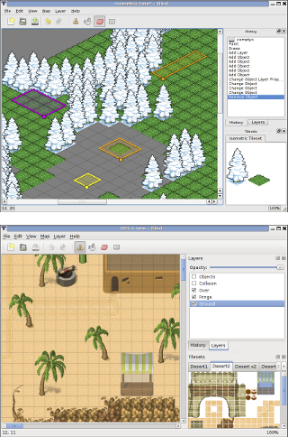


Deberemos proporcionar una imagen con un conjunto de patrones (_Mapa > Nuevo conjunto
de patrones_). Deberemos indicar el ancho y alto de cada "pieza" (_tile_), para que así sea
capaz de particionar la imagen y obtener de ella los diferentes patrones con los que
construir el mapa. Una vez cargados estos patrones, podremos seleccionar cualquiera de ellos
y asignarlo a las diferentes celdas del mapa.

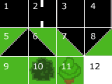


El resultado se guardará en un fichero de tipo `.tmx`, basado en XML, que la
mayor parte de motores 2D son capaces de leer. En Cocos2D tenemos la clase `CCTMXTiledMap`, 
que puede inicializarse a partir del fichero `.tmx`:

```cpp
TMXTiledMap *fondo = TMXTiledMap::create("mapa.tmx");
```

Este objeto es un nodo (hereda de `Node`), por lo que podemos añadirlo a pantalla 
(con `addChild`) y aplicar cualquier transformación de las vistas anterioremente.

Las dimesiones del mapa serán _(columnas*ancho)x(filas*alto)_, siendo _ancho x alto_ las
dimensiones de cada _tile_, y _columnas x filas_ el número de celdas que tiene el mapa. 
  
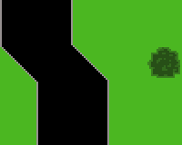


Hemos visto la creación básica de un escenario con _Tiled Map Editor_, pero esta herramienta nos 
da más facilidades para la creación de los fondos. En el caso anterior hemos visto como crear el fondo
a partir de una única capa de mosaico, pero podemos hacer que nuestros fondos se compongan de varias
capas. En el panel de la derecha de la herramienta vemos la lista de capas, y podemos añadir nuevas capas.
Al añadir una nueva capa, nos preguntará si queremos una nueva capa de patrones o de objetos. Las capas
de patrones nos permitirán crear el aspecto visual del fondo mediante un mosaico, como hemos visto anteriormente,
mientras que las de objetos nos permiten marcar diferentes zonas del mapa, por ejemplo para indicar puntos
en los que aparecen enemigos, o el punto en el que se debe situar nuestro personaje al comenzar el nivel.
Vamos a ver cada uno de estos tipos de capas con más detenimiento.


### Capas de patrones

Como hemos indicado anteriormente, las capas de patrones nos permiten definir el aspecto del nivel
mediante un mosaico, utilizando un conjunto de patrones para fijar el contenido de cada celda del mosaico.
Cuando creamos varias capas de patrones, será importante fijar su orden, ya que las capas que estén
al frente taparán a las que estén atrás. Este orden viene determinado por el orden en el que las capas
aparecen en la lista del panel derecho. Las capas al comienzo de la lista quedarán por delante de las
demás. Podemos cambiar el orden de las capas en esta lista mediante los botones con las flechas hacia arriba
y hacia abajo para conseguir situar cada una de ellas en la profundidad adecuada.

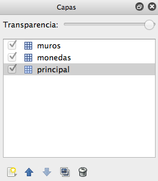


Las utilidades de esta división en capas son varias:


* **Aspecto**: Un primer motivo para utilizar diferentes capas puede ser simplemente por
cuestiones de aspecto, para combinar varios elementos en una misma celda. Por ejemplo, en una capa de fondo podríamos 
poner el cielo, y en una capa más cercana una reja con fondo transparente. De esa forma ese mismo recuadro
con la reja podría ser utilizado en otra parte del escenario con un fondo distinto (por ejemplo de montañas),
pudiendo así con únicamente 3 recuadros obtener 4 configuraciones diferentes: cielo, montaña, cielo con reja, y
montaña con reja.
* **Colisiones**: Puede interesarnos que los elementos de una capa nos sirvan para detectar
colisiones con los objetos del juego. Por ejemplo, podemos en ella definir muros que los personajes del juego
no podrán atravesar. Consideraremos desde nuestro juego que todas las celdas definidas en esa capa suponen
regiones que deben colisionar con nuestros _sprites_.
* **Consumibles**: Podemos definir una capa con objetos que podamos recoger. Por ejemplo
podríamos definir una capa con monedas, de forma que cada vez que el usuario entra en una celda con una moneda
dicha moneda sea eliminada del mapa y se nos añada a un contador de puntuación.


Vamos a ver ahora cómo implementar en nuestro juego los anteriores usos, que nos permitan detectar colisiones 
con las celdas y modificar en el programa el contenido de las mismas para poder introducir en ellas
elementos consumibles.

La base para hacer todo esto es poder obtener cada capa individual del mapa para poder trabajar con
sus elementos. Esto lo haremos con la clase `CCTMXLayer`:

```cpp
TMXLayer *capa = fondo->layerNamed("muros");
```


### Colisiones con el mapa

La detección de colisiones con los muros del fondo será muy útil en juegos de tipo RPG o de plataformas. 
Para hacer esto lo primero que debemos hacer es obtener la capa que define los elementos que se comportan
como "muro" tal como hemos visto anteriormente. De esta capa necesitaremos tener alguna forma de identificar
qué celdas definen muros. La forma más adecuada de marcar estas celdas consiste en darles una serie de 
propiedades que nuestro programa podrá leer y así comprobar si se trata de un muro con el que podemos
colisionar o no. Para asignar propiedades a un objeto del conjunto de patrones dentro de _Tiled_ 
podemos pulsar con el botón derecho sobre él, y seleccionar _Propiedades del Patrón..._. Se abrirá
un cuadro como el siguiente donde podremos definir dichas propiedades:

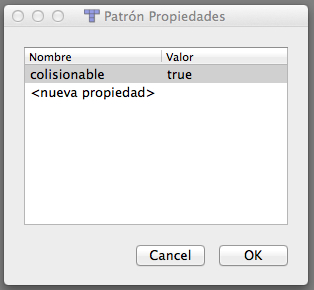


Lo que deberemos hacer es marcar todos los objetos del conjunto de patrones que sirvan para definir muros
con una misma propiedad que los marque como tal.

En el código de nuestro juego podremos leer estas propiedades de la siguiente forma:

```cpp
Point tileCoords = Point(fila,columna);

int tileGid = capa->getTileGIDAt(tileCoords);
if (tileGid) {
    auto properties = fondo->getPropertiesForGID(tileGid);
    if (!properties.isNull()) {
        bool collision =  properties.asValueMap().at("colisionable").asBool();
        if(collision) {
            ...
        }
    }
}
```

El _gid_ de cada celda nos indica el tipo de objeto de patrón que tenemos en ella. Si la celda está
vacía el _gid_ será `0`. En una versión más sencilla, podríamos considerar que todas
las celdas de la capa son colisionables y simplemente comprobar si el _gid_ es distinto de `0`.
De todas formas, el uso de propiedades hace más flexible nuestro motor del juego, para por ejemplo
en el futuro implementar distintos tipos de colisiones.

Para comprobar las colisiones de nuestro _sprite_ con los muros una primera aproximación podría
consistir en hacer la comprobación con todas las celdas de la capa. Sin embargo esto no resulta nada eficiente
ni adecuado. La solución que se suele utilizar habitualmente consiste en comprobar la colisión únicamente con las
celdas de nuestro entorno. Haremos lo siguiente:

* Obtendremos la posición en las que está centrado nuestro _sprite_.
* Calcularemos las coordenadas de la celda a la que corresponde (dividiendo entre la anchura y altura de cada celda).
* Obtendremos los _gid_ de las 9 celdas adyacentes.
* Comprobaremos si colisiona con alguna de ellas, corrigiendo la posición del _sprite_ en tal caso.

A continuación mostramos un ejemplo de código en el que obtendríamos cada una de las celdas adyacentes
a un _sprite_. En primer lugar vamos a crear una serie de métodos auxiliares. El primero de ellos
nos devolverá las coordenadas de una celda a partir de las coordenadas de la escena (dividiendo entre
el tamaño de cada celda):

```cpp
Point Game::tileCoordForPosition(Point position)
{
    Size tileSize = _tiledMap->getTileSize();

    float totalHeight = _tiledMap->getMapSize().height * tileSize.height;
    float x = floor(position.x / tileSize.width);
    float y = floor((totalHeight - position.y) / tileSize.height);
    return Point(x, y);
}
```

> Hay que destacar que las coordenadas _y_ del mapa están invertidas respecto a las
de la escena. Por ese motivo es necesario calcular la altura total y hacer la resta.

También vamos a definir un método que nos devuelva el área (`Rect`) que ocupa en la escena
una celda dada:

```cpp
Rect Game::rectForTileAt(CCPoint tileCoords) {
    Size tileSize = _tiledMap->getTileSize();

    float totalHeight = _tiledMap->getMapSize().height * tileSize.height;
    Point origin(tileCoords.x * tileSize.width, totalHeight - 
                         ((tileCoords.y + 1) * tileSize.height));
    return Rect(origin.x, origin.y, 
                      tileSize.width, tileSize.height);
}
```

Por último, crearemos un método que nos diga si una determinada celda es colisionable o no. Consideraremos 
que las celdas fuera del mapa no son colisionables (aunque según el caso podría interesarnos hacerlo al revés):

```cpp
bool Game::isCollidableTileAt(Point tileCoords) {
    
    // Consideramos que celdas fuera del mapa no son nunca colisionables
    if(tileCoords.x < 0 || tileCoords.x >= _tiledMap->getMapSize().width 
       || tileCoords.y < 0 
       || tileCoords.y >= _tiledMap->getMapSize().height) {
        return false;
    }
    
    TMXLayer *layerMuros = _tiledMap->getLayer("muros");
    
    int tileGid = layerMuros->getTileGIDAt(tileCoords);
    if (tileGid) {
        auto properties = _tiledMap->getPropertiesForGID(tileGid);
        if (!properties.isNull()) {
            bool collision = properties.asValueMap().at("colisionable").asBool();
            return collision;
        }
    }
    
    return false;
}
```

Una vez hecho esto, podremos calcular las colisiones con las celdas adyacentes a nuestro personaje y tomar las acciones oportunas.
Por ejemplo, en el caso sencillo en el que sólo necesitamos calcular las colisiones a la izquierda y a la derecha, podremos
utilizar el siguiente código:

```cpp
Size tileSize = _tiledMap->getTileSize();

Point tileCoord = 
    this->tileCoordForPosition(_spritePersonaje->getPosition());
Point tileLeft(tileCoord.x - 1, tileCoord.y);
Point tileRight(tileCoord.x + 1, tileCoord.y);

if(this->isCollidableTileAt(tileLeft)) {
    Rect tileRect = this->rectForTileAt(tileLeft);
    if(tileRect.intersectsRect(_spritePersonaje->getBoundingBox())) {
        this->detenerPersonaje();
        _spritePersonaje->setPosition(Vec2(tileRect.origin.x + 
            tileRect.size.width +
            _spritePersonaje->getContentSize().width / 2, 
            tileSize.height 
            + _spritePersonaje->getContentSize().height / 2));
    }
}

if(this->isCollidableTileAt(tileRight)) {
    Rect tileRect = this->rectForTileAt(tileRight);
    if(tileRect.intersectsRect(_spritePersonaje->getBoundingBox())) {
        this->detenerPersonaje();
        _spritePersonaje->setPosition(Vec2(tileRect.origin.x - 
            _spritePersonaje->getContentSize().width / 2, 
            tileSize.height + 
            _spritePersonaje->getContentSize().height / 2));
    }
}
```

Por supuesto, la forma de obtener estas celdas dependerá del tamaño del _sprite_. Si ocupase más de una celda
deberemos hacer la comprobación con todas las celdas de nuestro entorno a las que pudiera alcanzar.

Una vez detectada la colisión, el último paso hemos visto que consistiría en parar el movimiento del 
_sprite_. Si conocemos la posición de la celda respecto al _sprite_ (arriba, abajo, izquierda,
derecha) nos será de gran ayuda, ya que sabremos que deberemos posicionarlo justo pegado a esa celda en el
lateral que ha colisionado con ella. En el ejemplo anterior, según colisione con la celda izquierda o derecha,
posicionamos al _sprite_ pegado a la derecha o a la izquierda del muro respectivamente.


### Modificación del mapa

En muchos casos nos interesará tener en el mapa objetos que podamos modificar. Por ejemplo, monedas u otros
items que podamos recolectar, u objetos que podemos destruir. Para conseguir esto podemos definir una capa
con dichos objetos, y marcarlos con una propiedad que nos indique que son "recolectables" o "destruibles".
Una vez hecho esto, desde nuestro código podemos obtener la capa que contenga dichos objetos recolectables,
por ejemplo "monedas":

```cpp
TMXLayer *monedas = fondo->getLayer("monedas");
```

De esta capa podremos eliminar los objetos "recolectables" cuando nuestro personaje los recoja. Para hacer
esto podemos utilizar el siguiente método:

```cpp
monedas->removeTileAt(tileCoord);
```

También podríamos cambiar el tipo de elemento que se muestra en una celda (por ejemplo para que al tocar
una moneda cambie de color). Esto lo haremos especificando el nuevo _gid_ que tendrá
la celda:

```cpp
monedas->setTileGID(GID_MONEDA_ROJA,tileCoord);
```

Para cambiar o modificar los elementos recolectables primero deberemos comprobar si nuestro personaje 
"colisiona" con la celda en la que se encuentran, de forma similar a lo visto en el punto anterior:

```cpp
Point tileCoords = this->tileCoordForPosition(_sprite->getPosition());

int tileGid = monedas->getTileGIDAt(tileCoords);
if (tileGid) {
    auto properties = fondo->getPropertiesForGID(tileGid);
    if (!properties.isNull()) {
        bool recolectable = properties.asValueMap().at("recolectable").asBool();
        if(recolectable) {
            monedas->removeTileAt(tileCoords);
        }
    }
}
```

En este caso únicamente comprobamos la celda en la que se encuentra nuestro personaje, no las adyacentes.
Si el personaje fuese de mayor tamaño deberíamos comprobar todas las celdas del entorno que pudiera abarcar.


### Capas de objetos

Hasta el momento hemos visto las capas de patrones, que se construyen como un mosaico de celdas que definirá el
aspecto del fondo. Existe otro tipo de capa que podemos incluir en nuestro diseño del fondo que no se limita
al mosaico de celdas, sino que nos permite marcar cualquier región del mapa sin ajustarse a la rejilla de celdas.
Estas son las capas de objetos. En estas capas podremos por ejemplo marcar zonas de mapas donde aparecen enemigos,
o donde se situa automáticamente nuestro personaje al iniciar el nivel.

Cuando añadamos y seleccionemos una capa de objetos, en la barra de herramientas superior se activarán
dos iconos que nos permitirán crear nuevos objetos y seleccionar y cambiar las propiedades de los objetos
existentes. Pulsando el botón con el "cubo azul" podremos añadir un nuevo objeto a la escena. El objeto 
se definirá como un rectángulo (deberemos pulsar y arrastrar el ratón sobre el escenario para definir
dicho rectángulo).

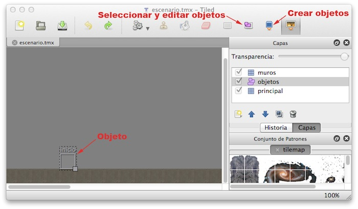


Tras crear un objeto, podremos cambiar a la herramienta para la selección y modificación de objetos, 
seleccionar el objeto que acabamos de crear, pulsar sobre él con el botón derecho, y seleccionar
la opción _Propiedades del Objeto ..._. Veremos una ventana como la siguiente, en la que podremos darle
un nombre, modificar sus dimensiones, y añadir una lista de propiedades.


#### Lectura de la capa de objetos

Una vez le hayamos dado un nombre al objeto, podremos obtenerlo desde el código de nuestro juego. Para ello
primero deberemos obtener la capa de objetos (representada con la clase `TMXObjectGroup`) a 
partir del nombre que le hemos dado (`objetos` en este ejemplo):

```cpp
TMXObjectGroup *objects = fondo->getObjectGroup("objetos");
```

A partir de esta capa podremos obtener uno de sus objetos dando su nombre. Por ejemplo, si hemos creado
un objeto con nombre `inicio`, podremos obtenerlo de la siguiente forma:

```cpp
auto inicio = objects->getObject("inicio");
```
        
Como vemos, el objeto se obtiene como un diccionario. De él podemos obtener diferentes propiedades,
como sus coordenadas:

```cpp
int x = inicio.at("x").asInt();
int y = inicio.at("y").asInt();

_sprite->setPosition(Vec2(x, y));
```

De esta forma en el código obtenemos la posición que ocupa el objeto y podemos utilizar esta posición
para su propósito (por ejemplo para situar en ella inicialmente a nuestro personaje, o hacer que en
ese punto aparezcan nuevos enemigos).


#### Formas geométricas

En la capa de objetos podemos incluir formas geométricas, como por ejemplo líneas o polilíneas. Esto puede ser especialmente útil para definir la geometría de colisión del escenario y posteriormente cargarla en el motor de físicas. 

La capa de objetos geométricos se carga de forma similar a los objetos genéricos definidos por el usuario. 

Por ejemplo, si nuestros objetos geométricos de la capa de objetos son todos ellos polilíneas, podemos cargarlos de la siguiente forma:

```objc
TMXObjectGroup *groupEdges = _tiledMap->getTiledMap()->getObjectGroup("MyEdges");
        
ValueVector edges = groupsEdges->getObjects();
        
for(Value edge : edges) {
    ValueVector polyline = edge.asValueMap().at("polylinePoints").asValueVector();
            
    // Calculamos la coordenadas absolutas del objeto
    float x = edge.asValueMap().at("x").asFloat() + _tiledMap->getTiledMap()->getPositionX();
    float y = edge.asValueMap().at("y").asFloat() + _tiledMap->getTiledMap()->getPositionY();
            
    for(Value point: polyline) {
        float px = point.asValueMap().at("x").asFloat() + x;
        float py = point.asValueMap().at("y").asFloat() + y;
                
        // Hacemos algo con (px, py)    
        ...
    }
}
```

> Si no conocemos cómo está organizada la capa de objetos, podemos consultar el fuente XML del fichero `.tmx`. También tenemos la opción de imprimir en la consola el objeto que nos devuelve `getObjects`, y de esta forma veremos su estructura en JSON y podremos así escribir el código para leerlo.


## Scroll del escenario

Cuando en el juego tenemos un mapa más extenso que el tamaño de la pantalla, tendremos que implementar
_scroll_ para movernos por él. Para hacer _scroll_ podemos desplazar la capa principal del
juego, que contiene tanto el mapa de fondo como los _sprites_:

```cpp
this->setPosition(Vec2(scrollX, scrollY));
```

En este ejemplo anterior, `this` sería nuestra capa principal. En este
caso es importante resaltar que si queremos implementar un HUD (para mostrar puntuaciones, número de vidas,
etc) la capa del HUD no debe añadirse como hija de la capa principal, sino que deberemos añadirla
directamente como hija de la escena (`Scene`), ya que de no ser así el HUD se movería con el
_scroll_.

Normalmente el _scroll_ deberá seguir la posición de nuestro personaje. Conforme movamos nuestro
personaje deberemos centrar el mapa:


```cpp
void Game::centerViewport() {
    Size screenSize = Director::getInstance()->getWinSize();
    
    float x = screenSize.width/2.0 - _sprite->getPosition().x;
    float y = screenSize.height/2.0 - _sprite->getPosition().y;
    
    this->setPosition(Vec2(x, y));
}
```

El método anterior deberá invocarse cada vez que se cambie la posición del _sprite_. Lo que hará
es desplazar todo el escenario del juego de forma que el _sprite_ quede situado justo en el centro
de la pantalla. Podemos observar que se obtiene el tamaño de la pantalla a partir de `Director`, 
y calculamos el desplazamiento _(x,y)_ necesario para que el _sprite_ quede situado justo
en el punto central.


### Límites del escenario

El problema de la implementación anterior es que el escenario no es infinito, y cuando lleguemos a sus
límites normalmente querremos no salirnos de ellos para no dejar en la pantalla espacio vacío. Deberemos
por lo tanto detener el _scroll_ del fondo cuando hayamos llegado a su límite. Esto podemos resolverlo
añadiendo algunos `if` al código anterior:


```cpp
void Game::centerViewport() {
    Size screenSize = Director::getInstance()->getWinSize();
    Size tileSize = _tiledMap->getTileSize();
    
    float offsetX =  screenSize.width / 2.0 - _sprite->getPosition().x;
    float offsetY =  screenSize.height / 2.0 - _sprite->getPosition().y;

    // Comprueba límites en la dimension x
    if(offsetX > 0) {
        offsetX = 0;
    } else if(offsetX < screenSize.width - 
              tileSize.width * _tiledMap->getMapSize().width) {
        offsetX = screenSize.width - 
                  tileSize.width * _tiledMap->getMapSize().width;
    }
    
    // Comprueba límites en la dimension y
    if(offsetY > 0) {
        offsetY = 0;
    } else if(offsetY < screenSize.height - 
              tileSize.height * _tiledMap->getMapSize().height) {
        offsetY = screenSize.height - 
                  tileSize.height * _tiledMap->getMapSize().height;
    }
    
    this->setPosition(Vec2(offsetX, offsetY));
}
```

Con este código evitaremos que en el visor veamos zonas fuera de los límites del mapa. La posición 
mínima que se mostrará será `0`, y la máxima el tamaño del mapa (se calcula como el número
de celdas `mapSize` por el tamaño de cada celda `tileSize`).

Cuando lleguemos a estos límites nuestro personaje seguirá moviéndose, pero ya no estará centrado
en la pantalla, el mapa permanecerá fijo y el personaje se moverá sobre él.


### Scroll parallax

En juegos 2D podemos crear una ilusión de profundidad creando varias capas de fondo y haciendo que
las capas más lejanas se muevan a velocidad más lenta que las más cercanas al hacer _scroll_. Esto
es lo que se conoce como _scroll parallax_.

En Cocos2D es sencillo implementar este tipo de _scroll_, ya que contamos con el tipo de nodo
`ParallaxNode` que define este comportamiento. Este nodo nos permite añadir varios hijos, y 
hacer que cada uno de ellos se desplace a una velocidad distinta.  


```cpp
ParallaxNode *parallax = ParallaxNode::create();

parallax->addChild(scene, 3, Vec2(1,1), Vec2(0,0));
parallax->addChild(mountains, 2, Vec2(0.25,1), Vec2(0,0));
parallax->addChild(sky, 1, Vec2(0.01,1), Vec2(0,0));

this->addChild(parallax, -1);
```

Podemos añadir cualquier nodo como capa al _scroll parallax_, como por ejemplo _sprites_
o _tilemaps_. Con _parallax ratio_ especificamos la velocidad a la que se mueve la capa. Si
ponemos un _ratio_ de 1 hacemos que se mueva a la velocidad real que estemos moviendo la capa
principal de nuestra escena. Si ponemos `0.5`, se moverá a mitad de la velocidad.


## Reproducción de audio

En un videojuego normalmente reproduciremos una música de fondo, normalmente de forma cíclica, y una serie
de efectos de sonido (disparos, explosiones, etc). En Cocos2D tenemos la librería CocosDenshion que nos
permite reproducir este tipo de audio de forma apropiada para videojuegos. 

La forma más sencilla de utilizar esta librería es mediante el objeto _singleton_
`SimpleAudioEngine`. Podemos acceder a él de la siguiente forma:

```cpp
#include "SimpleAudioEngine.h"

...

SimpleAudioEngine *audio = 
    CocosDenshion::SimpleAudioEngine::getInstance();
```


### Música de fondo

Podemos reproducir como música de fondo cualquier formato soportado por el dispositivo (MP3, M4A, etc).
Para ello utilizaremos el método `playBackgroundMusic` del objeto _audio engine_: 

```cpp
audio->playBackgroundMusic("musica.m4a", true);
```

Lo habitual será reproducir la música en bucle, por ejemplo mientras estamos en un menú o en un nivel
del juego. Por ese motivo contamos con el segundo parámetro (_loop_) que nos permite utilizar
de forma sencilla esta característica.

Podemos deterner la reproducción de la música de fondo en cualquier momento con:

```cpp
audio->stopBackgroundMusic();
```

También podemos a través de este objeto cambiar el volumen de la música de fondo (se debe
espeficiar un valor de `0` a `1`):

```cpp
audio->setBackgroundMusicVolume(0.9);
```


### Efectos de sonido

Los efectos de sonido sonarán cuando suceda un determinado evento (disparo, explosión, pulsación de un 
botón), y será normalmente una reproducción de corta duración. Una característica de estos efectos es
que deben sonar de forma inmediata al suceder el evento que los produce. Causaría un mal efecto que un 
disparo sonase con un retardo respecto al momento en el que se produjo. Sin embargo, la reproducción
de audio normalmente suele causar un retardo, ya que implica cargar las muestras del audio del fichero y
preparar los _bufferes_ de memoria necesarios para su reproducción. Por ello, en un videojuego
es importante que todos estos efectos se encuentren de antemano preparados para su reproducción, para
evitar estos retardos.

Con Cocos2D podremos precargar un fichero de audio de la siguiente forma:

```cpp
audio->preloadEffect("explosion.caf");
audio->preloadEffect("disparo.caf");
```

Esto deberemos hacerlo una única vez antes de comenzar el juego (un buen lugar puede ser el método
`init` de nuestra capa del juego). Una vez cargados, podremos reproducirlos de forma inmediata
con `playEffect`:

```cpp
audio->playEffect("explosion.caf");
```

<!-- 
También tenemos la opción de reproducir un sonido con efectos de _pitch_, _pan_ y
_gain_:

```cpp
audio->playEffect()explosion.caf" pitch:0.8 pan:0.2 gain:0.6];
```


* _Pitch_: Nos permite especificar la el tono del audio. Valores altos le darán un tono más agudo, 
y valores bajos lo harán más grave. Puede tomar valores entre 0.5 y 2.0.
* _Pan_: Controla el efecto _estéreo_. Puede tomar valores entre -1.0 y 1.0. Los valores 
negativos hacen que el sonido suene por el canal izquierdo, y los positivos por el derecho. Si el fichero
de sonido ya está grabado en estéreo este parámetro no tendrá ningún efecto. Sólo se puede aplicar a sonidos
grabados en mono.
* _Gain_: Ganancia de volumen del sonido. Puede tomar valores a partir de 0.0. El valor 1.0
corresponde al sonido original del audio.

 -->
 
Una vez no vayamos a utilizar estos efectos de sonido, deberemos liberarlos de memoria:

```cpp
audio->unloadEffect("explosion.caf");
audio->unloadEffect("disparo.caf");
```

Esto se puede hacer cuando vayamos a pasar a otra escena en la que no se vayan a necesitar
estos efectos.

Por último, al igual que en el caso de la música de fondo, podremos cambiar el volumen de los efectos
de sonido con:

```cpp
audio->setEffectsVolume(0.6);
```

De esta forma podremos tener dos niveles de volumen independientes para la música de fondo y para
los efectos de sonido. Los videojuegos normalmente nos presentan en sus opciones la posibilidad de
que el usuario ajuste cada uno de estos dos volúmenes según sus preferencias.


