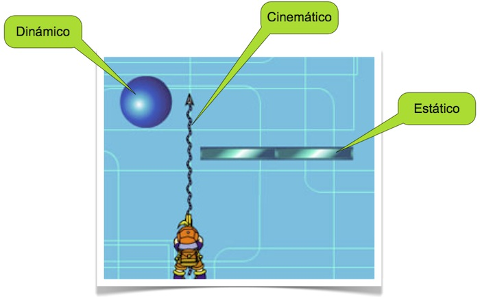

# Motores de físicas

Un tipo de juegos que ha tenido una gran proliferación en el mercado de aplicaciones para móviles son aquellos juegos basados en físicas. Estos juegos son aquellos en los que el motor realiza una simulación física de los objetos en pantalla, siguiendo las leyes de la cinemática y la dinámica. Es decir, los objetos de la pantalla están sujetos a gravedad, cada uno de ellos tiene una masa, y cuando se produce una colisión entre ellos se produce una fuerza de reacción que dependerá de su velocidad y su masa. El motor de físicas se
encarga de realizar toda esta simulación, y nosotros sólo deberemos encargarnos de proporcionar las propiedades de los objetos del mundo. 

Uno de los juegos que más se ha popularizado, cuya mecánica está basada casi al completo en físicas es Angry Birds (desarrollado por [Rovio](http://www.rovio.com/games)). 

## Componentes del motor de físicas

Los componentes básicos que nos aporta un motor de físicas son los siguientes:

* `Body`: Representa un cuerpo rígido. Estos son los tipos de objetos que tendremos en el mundo físico simulado. Cada cuerpo tendrá una posición y velocidad. Los cuerpos se verán afectados por la gravedad del mundo, y por la interacción con los otros cuerpos. Cada cuerpo tendrá una serie de propiedades físicas, como su masa, su centro de gravedad, su coeficiente de fricción o su forma (_shape_).

* `Shape`: Una de las principales características que deberemos tener en cuenta de los cuerpos físicos es su _forma_. Es importante destacar que el aspecto gráfico de los nodos se define de forma independiente de la _forma_ que tendrá en el mundo físico, pero deberemos intentar que sean lo más parecidos posibles.

* `Joint`: Nos permite definir uniones entre diferentes cuerpos. Por ejemplo, podemos hacer que un cuerpo esté conectado a otro mediante un resorte, o que pueda moverse sólo en un determinado eje. 

* `World`: Representa el mundo físico en el que tendrá lugar la simulación. A él se añadirán todos los cuerpos y se encargará de realizar la simulación física sobre ellos, aplicando las correspondientes fuerzas y actualizando su velocidad y posición en el mundo. Una de las principales propiedades del mundo es la gravedad.

## Cuerpos físicos

Vamos en primer lugar a estudiar los diferentes tipos de cuerpos y sus porpiedades.

### Tipos de cuerpos

En los motores de físicas encontraremos tres tipos diferentes de cuerpos:

* **Dinámicos**: Están sometidos a las leyes físicas, y tienen una masa concreta y finita. Estos cuerpos se ven afectados por la gravedad y por la interacción con los demás cuerpos.
* **Estáticos**: Son cuerpos que permanecen siempre en la misma posición. Equivalen a cuerpos con masa infinita. Por ejemplo, podemos hacer que el escenario sea estático. Es importante no mover aquellos cuerpos que hayan sido marcados como estáticos, ya que el motor podría no responder de forma correcta (éste realiza diferentes optimizaciones que asumen que no se van a mover).
* **Cinemáticos**: Al igual que los cuerpos estáticos tienen masa infinita y no se ven afectados por otros cuerpos ni por la gravedad. Sin embargo, en esta caso no tienen una posición fija, sino que podemos moverlos por el mundo, y podemos darles una velocidad fija. Nos son útiles por ejemplo para proyectiles.

### Forma de los cuerpos

Dependiendo de si tenemos un motor 2D o 3D, las formas de los cuerpos del motor físico serán distintas. Según la forma de los cuerpos, será para el motor más o menos complejo calcular las colisiones entre ellos. A continuación mostramos, **ordenadas de menor a mayor complejidad**, las formas que encontramos habitualmente en un motor de físicas 2D:

* **Círculos**. Es la forma más sencilla. Se crea simplemente indicando su centro y su radio, y el cálculo de colisiones con ellos es muy eficiente.

* **Polígonos**. Nos permite crear formas arbitrarias convexas. Es importante destacar que los polígonos siempre deberán ser **convexos y cerrados**. El cálculo de colisiones con formas cóncavas es demasiado complejo para el motor de físicas. Un tipo de polígono muy habitual será la forma de _caja_, muchas veces el motor nos dará atajos para crear dicha forma.

* **Formas compuestas**. Si ninguno de los tipos anteriores de formas se adapta a nuestras necesidades, como por ejemplo en el caso de necesitar una forma cóncava, podemos definir la forma del cuerpo como una composición de formás básicas. Esto será útil para cuerpos dinámicos con formas complejas.

* **Aristas**. Las aristas (_edges_) son segmentos de línea que normalmente se utilizan para construir la geometría del escenario estático, que podrá tener una forma arbitraria. Este tipo de cuerpo y el siguiente, por poder presentar _concavidades_, sólo podrá ser utilizado para cuerpos _estáticos_. El cálculo de colisiones entre dos cuerpos cóncavos es demasiado complejo, por lo que no debe haber cuerpos dinámicos con esas formas (el motor necesita comprobar las colisiones entre pares de cuerpos dinámicos, pero nunca entre dos cuerpos estáticos, al no poder moverse). 

* **Cadenas**. Las cadenas nos permiten unir varias aristas para así definir la geometría estática del escenario y evitar que se puedan producir "baches" en las juntas entre diferentes aristas.

En el caso 3D tenemos:

* **Esferas**. Es la forma más sencilla en este caso. Dado el centro y el radio de la esfera, para saber si colisiona con otra simplemente tendremos que calculas si la distancia entre sus centros es menor que la suma de sus radios.

* **Cajas**. En el caso 3D, en el segundo lugar de complejidad encontramos las cajas. Dependiendo del motor, podríamos encontrar tras este tipo otras clases de formas geométricas predefinidas, como cilindros y conos.

* **Maya convexa**. Si en el motor gráfico tenemos una maya 3D, podemos utilizar como forma física asociada un recubrimiento convexo (_convex hull_) de dicha maya. Es decir, cogemos la misma forma pero eliminando las concavidades.

* **Formas compuestas**. En algunos casos no podemos eliminar las concavidades de un cuerpo físico, pensemos por ejemplo en la forma de una silla, con sus patas, respaldo y asiento. En estos casos, si necesitamos que dicho cuerpo se comporte como dinámico, podemos crear su forma como una composición de formas cóncavas de los tipos anteriores (por ejemplo, una caja por cada pata, otra para el asiento, y otra para el respaldo).

* **Maya cóncava**. El uso de mayas cóncavas, al igual que ocurría en el caso 2D con los _edges_ y cadenas, queda reservado exclusivamente a los cuerpos estáticos. Puede utilizarse, por ejemplo, para definir la geometría física del escenario estático del juego.

### Propiedades de los cuerpos

Los cuerpos y tienen una serie de propiedades que nos permiten definir su comportamiento en la simulación física. Hemos hablado sobre la forma de los cuerpos. Vamos a ver ahora otras propiedades físicas que podemos configurar:

* **Masa**. La masa determinará _cuánta_ fuerza deberemos aplicar al objeto para producir una aceleración. Cuanto mayor sera la masa, más nos costará modificar su velocidad al aplicar una fuerza. Cabe destacar el caso extremos de los cuerpos estáticos o cinemáticos, que tienen masa infinita. Es decir, las fuerzas no tienen efecto sobre ellos.

* **Centro de masas**. Podemos establecer qué punto será el centro de masas del objeto. Por defecto será su centro, pero podemos modificarlo. Cuando apliquemos una fuerza en el centro de masas, se producirá una aceleración lineal. Sin embargo, si se aplica una fuerza en otro punto, la aceleración tendrá tanto una componente lineal como angular (el objeto se moverá y girará).

* **Momento de inercia**. Es el equivalente a la masa, pero en el caso de aplicar una fuerza angular. Nos da una indicación sobre _cuánto_ nos cuesta girar un objeto. Los objetos que tienen su masa concentrada alrededor del centro de masas serán más fáciles de girar que aquellos en los que está distribuida a mayor distancia del centro.

* **Resistencia al aire**. Para cada cuerpo podemos indicar una constante de resistencia al aire (_damping_), tanto lineal como angular. La resistencia al aire es la fuerza que hará que la velocidad del objeto disminuya, aunque no esté en contacto con ningún otro cuerpo. Cuánta mayor sea la velocidad, más fuerza ejercerá la resistencia al aire para pararlo. Es recomendable indicar una resistencia al aire para que los cuerpos no se muevan (o roten) de forma indefinida.

* **Fricción**. La fricción es la fuerza que hace que un objeto se pare al deslizarse sobre otro, debido a rugosidades de la superficie. A diferencia de la resistencia al aire, esta fuerza sólo se ejercerá cuando dos cuerpos estén en contacto.

* **Restitución**. La restitución nos indica la forma en la que responderá un objeto al colisionar con otro, permitiendo que los objetos permanezcan juntos o reboten. Una restitución `0` indica que el objeto no rebotará el colisionar, mientras que el valor `1` indica que al colisionar rebota y en el rebote se restituye toda la velocidad que tenía en el momento previo a la colisión.

## Simulación física

Una vez vistas las propiedades de los cuerpos del mundo físico, vamos a ver como realiza el motor la simulación.

Es importante destacar que la simulación se realiza de forma discreta. Es decir, en cada iteración del ciclo del juego, se simula la aplicación de las leyes de la cinemática y de la dinámica a todos los cuerpos del mundo, considerando el tiempo transcurrido desde la iteración anterior (_delta time_), para la actualización de la posición y velocidad de los objetos.

> **Recomendación**: En el caso de la simulación física conviene utilizar un _delta time_ fijo, para así obtener resultados predecibles en la simulación (por ejemplo _60 fps_), independientemente del _frame rate_ del _render gráfico_, que podría ser variable. Normalmente los motores se encargan de gestionar esto por nosotros. 

Sobre los cuerpos del mundo físico actuarán una serie de fuerzas:

* **Gravedad**. La fuerza de gravedad es una propiedad del mundo físico que podremos alterar, y que por defecto se aplicará sobre todos los cuerpos del mundo, aunque podremos excluir determinados cuerpos de forma manual.
* **Resistencia al aire**. Dependiendo de la propiedad _damping_ de cada objeto, se aplicará sobre ellos una fuerza de resistencia al aire, proporcional a su velocidad y a su factor de _damping_, pero en la dirección contraria a su movimient.
* **Fuerzas de reacción**. Cuando se produzca una colisión entre objetos, se producirá una fuerza de reacción entre ellos, que dependerá de su propiedad de _restitución_. Según dicha propiedad, esta fuerza hará simplemente que queden paren de moverse, o que reboten.
* **Fuerzas aplicadas en el código**. Podemos aplicar fuerzas sobre los diferentes cuerpos del mundo, por ejemplo para empujar una caja o lanzar una roca. 

El motor de simulación física, a partir de las fuerzas aplicadas a los cuerpos y las propiedades de los mismos, calculará la aceleración producida en cada caso. Con ello, aplicando las ecuaciones de la cinemática y de la dinámica actualizará la velocidad y la posición de los mismos. 

Tras realizar la actualización, comprobará si se producen **colisiones** entre los cuerpos. En tal caso, deberá resolver la colisión, aplicando la fuerza de reacción correspondiente.

Vamos a ver con mayor detalle la forma en la que se aplican fuerzas e impulsos sobre los cuerpos del mundo.

### Fuerza y masa

Siguiendo la segunda ley de Newton, la fuerza que se debe aplicar sobre un objeto para producir una determinada aceleración se calcula de la siguiente forma:

$$\mathbf{f} = m\mathbf{a}$$

Sin embargo, en nuestro motor de físicas lo que realmente nos interesa es conocer la aceleración producida tras aplicar una fuerza, calculada como:

$$\mathbf{a} = \frac{1}{m}\mathbf{f}$$

Podemos ver que aquí multiplicamos la fuerza por la **inversa de la masa**. Dado que este cálculo es frecuente, para evitar tener que calcular la inversa en cada momento, normalmente los motores almacenan la masa inversa de los cuerpos, en lugar de almacenar la masa.

Almacenar la masa inversa tiene una ventaja importante. Para hacer que un cuerpo sea estático (que no se vea afectado por las fuerzas que sobre él se ejerzan) lo que haremos es dar a ese cuerpo masa infinita. Este valor infinito podría crear dificultades en el código, y la necesidad de tratar casos especiales. Si trabajamos únicamente con masa inversa, bastará con darle un valor `0` a la masa inversa para hacer el cuerpo estático.

Además de la masa, el motor nos permitirá especificar el centro de masas y el momento de inercia de los cuerpos. El momento de inercia nos permitirá indicar qué par de fuerzas (_torque_) deberemos ejercer para producir una determinada aceleración angular, de la misma forma que la masa nos indica qué fuerza debemos ejercer para producir una determinada aceleración lineal.

### _Torque_ y momento de inercia

El _torque_ $\tau$ es a la aceleración angular $\alpha$ lo que la fuerza es a la aceleración lineal. En este caso, en lugar de tener en cuenta únicamente la masa del objeto, deberemos tener en cuenta su momento de inercia $I$, en el que no sólo tenemos la masa, sino cómo está repartida a lo largo del cuerpo, lo cual influirá en cómo las fuerzas afectarán a la rotación.

$$\tau = I \alpha$$

Por ejemplo, si tenemos un objeto con forma de bastón, habrá que hacer menos fuerza para que gire alrededor de su eje principal que alrededor de otro eje. Por lo tanto, el momento de inercia no tendrá siempre el mismo valor para un determinado objeto, sino que dependerá del eje de rotación.

El _momento de inercia_ codifica cómo está repartida la masa del objeto alrededor de su centro. Para simplificar, supongamos que nuestro cuerpo rígido está compuesto de $n$ partículas cada una de ellas con una determinada masa $m_i$, y situada en una posición $(x_i, y_i)$ respecto al centro de masas del cuerpo. El momento de inercia se calcularía de la siguiente forma (medido en $kg·m$):

$$I = \sum^{n}_{i=1} m_i \sqrt{x_i^2 + y_i^2}$$

Es decir, este coeficiente no tiene en cuenta sólo la masa, sino también lo alejada que está la masa respecto del centro del centro. De esta forma, hará falta hacer más fuerza para girar un cuerpo cuando la distribución de masa esté alejada del centro.

> Los motores de físicas por defecto calcularán de forma automática tanto el centro de masas como el momento de inercia a partir de la densidad (o masa) y de la forma que hemos asignado al cuerpo, y no necesitaremos establecer estos datos de forma manual a no ser que busquemos un comportamiento distinto.

### Acumulador de fuerzas

Normalmente sobre un cuerpo actuarán varias fuerzas. Siguiendo el principio de _D'Alembert_, un conjunto de fuerzas

$$F=\{f_1, f_2, ... f_{|F|}\}$$

actuando sobre un objeto pueden ser sustituidas por una única fuerza calculada como la suma de las fuerzas de $F$:

$$f = \sum^{|F|}_{i=1} f_i$$

Para ello, cada objeto contará con un acumulador de fuerzas $f$ donde se irán sumando todas las fuerzas que actúan sobre él (gravedad, resistencia al aire, interacción con otros objetos, etc). Cuando llegue el momento de realizar la actualización de posición y velocidad, la aceleración del objeto se calculará a partir de la fuerza que indique dicho acumulador $f$.

Deberemos llevar cuidado con la discretización del tiempo. Si una gran fuerza se aplica durante un periodo de tiempo muy breve (por ejemplo para disparar una bala), si la aceleración producida se extiende a todo el _delta time_ el incremento de velocidad producido puede ser desmesurado. Por este motivo, estas fuerzas que se aplican en un instante puntual de tiempo se tratarán como **impulsos**.

### Aplicación de fuerzas

El caso más común de fuerza aplicada a los objetos es la **gravedad**. Si queremos hacer una simulación realista deberíamos aplicar una fuerza que produzca una aceleración de

$$a_{gravedad}=-9.8 \frac{m}{s^2}$$

sobre nuestros objetos en el eje $y$ (normalmente se redondea en $a_{gravedad}=10$. Considerando el vector

$$\mathbf{a}_{gravedad} = (0, a_{gravedad})$$

tenemos:

$$\mathbf{f}_{gravedad} = \mathbf{a}_{gravedad}m$$

También se puede tratar como una fuerza la **"resistencia al aire"** (_damping_) que produce que los objetos vayan frenando y no se muevan indefinidamente. Un modelo simplificado para esta fuerza que se suele utilizar en videojuegos es el siguiente:

$$\mathbf{f}_{resistencia} = -\mathbf{\hat{v}}(k_{damping} |\mathbf{v}| $$

Donde $k_{damping}$ es la constante de _damping_ especificada para el cuerpo, y $\mathbf{\hat{v}}$ el vector de velocidad normalizado (vector unitario con la dirección de la velocidad). Podemos ver que la fuerza actúa en el sentido opuesto a la velocidad del objeto (lo frena), y con una magnitud proporcional a la velocidad.

A parte de las fuerzas de gravedad, resistencia al aire, y las fuerzas ejercidas entre cuerpos en contacto, también podemos aplicar una fuerza manualmente sobre un determinado cuerpo. A la hora de aplicar una fuerza debemos indicar:

* **Vector de fuerza** a aplicar 
* **Punto del cuerpo** (opcional) donde aplicarla. En caso de no especificarlo, por defecto se considerará que será su centro de masas.

Las unidades en las que especificaremos la fuerza son _Newtons_ ($N = \frac{kg·m}{s^2}$).

Si el punto del objeto al que aplicamos la fuerza no es su centro de masas, la fuerza producirá además que el objeto rote (a no ser que en sus propiedades hayamos indicado que no puede rotar).

### Aplicación de un par de fuerzas (_torque_)

Podemos también aplicar un par de fuerzas (_torque_) para producir una rotación del objeto alrededor de su centro de masas sin producir una traslación. El _torque_ se indica en $N·m$.

### Impulsos

Los impulsos producen un cambio instantáneo en la velocidad de un objeto. Podemos ver los impulsos respecto a la velocidad como vemos a las fuerzas respecto a la aceleración. Si aplicar una fuerza a un cuerpo produce una aceleración, aplicar un impulso produce un cambio de velocidad. Una diferencia importante es que no puede haber aceleración si no se aplica ninguna fuerza, mientras que si que puede haber velocidad si no se aplican impulsos, un impulso lo que provoca es un cambio en la velocidad. El impulso $g$ necesario para producir un cambio de velocidad $\Delta v$ será proporcional a la masa del objeto:

\begin{equation}
g = m\Delta v
\end{equation}

Al igual que en el caso de las fuerzas, el cálculo que nos interesará realizar es la obtención del cambio de velocidad a partir del impulso:

\begin{equation}
\Delta v = \frac{1}{m}g
\end{equation}

Considerando $\Delta v = v' - v$, donde $v$ es la velocidad previa a la aplicación del impulso, y $v'$ es la velocidad resultante, tenemos:

\begin{equation}
v' = v + \frac{1}{m}g
\end{equation}

Al igual que en el caso de las fuerzas, al aplicar un impulso también podremos indicar el punto del cuerpo en el que lo aplicamos.

Las unidades en este caso son $N·m·s$ (es decir, $kg\frac{m^2}{s}$).

### Velocidad

Además de aplicar fuerzas e impulsos sobre los cuerpos, también podemos consultar o modificar su velocidad directamente. En el caso de la velocidad trabajaremos con $\frac{m}{s}$.

Esto puede ser útil en cuerpos de tipo _cinemático_, en los que las fuerzas no tienen efecto (al tener masa infinita), pero que si que pueden mantener una velocidad constante, como por ejemplo un proyectil.

De la misma forma, también podemos consultar y modificar la velocidad angular. En estos casos las unidades son $\frac{radianes}{s}$.

### Posición

Dado un cuerpo, cuyo centro de masas está posicionado en $\mathbf{p}_0$ y con rotación $\Theta$ (matriz de rotación), puede interesarnos determinar la posición de cualquier otro punto del objeto en el mundo. Supongamos que queremos conocer la posición de un punto cuyas coordenadas locales (respecto al centro de masas) son $\mathbf{p}_{local}$. La posición global de dicho punto vendrá determinada por:

$$\mathbf{p}_{global} = \Theta \mathbf{p}_{local} + \mathbf{p}_0$$

Para simplificar este cálculo, normalmente los motores nos permitirán convertir las coordenadas locales de un cuerpo, a coordenadas globales del mundo.  

## Detección de colisiones

Hemos comentado que dentro de la simulación física existen interacciones entre los diferentes objetos del mundo. Encontramos diferentes formas de consultar las colisiones de los objetos del mundo con otros objetos y otros elementos.

### Colisión con un punto del mundo

Un _test_ sencillo consiste en comprobar si la forma de un cuerpo ocupa un determinado punto del mundo. Esto es útil por ejemplo cuando tocamos sobre la pantalla táctil, para comprobar si en el punto sobre el que hemos pulsado hay un determinado objeto. 

En el caso de motores 3D, se puede comprobar si hay algún cuerpo dentro de una determinada área del mundo (útil por ejemplo para saber los cuerpos que han sido afectados por una explosión).

### Trazado de rayos

Otro _test_ disponible es el trazado de rayos. Consiste en lanzar un rayo desde una determinada posición del mundo en una determinada dirección y comprobar cuál es el primer objeto del mundo físico con el que impacta. Podremos lanzar un rayo para comprobar si impacta contra un objeto determinado, o bien para obtener una lista de objetos con los que impacta.

Esto es utilizado de forma habitual en casos como los siguientes:

* _Disparos_. Al ser la bala un objeto extremadamente rápido, no es conveniente simular su movimiento con el motor de físicas, ya que podría producirse el efecto conocido como _tunneling_, atravesando objetos al dar un gran salto en su posición de una iteración a la siguiente. En este caso es mejor simplemente considerar la bala como algo instantáneo, y encontrar en el mismo momento en que se dispara el objeto con el que impactaría lanzando un rayo.
* _Visibilidad_. Si queremos saber si un personaje _ve_ a otro, podremos lanzar un rayo del primero al segundo, y ver si el rayo impacta antes con otro objeto. En tal caso, quiere decir que hay algo que se lo tapa, y por lo tanto no lo verá.
* _Seleccionar objetos en 3D_. Cuando pulsamos sobre la pantalla en un juego 3D, no es trivial saber sobre qué objetos estamos tocando, ya que tenemos unas coordenadas 2D del _touch_ en pantalla, pero los objetos del mundo están en un espacio 3D. Podemos para ello lanzar un rayo desde el punto de vista de la cámara hacia la posición en la que estamos tocando en un plano perpendicular a la cámara, y ver con qué objetos impacta.

Para lanzar un rayo, normalmente indicaremos:

* Punto desde el que lanzamos el rayo.
* Dirección (_vector_) en la que lo lanzamos.
* Distancia máxima de alcance.

Como salida tenemos la siguiente información del punto de impacto:

* _Cuerpo_: Objeto del mundo sobre el que ha impactado el rayo.
* _Fracción_: Tomando como referencia el vector desde el punto inicial al final del rayo, nos indica en qué fracción de dicho vector se encuentra el punto de impacto. 
* _Normal_: Nos indica la dirección normal de la superficie sobre la que ha impactado el rayo. De esta forma podremos saber si hemos impactado de lado o de frente, y así aplicar distinto nivel de daño en cada caso, o aplicar una fuerza al objeto en la dirección en la que haya recibido el impacto.

### Colisiones entre cuerpos

Podemos recibir notificaciones cada vez que se produzca un contacto entre objetos del mundo, para así por ejemplo aumentar el daño recibido. Para esto, normalmente deberemos implementar un _listener_ al que nos llegarán avisos de los contactos entre cuerpos.

Cada vez que se produzca un contacto, de éste sabremos:

* **Cuerpos involucrados**. En cada contacto participarán dos cuerpos (A y B), cuyo orden es arbitrario
* **Velocidad del impacto**. La velocidad relativa a la que han impactado los cuerpos nos permitirá aplicar un diferente nivel de daño según la fuerza del impacto.
* **Normal del impacto**. También podremos saber en qué dirección se ha producido el impacto. Un choque frontal producirá mas daño que uno con un determinado ángulo.

A partir de esta información, el motor resolverá el contacto aplicando la fuerza de reacción oportuna, aunque en ocasiones nos permitirá personalizar la forma en la que se resuelven los contactos.

Como hemos comentado anteriormente, el cálculo de las colisiones y puntos de contacto entre dos cuerpos puede llegar a ser muy complejo, dependiendo de su forma. Por ello, el motor debe optimizar en la medida de los posible la forma de realizar estos cálculos, y no realizar más comprobaciones de las necesarias. 

En primer lugar, sólo realizará **comprobaciones de colisión** en las que uno de los cuerpos sea dinámico. Dado que los cuerpos estáticos y cinemáticos no pueden recibir fuerzas de reacción, no tiene sentido calcular colisiones entre ellos si no interviene un cuerpo dinámico. En la siguiente tabla se indican las comprobaciones que se realizan:

|            | Estático  | Cinemático    | Dinámico  |
|------      |------     |-----          | -----     |
|Estático    |No         |No             |**Si**     |
|Cinemático  |No         |No             |**Si**     |
|Dinámico    |**Si**     |**Si**         |**Si**     |

Además, también podremos personalizar entre qué grupos de cuerpos se realizan las comprobaciones mediante el uso del _layering_, como veremos más adelante, para filtrar aún más las comprobaciones a realizar.

### Sensores

En el punto anterior hemos visto cómo detectar colisiones entre cuerpos que producen una respuesta (fuerza de reacción). En algunos casos nos interesa que en el motor de físicas se detecten contactos con un cuerpo, pero que no produzcan una respuesta en la simulación física. 

Por ejemplo, podríamos tener una zona en la que al entrar algún cuerpo queramos que se abra alguna puerta. Esto podemos conseguirlo mediante sensores. 

Al ser un sensor, otros objetos atravesarán dicho cuerpo, pero recibiremos notificaciones cuando esto ocurra.

En el caso de los **sensores** las comprobaciones cambian ligeramente respecto a las **colisiones**. En el caso de las colisiones no tenía sentido hacer la comprobación entre dos cuerpos cinemáticos, ya que no se les va a aplicar fuerza de reacción para resolver la colisión, pero si que nos puede interesar saber si están en contacto. Por lo tanto, en caso de los sensores normalmente se amplian las comprobaciones a realizar:

|            | Estático  | Cinemático    | Dinámico  |
|------      |------     |-----          | -----     |
|Estático    |No         |**Si**         |**Si**     |
|Cinemático  |**Si**     |**Si**         |**Si**     |
|Dinámico    |**Si**     |**Si**         |**Si**     |

### _Layering_

El _layering_ es una característica de los motores de física que nos pemitirá indicar qué comprobaciones de colisión debe hacer el motor.

Para ello, se definen diferentes _capas_ o categorías de objetos. Por ejemplo _"Personaje"_, _"Enemigos"_ y _"Balas"_. Podemos asignar a cada cuerpo del motor, una de estas categorías.

Con esto, podemos proporcionar una matriz que nos indique qué categorías se comprueban con cuáles otras. Por ejemplo, en el caso anterior podríamos tener algo como:

|            | Personaje  | Enemigos    | Balas  |
|------      |------      |-----        | -----     |
|Personaje   |No          |**Si**       |**Si**     |
|Enemigos    |**Si**      |No           |**Si**     |
|Balas       |**Si**      |**Si**       |No         |

En este caso, nos interesa saber si un enemigo toca a nuestro personaje (nos mata), o si una bala toca al personaje o a un enemigo (lo mataría), pero no nos interesa saber si un enemigo toca a otro, ni si una bala toca a otra. Modificando esta matriz podríamos conseguir de forma sencilla por ejemplo que una bala mate a los enemigos pero no a nuestro personaje.

En algunos motores el _layering_ se implemente como una matriz a nivel global, mientras que en otros se trata de una máscara binaria para cada cuerpo, en la que indicamos con qué categorías podría colisionar. 

