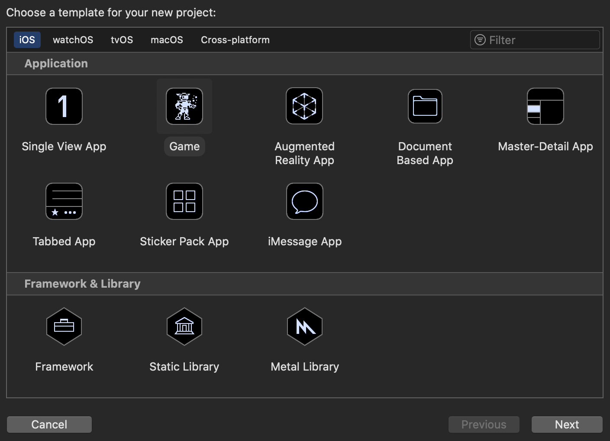
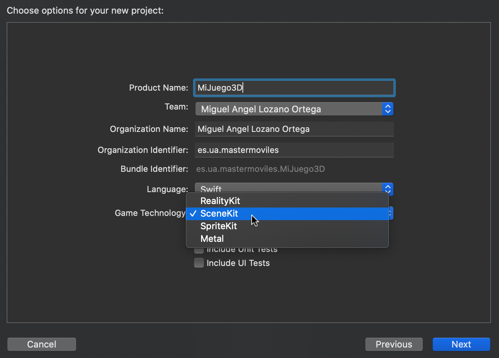
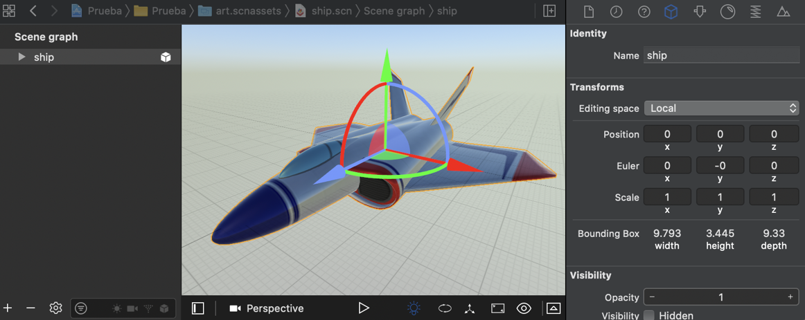
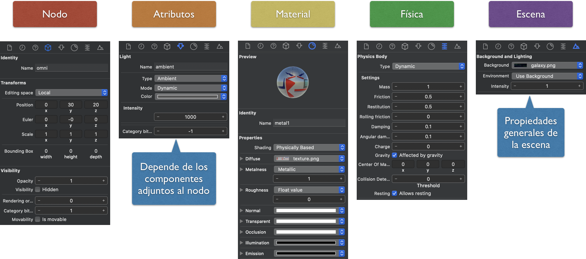
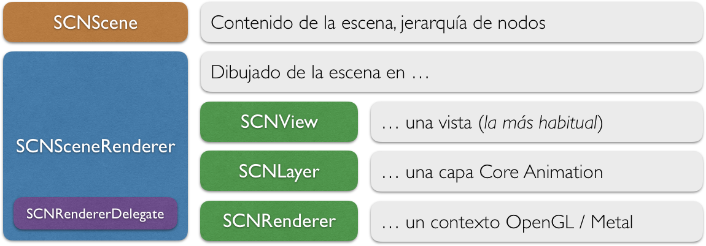
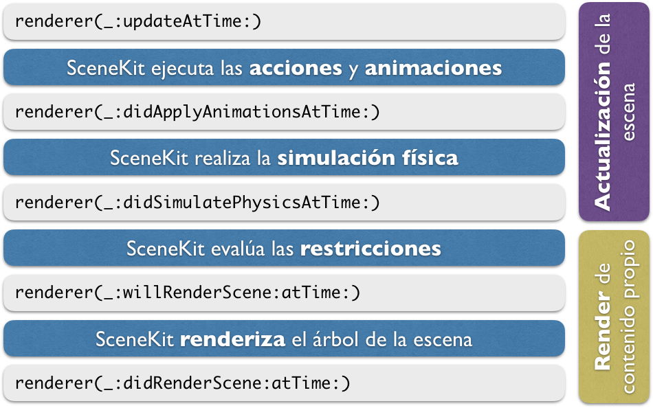
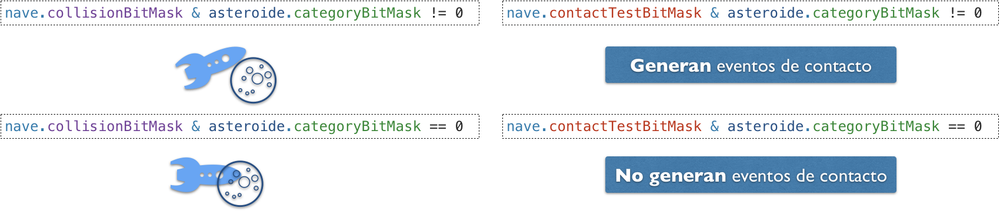

# SceneKit

## Creación de un proyecto de SceneKit

Al igual que en el caso de SpriteKit, desde Xcode podemos crear un proyecto de tipo _Game_, y nos preguntará cuál de las librerías nativas queremos utilizar como base. 




En este caso utilizaremos **SceneKit**, el _framework_ nativo de alto nivel de la plataforma iOS para el desarrollo de aplicaciones basadas en gráficos 3D, destacando entre ellas el caso de los videojuegos 3D. Dentro de Xcode tendremos además **un editor visual** de la escena 3D. 

La librería de clase de SceneKit es muy similar a SpriteKit, pero en este caso todas las clases tendrán el prefijo `SCN`. A continuación veremos todos los elementos de esta librería, haciendo especial hincapié en lo que la diferencia de SpriteKit.


## Elementos de SceneKit

En la siguiente tabla se muestran los principales elementos que encontramos dentro de la librería de SceneKit:

| Clase                 | Descripción  
| --------------------  | ----------
| `SCNView`	            | Vista de `UIKit` que podemos incluir en nuestro controlador (`UIViewController`) y que contendrá una escena de SceneKit.
| `SCNScene`	        | Define cada pantalla (estado) del juego. Contiene un árbol de nodos, pero en este caso no es un nodo, sino que contiene un nodo raíz al que podremos añadir hijos. 
| `SCNNode`             | Nodos que pueden formar parte del árbol de la escena de SceneKit. En este caso no tendremos distintos tipos de nodo como ocurría en SpriteKit, sino que el comportamiento y apariencia de cada nodo vendrá determinado por los componentes que le añadamos. Es decir, la personalización de los nodos no la haremos por herencia, sino mediante la agregación de componentes (luz, cámara, geometría, físicas, etc). 
| `SCNAction`	        | Acciones que podemos ejecutar sobre los nodos de la escena para por ejemplo animarlos o moverlos.


### Componentes de los nodos

Como se ha comentado en el punto anterior, la forma de definir las propiedades de cada nodo es mediante la agregación de una serie de componentes a los mismos. Estos componentes se añaden a una serie de propiedades de la clase `SCNNode` que se muestran en la siguiente tabla:

| Propiedad         | Clase del componente  | Descripción  
| ----------------  | ----------            | ----------
| `camera`	        | `SCNCamera`	        | Hace que el nodo se comporte como una cámara
| `light`	        | `SCNLight`	        | Hace que el nodo se comporte como una luz
| `geometry`	    | `CNGeometry`	        | Hace que el nodo muestre una geometría 3D
| `physicsBody`	    | `SCNPhysicsBody`	    | Hace que el nodo se someta a simulación física
| `particleSystems`	| `SCNParticleSystem`	| Muestra un sistema de partículas (fuego, explosión, etc)
| `audioPlayers`	| `SCNAudioPlayer`	    | Reproduce audio en la posición del nodo


### Geometría de los nodos

Uno de los principales componentes es el que nos permite definir la geometría del nodo, es decir, la forma con la que se renderizará y se visualizará en la escena. La geometría se especifica mediante una clase de tipo `SCNGeometry`, y podemos definirla de tres formas distintas:

* Utilizar alguno de los **tipos básicos** de geometría predefinidos (subclases de `SCNGeometry`)

| Clase                 | Descripción  
| --------------------  | ----------
| `SCNSphere`	        | Forma de esfera
| `SCNBox`	            | Forma de caja
| `SCNCapsule`	        | Forma de cápsula
| `SCNText`	            | Muestra una etiqueta de texto 3D
| `SCNShape`	        | Forma 2D extruída

* Crear la geometría **manualmente** mediante las clases `SCNGeometrySource` y `SCNGeometryElement`. Con estas clases podemos especificar los vértices y las caras de las formas geométricas a mostrar manualmente, lo cual es útil si queremos generar formas de manera dinámica, por ejemplo, para generar gráficas 3D a partir de datos que se hayan obtenido. 

* Importar la geometría de alguna **herramienta de _authoring_** (como por ejemplo Blender o Maya). Uno de los formatos preferidos de importación es el formato `.dae`.

## La escena

Para crear una escena, lo habitual será utilizar el editor visual de la escena de Xcode y posteriormente cargar dicha escena desde el código. Vamos a ver en primer lugar cómo podemos crear la escena con el editor, y posteriormente cómo cargarla y manipularla desde el código.

### Editor visual de la escena

El entorno Xcode integra un editor visual de la escena 3D. Dicho editor guarda la escena en formato `.scn`. 



Podemos importar en este editor modelos en otros formatos (como por ejemplo el formato `.dae`), que podamos haber creado con otras herramientas como Blender o Autodesk Maya. 

Se recomienda que las escenas se guarden en una carpeta `art.scnassets`, para que Xcode pueda optimizar estos ficheros al construir el proyecto.

### Inspectores de la escena

Dentro del editor, al seleccionar un elemento de la escena podremos modificar gran parte de sus propiedades utilizando los diferentes inspectores disponibles en el lateral derecho:



Encontramos los siguientes inspectores:

* **Nodo**: Propiedades generales del nodo seleccionado, independientemente de los componentes que incluya. Por ejemplo, su posición, rotación y escala en la escena, o su nombre. El nombre (`name`) es una propiedad importante, ya que nos permitirá hacer referencia a los nodos desde el código.
* **Atributos**: Propiedades de los componentes incluidos en el nodo seleccionado. Variará dependiendo de qué componentes incluya (por ejemplo, podrá mostrar las propiedades de la cámara, de una luz, o de la geometría de un nodo, en caso de incluir alguno de estos componentes).
* **Material**: Propiedades del material con el que se renderizará el nodo. Por ejemplo, podremos indicar el color o la textura, y si el objeto presentará brillos o si será mate. 
* **Física**: Nos permite establecer las propiedades físicas de los nodos, para que sean gestionados por el motor de físicas de SceneKit (tipo de cuerpo, forma, y otras propiedades físicas).
* **Escena**: Propiedades generales de la escena. Son independientes del nodo seleccionado. Nos permite por ejemplo poner una imagen o color de fondo, o un _skybox_. 

Si queremos cambiar las propiedades anteriores en un fichero importado desde otra herramienta, SceneKit lo transformará previamente al formato `.scn`. 


### Carga de la escena

Una vez definida la escena de forma visual, podemos cargarla desde el código de la siguiente forma:

```swift
override func viewDidLoad() {
    super.viewDidLoad()
        
    let scene = SCNScene(named: "art.scnassets/miescena.scn")!      

    let scnView = self.view as! SCNView        
    scnView.scene = scene    
}
```

En el ejemplo anterior cargamos la escena y la asignamos como escena activa en la vista `SCNView`. Esta vista actuará como _renderer_ de la escena, como veremos más adelante, siendo la encargada de dibujar su contenido en pantalla. Podemos cambiar en ella una serie de propiedades, por ejemplo para poner un color de fondo, permitir girar la cámara mediante gestos de _arrastrar_, o mostrar estadísticas de rendimiento del motor:

```swift    
scnView.allowsCameraControl = false        
scnView.showsStatistics = true        
scnView.backgroundColor = UIColor.black        
```


### Manipulación del árbol de la escena

Una vez cargada la escena, vamos a ver cómo podríamos obtener y manipular su contenido desde código. Como se ha comentado, la escena contiene un árbol de nodos. Contamos con la propiedad `rootNode` que representa el nodo raíz de dicho árbol, y a partir del cual podremos buscar nodos o añadir nuevos nodos. 

Una de las primeras cosas que haremos será obtener los nodos que hayamos creado de forma visual en el editor de la escena. Para ello, podemos hacer desde el nodo raíz una búsqueda a partir de su nombre con `childNode(withName:, recursively:)`:

```swift
let nave = scene.rootNode.childNode(withName: "ship", recursively: true)!
```

Podríamos también crear un nuevo nodo y añadirlo a la escena con `addChildNode(_:)`. Deberemos añadirlo como hijo al nodo que queremos que sea su padre. Por ejemplo:

```swift
let escudo = SCNNode()
let asteroide = SCNNode()

scene.rootNode.addChildNode(asteroide)
nave.addChildNode(escudo)
````

En este ejemplo, añadimos un _asteroide_ al nodo raíz de la escena, para que sea independiente de la _nave_, pero añadimos un _escudo_ como hijo de la _nave_ para que forme parte del mismo bloque.

Si queremos eliminar un nodo, simplemente deberemos eliminarlo de su padre. Por ejemplo, si destruimos el asteroide podemos eliminarlo con `removeFromParentNode()`:

```swift
asteroide.removeFromParentNode()
```

No hace falta especificar quién es su padre. Además, contaremos también con métodos adicionales, por ejemplo para listar todos los hijos de un nodo.


## Propiedades de los nodos

Todos los nodos tienen una serie de propiedades comunes, especialmente para su posicionamiento en la escena, tal como se muestra en la siguiente tabla:

| Propiedad         | Tipo                  | Descripción  
| ----------------  | ----------            | ----------
| `name`            | `String`	            | Nombre que nos permite identificar al nodo y buscarlo en la escena.
| `transform`       | `SCNMatrix4`	        | Combina traslación, rotación y escala en una única matriz de transformación `4x4`.
| `position`        | `SCNVector3`	        | Posición del objeto en la escena (coordenadas `x`, `y`, `z`).
| `rotation`        | `SCNVector4`	        | La rotación es especifica mediante un vector de 4 componentes, que incluye: un eje (x, y, z) y un ángulo de rotación alrededor de dicho eje.
| `eulerAngles`     | `SCNVector3`	        | La rotación se establece mediante 3 componentes: rotación alrededor de `x`, de `y`, y de `z`.
| `scale`           | `SCNVector3`	        | Escala del objeto en las 3 dimensiones (`x`, `y`, `z`).
| `isHidden`        | `Bool`	            | Permite ocultar el objeto (no se renderizará)
| `opacity`         | `CGFloat`	            | Permite añadir un grado de transparencia al objeto.

Una de las operaciones más habituales será modificar la posición de un nodo. Esto podremos hacerlo con:

```swift
nave.position = SCNVector3(x: 0, y: 10, z: 10)
```

Además, podremos también cambiar las propiedades de los componentes que incorporan los nodos.

### Luces

Podemos añadir un componente de tipo luz a un nodo con:

```swift
lightNode = SCNNode()
lightNode.light = SCNLight()
```

La principal propiedad de este componente es el **tipo de luz**. En función del tipo, tendremos otras propiedades para configurar la fuente de luz. Encontramos los siguientes tipos:

* _Ambiente_: Luz que afecta por igual a todos los objetos en todas sus caras. Simula la luz general que hay en el ambiente, debida a la reflexión de la luz en todos los objetos de la estancia. Normalmente se da una luz ambiente como un valor mínimo para que ninguna zona esté totalmente oscura.
* _Área_: Similar a la anterior, pero en lugar de afectar a toda la escena se aplica sólo a una determinada área de la misma.
* _Direccional_: La luz incide en todos los objetos en una misma dirección. Por ejemplo, nos permitiría simular la luz del sol (una fuente de luz que se encuentra a distancia infinita). 
* _Omnidireccional_: Se trata de un punto que emite luz en todas las direcciones. Por ejemplo útil para simular una bombilla.
* _Foco_: Un foco emite un haz de luz cónico, como por ejemplo podrían ser los faros de un coche.

Si utilizamos el editor de la escena, añadiendo un objeto de tipo _Light_ tendremos un nodo que ya incorporará dicho componente. Encontramos distintos tipos de objetos _Light_, según el tipo de luz que queramos crear: _Ambiente Light_, _Area Light_, _Directional Light_, _Omni Light_ y _Spot Light_.

Todas las luces tienen algunas propiedades comunes, como el **color** o la **intensidad** de la luz. En las fuentes que emiten luz desde una posición determinada, se define también una **atenuación** en función de la distancia, y de forma más específica, en las fuentes de tipo foco, se define la **amplitud** del foco de luz.

Además, podemos también indicar si una luz proyecta **sombras** o no. Tener más de una luz proyectando sombras produce un incremento notable del coste computacional del _render_, por lo que sólo se deberá hacer si lo consideramos importante en el videojuego.


### Cámaras

Podemos añadir un componente de tipo cámara a un nodo con:

```swift
cameraNode = SCNNode()
cameraNode.camera = SCNCamera()
```

Si utilizamos el editor de la escena, añadiendo un objeto de tipo _Camera_ tendremos un nodo que ya incorporará dicho componente.

Una propiedad importante de la cámara son los **planos de recorte cercano y lejano**. En ellos determinaremos en que rango de profundida (coordenada `z`) se renderizarán los objetos. Es decir, sólo se rendizarán los objetos que estén más lejos de la cámara de lo que marque el plano cercano, pero que estén más cerca del plano lejano. Cuando mayor sea el plano lejano, se mostrarán objetos más distantes, pero el coste del _render_ será mayor.

```swift
cameraNode.camera?.zNear = 1.0
cameraNode.camera?.zFar = 100.0
```

Otra propiedades de la cámara son las que nos permiten configurar los parámetros de cámara, como la **distancia focal** o el **campo visual**. El campo visual (ángulo que abarca la cámara) es lo que determinará qué elementos quedan dentro o fuera de la proyección en pantalla. Por defecto se especificará el vertical, aunque podemos modificarlo para que sea el campo horizontal el que se tome como referencia. Esto tiene importancia para la adaptación a diferentes dispositivos, ya que independientemente del tamaño de pantalla, el campo visual será siempre el mismo, por lo que el contenido que veremos en pantalla, a lo largo de la vertical, será el mismo también. En cuanto a la horizontal, dependiendo de la relación de aspecto de la pantalla veremos un campo menor o mayor. 

También encontramos propiedades para añadir efectos avanzados de imagen a la cámara, como HDR, _depth of field_ (sólo aparecerán enfocados los objetos en un rango de distancia determinado), o _motion blur_ (los objetos se desenfocarán al moverse).


### Geometría y material

Podemos establecer la geometría de un nodo mediante su propiedad `geometry`:

```swift
node = SCNNode()
node.geometry = SCNBox(width: 1.0, height: 1.0, 
                       length: 1.0, chamferRadius: 0.0)
```


Utilizando el editor de la escena, encontramos diferentes tipos de nodos para geometrías predefinidas: _Plane_, _Sphere_, _Box_, _Cyclinder_, _Cone_, _Capsule_, _3D Text_, etc. Si queremos incluir una maya 3D compleja, podremos crearla con otras herramientas (Blender, Maya, etc) e importarlas desde Xcode. 

Una vez tenemos establecida la geometría, podemos asignarle el material con el que se renderizará. Podemos añadir varios materiales, aunque lo habitual será acceder al primero de ellos (propiedad `firstMaterial`). Dentro del material podemos encontrar diferentes propiedades que nos permitirán definir cómo responde el objeto a la luz. Algunas de ellas son:

* `diffuse`: El contenido que pongamos en esta propiedad se mostrará como material _mate_. Es decir, su aspecto viene determinado por la luz que recibe, pero no del ángulo desde el que nosotros lo miremos (no aparecen _brillos_)
* `specular`: En este caso el contenido podrá mostrarse con _brillos_. La forma en la que lo veremos dependerá de la posición de la fuente de luz y del observador, pudiendo generarse brillos.
* `emission`: Esta propiedad nos permitirá que el material sea _emisivo_. Es decir, para mostrarse el contenido no hará falta que incida luz en el objeto, el propio objeto ya emite luz (pero no ilumina otros objetos de la escena). Esto nos puede servir por ejemplo para crear un monitor o una luz LED, que deberán verse aunque la escena esté en completa oscuridad.

Por ejemplo, podríamos dar un color _rojo mate_ a un objeto con:

```swift
node.geometry?.firstMaterial?.diffuse.contents = UIColor.red
```

La propiedad `contents` anterior puede recibir distintos tipos de objetos, entre los que se encuentran:

* Colores básicos (`UIColor`)
* Una imagen o texture
* Un vídeo
* Una capa de _Core Animation_ (`CALayer`)
* Una escena de _SpriteKit_ (`SKScene`)


## _Renderer_ de la escena

En SceneKit tenemos dos objetos: 

* La escena (`SCNScene`). Define el contenido de la escena mediante un árbol de nodos.
* _Renderer_ de la escena (`SCNSceneRenderer`): Es el encargado de dibujar (_renderizar_) la escena en pantalla.

Encontramos diferentes tipos de _renderers_ (clases que implementan el protocolo `SCNSceneRenderer`), según el contexto en el que queramos que se dibuje el contenido de la escena:

* `SCNView`: Se _renderiza_ en una vista de UIKit (subclases de `UIView`). Será el caso más habitual.
* `SCNLayer`: Se _renderiza_ en una capa de _Core Animation_ (subclase de `CALayer`).
* `SCNRenderer`: Se _renderiza_ en un contexto OpenGL o Metal.

El _renderer_ de la escena permite definir un delegado de tipo `SCNSceneRendererDelegate`, donde podremos responder a los diferentes eventos del ciclo de vida de la escena.




### Ciclo de vida de la escena

Mediante el delegado del _renderer_ de la escena podremos introducir código en las distintas fases del ciclo de vida de la escena, tal como se muestra en la siguiente figura:



Vemos que hay una serie de métodos que podemos utilizar para actualizar el contenido de la escena, mientras que hay otros que pueden ser útiles para alterar la forma en la que se hace el _render_ (por ejemplo para dibujar contenido por debajo o por encima de la escena).

Para utilizar este delegado deberemos:

1. Implementar el protocolo `SCNSceneRendererDelegate``
2. Asignar la clase en la que hayamos implementado el protocolo a la propiedad `delegate` del `SCNSceneRenderer`.
3. Implementar los métodos del protocolo que necesitemos.

Lo más habitual será definir el método `renderer(_:, updateAtTime:)` para actualizar la escena en cada ciclo de reloj. Podemos utilizar el propio `UIViewController` como delegado, tal como vemos en el siguiente ejemplo:


```swift
class GameViewController: UIViewController, 
                          SCNSceneRendererDelegate {

    var previousUpdateTime : TimeInterval?
    
    override func viewDidLoad() {
        super.viewDidLoad()
        
        let scnView = self.view as! SCNView        

        …

        scnView.delegate = self
    }
    
    func renderer(_ renderer: SCNSceneRenderer, 
                  updateAtTime time: TimeInterval) {
        let deltaTime = time - (previousUpdateTime ?? time)
        previousUpdateTime = time
                  …
    } 

    …
}
```

Del código anterior, destacamos que los métodos del delegado reciben el tiempo del sistema en cada iteración. Será responsabilidad nuestra calcular el _delta time_ (tiempo transcurrido desde la última iteración). En el ejemplo anterior podemos ver una forma de hacerlo, controlando que en la primera iteración el _delta time_ sea `0`. 


## Físicas

La librería SceneKit, al igual que SpriteKit, integra su propio motor de físicas, pero en este caso en 3D. Los distintos elementos de este motor de físicas son muy parecidos a los que encontrábamos en el caso 2D:

|Clase          |Descripción    |
|----           |------         |
|`SCNPhysicsWorld` |El mundo físico en el que se producirá la simulación, que estará contenido dentro de la escena (`SCNScene`), en su propiedad `physicsWorld`     |
|`SCNPhysicsBody`  | Los cuerpos físicos estarán vinculados a cada nodo (`SCNNode`), como componente en su propiedad `physicsBody`.      |
|`SCNPhysicsShape` | En este caso, se define este tipo para representar la forma geométrica de los cuerpos físicos. Cada cuerpo definirá su forma mediante un objeto de este tipo.
|`SCNPhysicsBehavior` | Similar a los _joints_ del caso 2D, pero en este caso además de uniones entre cuerpos, nos permitirá definir otro tipo de comportamientos, como por ejemplo vehículos |

Como podemos ver, el motor físico está totalmente integrado dentro de los elementos básicos de SceneKit: `SCNScene` y `SCNNode`. 

* Para que un nodo pase a estar controlado por el motor de físicas, simplemente deberemos añadir un objeto `SCNPhysicsBody` a su propiedad `physicsBody`.
* Si queremos modificar propiedades generales del mundo físico, podemos acceder a él en la propiedad `physicsWorld` de nuestra escena.

Vamos a ver con más detalle como utilizar el motor de físicas de SceneKit.

### El mundo físico

Desde la clase de nuestra escena, podemos acceder al mundo físico con:

```swift
scene.physicsWorld
```

Una de las propiedades del mundo físico que podemos modificar es la **gravedad**, que se aplicará sobre todos los cuerpos del mundo:

```swift
scene.physicsWorld.gravity = SCNVector3(x: 0, y: -10, z: 0)
```

En este objeto `physicsWorld`, podemos también establecer la velocidad (`speed`) de la simulación, y la tasa de actualización de las físicas (`timeStep`). Además, podremos añadir uniones entre cuerpos o comprobar colisiones como veremos más adelante.


### Creación de un cuerpo físico

Para utilizar el motor de físicas, lo primero que deberemos hacer es crear un cuerpo físico. Por ejemplo, podemos añadir un cuerpo físico a un nodo de la siguiente forma:

```swift
nodo.physicsBody = SCNPhysicsBody(
     type: SCNPhysicsBodyType.dynamic, 
     shape: SCNPhysicsShape(geometry: SCNSphere(radius: 1.0)))
```

En este caso, el cuerpo podrá ser de cualquiera de los tipos habituales en los motores de físicas:

* `.static`: El objeto no se mueve ni le afectan las fuerzas
* `.kinematic`: El objeto puede moverse, pero no le afectan las fuerzas
* `.dynamic`: Al objeto le afectan las fuerzas del ,mundo físico.


Podemos observar que al definir el cuerpo físico, debemos especificar también su geometría de colisión en el constructor mediante un objeto de tipo `SCNPhysicsShape`. Como vemos, el objeto `SCNPhysicsShape` se puede construir a partir de un objeto de tipo `SCNGeometry`, por lo que podríamos utilizar la misma geometría que se utilizó para la maya gráfica, pero tenemos otras opciones. Recordemos que deberemos buscar una geometría **lo más sencilla posible**, que **se adapte de la mejor forma posible a la geometría gráfica del nodo**. 

### Forma de los cuerpos físicos

Podemos construir el objeto `SCNPhysicsShape` a partir de:

* Un objeto `SCNGeometry`. Podemos crearlo a partir de las formas predefinidas, o bien a partir de mayas más complejas.
* Un nodo `SCNNode`. Se tomará la geometría del nodo proporcionado, y en caso de tener hijos combinará la geometría de los mismos.
* Un lista de `[SCNPhysicsShape]`. Nos permitirá crear un **cuerpo compuesto** por varias geometrías. A efectos de coste computacional, es preferible crear un cuerpo compuesto por varias geometrías convexas, a crearlo a partir de una única geometría cóncava.

En cualquiera de los casos anteriores, podemos encontrarnos con los siguientes casos:

* La geometría es un **tipo predefinido**. El cálculo de colisiones está optimizado para estas geometrías, siendo el orden de menos a más complejas el siguiente: `SCNSphere`, `SCNBox`, `SCNCapsule`, otras formas geométricas.
* **Maya personalizada**. En este caso, en el parámetro `options` tenemos una propiedad `type` con la que podemos especificar la manera en que se adaptará la _forma gráfica_ del objeto para obtener la forma física. Estas opciones pueden ser:
    - `boundingBox`: Simplemente calcula una forma de tipo _caja_ que engloba toda la geometría del objeto. Es la simplificación más básica y eficiente, pero puede adaptarse mal a la geometría del objeto.
    - `convexHull`: Recubrimiento convexo de la maya. Se crea una maya que envuelva toda la geometría del objeto eliminando concavidades. Esta será la forma de adaptación _por defecto_. 
    - `concavePolyhedron`: Se adapta completamente a la geometría del objeto, respetando las concavidades. Debemos evitar el uso de este tipo de formas en cuerpos dinámicos. Si las concavidades son importantes, debemos plantearnos aproximarlas mediante el uso de formas compuestas en lugar de utilizar formas cóncavas. 


### Propiedades de los cuerpos físicos

Los cuerpos físicos tienen una serie de propiedades que podemos configurar:

|Propiedad      | Descripción    |
|----           | ------         |
|`type`         | Establece si es **dinámico**, **cinemático** o **estático**  |
|`physicsShape` | Establece la forma del cuerpo físico
|`mass`         | Masa del cuerpo (en $kg$).  |
|`momentOfInertia`     | Momento de inercia |
|`centerOfMassOffset`  | Desplazamiento del centro de masas del cuerpo |
|`damping`  | Resistencia al aire lineal |
|`angularDamping`  | Resistencia al aire angular  |
|`friction`  | Coeficiente de fricción de la superficie. Regulará la fuerza que se opone al desplazamiento del objeto cuando éste se desliza sobre una superficie rugosa. |
|`rollingFriction`  | Coeficiente de fricción en el rodamiento, se aplica cuando en lugar de deslizarse sobre una superficie, el cuerpo ruede sobre ella. |
|`restitution`  |Coeficiente de restitución (rebote) |
|`velocityFactor`  | Factor multiplicativo que se le aplicará a la velocidad del cuerpo. El factor se especifica mediante un `SCNVector3`, de forma que podemos especificar un factor diferente para la velocidad en `x`, `y`, `z`. Si ponemos un factor `0` en alguno de los ejes, evitaremos que el objeto se mueva en dicho eje, limitando así sus grados de libertad. Por ejemplo, se podría conseguir que un objeto se mueva sólo en un determinado plano. |
|`angularVelocityFactor`  | Similar a la propiedad anterior, pero aplicada a la velocidad angular aplicada en cada eje. Con esta propiedad podremos hacer por ejemplo que el objeto pueda rotar únicamente alrededor de un determinado eje. |
|`isAffectedToGravity`  | Determina si al objeto le afecta la gravedad del mundo. |


### Búsqueda de cuerpos 

Existe diferentes formas de buscar cuerpos en determinadas regiones del mundo.

* **Búsqueda por área**: Con `convexSwepTest(with:from:to:options:)` podemos hacer un barrido por una zona determinada del mundo, para detectar qué cuerpos han en esa zona. 

* **Trazado de rayos**. Podemos lanzar un rayo 3D con `rayTestWithSegment(from:to:options:)` para detectar los cuerpos que se encuentren en su camino. Tendremos que indicar un punto inicial y un punto final del rayo.


### Colisiones

En SceneKit podemos comprobar directamente si dos cuerpos colisionan entre si, o consultar qué cuerpos están en contacto con un determinado cuerpo. Para ello contamos con los siguientes métodos:

* `contactTestBetween(:,:,options:)`
* `contactTest(with:,options:)`

Puede interesarnos también recibir notificaciones de los contactos entre cuerpos. Para ello deberemos implementar un _delegado de contactos_ que adopte el protocolo `SCNPhysicsContactDelegate`. Podemos adoptar dicho delegado en nuestro propio controlador. Para crear dicho delegado deberemos:

1. Adoptar el protocolo `SCNPhysicsContactDelegate` en nuestra clase.
    ```swift
    class GameViewController: UIViewController, 
                              SCNPhysicsContactDelegate 
    ```
2. Asignar dicha clase como `contactDelegate` del `physicsWorld`
    ```swift
    scene.physicsWorld.contactDelegate = self
    ```
3. Implementar los métodos que nos interesen del delegado:
    - `physicsWorld(:,didBegin:)`
    - `physicsWorld(:,didUpdate:)`
    - `physicsWorld(:,didEnd:)`

Por ejemplo, podemos comprobar si un proyectil entra en contacto con otro cuerpo, y a partir del impulso de la colisión calcular el daño producido de la siguiente forma:

```swift
func physicsWorld(_ world: SCNPhysicsWorld, 
                  didBegin contact: SCNPhysicsContact) {
    if(contact.nodeA.name=="proyectil" || 
       contact.nodeB.name=="proyectil") {
        let damage = contact.collisionImpulse
        ...
    }
}
```

Hay que destacar que en la colisión siempre intervendrán dos nodos: `nodeA` y `nodoB`, y que el orden en el que pueden venir es arbitrario, por lo que habrá que tener en cuenta cualquier posibilidad. 


### Layering

SceneKit, al igual que SpriteKit,  nos permite filtrar qué cuerpos colisionan con otros mediante una serie de máscaras binarias:

* `categoryBitMask` nos permite definir diferentes categorías de objetos. Cada bit de la máscara representa una categoría, por ejemplo:
```swift
let naveCategoryMask : UInt32 = 0b0001 // 1 
let asteroideCategoryMask : UInt32 =  0b0010 // 2 
let balaCategoryMask : UInt32 =     0b0100 // 4
```
* `collisionBitMask` nos indica con qué categorías de cuerpos podremos colisionar. Por ejemplo, si a los asteroides les damos un valor de `0b0011`, el asteroide colisionará con nuestra nave y otros asteroides, pero será atravesado por las balas. Si a las balas les damos un valor `0b0000` atravesarán tanto a la nave y a los asteroides como otras balas. 
* `contactTestBitMask` nos indica con qué categorías de cuerpos nos notificará los contactos en el _listener de contactos_. Por ejemplo, si a los asteroides les damos un valor `0b0101` nos notificará cuando _toquen_ una bala o a nuestra nave. Si a la nave le damos un valor `0b0010`, nos avisará únicamente cuando nos toque un asteroide.




### Uniones

Podemos establecer uniones entre cuerpos con diferentes subclases de `SCNPhysicsBehaviour`:

* `SCNPhysicsSliderJoint`: Unión de tipo **"rail"**. Los dos cuerpos pueden deslizarse a lo largo de un eje determinado.
* `SCNPhysicsHingeJoint`: Union de tipo **"bisagra"**. Permite la rotación alrededor de determinado eje. Útil por ejemplo para puertas.
* `SCNPhysicsConeTwistJoint`: Unión tipo **"articulación"**. 
* `SCNPhysicsBallSocketJoint`: Unión tipo **"varilla"**. Los objetos se mantienen a una distancia fija, anclados a dos puntos alrededor de los cuales pueden rotar.

Además, contamos con los comportamientos `SCNPhysicsVehicle` y `SCNPhysicsVehicleWheel` que implementan el comportamiento de un vehículos y sus ruedas, respectivamente.

Por ejemplo, podemos crear una unión de tipo _bisagra_ de la siguiente forma:

```swift
let hinge = SCNPhysicsHingeJoint(body: body, axis: SCNVector3(0, 1, 0), anchor: SCNVector3(0, 0, 0))
```

Una vez definida la unión e indicados los cuerpos que unirá, debemos añadirla al mundo:

```swift
scene.physicsWorld.addBehavior(hinge)
```

De la misma forma, podemos _desconectar_ los cuerpos eliminando la unión del mundo:

```swift
scene.physicsWorld.removeBehavior(hinge)
```


## Acciones y animaciones

En SceneKit contamos con el mismo mecanismo de acciones que SpriteKit, que nos permite programar el comportamiento de los nodos de la escena. 

### Acciones

En este caso, todas las acciones se crean mediante métodos de `SCNAction`, y en casi todas ellas deberemos especificar el tiempo que durará la acción. Por ejemplo:

```swift
let accion = SCNAction.fadeIn(withDuration: 1.0)
````

Esta acción hará un fundido de entrada (desde transparente hasta opaco) durante 1 segundo en el nodo en el que la ejecutemos. Ejecutaremos la acción sobre un nodo con:

```swift
node.run(accion)
```

Podemos también detener todas las acciones que esté ejecutando un nodo con:

```swift
 node.removeAllActions()
```

Si queremos detener una acción concreta, deberemos ejecutarla con una clave que nos permita identificarla, y posteriormente detenerla a partir de dicha clave:

```swift
node.run(accion, withKey: "fundido")

...

node.removeAction(forKey: "fundido")
```

### Tipos de acciones

Dentro de `SCNAction` encontramos númerosos métodos factoría para crear diferentes tipos de acciones. Destacamos por ejemplo las acciones dedicadas a trasladar un nodo:

```swift
let accion1 = SCNAction.move(to: SCNVector3Make(0, 50, 50), 
                             duration: 1.0)
let accion2 = SCNAction.move(by: SCNVector3Make(0, -50, 0), 
                             duration: 1.0)
let accion3 = SCNAction.rotate(by: .pi, 
                               around: SCNVector3Make(1, 0, 0), 
                               duration: 0.5)
```

En todas estas acciones se indica la posición o ángulo al que se moverá el nodo, y el tiempo que tardará en hacerlo (en segundos).


### Composición de acciones

Podemos crear acciones que se creen a partir de la combinación de varias acciones:

* `sequence`. Combina varias acciones en secuencia. La duración de la escena resultante será la suma de la duración de todas las acciones contenidas.
* `group`. Combina varias acciones en paralelo. La acción resultante terminará cuando termine la más larga de las acciones que contenga.

Por ejemplo, podemos crear una secuencia con las acciones anteriores:

```swift
let accion = SCNAction.sequence([accion1, accion2, accion3])
```

Además, contamos con podemos hacer que una acción se repita un número determinado de veces con `SCNAction.repeat` o de forma indefinida por `SCNAction.repeatForever`. Por ejemplo, podríamos repetir continuamente la secuencia anterior con:

```swift
let accionRepite = SKAction.repeatForever(accion)
```

Hay algunas acciones que serán especialmente útiles para integrar dentro de una secuencia, como por ejemplo `SCNAction.removeFromParentNode`, que eliminará del árbol de la escena el nodo sobre el que se ejecute, y la acción `SCNAction.run` que nos permite ejecutar nuestro propio bloque de código:

```swift
let accionRun = SCNAction.run { (node) in
    mostrarResultados()
}
```

Esto nos permitirá ejecutar código propio en cualquier paso intermedio o final de la secuencia de acciones.


### Animaciones

Además de las acciones, en SceneKit podemos también implementar animaciones mediante transacciones, de forma similar a como se hace con Core Animation. 

Para realizar una animación de esta forma, deberemos abrir una transacción de animación (`SCNTransaction`), establecer su duración (`animationDuration`) y cambiar las propiedades de los objetos que queramos que sean modificadas de forma gradual durante el tiempo de la animación. 

```swift
SCNTransaction.begin()
SCNTransaction.animationDuration = 0.5
            
SCNTransaction.completionBlock = {
                SCNTransaction.begin()
                SCNTransaction.animationDuration = 0.5
                
                material.emission.contents = UIColor.black
                
                SCNTransaction.commit()
            }
            
material.emission.contents = UIColor.red
           
SCNTransaction.commit()
```

Vemos además que podemos incluir un `completionBlock`, con el que podemos por ejemplo encadenar varias animaciones como vemos en el ejemplo anterior.
