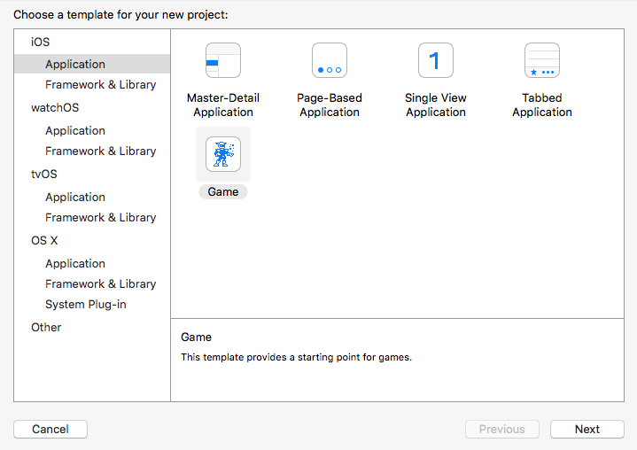
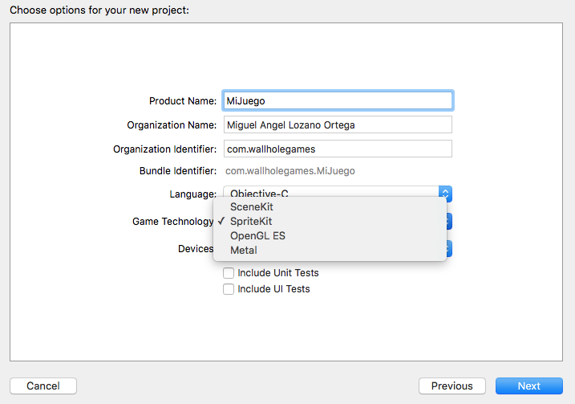
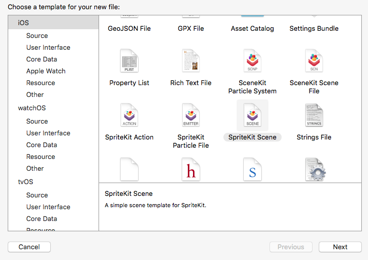

# SpriteKit

## Creación de un proyecto de SpriteKit

 Desde Xcode podemos crear un proyecto de tipo _Game_, y nos preguntará cuál de las librerías nativas queremos utilizar como base. 




En este caso vamos a empezar trabajando con **SpriteKit**, el _framework_ nativo de la plataforma iOS destinado al desarrollo de aplicaciones que muestren cualquier tipo de gráficos 2D animados, como es el caso de los videojuegos 2D. 

Xcode nos ofrecerá además **herramientas visuales** en el entorno para crear las escenas del videojuego. 

Conviene destacar también que esta tecnología presenta abundantes **similitudes con el motor Cocos2d-x**, por lo que la transición entre estas tecnologías será muy sencilla. 

Todas las clases de SpriteKit tienen el prefijo `SK`, y se encuentra disponible a partir de iOS 7.

## La escena de SpriteKit

Como en prácticamente todos los motores para videojuegos, SpriteKit utiliza una organización **jerárquica** de los elementos **escena**, es decir, todos los elementos de la escena son **nodos** que se organizan en forma de de árbol. 

Tendremos una escena para cada estado (pantalla) del juego (menú principal, opciones, partida, etc). 

### Creación de la escena

Para crear una escena normalmente crearemos una clase que herede de `SKScene`, por ejemplo:

```swift
import SpriteKit

class MenuScene: SKScene {
    // ...
}
```

Aunque podemos crear una escena de forma totalmente programada, Xcode nos ofrece la posibilidad de definir la escena (o parte de ella) de forma visual. Para ello deberemos crear un recurso de tipo _SpriteKit Scene_ desde Xcode, con _File > New > File ... > iOS > Resource > SpriteKit Scene_:



> En la plantilla que crea el entorno al seleccionar un proyecto de tipo _SpriteKit_ veremos que tenemos ya creada una escena con nombre `GameScene.sks`.

La escena se quedará guardada en un fichero con extensión `.sks` (_Sprite Kit Scene_). Podemos cargar este recurso desde el código simplemente proporcionando el nombre de la escena al siguiente constructor de `SKScene`:

```swift
let scene = SKScene(fileNamed: "MenuScene")
```

En el caso del código anterior, cargará el contenido del fichero `MenuScene.sks`.

El escenario más común será aquel en el que definamos una escena mediante el editor visual, pero asociando dicha escena a una subclase de `SKScene` propia donde personalicemos el comportamiento de dicha escena. 

Podemos asociar una clase propia a dicha escena creada de forma visual utilizando el _Inspector de Custom Class_ del editor de la escena (dentro del panel derecho del entorno):


Ahora, si cargamos dicha escena desde el código, la clase que se utilizará para instanciarla será la clase `MenuScene` que hemos definido anteriormente, en lugar de la clase genérica `SKScene`.

### Presentar la escena

Para poder mostrar esa escena necesitaremos previamente contar con una vista de tipo `SKView`, que hará de contenedor de escenas. Con esta clase podremos presentar una escena, o bien cambiar la escena que se está mostrando, realizando así una transición entre escenas. 

Por ejemplo, podemos introducir una vista de este tipo dentro de nuestro controlador en el _storyboard_. En el **código de inicialización de nuestro controlador** podemos obtener dicha vista y cargar en ella la escena principal:

```swift
override func viewDidLoad() {
    super.viewDidLoad()
        
    if let view = self.view as! SKView? {
        // Carga la escena del fichero 'MenuScene.sks'
        if let scene = SKScene(fileNamed: "MenuScene") {
            // Presenta la escena en la vista
            view.presentScene(scene)
        }
    }
}
```

Hemos de recordar que el constructor de la escena toma como parámetro el nombre del fichero `.sks` de la escena a cargar, omitiendo la extensión. 


### Ciclo de vida de la escena

Dentro de la clase de la escena, podemos sobrescribir cualquiera de los siguientes métodos para responder a eventos de su ciclo de vida:

* `sceneDidLoad()`: Se invoca cuando la escena va a ser presentada, para su inicialización. Este evento tendrá lugar antes de que la escena haya sido añadida a la vista.
* `didMove(to:)`: Se invoca en el momento en el que la escena se añade a la vista. Este es un buen momento para inicializar los elementos de la interfaz de la escena. 
* `didChangeSize()`: Se invoca si se produce un cambio en el tamaño de la escena. Por ejemplo, si queremos soportar el cambio de orientación del dispositivo, deberemos implementar este método para indicar cómo adaptar de forma correcta la disposición de los elementos en pantalla. 
* `willMove(from:)`: Nos indica cuando la escena va a ser eliminada de la vista, posiblemente por cerrar la vista o por hacer una transición a otra escena.

Habitualmente aprovecharemos `didMove(to:)` para crear de forma programada el contenido de la escena (o parte de él). Este contenido se definirá como un árbol de nodos (objetos de tipo `SKNode` o de alguna de sus subclases).


## Árbol de la escena

La escena de SpriteKit se define como un árbol de nodos, todos ellos de tipo `SKNode` o alguna de sus subclases. 

Los nodos genéricos se instancian mediante el constructor vacío de `SKNode`:

```swift
let nodo = SKNode()
```

Este tipo de nodos no mostrarán nada en la escena, pero son útiles para agrupar otros nodos en el árbol de la escena y poder moverlos de forma conjunta. Más adelante veremos otros tipos de nodos que heredan de `SKNode`, como los _sprites_ y las etiquetas de texto.


### Propiedades de los nodos

Todos los nodos (clases que heredan de `SKNode`) comparten una serie de propiedades comunes heredadas de dicha clase. 

Podremos cambiar la posición (x,y) de todos los nodos en la escena, así como su orden z, que determinará qué nodos se muestran por delante de otros:

```swift
nodo.position = CGPoint(x: 100, y: 100)
nodo.zPosition = 5
```

También podremos cambiar su rotación y su escala (x,y):

```swift
nodo.zRotation = 90
nodo.xScale = -1
nodo.yScale = 1
```

> Es de especial interés la posibilidad de hacer un escalado de -1, para así crear un efecto "espejo".

### Construcción del árbol de la escena

Además de estas propiedades, otra característica importante de los nodos es su método `addChild:`, que nos permite añadir otro nodo como hijo:

```swift
let grupo = SKNode()
grupo.addChild(nodo)
```

> El agrupamiento jerárquico de nodos es importante porque nos permitirá por ejemplo mover de forma conjunta todo un grupo de nodos cambiando únicamente la posición del nodo padre.

Para eliminar un nodo del árbol, simplemente deberemos indicar que sea eliminado de su nodo padre:

```swift
nodo.removeFromParent()
```

Encontraremos también métodos y propiedades para conocer quién es el padre de un nodo, o moverlo a otro nodo padre, entre otras funciones.

## Tipos de nodos

Destacamos los siguiente tipos de nodos:

* `SKLabelNode`: Subclase de `SKNode` que mostrará una etiqueta de texto en la escena.
* `SKSpriteNode`: Subclase de `SKNode` que mostrará un _sprite_ en la escena. 
* `SKShapeNode`:	Muestra formas básicas y contenido de _Core Graphics_.
* `SKVideoNode`:	Muestra un reproductor de vídeo.
* `SKCropNode`:	Recorta el contenido de sus hijos.
* `SKReferenceNode`: Hace referencia a contenido compartido en un fichero `.sks`.

### Etiqueta de texto

Un tipo de nodo fundamental es la etiqueta de texto (`SKLabelNode`) que nos permitirá mostrar texto en la escena. Este tipo de nodo se puede crear a partir de la fuente a utilizar:

```swift
let etiq = SKLabelNode()
```

A parte de las propiedades generales de los nodos, la propiedad más importante de este tipo de nodo es `text`, que nos permite especificar el texto a mostrar por la etiqueta:

```swift
etiq.text = "Super Mobile Game"
```

Este tipo de nodos nos permitirá cambiar además el tipo de fuente, su color, o la alineación del texto.

#### Sprites

El tipo de nodo más importante en un videojuego es el _sprite_, que representa aquellas entidades que aparecen en la escena (personajes, objetos, etc), y que se muestran como una imagen o una animación. Podemos crear un _sprite_ a partir del nombre de la imagen que queremos que muestre:

```swift
let sprite = SKSpriteNode(imageNamed: "mario")
```

Dado que el _sprite_ muestra una imagen en la escena, una propiedad importante será `size`, que nos indicará el tamaño del _sprite_ en puntos. Esto será importante porque se tendrá en cuenta también para el cálculo de colisiones con otros _sprites_ de la escena. 

Además, tambien tiene una propiedad `anchorPoint`, cuyo valor por defecto es `(0.5, 0.5)`, y que siempre tomará valores entre `(0.0, 0.0)` y `(1.0, 1.0)`. Esta propiedad nos indicará cómo posicionar el _sprite_ en la escena cuando modifiquemos su propiedad `position`. Se trata de las coordenadas locales dentro de la imagen del _sprite_ que se situarán en la posición indicada por `position`, siendo:

* `(0.0, 0.0)` es la esquina inferior izquierda del _sprite_.
* `(0.5, 0.5)` es el centro del _sprite_.
* `(1.0, 1.0)` es la esquina superior derecha del _sprite_.


## Físicas

La librería SpriteKit integra su propio motor de físicas. Los distintos elementos de este motor de físicas vienen representados por las siguientes clases:

|Clase          |Descripción    |
|----           |------         |
|`SKPhysicsWorld` |El mundo físico en el que se producirá la simulación, que estará contenido dentro de la escena (`SKScene`), en su propiedad `physicsWorld`     |
|`SKPhysicsBody`  |Los cuerpos físicos estarán vinculados a cada nodo (`SKNode`), en su propiedad `physicsBody`.      |
|`SKPhysicsJoint` |Nos permitirá establecer uniones entre diferentes cuerpos físicos (`SKPhysicsBody`)     |

Como podemos ver, el motor físico está totalmente integrado dentro de los elementos básicos de SpriteKit: `SKScene` y `SKNode`. 

* Para que un nodo pase a estar controlado por el motor de físicas, simplemente deberemos añadir un objeto `SKPhysicsBody` a su propiedad `physicsBody`.
* Si queremos modificar propiedades generales del mundo físico, podemos acceder a él en la propiedad `physicsWorld` de nuestra escena.

Vamos a ver con más detalle como utilizar el motor de físicas de SpriteKit.

### El mundo físico

Desde la clase de nuestra escena, podemos acceder al mundo físico con:

```swift
scene.physicsWorld
```

Una de las propiedades del mundo físico que podemos modificar es la **gravedad**, que se aplicará sobre todos los cuerpos del mundo:

```swift
self.physicsWorld.gravity = CGVector(dx: 0, dy: -10)
```

A partir de este objeto, general de la escena, además de controlar la gravedad del mundo, podremos añadir uniones entre cuerpos o comprobar colisiones como veremos más adelante.


### Creación de un cuerpo físico

Para utilizar el motor de físicas, lo primero que deberemos hacer es crear un cuerpo físico. Por ejemplo, podemos añadir un cuerpo físico a nuestro _sprite_ de la siguiente forma:

```swift
let lata = SKSpriteNode(texture: texturaLata)
lata.physicsBody = SKPhysicsBody(
    rectangleOf: CGSize(width: lata.size.width,
                        height: lata.size.height))
```

Podemos observar que al definir el cuerpo físico, debemos especificar su geometría de colisión en el constructor. Deberemos buscar una geometría **lo más sencilla posible**, que **se adapte de la mejor forma posible al _sprite_**. Podemos buscar entre los constructores de `SKPhysicsBody` el que resulte más adecuado.

Para cuerpos estáticos o dinámicos, podemos utilizar las siguientes geometrías (de más sencillas a más complejas):

* `circle`. Se crea a partir de su **radio**.
* `rectangle`. Se crea a partir de sus dimensiones (`CGSize`)
* `poligon`. Se crea a partir de una polilínea cerrada (`CGPath`)
* `texture`. Se crea a partir de la **textura** de un _sprite_. Se generará de forma automática un polígono convexo que se ajuste de forma aproximada al _sprite_, buscando un compromiso entre eficiencia y exactitud. 
* `bodies`. Cuerpo compuesto por **varios cuerpos**. De estos cuerpos sólo cogerá _sus formas_, para generar una nueva forma resultado de su unión. Las propiedades del cuerpo resultante serán las establecidas en el padre, ignorando las de los cuerpos hijo. 

Todas las formas anteriores suponen regiones **solidas**. Además, tenemos las siguientes geometrías basadas en aristas (sin relleno), que al ser de mayor complejidad (podremos tener formas cóncavas) sólo pueden ser utilizadas en cuerpos estáticos:

* `edge`. Se crea a partir de sus dos puntos extremo (`CGPoint`).
* `edgeLoop`. Se puede crear a partir de un rectángulo (`CGRect`) o de una polilínea cerrada (`CGPath`). La primera forma será más eficiente.
* `edgeChain`. Se puede crear a partir de una polilínea abierta (`CGPath`)

Por ejemplo, es habitual definir los límites de la escena como un cuerpo con geometría `edgeLoop` de la siguiente forma:

```swift
self.physicsBody = SKPhysicsBody(edgeLoopFrom: self.frame)
```

> Ten en cuenta que estos límites no pueden ser de tipo `rectangle` porque dicha forma es **sólida**, y para poder tener contenido dentro de la escena necesitamos que sea _hueco_.

### Propiedades de los cuerpos físicos

Además de su forma, los cuerpos físicos tienen una serie de propiedades que podemos configurar:

|Propiedad          |Descripción    |
|----           |------         |
|`isDynamic` |Establece si es **dinámico** o **estático** (SpriteKit no incluye el tipo _kinematic_) |
|`mass`  |Masa del cuerpo (en $kg$). De forma alternativa, podemos especificar la masa mediante la densidad (`density`, en $kg/m^2$) y el área (`area`, dada en $m^2$).  |
|`friction`  |Coeficiente de fricción de la superficie |
|`restitution`  |Coeficiente de restitución (rebote) |
|`linearDamping`  |Resistencia al aire lineal |
|`angularDamping`  |Resistencia al aire angular   |

### Fuerzas e impulsos

Podemos aplicar fuerzas o impulsos sobre los **cuerpos dinámicos**. En el siguiente caso, se aplicarán en su centro de masas, lo cual producirá únicamente una aceleración lineal:

```swift
body.applyForce(CGVector(dx: 1.0, dy: 1.0))
body.applyImpulse(CGVector(dx: 1.0, dy: 1.0))
```

SpriteKit nos permitirá aplicarlos también en cualquier otro punto del cuerpo, lo cual producirá tanto una aceleración lineal como angular:

```swift
body.applyForce(CGVector(dx: 1.0, dy: 1.0), at: CGPoint(x: 0.0, y: 0.05))
body.applyImpulse(CGVector(dx: 1.0, dy: 1.0), at: CGPoint(x: 0.0, y: 0.05))
```

También tenemos la opción de aplicar un par de fuerzas (_torque_), para así producir únicamente aceleración angular:

```swift
body.applyTorque(0.5)
```

Además, se podrá modificar directamente tanto la velocidad lineal como angular. Esto es útil por ejemplo si queremos parar un cuerpo, o darle una velocidad inicial:

```swift
body.velocity = CGVector(dx: 1.0, dy: 1.0)
body.angularVelocity = 0.5
```


### Búsqueda de cuerpos 

Existe diferentes formas de buscar cuerpos en determinadas regiones del mundo.

**Búsqueda por punto**. Nos dice si hay algún cuerpo en un punto determinado:

```swift
self.physicsWorld.body(at: punto)
```

**Búsqueda por área**. Similar al anterior, pero comprueba si hay algún cuerpo dentro de un área rectangular:

```swift
self.physicsWorld.body(in: rectangulo)
```

**Trazado de rayos**. Este es un _test_ habitual en los motores de física, y nos permite comprobar si hay algún cuerpo a lo largo de una línea. Es útil por ejemplo para implementar disparos, y comprobar si en la trayectoria de un disparo hay algún objeto que debamos destruir. 

```swift
self.physicsWorld.body(alongRayStart: puntoInicio, end: puntoFin)
```

Todos los métodos anteriores nos proporcionan el primer cuerpo que encuentren en la zona de búsqueda. Tambinén contamos con una variante de dichos métodos (`enumerateBodies`) que nos devolverá la lista de todos los cuerpos que encuentre en la zona correspondiente.

### Colisiones

Será habitual necesitar conocer cuándo se produce una colisión o contacto entre cuerpos (por ejemplo, si un proyectil impacta contra una estructura, aplicar daño a dicha estructura). Para tener constancia de dichos contactos deberemos implementar un _delegado de contactos_ que adopte el protocolo `SKPhysicsContactDelegate`. Podemos adoptar dicho delegado en la propia clase de nuestra escena. 

Tras esto, podremos definir los métodos `didBegin(:)` y `didEnd(:)`, a los que avisará cuando comience y cuando finalice un contacto entre cuerpos:

```swift
func didBegin(_ contact: SKPhysicsContact) {
    if(contact.bodyA.node?.name=="campana" ||
       contact.bodyB.node?.name=="campana")
    {
        reproduceSonidoCamapana()
    }
}
```

Hay que destacar que en la colisión siempre intervendrán dos cuerpos: `bodyA` y `bodyB`, y que el orden en el que pueden venir es arbitrario, por lo que habrá que tener en cuenta cualquier posibilidad. 

Además, del contacto también nos indicará el **punto** en el que se ha producido, la **normal** a la superficie de contacto, y el **impulso** del contacto, es decir, la reacción necesaria para mantener los cuerpos separados. Dicho impulso se puede tomar como una medida relacionada con la energía de la colisión, que podría ser utilizada para saber cuánto daño debemos aplicar.

Una vez definido el _delegado de contactos_, deberemos añadirlo como _delegado_ en el mundo físico:

```swift
self.physicsWorld.contactDelegate = self
```

### Layering

SpriteKit nos permite filtrar qué cuerpos colisionan con otros mediante una serie de máscaras binarias:

* `categoryBitMask` nos permite definir diferentes categorías de objetos. Cada bit de la máscara representa una categoría, por ejemplo:
```swift
let personajeCategoryMask : UInt32 = 0b0001 // 1 
let enemigosCategoryMask : UInt32 =  0b0010 // 2 
let balasCategoryMask : UInt32 =     0b0100 // 4
```
* `collisionBitMask` nos indica con qué categorías de cuerpos podremos colisionar. Por ejemplo, si a los enemigos les damos un valor de `0b0011`, el enemigo colisionará con nuestro personaje y otros enemigos, pero será atravesado por las balas. Si a las balas les damos un valor `0b0000` atravesarán tanto al jugador y a los enemigos como otras balas. 
* `contactTestBitMask` nos indica con qué categorías de cuerpos nos notificará los contactos en el _listener de contactos_. Por ejemplo, si a las balas les damos un valor `0b0011` nos notificará cuando _toquen_ a un enemigo o a un personaje, y así podremos "matarlo". Si al personaje le damos un valor `0b0010`, nos avisará únicamente cuando nos toque un enemigo.


### Uniones

Podemos establecer uniones entre cuerpos con diferentes subclases de `SKPhysicsJoint`:

* `SKPhysicsJointFixed`: Unión "solida" entre dos objetos, como si estuvieran pegados en un determinado punto.
* `SKPhysicsJointLimit`: Union de tipo "cuerda". Habrá una distancia máxima entre dos cuerpos.
* `SKPhysicsJointPin`: Los puntos quedan "clavados" entre si en un punto determinado, pudiendo rotar alrededor de dicho punto.
* `SKPhysicsJointSliding`: Unión de tipo "rail". Los dos cuerpos pueden deslizarse a lo largo de un eje determinado.
* `SKPhysicsJointSpring`: Unión de tipo "resorte". Es como si un muelle uniese los dos cuerpos, con un determinado coeficiente de elasticidad.

Por ejemplo, podemos crear una unión de tipo _pin_ de la siguiente forma:

```swift
let pinJoint = SKPhysicsJointPin.joint(withBodyA: corcho.physicsBody,
                                       bodyB: poster.physicsBody, 
                                       anchor: posicionPin)
```

Una vez definida la unión e indicados los dos cuerpos que unirá, debemos añadirla al mundo:

```swift
self.physicsWorld.add(pinJoint)
```

De la misma forma, podemos _desconectar_ los cuerpos eliminando la unión del mundo:

```swift
self.physicsWorld.remove(pinJoint)
```


## Acciones

Nos permiten programar el comportamiento de los nodos de la escena, de forma que realicen una serie de acciones de forma automática durante el tiempo que dure su ejecución. 

Todas las acciones se crean mediante métodos de `SKAction`, y en casi todas ellas deberemos especificar el tiempo que durará la acción. Por ejemplo:

```swift
let accion = SKAction.fadeIn(withDuration: 1.0)
````

Esta acción hará un fundido de entrada (desde transparente hasta opaco) durante 1 segundo en el nodo en el que la ejecutemos. Ejecutaremos la acción sobre un nodo con:

```swift
 node.run(accion)
```

Podemos también detener todas las acciones que esté ejecutando un nodo con:

```swift
 node.removeAllActions()
```

Si queremos detener una acción concreta, deberemos ejecutarla con una clave que nos permita identificarla, y posteriormente detenerla a partir de dicha clave:

```swift
node.run(accion, withKey: "fundido")

...

node.removeAction(forKey: "fundido")
```

### Cambios en propiedades de los objetos

Dentro de `SKAction` encontramos númerosos métodos factoría para crear diferentes tipos de acciones. Por ejemplo, tenemos acciones para mover un nodo a una posición o rotarlo a un cierto ángulo:

```swift
let accionMoverFinal = SKAction.move(to: CGPoint(x: 200, y: 200), duration: 2.0)
let accionRotarFinal = SKAction.rotate(toAngle: 3.14, duration: 1.0)
let accionMoverInicio = SKAction.move(to: CGPoint(x: 100, y: 100), duration: 2.0)
let accionRotarInicio = SKAction.rotate(toAngle: 0.0, duration: 1.0)
```

En estas acciones se indica la posición o ángulo destino a la que se moverá el nodo, y el tiempo que tardará en hacerlo (en segundos).

Existen también acciones que nos permiten modificar la escala o la opacidad de un nodo, o incluso actuar sobre las físicas.


### Composición de acciones

Podemos crear acciones que se creen a partir de la combinación de varias acciones:

* `sequence`. Combina varias acciones en secuencia. La duración de la escena resultante será la suma de la duración de todas las acciones contenidas.
* `group`. Combina varias acciones en paralelo. La acción resultante terminará cuando termine la más larga de las acciones que contenga.

Por ejemplo, podemos crear una secuencia con las acciones anteriores:

```swift
let accionSecuencia = SKAction.sequence(
    [accionMoverFinal, 
     accionRotarFinal, 
     accionMoverInicio, 
     accionRotarInicio])
```

Además, podemos hacer que una acción se repita:

```swift
let accionRepite = SKAction.repeatForever(accionSecuencia)
```

Con esta última acción podemos especificar por ejemplo el movimiento de "patrulla" de un enemigo, que se moverá contínuamente entre los puntos `(100, 100)` y `(200, 200)`.
