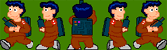

# Sprites y colisiones

En esta sesión vamos a ver un componente básico de los videojuegos: los _sprites_. Vamos a ver
cómo tratar estos componentes de forma apropiada, cómo animarlos, moverlos por la pantalla y detectar
colisiones entre ellos.


## Sprites

Los _sprites_ hemos dicho que son todos aquellos objetos de  
  la escena que se mueven y/o podemos interactuar con ellos de alguna forma. 


Podemos crear un _sprite_ en Cocos2D con la clase `Sprite`
a partir de la textura de dicho _sprite_:

```cpp
Sprite *sprite = Sprite::create("personaje.png");
```

El _sprite_ podrá ser añadido a la escena como cualquier otro nodo, añadiéndolo
como hijo de alguna de las capas con `addChild:`.


### Posición

Al igual que cualquier nodo, un _sprite_ tiene una posición en pantalla
representada por su propiedad `position`, de tipo `Vec2` (también podemos utilizar como tipo `Point`, ya que es un alias de `Vec2`). 

Por ejemplo, para posicionar un _sprite_ en unas determinadas coordenadas
le asignaremos un valor a su propiedad `position` (esto es aplicable a 
cualquier nodo):

```cpp
sprite->setPosition(Vec2(240, 160));
```

La posición indicada corresponde al punto central del _sprite_, aunque 
podríamos modificar esto con la propiedad `anchorPoint`, de forma similar
a las capas de CoreAnimation. El sistema de coordenadas de Cocos2D es el mismo que el
de CoreGraphics, el origen de coordenadas se encuentra en la esquina inferior 
izquierda, y las _y_ son positivas hacia arriba.

Podemos aplicar otras transformaciones al _sprite_, como rotaciones 
(`rotation`), escalados (`scale`, `scaleX`, `scaleY`), o desencajados
(`skewX`, `skewY`). También podemos especificar su orden Z (`zOrder`). 
Recordamos que todas estas propiedades no son exclusivas de los _sprites_, sino que son
aplicables a cualquier nodo, aunque tienen un especial interés en el caso de los _sprites_.


### Fotogramas

Estos objetos pueden estar animados. Para ello deberemos definir los distintos 
  fotogramas (o _frames_) de la animación. Podemos definir varias 
  animaciones para cada _sprite_, según las acciones que pueda hacer. 
  Por ejemplo, si tenemos un personaje podemos tener una animación para 
  andar hacia la derecha y otra para andar hacia la izquierda.
El _sprite_ tendrá un determinado tamaño (ancho y alto), 
  y cada fotograma será una imagen de este tamaño.
  
Cambiando el fotograma que se muestra del _sprite_ en cada momento podremos 
  animarlo. Para ello deberemos tener imágenes para los distintos fotogramas del _sprite_.
  Sin embargo, como hemos comentado anteriormente, la memoria de vídeo es un recurso crítico, y 
  debemos aprovechar al máximo el espacio de las texturas que se almacenan en ella. Recordemos
  que el tamaño de las texturas en memoria debe ser potencia de 2. Además, conviene evitar
  empaquetar con la aplicación un gran número de imágenes, ya que esto hará que el espacio
  que ocupan sea mayor, y que la carga de las mismas resulte más costosa.

Para almacenar los fotogramas de los _sprites_ de forma óptima, utilizamos lo que se conoce como
_sprite sheets_. Se trata de imágenes en las que incluyen de forma conjunta todos los fotogramas
de los _sprites_, dispuestos en forma de mosaico.
  



Podemos crear estos _sprite sheets_ de forma manual, aunque encontramos herramientas que nos
facilitarán enórmemente este trabajo, como **TexturePacker** (http://www.texturepacker.com).
Esta herramienta cuenta con una versión básica gratuita, y opciones adicionales de pago. Además de organizar
los _sprites_ de forma óptima en el espacio de una textura OpenGL, nos permite almacenar esta textura
en diferentes formatos (RGBA8888, RGBA4444, RGB565, RGBA5551, PVRTC) y aplicar efectos de mejora como 
_dithering_. Esta herramienta permite generar los _sprite sheets_ en varios formatos reconocidos por los diferentes
motores de videojuegos, como por ejemplo Cocos2D o libgdx.


Con esta herramienta simplemente tendremos que arrastrar sobre ella el conjunto de imágenes con los distintos 
fotogramas de nuestros _sprites_, y nos generará una textura optimizada para OpenGL con todos ellos 
dispuestos en forma de mosaico. Cuando almacenemos esta textura generada, normalmente se guardará un fichero
`.png` con la textura, y un fichero de datos que contendrá información sobre los distintos fotogramas
que contiene la textura, y la región que ocupa cada uno de ellos.

Para poder utilizar los fotogramas añadidos a la textura deberemos contar con algún mecanismo que nos permita
mostrar en pantalla de forma independiente cada región de la textura anterior (cada fotograma). En 
prácticamente todos los motores para videojuegos encontraremos mecanismos para hacer esto.

En el caso de Cocos2D, tenemos la clase `SpriteFrameCache` que se encarga de almacenar la
caché de fotogramas de _sprites_ que queramos utilizar. Con TexturePacker habremos
obtenido un fichero `.plist` (es el formato utilizado por Cocos2D) y una imagen `.png`. 
Podremos añadir fotogramas a la caché a partir de estos dos ficheros. En el fichero `.plist` se 
incluye la información de cada fotograma (tamaño, región que ocupa en la textura, etc). Cada fotograma se 
encuentra indexado por defecto mediante el nombre de la imagen original que añadimos a TexturePacker, aunque 
podríamos editar esta información de forma manual en el `.plist`.

La caché de fotogramas se define como _singleton_. Podemos añadir nuevos fotogramas a este
_singleton_ de la siguiente forma:

```cpp
SpriteFrameCache::getInstance()
    ->addSpriteFramesWithFile("sheet.plist");
```

En el caso anterior, utilizará como textura un fichero con el mismo nombre que el `.plist` pero
con extensión `.png`. También encontramos una versión del método anterior que también recibe como
parámetro la textura a utilizar, y de esta forma nos permite utilizar un fichero de textura 
con distinto nombre al `.plist`.

Una vez introducidos los fotogramas empaquetados por TexturePacker en la caché de Cocos2D, podemos crear 
_sprites_ a partir de dicha caché con:

```cpp
Sprite *sprite = Sprite::createWithSpriteFrameName("frame01.png");
```

En el caso anterior creamos un nuevo _sprite_, pero en lugar de hacerlo directamente a partir de una
imagen, debemos hacerlo a partir del nombre de un fotograma añadido a la caché de textura. No debemos confundirnos
con esto, ya que en este caso al especificar `"frame01.png"` no buscará un fichero con este nombre
en la aplicación, sino que buscará un fotograma con ese nombre en la caché de textura. El que los fotogramas
se llamen por defecto como la imagen original que añadimos a TexturePacker puede llevarnos a confusión.

También podemos obtener el fotograma como un objeto `SpriteFrame`. Esta clase no define un 
_sprite_, sino el fotograma almacenado en caché. Es decir, no es un nodo que podamos almacenar en la 
escena, simplemente define la región de textura correspondiente al fotograma:

```cpp
SpriteFrame* frame = SpriteFrameCache::getInstance()
    ->spriteFrameByName("frame01.png");
```

Podremos inicializar también el _sprite_ a partir del fotograma anterior, en lugar de hacerlo directamente
a partir del nombre del fotograma:

```cpp
Sprite *sprite = Sprite::createWithSpriteFrame(frame);
```


### Animación

Podremos definir determinadas secuencias de _frames_ para crear animaciones. Las animaciones se
representan mediante la clase `Animation`, y se pueden crear a partir de la secuencia de
fotogramas que las definen. Los fotogramas deberán indicarse mediante objetos de la clase 
`SpriteFrame`:

```cpp
Animation *animAndar = Animation::create();
animAndar->addSpriteFrame(SpriteFrameCache::getInstance()
    ->spriteFrameByName("frame01.png"));
animAndar->addSpriteFrame(SpriteFrameCache::getInstance()
    ->spriteFrameByName("frame02.png"));
```

Podemos ver que los fotogramas se pueden obtener de la caché de fotogramas definida anteriormente. Además
de proporcionar una lista de fotogramas a la animación, deberemos proporcionar su periodicidad, es decir, el
tiempo en segundos que tarda en cambiar al siguiente fotograma. Esto se hará mediante la propiedad
`delayPerUnit`:

```cpp
animAndar->setDelayPerUnit(0.25);
```

Una vez definida la animación, podemos añadirla a una caché de animaciones que, al igual que la caché
de texturas, también se define como _singleton_:

```cpp
AnimationCache::getInstance()
    ->addAnimation(animAndar, "animAndar");
```

La animación se identifica mediante la cadena que proporcionamos como parámetro
`name`. Podemos cambiar el fotograma que muestra actualmente un _sprite_ con su método:

```cpp
sprite->setDisplayFrameWithAnimationName("animAndar", 0);
```

Con esto buscará en la caché de animaciones la animación especificada, y mostrará de ella
el fotograma cuyo índice proporcionemos. Más adelante cuando estudiemos el motor del juego veremos cómo 
reproducir animaciones de forma automática.


### _Sprite batch_

En OpenGL los _sprites_ se dibujan realmente en un contexto 3D. Es decir, son texturas que se 
mapean sobre polígonos 3D (concretamente con una geometría rectángular). Muchas veces encontramos en
pantalla varios _sprites_ que utilizan la misma textura (o distintas regiones de la misma textura,
como hemos visto en el caso de los _sprite sheets_). Podemos optimizar el dibujado de estos _sprites_ 
generando la geometría de todos ellos de forma conjunta en una única operación con la GPU. Esto será
posible sólo cuando el conjunto de _sprites_ a dibujar estén contenidos en una misma textura. 

Podemos crear un _batch_ de _sprites_ con Cocos2D utilizando la clase 

```cpp
SpriteBatchNode *spriteBatch = 
    SpriteBatchNode::create("sheet.png");
this->addChild(spriteBatch);
```

El _sprite batch_ es un tipo de nodo más que podemos añadir a nuestra capa como hemos visto, 
pero por si sólo no genera ningún contenido. Deberemos añadir como hijos los _sprites_ que queremos 
que dibuje. Es imprescindible que los hijos sean de tipo `Sprite` (o subclases de ésta), y
que tengan como textura la misma textura que hemos utilizado al crear el _batch_ (o regiones de 
la misma). No podremos añadir _sprites_ con ninguna otra textura dentro de este _batch_.

```cpp
Sprite *sprite1 = Sprite::createWithSpriteFrameName("frame01.png");
sprite1->setPosition(Vec2(50,20));
Sprite *sprite2 = Sprite::createWithSpriteFrameName("frame01.png");
sprite2->setPosition(Vec2(150,20));

spriteBatch->addChild(sprite1);
spriteBatch->addChild(sprite2);
```

En el ejemplo anterior consideramos que el _frame_ con nombre `"frame01.png"`
es un fotograma que se cargó en la caché de fotogramas a partir de la textura `sheet.png`.
De no pertenecer a dicha textura no podría cargarse dentro del _batch_.


### Colisiones

Otro aspecto de los _sprites_ es la interacción entre ellos. 
  Nos interesará saber cuándo somos tocados por un enemigo o una bala para 
  disminuir la vida, o cuándo alcanzamos nosotros a nuestro enemigo. Para ello 
  deberemos detectar las colisiones entre _sprites_. La colisión 
  con _sprites_ de formas complejas puede resultar costosa de calcular. 
  Por ello se suele realizar el cálculo de colisiones con una forma aproximada 
  de los _sprites_ con la que esta operación resulte más 
  sencilla. Para ello solemos utilizar el _bounding box_, es decir, un 
  rectángulo que englobe el _sprite_. La intersección de 
  rectángulos es una operación muy sencilla. 
    
La clase `Sprite` contiene un método `getBoundingBox` que
nos devuelve un objeto `Rect` que representa la caja en la que el
_sprite_ está contenido. Con la función `intersectsRect` podemos
comprobar de forma sencilla y eficiente si dos rectángulos colisionan:

```cpp
Rect bbPersonaje = spritePersonaje->getBoundingBox();
Rect bbEnemigo = spriteEnemigo->getBoundingBox();

if (bbPersonaje.intersectsRect(bbEnemigo)) {
    // Game over
    ...
}
```


## Motor del juego

El componente básico del motor de un videojuego es lo que se conoce como ciclo del juego
(_game loop_). Vamos a ver a continuación en qué consiste este ciclo. 


### Ciclo del juego

Se trata de un bucle infinito en el que tendremos el código 
  que implementa el funcionamiento del juego. Dentro de este bucle se efectúan 
  las siguientes tareas básicas:

* **Leer la entrada**: Lee la entrada del usuario para conocer 
    si el usuario ha pulsado alguna tecla desde la última iteración.
  
* **Actualizar escena**: Actualiza las posiciones de los _sprites_ 
    y su fotograma actual, en caso de que estén siendo animados, la posición 
    del fondo si se haya producido _scroll_, y cualquier otro elemento 
    del juego que deba cambiar. Para hacer esta actualización se pueden 
    tomar diferentes criterios. Podemos mover el personaje según la entrada 
    del usuario, la de los enemigos según su inteligencia artificial, o 
    según las interacciones producidas entre ellos y cualquier otro objeto 
    (por ejemplo al ser alcanzados por un disparo, colisionando el _sprite_ 
    del disparo con el del enemigo), etc.
  
* **Redibujar**: Tras actualizar todos los elementos del juego, 
    deberemos redibujar la pantalla para mostrar la escena tal como ha quedado 
    en el instante actual. 
  
* **Dormir**: Normalmente tras cada iteración dormiremos 
    un determinado número de milisegundos para controlar la velocidad a 
    la que se desarrolla el juego. De esta forma podemos establecer a cuantos 
    fotogramas por segundo (_fps_) queremos que funcione el juego, siempre 
    que la CPU sea capaz de funcionar a esta velocidad.


```cpp
while(true) {
    leeEntrada();
    actualizaEscena();
    dibujaGraficos();   
}
```

Este ciclo no siempre deberá comportarse siempre de la misma forma. 
  El juego podrá pasar por distintos estados, y en cada uno de ellos deberán 
  el comportamiento y los gráficos a mostrar serán distintos (por ejemplo, las pantallas
  de menú, selección de nivel, juego, _game over_, etc).
Podemos modelar esto como una máquina de estados, en la que en cada 
  momento, según el estado actual, se realicen unas funciones u otras, 
  y cuando suceda un determinado evento, se pasará a otro estado.


### Actualización de la escena

En Cocos2D no deberemos preocuparnos de implementar el ciclo del juego, ya que de esto
se encarga el _singleton_ `Director`. Los estados del juego se
controlan mediante las escenas (`Scene`). En un momento dado, el ciclo de
juego sólo actualizará y mostrará los gráficos de la escena actual. Dicha escena dibujará
los gráficos a partir de los nodos que hayamos añadido a ella como hijos.

Ahora nos queda ver cómo actualizar dicha escena en cada iteración del ciclo del juego, 
por ejemplo, para ir actualizando la posición de cada personaje, o comprobar si existen
colisiones entre diferentes _sprites_. La escena tiene un método 
`schedule` que permite especificar un método al que
se llamará en cada iteración del ciclo. De esa forma, podremos especificar en dicho método la forma de actualizar la escena:

```cpp
scene->schedule(CC_SCHEDULE_SELECTOR(Game::update));
```

Tendremos que definir un método `update` donde introduciremos el código
que se encargará de actualizar la escena. Como parámetro recibe el tiempo transcurrido desde
la anterior actualización (desde la anterior iteración del ciclo del juego). Deberemos aprovechar
este dato para actualizar los movimientos a partir de él, y así conseguir un movimiento fluido
y constante:

```cpp
void Game::update(float dt)
{
    _sprite->setPosition(_sprite->getPosition() + Vec2(100*dt, 0));
}
```

En este caso estamos moviendo el _sprite_ en _x_ a una velocidad de 100 pixeles por
segundo (el tiempo transcurrido se proporciona en segundos). 

> Es importante remarcar que tanto el dibujado como las actualizaciones sólo se 
llevarán a cabo cuando la escena en la que están sea la escena que está ejecutando actualmente
el `Director`. Así es como se controla el estado del juego.

Existe otra versión del método `schedule` que nos permite proporcionar el método a llamar mediante una función lambda. En este caso deberemos indicar también un identificador para nuestra función, para así poder cancelar su planificación:

```cpp
scene->schedule([=](float dt) {
    ...        
}, "ia");
```

A esta planificación le hemos dado el identificador `"ia"`. Podremos cancelarla llamando a `unschedule("ia")`. 

Si no queremos tener que especificar la función de forma _inline_, también podemos especificarla de la siguiente forma:

```cpp
scene->schedule(CC_CALLBACK_1(Game::update, this), "ia");
```


### Acciones

En el punto anterior hemos visto cómo actualizar la escena de forma manual como se hace habitualmente
en el ciclo del juego. Sin embargo, con Cocos2D tenemos formas más sencillas de animar los nodos de 
la escena, son lo que se conoce como **acciones**. Estas acciones nos permiten definir
determinados comportamientos, como trasladarse a un determinado punto, y aplicarlos sobre un nodo
para que realice dicha acción de forma automática, sin tener que actualizar su posición manualmente
en cada iteración (_tick_) del juego.

Todas las acciones derivan de la clase `Action`. Encontramos acciones instantáneas 
(como por ejemplo situar un _sprite_ en una posición determinada), o acciones con una duración
(mover al _sprite_ hasta la posición destino gradualmente).

Por ejemplo, para mover un nodo a la posición _(200, 50)_ en 3 segundos, podemos definir una 
acción como la siguiente:

```cpp
MoveTo *actionMoveTo = MoveTo::create(3, Vec2(200, 50));
```

Para ejecutarla, deberemos aplicarla sobre el nodo que queremos mover:

```cpp
sprite->runAction(actionMoveTo);
```

Podemos ejecutar varias acciones de forma simultánea sobre un mismo nodo. Si queremos detener todas
las acciónes que pudiera haber en marcha hasta el momento, podremos hacerlo con:

```cpp
sprite->stopAllActions();
```

Además, tenemos la posibilidad de encadenar varias acciones mediante el tipo especial de acción
`Sequence`. En el siguiente ejemplo primero situamos el _sprite_ de forma
inmediata en _(0, 50)_, y después lo movermos a _(200, 50)_:

```cpp
Place *actionPlace = Place::create(Vec2(0, 50));
MoveTo *actionMoveTo = MoveTo::create(3, Vec2(200, 50));

Sequence *actionSequence = 
    Sequence::create(actionPlace, actionMoveTo, NULL);
    
sprite->runAction(actionSequence);
```

Incluso podemos hacer que una acción (o secuencia de acciones) se repita un determinado número
de veces, o de forma indefinida:

```cpp
RepeatForever *actionRepeat = 
    RepeatForever::create(actionSequence);
sprite->runAction(actionRepeat);
```

De esta forma, el _sprite_ estará continuamente moviéndose de _(0,50)_ a _(200,50)_.
Cuando llegue a la posición final volverá a aparecer en la inicial y continuará la animación.

Podemos aprovechar este mecanismo de acciones para definir las animaciones de fotogramas de los
_sprites_, con una acción de tipo `Animate`. Crearemos la acción de animación
a partir de una animación de la caché de animaciones:

```cpp
Animate *animate = Animate::create(
    AnimationCache::sharedAnimationCache()
        ->animationByName("animAndar"));

sprite->runAction(RepeatForever::create(animate));
```

Con esto estaremos reproduciendo continuamente la secuencia de fotogramas definida en la animación,
utilizando la periodicidad (_delayPerUnit_) que especificamos al crear dicha animación.

Encontramos también acciones que nos permiten realizar tareas personalizadas, proporcionando mediante una pareja
_target-selector_ la función a la que queremos que se llame cuando se produzca la acción:

```cpp
CallFunc *actionCall = 
    CallFunc::create(CC_CALLBACK_0(Game::accionCallback, this));
```

Deberemos definir en nuestra clase el método de _callback_ a llamar. En el caso del
ejemplo anterior sería:

```cpp
void Game::accionCallback() {
    ...
}
```

Otra opción es pasar directamente una función _lambda_ como parámetro:

```cpp
CallFunc::create([=] {
    ...            
});
```

También encontramos variantes de esta acción que nos permiten pasarle al _callback_
como parámetro datos propios o el nodo sobre el que se ha ejecutado la acción (`CallFuncN` recibe el nodo como parámetro, y `CallFundND` recibe el nodo y un puntero a datos genéricos). Cuanto tengamos que pasar un _callback_ con parámetros utilizaremos `CC_CALLBACK_1`, `CC_CALLBACK_2` y `CC_CALLBACK_3`, para 1, 2 y 3 parámetros respectivamente.

Encontramos gran cantidad de acciones disponibles, que nos permitirán crear diferentes efectos (fundido, tinte,
rotación, escalado), e incluso podríamos crear nuestras propias acciones mediante subclases de `Action`.


