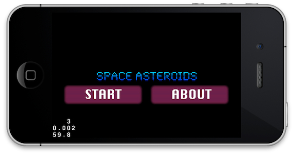
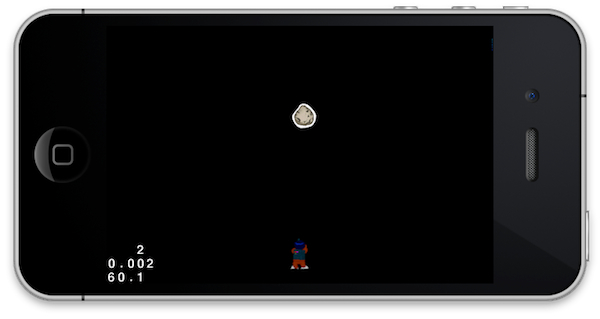
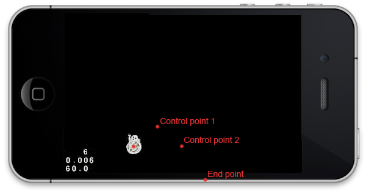
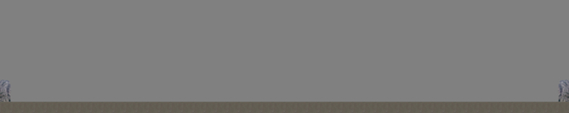
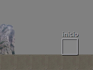
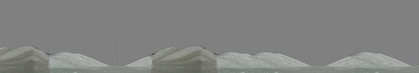
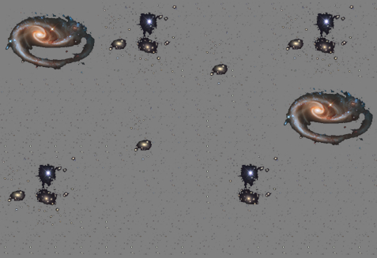
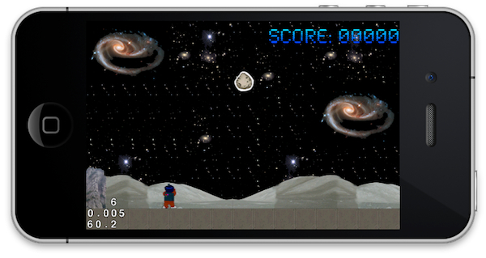

# Ejercicios

## Desarrollo de un videojuego con Cocos2d-x

Vamos a realizar un ejercicio guiado en el que desarrollaremos paso a paso un videojuego
con el motor Cocos2d-x. Partiremos de las plantillas del proyecto `SpaceAsteroids`, 
en las que inicialmente sólo tenemos una pantalla inicial inicial estática.
      

## Creación del menú principal del juego

Vamos a comenzar trabajando con la clase `HelloWorld` en la que se define
la pantalla inicial. Modificaremos esta clase para crear el menú principal del juego. Se pide:

_a)_ Cambia el título de la pantalla `HelloWorld` para que muestre el título de nuestro
juego (_Space Asteroids_), en lugar de _Hello World_.

_b)_ Tenemos una fuente de tipo _bitmap_ en los recursos del proyecto (`fuente.fnt`),
creada con la herramienta _Hiero Bitmap Font Tool_. Haz que el título 
se muestre con esta fuente, en lugar de la fuente _true type_ que tiene por defecto.

_c)_ Cambia las opciones del menú del juego. Las opciones deberán ser _Start_ y _About_.
Utilizaremos imágenes para los _items_ del menú:

* `boton_start_normal.png`
* `boton_start_press.png`
* `boton_about_normal.png`
* `boton_about_press.png`

Todas estas imágenes se pueden encontrar en la plantilla. Los 
botones del menú por el momento no harán nada.

_d)_ Haz que al pulsar sobre la opción _Start_
se haga una transición a la pantalla `Game` (por ahora esta pantalla no muestra nada).

_e)_ Haz que los cambios de escena anteriores se realicen mediante una transición animada. Escoge cualquiera
de las transiciones animadas definidas en Cocos2d-x.

      
            

## Creación de _sprites_ y actualización de la escena

A partir de este momento vamos a trabajar sobre la pantalla del juego. 
Tenemos una plantilla en la clase `Game`. Lo primero que haremos será añadir 
_sprites_ a dicha pantalla.

_a)_ En primer lugar crearemos un primer _sprite_ para mostrar una roca en una posición fija
de pantalla. Vamos a crear el _sprite_ a partir de una hoja de _sprites_ (_sprite sheet_).
Podemos encontrar esta hoja de _sprites_ en el fichero `sheet.plist`, creado
con la herramienta _TexturePacker_. 
Añadiremos el contenido de esta hoja de _sprites_ a la caché de fotogramas, 
crearemos a partir de ella el _sprite_ de la roca (el nombre del fotograma a utilizar 
será `roca.png`), y lo situaremos en _(240, 250)_.
Esto lo haremos en el método `init` de nuestra capa principal. Añadiremos este _sprite_
a la lista de tipo `CCArray` que tenemos en el campo `_asteroids`. Lo 
añadimos a una lista porque más adelante deberemos introducir más asteroides.

 
_b)_ Ahora vamos a crear el _sprite_ del personaje (el nombre del fotograma a utilizar 
será `pers01.png`), y lo añadiremos a la posición _(240, 37)_ de la pantalla 
(almacenada en la variable `_respawnPosition`). Guardaremos el _sprite_ en
el campo `_spritePersonaje`.

> Al guardar el _sprite_ del personaje en un campo de nuestro objeto, deberás
retenerlo en memoria, y liberarlo cuando el objeto `Game` sea destruido.

_c)_ Vamos a hacer ahora que el personaje se mueva al pulsar sobre la parte izquierda
o derecha de la pantalla. Para ello vamos a programar que el método `update` se ejecute
en cada iteración del ciclo del juego (esto se hará en `init`). Posteriormente, en 
`update` modificaremos la posición del _sprite_ a partir de la entrada de usuario. 
Podremos utilizar la variable de instancia `_velocidadPersonaje` para ello, que
nos indicará la velocidad a la que debemos mover el personaje en el eje x, en puntos/segundo.
Podemos utilizar esta información junto a _delta time_ para calcular la nueva posición del
_sprite_. Ahora si pulsamos en los laterales de la pantalla veremos como el _sprite_
se mueve.

_d)_ Vamos a crear un nuevo sprite para el disparo que lanza nuestro personaje. En la inicialización
de la capa (`init`) crea dicho _sprite_ a partir del _frame_ `rayo.png` y haz que
inicialmente sea invisible (con el método `setVisible`). Añádelo a la escena y 
guárdalo en la variable `_rayoSprite` gestionando de forma adecuada la memoria.

_e)_ Haz que al disparar el rayo éste aparezca en la posición actual de nuestro personaje, y 
se mueva hacia la parte superior de la pantalla con una acción. Para ello deberemos realizar lo siguiente
en el método `disparar`:

* Sólo se disparará el rayo si no hay ningún rayo en pantalla (si `_spriteRayo->isVisible` es `false`).
* En este caso, haremos el rayo visible y lo posicionaremos en la posición actual del personaje.
* Programaremos una acción que haga que el rayo se mueva hacia arriba, hasta salirse de la pantalla. En ese
momento el rayo deberá volverse a hacer invisible para poder volver a disparar.

Prueba a disparar el rayo pulsando en la zona superior de la pantalla.

> Mira las acciones `CCMoveTo`, `CCCallFunc` y `CCSequence`.

_f)_ Ahora haremos que el personaje al moverse reproduzca una animación por fotogramas en la que
se le vea caminar. Para ello en primer lugar debemos definir las animaciones en `init`.
La animación de caminar a la izquierda estará formada por los fotogramas `pers02.png` y
`pers03.png`, mientras que la de la derecha estará formada por `pers04.png` y
`pers05.png`. En ambos casos el retardo será de 0.25 segundos. Añadiremos las animaciones a la 
caché de animaciones. Una vez hecho esto, deberemos reproducir las animaciones cuando andemos hacia 
la derecha o hacia la izquierda. Podemos hacer esto mediante una acción de tipo `CCAnimate`.
Ejecutaremos estas animaciones en los métodos `moverPersonajeIzquierda` y `moverPersonajeDerecha`.
En `detenerPersonaje` deberemos parar cualquier animación que esté activa y mostrar el
fotograma `pers01.png`.

_g)_ Vamos a detectar colisiones entre el rayo y la roca. En caso de que exista
contacto, haremos que la roca desaparezca. Esto deberemos detectarlo en el método `update`.
Obtendremos los _bounding boxes_ de ambos _sprites_, comprobaremos si intersectan, y de ser así
haremos que la roca deje de ser visible.

_*h)_ En los anteriores ejercicios hemos añadido algunas de las funcionalidades vistas en clase. Vamos ahora
a completar el conjunto de funcionalidades relacionadas con _sprites_, acciones y colisiones
necesarias para nuestro juego. 

Estamos mostrando en pantalla diferentes _sprites_ pertenecientes todos ellos a una
misma textura en memoria. Vamos a optimizar el _render_ utilizando un _sprite batch_ para
volcar toda la geometría a pantalla mediante una única operación. Crea un `CCSpriteBatch` en
el método `init` y añade todos los _sprites_ a ella, en lugar de añadirlos directamente
a la capa.

> Todos los _sprites_ deben cargarse de la misma textura en memoria (deben ser
_frames_ sacados de la misma textura en la caché de _frames_). Lleva cuidado de que
esto sea así.

_*i)_ Vamos a modificar el código para crear varias rocas en lugar de sólo una. Crearemos 
`_numAsteroides` _sprites_ a partir del _frame_ `roca.png` y los 
introduciremos en el `CCArray` `_asteroids` y en el _sprite batch_. 
Inicialmente haremos que todos los asteroides sean invisibles. Haremos que éstos aparezcan dentro del 
método `update`. Dentro de este método, cuando un asteroide sea invisible se inicializará una 
acción para que caiga desde la parte superior de la pantalla con valores de posición y velocidad aleatorios, 
y cuando desaparezca por la parte inferior de la pantalla se marcará como invisible para que en la próxima
iteración vuelva a ser generado (_respawn_). Los valores de posición y velocidad para la acción
los generaremos con el método `generateRandomNumber` con los siguientes rangos:

* La posición _x_ inicial tendrá un valor entre `0` y el ancho de la pantalla.
* La posición _y_ inicial será la altura de la pantalla más la altura del _sprite_.
* La posición _x_ final podrá desviarse 3 veces en ancho del asteroide como máximo hacia
la izquierda o hacia la derecha, respecto a la posición inicial.
* La posición _y_ final siempre será `0` menos la altura del _sprite_.
* La duración de la caída estará entre 2s y 4s.

_*j)_ Vamos a añadir una animación de explosión para los asteroides. En primer lugar, en el
método `init` debemos crear la animación a partir de los _frames_ 
`expl01.png`, `expl02.png`, `expl03.png` y `expl04.png`
con retardo de 0.05 segundos, y la añadiremos a la caché de animaciones con nombre 
`animacionExpl`. Tras hacer esto, en el método `update`, cuando se detecte 
la colisión del disparo con un asteroide en lugar de hacerlo desaparecer directamente, reproduciremos
antes la animación de la explosión, y tras esto lo haremos invisible.

_*k)_ Por último, comprobaremos las colisiones entre los asteroides y el personaje. Cuando un
astoroide impacte con nuestro personaje, este último morirá, se convertirá en un esqueleto y caerá describiendo
un arco. Durante la muerte del personaje no deberemos poder moverlo, para ello deshabilitaremos
los eventos táctiles mediante el método `setTouchEnabled` de nuestra capa. Sólo comprobaremos la colisión con el personaje
cuando `this->isTouchEnabled()` sea `true`, con esta propiedad controlaremos si el
personaje es manejable (y por lo tanto puede morir) o no. Para que el personaje caiga describiendo un
arco utilizaremos la acción `CCBezierTo`, que mueve el _sprite_ siguiendo la ruta
de una curva de Bezier. Para ello antes tenemos que definir esta curva. Utilizaremos los siguientes
puntos de control para esta curva (tipo `ccBezierConfig`):

* **Punto de control 1: **Dos veces el ancho del _sprite_ a su derecha, y una vez el alto
del _sprite_ arriba de éste.
* **Punto de control 2: **Cuatro veces el ancho del _sprite_ a su derecha, y a la misma
altura que la posición actual del _sprite_
* **Punto de control final: **Seis veces el ancho del _sprite_ a su derecha, y una vez la altura
del _sprite_ por debajo de la parte inferior de la pantalla.

Una vez el _sprite_ haya caido, lo haremos invisible y lo moveremos a su posición inicial 
(`_respawnPosition`). Una vez haya llegado, volveremos a hacerlo visible y habilitaremos
de nuevo el control del usuario.

      
      

## Escenario y fondo

Vamos a utilizar _tilemap_ como escenario del juego, creado con la herramienta _Tiled Map Editor_. Contamos en los recursos
del proyecto con el fichero `escenario.tmx` que contiene el mapa del juego. Tiene 
50 celdas de ancho y 10 de alto, y utiliza como imagen de patrones el fichero 
`tilemap.png`. El mapa se ha definido como se muestra a continuación:

_a)_ Carga el mapa anterior en la clase `Game` del proyecto. 
Introduce en el método `init` el código necesario para cargar el mapa TMX en el campo
`_tiledMap` y añádelo a la capa del juego (indica el orden `z` adecuado para
que aparezca detrás de los _sprites_).

_b)_ Ahora vemos que el personaje se solapa con el suelo definido en el mapa. Vamos a solucionar
esto calculando la posición del personaje respecto al tamaño de los _tiles_. Guarda en primer lugar el 
tamaño de los _tiles_ del mapa en la variable `_tileSize`. 
Tras esto, calcularemos la posición inicial del personaje (`_respawnPosition`) a partir del
tamaño de los _tiles_ y del propio personaje, de forma que ande por encima del suelo.

_c)_ Vamos ahora a implementar _scroll_ para nuestro escenario. Para ello en primer lugar
debemos centrar el visor en la posición del _sprite_ en cada momento. Para ello
utilizaremos el método `centerViewport` ya definido. Habrá que llamar a este método tanto en 
`init`, al posicionar el _sprite_ por primera vez, como en `update`, 
cada vez que movemos nuestro personaje. También haremos que la posición _x_ inicial de los asteroides
generada aleatoriamente pueda generarse en todo el ancho del escenario, en lugar de sólo la pantalla. Esto
deberá ser modificado en `update`, en el momento en el que se regeneran los asteroides.

_*d)_ Vamos a utilizar ahora la capa de objetos para marcar la posición _x_ inicial del
personaje en el mapa. En esta capa tenemos un objeto con nombre `inicio` en la posición del quinto _tile_, 
tal como se muestra a continuación:

Se deberá tener la capa de objetos en el código, para extraer de ella el objeto
`inicio` y de él la posición _x_ en la que se encuentra. Ahora calcularemos 
`_respawnPosition` utilizando como coordenada _x_ la leída de la capa de objetos.

_*e)_ También deberemos evitar que el personaje se pueda salir por los laterales del mapa. Para ello
haremos los _tiles_ de las rocas de los laterales "colisionables". Estos _tiles_ se encuentran en 
una capa del mapa llamada `muros`, y tienen  
una propiedad `colisionable` con valor `true`. En el 
código tenemos un método `isCollidableTileAt` ya implementado, que dadas las coordenadas de 
un _tile_, nos dice si es colisionable o no. Vamos a utilizarlo para hacer que el personaje no 
pueda atravesar las rocas. Al final del método `update` obtendremos los _tiles_ inmediatamente
a la izquierda y a la derecha del personaje. Si alguno de ellos es colisionable, y efectivamente colisiona
con el personaje, detendremos a nuestro _sprite_ y corregiremos su posición para que no se quede
a mitad de la roca.

_*f)_ Vamos a añadir ahora _scroll parallax_, con varias capas de fondo. Para ello utilizaremos dos 
_tilemaps_ adicionales: `fondo.tmx` y `espacio.tmx`. El primero de ellos tiene 25 _tiles_ 
de ancho, y 10 de alto, y una un fondo de montañas:

El segundo tiene 15 _tiles_ de ancho y 10 de alto, y muestra un fondo de estrellas:

Cargaremos estos fondos en el método `init` y los añadiremos a un nodo de _scroll parallax_.
También añadiremos a este nodo el fondo original, en lugar de añadirlo directamente a la capa del juego. El
nodo original se moverá con un _ratio_ 1, ya que debe avanzar a la misma velocidad a la que desplazamos
el _viewport_, pero los otros se moverán a una velocidad más baja (con _ratios_ 0.25 y 0.01)
para dar sensación de profundidad.

_*g)_ Vamos a añadir ahora sonido al videojuego. En la inicialización de la capa 
del juego (método `init`) precargaremos los
efectos de sonido necesarios: `disparo.caf` y `explosion.caf`.

_*h)_ Reproduciremos el sonido de disparo en el método `disparar`, y el de la explosión
cuando en `update:` se detecte la colisión entre el disparo y un asteroide.

_*i)_ Vamos ahora a reproducir musica de fondo. Durante el juego reproduciremos 
`bgmusic.mp3` (esto lo haremos en el método `init` de `Game`).

_*j)_ Ahora ajustaremos el volumen de la música y los efectos. En el método `init`
fijaremos el volumen de la música a 0.6 y el de los efectos de sonido a 0.8.

_*k)_ Finalmente, vamos a añadir un HUD para mostrar la puntuación del juego. Dado que el juego implementa
_scroll_, para que el HUD no se desplace con el _scroll_ deberemos añadirlo a la escena
en una capa independiente a la del juego. En el método `scene` de `Game`, crearemos una etiqueta
de tipo _bitmap font_ con el formato _Score: 00000_ y la añadiremos a la escena directamente
en la esquina superior derecha de la pantalla (utilizando para ello las propiedades `anchorPoint`
y `position`).

_*l)_ Cuando se detecte la colisión del rayo con un asteroide en `update`, tras incrementar 
la puntuación actualizaremos la etiqueta del HUD, con la nueva puntuación con formato `"Score: %05d"`.

 al asteroide rebotar contra el suelo.

_d)_ Ahora vamos a hacer que los disparos se comporten como cuerpos cinemáticos, de forma 
que al impactar con el asteroide harán que rebote. En este caso el cuerpo lo añadiremos cuando se
produzca un disparo, en el método `disparar`. Crearemos el cuerpo en la misma
posición que el personaje, con una velocidad de 10 m/s hacia arriba. Le daremos una forma de caja
con radio (10px, 5px).

En el método `update`, en caso de que `_bodyRayo` exista, extraremos de él
su posición y se la asignaremos al _sprite_ del rayo. Además, comprobaremos si el rayo ha salido
por el extremo superior de la pantalla. En ese caso, haremos invisible el _sprite_ y destruiremos
el cuerpo del rayo del mundo.

_e)_ La forma del _sprite_ de la roca ha sido aproximada mediante un círculo, pero realmente no 
es circular. Vamos a definirla de forma más precisa con la herramienta 
_Physics Editor_.
Cargar en Physics Editor el _sprite_ de la roca y definir su
forma mediante la varita mágica. Le daremos fricción de 0.5 y _restitution_ de 1.0. Graba
la definición de la forma en un fichero `plist` y añádelo al proyecto de Xcode.

En el método `init` eliminaremos la definición de la _fixture_ de
forma circular para la roca. En su lugar cargaremos el fichero `plist` generado
con Physics Editor, y añadiremos al cuerpo de la roca como _fixture_ la forma definida
en dicho fichero.

> Deberemos establecer el `anchorPoint` del _sprite_ de la roca
en el código tal como se haya establecido en Physics Editor.

