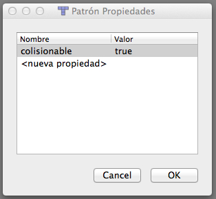
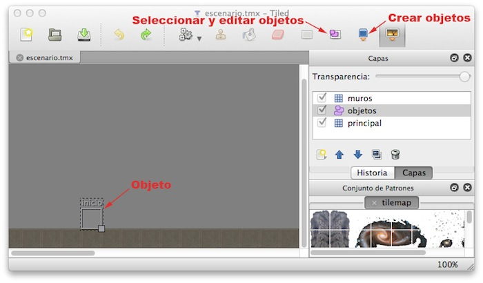

# Escenario y fondo

Hasta el momento hemos visto cómo crear los diferentes elementos dinámicos (_sprites_) de
nuestro juego, como por ejemplo nuestro personaje, los enemigos, o los disparos. Pero todos estos elementos
normalmente se moverán sobre un escenario. Vamos a ver en esta sesión la forma en la que podemos construir
este escenario, los fondos, y también cómo añadir música de fondo y efectos de sonido.      
      

## Escenario de tipo mosaico

En los juegos normalmente tendremos un fondo sobre el que se mueven los personajes. 
  Muchas veces los escenarios del juego son muy extensos y no caben enteros en 
  la pantalla. De esta forma lo que se hace es ver sólo la parte del escenario 
  donde está nuestro personaje, y conforme nos movamos se irá desplazando 
  esta zona visible para enfocar en todo momento el lugar donde está nuestro 
  personaje. Esto es lo que se conoce como _scroll_. 
El tener un fondo con _scroll_ será más costoso computacionalmente, 
  ya que siempre que nos desplacemos se deberá redibujar toda la pantalla, 
  debido a que se está moviendo todo el fondo. Además para poder 
  dibujar este fondo deberemos tener una imagen con el dibujo del fondo para poder 
  volcarlo en pantalla. Si tenemos un escenario extenso, sería totalmente 
  prohibitivo hacer una imagen que contenga todo el fondo. Esta imagen sobrepasaría con
  total seguridad el tamaño máximo de las texturas OpenGL.
Para evitar este problema lo que haremos normalmente en este tipo de juegos 
  es construir el fondo como un mosaico. Nos crearemos una imagen con los elementos 
  básicos que vamos a necesitar para nuestro fondo, y construiremos el 
  fondo como un mosaico en el que se utilizan estos elementos. 


Encontramos herramientas que nos permiten hacer esto de forma sencilla, como 
**Tiled** (http://www.mapeditor.org). 
Con esta herramienta deberemos proporcionar una textura con las distintas piezas con las
que construiremos el mosaico, y podemos combinar estas piezas de forma visual para 
construir mapas extensos.


Deberemos proporcionar una imagen con un conjunto de patrones (_Mapa > Nuevo conjunto
de patrones_). Deberemos indicar el ancho y alto de cada "pieza" (_tile_), para que así sea
capaz de particionar la imagen y obtener de ella los diferentes patrones con los que
construir el mapa. Una vez cargados estos patrones, podremos seleccionar cualquiera de ellos
y asignarlo a las diferentes celdas del mapa.


El resultado se guardará en un fichero de tipo `.tmx`, basado en XML, que la
mayor parte de motores 2D son capaces de leer. En Cocos2D tenemos la clase `CCTMXTiledMap`, 
que puede inicializarse a partir del fichero `.tmx`:

```cpp
CCTMXTiledMap *fondo = CCTMXTiledMap::create("mapa.tmx");
```

Este objeto es un nodo (hereda de `CCNode`), por lo que podemos añadirlo a pantalla 
(con `addChild`) y aplicar cualquier transformación de las vistas anterioremente.

Las dimesiones del mapa serán _(columnas*ancho)x(filas*alto)_, siendo _ancho x alto_ las
dimensiones de cada _tile_, y _columnas x filas_ el número de celdas que tiene el mapa. 
  


Hemos visto la creación básica de un escenario con _Tiled Map Editor_, pero esta herramienta nos 
da más facilidades para la creación de los fondos. En el caso anterior hemos visto como crear el fondo
a partir de una única capa de mosaico, pero podemos hacer que nuestros fondos se compongan de varias
capas. En el panel de la derecha de la herramienta vemos la lista de capas, y podemos añadir nuevas capas.
Al añadir una nueva capa, nos preguntará si queremos una nueva capa de patrones o de objetos. Las capas
de patrones nos permitirán crear el aspecto visual del fondo mediante un mosaico, como hemos visto anteriormente,
mientras que las de objetos nos permiten marcar diferentes zonas del mapa, por ejemplo para indicar puntos
en los que aparecen enemigos, o el punto en el que se debe situar nuestro personaje al comenzar el nivel.
Vamos a ver cada uno de estos tipos de capas con más detenimiento.


### Capas de patrones

Como hemos indicado anteriormente, las capas de patrones nos permiten definir el aspecto del nivel
mediante un mosaico, utilizando un conjunto de patrones para fijar el contenido de cada celda del mosaico.
Cuando creamos varias capas de patrones, será importante fijar su orden, ya que las capas que estén
al frente taparán a las que estén atrás. Este orden viene determinado por el orden en el que las capas
aparecen en la lista del panel derecho. Las capas al comienzo de la lista quedarán por delante de las
demás. Podemos cambiar el orden de las capas en esta lista mediante los botones con las flechas hacia arriba
y hacia abajo para conseguir situar cada una de ellas en la profundidad adecuada.


Las utilidades de esta división en capas son varias:


* **Aspecto**: Un primer motivo para utilizar diferentes capas puede ser simplemente por
cuestiones de aspecto, para combinar varios elementos en una misma celda. Por ejemplo, en una capa de fondo podríamos 
poner el cielo, y en una capa más cercana una reja con fondo transparente. De esa forma ese mismo recuadro
con la reja podría ser utilizado en otra parte del escenario con un fondo distinto (por ejemplo de montañas),
pudiendo así con únicamente 3 recuadros obtener 4 configuraciones diferentes: cielo, montaña, cielo con reja, y
montaña con reja.
* **Colisiones**: Puede interesarnos que los elementos de una capa nos sirvan para detectar
colisiones con los objetos del juego. Por ejemplo, podemos en ella definir muros que los personajes del juego
no podrán atravesar. Consideraremos desde nuestro juego que todas las celdas definidas en esa capa suponen
regiones que deben colisionar con nuestros _sprites_.
* **Consumibles**: Podemos definir una capa con objetos que podamos recoger. Por ejemplo
podríamos definir una capa con monedas, de forma que cada vez que el usuario entra en una celda con una moneda
dicha moneda sea eliminada del mapa y se nos añada a un contador de puntuación.


Vamos a ver ahora cómo implementar en nuestro juego los anteriores usos, que nos permitan detectar colisiones 
con las celdas y modificar en el programa el contenido de las mismas para poder introducir en ellas
elementos consumibles.

La base para hacer todo esto es poder obtener cada capa individual del mapa para poder trabajar con
sus elementos. Esto lo haremos con la clase `CCTMXLayer`:

```cpp
CCTMXLayer *capa = fondo->layerNamed("muros");
```


### Colisiones con el mapa

La detección de colisiones con los muros del fondo será muy útil en juegos de tipo RPG o de plataformas. 
Para hacer esto lo primero que debemos hacer es obtener la capa que define los elementos que se comportan
como "muro" tal como hemos visto anteriormente. De esta capa necesitaremos tener alguna forma de identificar
qué celdas definen muros. La forma más adecuada de marcar estas celdas consiste en darles una serie de 
propiedades que nuestro programa podrá leer y así comprobar si se trata de un muro con el que podemos
colisionar o no. Para asignar propiedades a un objeto del conjunto de patrones dentro de _Tiled_ 
podemos pulsar con el botón derecho sobre él, y seleccionar _Propiedades del Patrón..._. Se abrirá
un cuadro como el siguiente donde podremos definir dichas propiedades:




Lo que deberemos hacer es marcar todos los objetos del conjunto de patrones que sirvan para definir muros
con una misma propiedad que los marque como tal.

En el código de nuestro juego podremos leer estas propiedades de la siguiente forma:

```cpp
CCPoint tileCoords = ccp(fila,columna);

int tileGid = capa->tileGIDAt(tileCoords);
if (tileGid) {
    CCDictionary *properties = fondo->propertiesForGID(tileGid);
    if (properties) {
        const CCString *collision = 
            properties->valueForKey("colisionable");
        if(collision && collision->compare("true")==0) {
            ...
        }
    }
}
```

El _gid_ de cada celda nos indica el tipo de objeto de patrón que tenemos en ella. Si la celda está
vacía el _gid_ será `0`. En una versión más sencilla, podríamos considerar que todas
las celdas de la capa son colisionables y simplemente comprobar si el _gid_ es distinto de `0`.
De todas formas, el uso de propiedades hace más flexible nuestro motor del juego, para por ejemplo
en el futuro implementar distintos tipos de colisiones.

Para comprobar las colisiones de nuestro _sprite_ con los muros una primera aproximación podría
consistir en hacer la comprobación con todas las celdas de la capa. Sin embargo esto no resulta nada eficiente
ni adecuado. La solución que se suele utilizar habitualmente consiste en comprobar la colisión únicamente con las
celdas de nuestro entorno. Haremos lo siguiente:

<ol>
* Obtendremos la posición en las que está centrado nuestro _sprite_.
* Calcularemos las coordenadas de la celda a la que corresponde (dividiendo entre la anchura y altura de cada celda).
* Obtendremos los _gid_ de las 9 celdas adyacentes.
* Comprobaremos si colisiona con alguna de ellas, corrigiendo la posición del _sprite_ en tal caso.
</ol>

A continuación mostramos un ejemplo de código en el que obtendríamos cada una de las celdas adyacentes
a un _sprite_. En primer lugar vamos a crear una serie de métodos auxiliares. El primero de ellos
nos devolverá las coordenadas de una celda a partir de las coordenadas de la escena (dividiendo entre
el tamaño de cada celda):

```cpp
CCPoint Game::tileCoordForPosition(CCPoint position)
{
    CCSize tileSize = _tiledMap->getTileSize();

    float totalHeight = _tiledMap->getMapSize().height * tileSize.height;
    float x = floor(position.x / tileSize.width);
    float y = floor((totalHeight - position.y) / tileSize.height);
    return ccp(x, y);
}
```

> Hay que destacar que las coordenadas _y_ del mapa están invertidas respecto a las
de la escena. Por ese motivo es necesario calcular la altura total y hacer la resta.

También vamos a definir un método que nos devuelva el área (`CCRect`) que ocupa en la escena
una celda dada:

```cpp
CCRect Game::rectForTileAt(CCPoint tileCoords) {
    CCSize tileSize = _tiledMap->getTileSize();

    float totalHeight = _tiledMap->getMapSize().height * tileSize.height;
    CCPoint origin = ccp(tileCoords.x * tileSize.width, totalHeight - 
                         ((tileCoords.y + 1) * tileSize.height));
    return CCRectMake(origin.x, origin.y, 
                      tileSize.width, tileSize.height);
}
```

Por último, crearemos un método que nos diga si una determinada celda es colisionable o no. Consideraremos 
que las celdas fuera del mapa no son colisionables (aunque según el caso podría interesarnos hacerlo al revés):

```cpp
bool Game::isCollidableTileAt(CCPoint tileCoords) {
    
    // Consideramos que celdas fuera del mapa no son nunca colisionables
    if(tileCoords.x < 0 || tileCoords.x >= _tiledMap->getMapSize().width 
       || tileCoords.y < 0 
       || tileCoords.y >= _tiledMap->getMapSize().height) {
        return false;
    }
    
    CCTMXLayer *layerMuros = _tiledMap->layerNamed("muros");
    
    int tileGid = layerMuros->tileGIDAt(tileCoords);
    if (tileGid) {
        CCDictionary *properties = _tiledMap->propertiesForGID(tileGid);
        if (properties) {
            const CCString *collision = 
                properties->valueForKey("colisionable");
            return (collision && collision->compare("true")==0);
        }
    }
    
    return false;
}
```

Una vez hecho esto, podremos calcular las colisiones con las celdas adyacentes a nuestro personaje y tomar las acciones oportunas.
Por ejemplo, en el caso sencillo en el que sólo necesitamos calcular las colisiones a la izquierda y a la derecha, podremos
utilizar el siguiente código:

```cpp
CCSize tileSize = _tiledMap->getTileSize();

CCPoint tileCoord = 
    this->tileCoordForPosition(_spritePersonaje->getPosition());
CCPoint tileLeft = ccp(tileCoord.x - 1, tileCoord.y);
CCPoint tileRight = ccp(tileCoord.x + 1, tileCoord.y);

if(this->isCollidableTileAt(tileLeft)) {
    CCRect tileRect = this->rectForTileAt(tileLeft);
    if(tileRect.intersectsRect(_spritePersonaje->boundingBox())) {
        this->detenerPersonaje();
        _spritePersonaje->setPosition(ccp(tileRect.origin.x + 
            tileRect.size.width +
            _spritePersonaje->getContentSize().width / 2, 
            tileSize.height 
            + _spritePersonaje->getContentSize().height / 2));
    }
}

if(this->isCollidableTileAt(tileRight)) {
    CCRect tileRect = this->rectForTileAt(tileRight);
    if(tileRect.intersectsRect(_spritePersonaje->boundingBox())) {
        this->detenerPersonaje();
        _spritePersonaje->setPosition(ccp(tileRect.origin.x - 
            _spritePersonaje->getContentSize().width / 2, 
            tileSize.height + 
            _spritePersonaje->getContentSize().height / 2));
    }
}
```

Por supuesto, la forma de obtener estas celdas dependerá del tamaño del _sprite_. Si ocupase más de una celda
deberemos hacer la comprobación con todas las celdas de nuestro entorno a las que pudiera alcanzar.

Una vez detectada la colisión, el último paso hemos visto que consistiría en parar el movimiento del 
_sprite_. Si conocemos la posición de la celda respecto al _sprite_ (arriba, abajo, izquierda,
derecha) nos será de gran ayuda, ya que sabremos que deberemos posicionarlo justo pegado a esa celda en el
lateral que ha colisionado con ella. En el ejemplo anterior, según colisione con la celda izquierda o derecha,
posicionamos al _sprite_ pegado a la derecha o a la izquierda del muro respectivamente.


### Modificación del mapa

En muchos casos nos interesará tener en el mapa objetos que podamos modificar. Por ejemplo, monedas u otros
items que podamos recolectar, u objetos que podemos destruir. Para conseguir esto podemos definir una capa
con dichos objetos, y marcarlos con una propiedad que nos indique que son "recolectables" o "destruibles".
Una vez hecho esto, desde nuestro código podemos obtener la capa que contenga dichos objetos recolectables,
por ejemplo "monedas":

```cpp
CCTMXLayer *monedas = fondo->layerNamed("monedas");
```

De esta capa podremos eliminar los objetos "recolectables" cuando nuestro personaje los recoja. Para hacer
esto podemos utilizar el siguiente método:

```cpp
monedas->removeTileAt(tileCoord);
```

También podríamos cambiar el tipo de elemento que se muestra en una celda (por ejemplo para que al tocar
una moneda cambie de color). Esto lo haremos especificando el nuevo _gid_ que tendrá
la celda:

```cpp
monedas->setTileGID(GID_MONEDA_ROJA,tileCoord);
```

Para cambiar o modificar los elementos recolectables primero deberemos comprobar si nuestro personaje 
"colisiona" con la celda en la que se encuentran, de forma similar a lo visto en el punto anterior:

```cpp
CCPoint tileCoords = this->tileCoordForPosition(_sprite->getPosition());

int tileGid = monedas->tileGIDAt(tileCoords);
if (tileGid) {
    CCDictionary *properties = fondo->propertiesForGID(tileGid);
    if (properties) {
        const CCString *recolectable = 
            properties->valueForKey("recolectable");
        if(recolectable && recolectable->compare("true")==0) {
            monedas->removeTileAt(tileCoords);
        }
    }
}
```

En este caso únicamente comprobamos la celda en la que se encuentra nuestro personaje, no las adyacentes.
Si el personaje fuese de mayor tamaño deberíamos comprobar todas las celdas del entorno que pudiera abarcar.


### Capas de objetos

Hasta el momento hemos visto las capas de patrones, que se construyen como un mosaico de celdas que definirá el
aspecto del fondo. Existe otro tipo de capa que podemos incluir en nuestro diseño del fondo que no se limita
al mosaico de celdas, sino que nos permite marcar cualquier región del mapa sin ajustarse a la rejilla de celdas.
Estas son las capas de objetos. En estas capas podremos por ejemplo marcar zonas de mapas donde aparecen enemigos,
o donde se situa automáticamente nuestro personaje al iniciar el nivel.

Cuando añadamos y seleccionemos una capa de objetos, en la barra de herramientas superior se activarán
dos iconos que nos permitirán crear nuevos objetos y seleccionar y cambiar las propiedades de los objetos
existentes. Pulsando el botón con el "cubo azul" podremos añadir un nuevo objeto a la escena. El objeto 
se definirá como un rectángulo (deberemos pulsar y arrastrar el ratón sobre el escenario para definir
dicho rectángulo).




Tras crear un objeto, podremos cambiar a la herramienta para la selección y modificación de objetos, 
seleccionar el objeto que acabamos de crear, pulsar sobre él con el botón derecho, y seleccionar
la opción _Propiedades del Objeto ..._. Veremos una ventana como la siguiente, en la que podremos darle
un nombre, modificar sus dimensiones, y añadir una lista de propiedades.


Una vez le hayamos dado un nombre al objeto, podremos obtenerlo desde el código de nuestro juego. Para ello
primero deberemos obtener la capa de objetos (representada con la clase `CCTMXObjectGroup`) a 
partir del nombre que le hemos dado (`objetos` en este ejemplo):

```cpp
CCTMXObjectGroup *objects = fondo->objectGroupNamed("objetos");
```

A partir de esta capa podremos obtener uno de sus objetos dando su nombre. Por ejemplo, si hemos creado
un objeto con nombre `inicio`, podremos obtenerlo de la siguiente forma

```cpp
CCDictionary *inicio = objects->objectNamed("inicio");
```
        
Como vemos, el objeto se obtiene como un diccionario. De él podemos obtener diferentes propiedades,
como sus coordenadas:

```cpp
_sprite->setPosition(ccp(inicio->valueForKey("x")->intValue(), 
                         inicio->valueForKey("y")->intValue()));
```

De esta forma en el código obtenemos la posición que ocupa el objeto y podemos utilizar esta posición
para su propósito (por ejemplo para situar en ella inicialmente a nuestro personaje, o hacer que en
ese punto aparezcan nuevos enemigos).


<!-- 

## Mapas y pantalla retina

La adaptación de los _tilemaps_ a pantalla retina resulta algo más compleja que otros elementos,
ya que su API trabaja únicamente en píxeles, por lo que deberemos llevar cuidado 
de realizar las transformaciones necesarias en el código.

En primer lugar, deberemos adaptar nuestro fichero `.tmx` a pantalla retina. Para ello
crearemos una nueva versión del fichero `png` con el conjunto de patrones, 
adaptándalo a la nueva resolución (duplicando la resolución para pantalla retina). Por ejemplo, si
nuestros patrones originales están en un fichero `patrones.png`, crearemos la versión
retina de los mismos en un fichero con sufijo `-hd`:

```
patrones-hd.png
```

Tras la adaptación del fichero con la imagen de los patrones, deberemos modificar el fichero
`tmx`, ya que en él se especifican las dimensiones de los patrones en píxeles. Deberemos
generar por lo tanto una versión `-hd` del fichero `tmx` con las nuevas 
dimensiones. Lo más sencillo en este caso es realizar una copia del fichero original, 
añadirle el sufijo `-hd`, y modificarlo manualmente con un editor de texto, 
ya que se trata de un fichero XML. Este fichero tiene un formato como el siguiente:

```xml
<map version="1.0" orientation="orthogonal" width="50" height="10" 
                   tilewidth="32" tileheight="32">
 <tileset firstgid="1" name="tilemap" tilewidth="32" tileheight="32">
  <image source="tilemap.png" width="320" height="160"/>
  ...
 </tileset>
 <objectgroup name="objetos" width="50" height="10">
  <object name="inicio" x="128" y="256" width="32" height="32"/>
 </objectgroup>
</map>
```

Podemos observar que hay una serie de propiedades que hacen referencia al tamaño de los
_tiles_ o de las imágenes, medidas en píxeles, mientras que otras propiedades
hacen referencia al tamaño del mapa en filas y columnas. Para hacer la adaptación a
pantalla retina sólo deberemos modificar las medidas que se encuentran en píxeles. En el
ejemplo anterior podemos observar que estos elementos son:


* Ancho y alto de los _tiles_ del mapa (atributos `tilewidth` y
`tileheight` de la etiqueta `map`).
* Ancho y alto de los _tiles_ del conjunto de patrones (atributos `tilewidth` y
`tileheight` de la etiqueta `tileset`).
* Ancho y alto de la imagen de patrones (atributos `width` y
`height` de la etiqueta `image`).
* Posición y dimensiones de los objetos  (atributos `x`, `y`, `width` y
`height` de la etiqueta `object`).


Tras duplicar las dimensiones de los elementos anteriores, el mapa quedará de la siguiente
forma:

```xml
<map version="1.0" orientation="orthogonal" width="50" height="10" 
                   tilewidth="64" tileheight="64">
 <tileset firstgid="1" name="tilemap" tilewidth="64" tileheight="64">
  <image source="tilemap.png" width="640" height="320"/>
  ...
 </tileset>
 <objectgroup name="objetos" width="50" height="10">
  <object name="inicio" x="256" y="512" width="64" height="64"/>
 </objectgroup>
</map>
```

Debemos tener en cuenta que el tamaño y posición de los _tiles_ y objetos pueden estar siendo
utilizados en nuestro código para detección de colisiones o aparición de personajes. Debemos tener
en cuenta que, tal como hemos comentado al comienzo de esta sección, la API de Cocos2D para
_tilemaps_ trabaja siempre en píxeles, no en puntos. Es decir, cuando accedemos a la propiedad
`tileSize` de nuestro `CCTMXTiledMap` nos dará las dimensiones tal como 
aparecen en el fichero `tmx` (en píxeles), mientras que las posiciones y dimensiones de los 
_sprites_ en Cocos2D están en puntos.

La forma más sencilla de resolver este problema, sabiendo que hemos duplicado las dimensiones del mapa
para adaptarlo a pantalla retina, es convertir las dimensiones de píxeles a puntos mediante
las macros que nos proporciona Cocos2D. Podemos obtener el tamaño de un _tile_ en puntos de
la siguiente forma:

```cpp
CGSize tileSizeInPoints = CC_SIZE_PIXELS_TO_POINTS(tiledMap.tileSize);
```

Podríamos también hacer la transformación inversa con `CC_SIZE_POINTS_TO_PIXELS`.


 -->
 


## Scroll del escenario

Cuando en el juego tenemos un mapa más extenso que el tamaño de la pantalla, tendremos que implementar
_scroll_ para movernos por él. Para hacer _scroll_ podemos desplazar la capa principal del
juego, que contiene tanto el mapa de fondo como los _sprites_:

```cpp
this->setPosition(ccp(scrollX, scrollY));
```

En este ejemplo anterior, `this` sería nuestra capa (`CCLayer`) principal. En este
caso es importante resaltar que si queremos implementar un HUD (para mostrar puntuaciones, número de vidas,
etc) la capa del HUD no debe añadirse como hija de la capa principal, sino que deberemos añadirla
directamente como hija de la escena (`CCScene`), ya que de no ser así el HUD se movería con el
_scroll_.

Normalmente el _scroll_ deberá seguir la posición de nuestro personaje. Conforme movamos nuestro
personaje deberemos centrar el mapa:


```cpp
void Game::centerViewport() {
    CCSize screenSize = CCDirector::sharedDirector()->getWinSize();
    
    float x = screenSize.width/2.0 - _sprite->getPosition().x;
    float y = screenSize.height/2.0 - _sprite->getPosition().y;
    
    this->setPosition(ccp(x, y));
}
```

El método anterior deberá invocarse cada vez que se cambie la posición del _sprite_. Lo que hará
es desplazar todo el escenario del juego de forma que el _sprite_ quede situado justo en el centro
de la pantalla. Podemos observar que se obtiene el tamaño de la pantalla a partir de `CCDirector`, 
y calculamos el desplazamiento _(x,y)_ necesario para que el _sprite_ quede situado justo
en el punto central.


### Límites del escenario

El problema de la implementación anterior es que el escenario no es infinito, y cuando lleguemos a sus
límites normalmente querremos no salirnos de ellos para no dejar en la pantalla espacio vacío. Deberemos
por lo tanto detener el _scroll_ del fondo cuando hayamos llegado a su límite. Esto podemos resolverlo
añadiendo algunos `if` al código anterior:


```cpp
void Game::centerViewport() {
    CCSize screenSize = CCDirector::sharedDirector()->getWinSize();
    CCSize tileSize = _tiledMap->getTileSize();
    
    float offsetX =  screenSize.width / 2.0 - _sprite->getPosition().x;
    float offsetY =  screenSize.height / 2.0 - _sprite->getPosition().y;

    // Comprueba límites en la dimension x
    if(offsetX > 0) {
        offsetX = 0;
    } else if(offsetX < screenSize.width - 
              tileSize.width * _tiledMap->getMapSize().width) {
        offsetX = screenSize.width - 
                  tileSize.width * _tiledMap->getMapSize().width;
    }
    
    // Comprueba límites en la dimension y
    if(offsetY > 0) {
        offsetY = 0;
    } else if(offsetY < screenSize.height - 
              tileSize.height * _tiledMap->getMapSize().height) {
        offsetY = screenSize.height - 
                  tileSize.height * _tiledMap->getMapSize().height;
    }
    
    this->setPosition(ccp(offsetX, offsetY));
}
```

Con este código evitaremos que en el visor veamos zonas fuera de los límites del mapa. La posición 
mínima que se mostrará será `0`, y la máxima el tamaño del mapa (se calcula como el número
de celdas `mapSize` por el tamaño de cada celda `tileSize`).

Cuando lleguemos a estos límites nuestro personaje seguirá moviéndose, pero ya no estará centrado
en la pantalla, el mapa permanecerá fijo y el personaje se moverá sobre él.


### Scroll parallax

En juegos 2D podemos crear una ilusión de profundidad creando varias capas de fondo y haciendo que
las capas más lejanas se muevan a velocidad más lenta que las más cercanas al hacer _scroll_. Esto
es lo que se conoce como _scroll parallax_.

En Cocos2D es sencillo implementar este tipo de _scroll_, ya que contamos con el tipo de nodo
`CCParallaxNode` que define este comportamiento. Este nodo nos permite añadir varios hijos, y 
hacer que cada uno de ellos se desplace a una velocidad distinta.  


```cpp
CCParallaxNode *parallax = CCParallaxNode::create();

parallax->addChild(scene, 3, ccp(1,1), ccp(0,0));
parallax->addChild(mountains, 2, ccp(0.25,1), ccp(0,0));
parallax->addChild(sky, 1, ccp(0.01,1), ccp(0,0));

this->addChild(parallax, -1);
```

Podemos añadir cualquier nodo como capa al _scroll parallax_, como por ejemplo _sprites_
o _tilemaps_. Con _parallax ratio_ especificamos la velocidad a la que se mueve la capa. Si
ponemos un _ratio_ de 1 hacemos que se mueva a la velocidad real que estemos moviendo la capa
principal de nuestra escena. Si ponemos `0.5`, se moverá a mitad de la velocidad.


## Reproducción de audio

En un videojuego normalmente reproduciremos una música de fondo, normalmente de forma cíclica, y una serie
de efectos de sonido (disparos, explosiones, etc). En Cocos2D tenemos la librería CocosDenshion que nos
permite reproducir este tipo de audio de forma apropiada para videojuegos. 

La forma más sencilla de utilizar esta librería es mediante el objeto _singleton_
`SimpleAudioEngine`. Podemos acceder a él de la siguiente forma:

```cpp
#include "SimpleAudioEngine.h"

...

SimpleAudioEngine *audio = 
    CocosDenshion::SimpleAudioEngine::sharedEngine();
```


### Música de fondo

Podemos reproducir como música de fondo cualquier formato soportado por el dispositivo (MP3, M4A, etc).
Para ello utilizaremos el método `playBackgroundMusic` del objeto _audio engine_: 

```cpp
audio->playBackgroundMusic("musica.m4a", true);
```

Lo habitual será reproducir la música en bucle, por ejemplo mientras estamos en un menú o en un nivel
del juego. Por ese motivo contamos con el segundo parámetro (_loop_) que nos permite utilizar
de forma sencilla esta característica.

Podemos deterner la reproducción de la música de fondo en cualquier momento con:

```cpp
audio->stopBackgroundMusic();
```

También podemos a través de este objeto cambiar el volumen de la música de fondo (se debe
espeficiar un valor de `0` a `1`):

```cpp
audio->setBackgroundMusicVolume(0.9);
```


### Efectos de sonido

Los efectos de sonido sonarán cuando suceda un determinado evento (disparo, explosión, pulsación de un 
botón), y será normalmente una reproducción de corta duración. Una característica de estos efectos es
que deben sonar de forma inmediata al suceder el evento que los produce. Causaría un mal efecto que un 
disparo sonase con un retardo respecto al momento en el que se produjo. Sin embargo, la reproducción
de audio normalmente suele causar un retardo, ya que implica cargar las muestras del audio del fichero y
preparar los _bufferes_ de memoria necesarios para su reproducción. Por ello, en un videojuego
es importante que todos estos efectos se encuentren de antemano preparados para su reproducción, para
evitar estos retardos.

Con Cocos2D podremos precargar un fichero de audio de la siguiente forma:

```cpp
audio->preloadEffect("explosion.caf");
audio->preloadEffect("disparo.caf");
```

Esto deberemos hacerlo una única vez antes de comenzar el juego (un buen lugar puede ser el método
`init` de nuestra capa del juego). Una vez cargados, podremos reproducirlos de forma inmediata
con `playEffect`:

```cpp
audio->playEffect("explosion.caf");
```

<!-- 
También tenemos la opción de reproducir un sonido con efectos de _pitch_, _pan_ y
_gain_:

```cpp
audio->playEffect()explosion.caf" pitch:0.8 pan:0.2 gain:0.6];
```


* _Pitch_: Nos permite especificar la el tono del audio. Valores altos le darán un tono más agudo, 
y valores bajos lo harán más grave. Puede tomar valores entre 0.5 y 2.0.
* _Pan_: Controla el efecto _estéreo_. Puede tomar valores entre -1.0 y 1.0. Los valores 
negativos hacen que el sonido suene por el canal izquierdo, y los positivos por el derecho. Si el fichero
de sonido ya está grabado en estéreo este parámetro no tendrá ningún efecto. Sólo se puede aplicar a sonidos
grabados en mono.
* _Gain_: Ganancia de volumen del sonido. Puede tomar valores a partir de 0.0. El valor 1.0
corresponde al sonido original del audio.

 -->
 
Una vez no vayamos a utilizar estos efectos de sonido, deberemos liberarlos de memoria:

```cpp
audio->unloadEffect("explosion.caf");
audio->unloadEffect("disparo.caf");
```

Esto se puede hacer cuando vayamos a pasar a otra escena en la que no se vayan a necesitar
estos efectos.

Por último, al igual que en el caso de la música de fondo, podremos cambiar el volumen de los efectos
de sonido con:

```cpp
audio->setEffectsVolume(0.6);
```

De esta forma podremos tener dos niveles de volumen independientes para la música de fondo y para
los efectos de sonido. Los videojuegos normalmente nos presentan en sus opciones la posibilidad de
que el usuario ajuste cada uno de estos dos volúmenes según sus preferencias.


