# El motor cocos2d-x

Uno de los motores más conocidos y utilizados para desarrollo de videojuegos para
dispositivos móviles es **Cocos2D**. Existe gran
cantidad de juegos para iOS implementados con este motor. Aunque inicialmente se trataba de un motor escrito en Objective-C únicamente para iOS, actualmente contamos con **Cocos2d-x** 
(http://www.cocos2d-x.org) que es la versión multiplataforma de este motor. El juego se desarrolla con C++, y puede ser
portado directamente a distintos tipos de dispositivos (Android, iOS, Windows Phone, etc). 

Vamos a comenzar estudiando la forma de crear los diferentes componentes de un videojuego mediante el motor Cocos2d-x. 

## Instalación de Cocos2d-x

Existen dos formas de instalar Cocos2d-x: 

* Instalar únicamente el _framework_, con lo que tendremos todo el código fuente de la librería y comandos del terminal para crear nuevos proyectos que la utilicen
* Instalar todo el _kit_ de herramientas de Cocos, que nos proporciona una interfaz para la creación de nuevos proyectos, una herramienta visual para la creación de escenas (_Cocos Studio_), y la posibilidad de utilizar una versión precompilada de la librería, lo cual ahorrará mucho tiempo de compilación en nuestro proyecto. 

Elegiremos la primera opción si queremos modificar el código de la librería y hacer alguna contribución al proyecto, mientras que en otros casos sería más conveniente utilizar la segunda.

### Creación del proyecto con Cocos

Si instalamos el _kit_ completo de herramientas, contaremos con la herramienta _Cocos_ que nos permitirá crear un nuevo proyecto multiplataforma con esta librería, y gestionar los proyectos existentes.

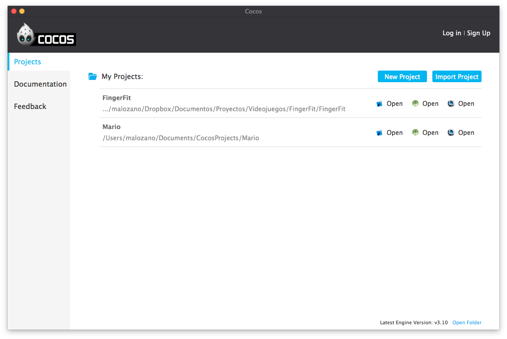

Al crear un nuevo proyecto nos dejará elegir:

* **Nombre del proyecto**. 
* **Ruta del directorio de proyectos**. Ruta del disco donde se almacenará el proyecto Cocos2d-x. Será un directorio con el nombre indicado en el campo anterior.
* **Tipo de motor**. Podemos elegir si queremos que nuestro proyecto integre los fuentes de la librería de Cocos2d-x, o sólo los binarios. Con la primera opción la compilación será más lenta, pero nos permitirá hacer cambios en la librería si es necesario.
* **Lenguaje de desarrollo**. Además de C++, podremos también crear videojuegos mediante lenguajes de _script_ como Lua o Javascript.
* **Editor**. Nos permite indicar si queremos utilizar _Cocos Studio_ para la edición visual de las escenas.
* **SDKs**. Nos permite incluir _plugins_ adicionales para integrar servicios nativos de la plataforma o servicios de terceros, como por ejemplo redes sociales o analíticas.

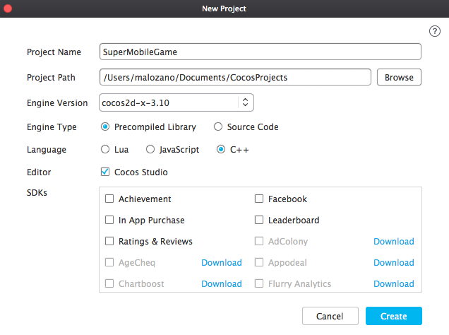


### Creación del proyecto desde la terminal

Tanto si tenemos el _kit_ completo como sólo el _framework_, tendremos la opción de crear un nuevo proyecto desde la terminal. 

Al descargar y descomprimir Cocos2d-x, veremos en el directorio raiz de la libreria un script llamado `setup.py`. Este hay que ejecutarlo una vez después de haber descomprimido la libreria (si utilizamos el instalador esto se hará de forma automática). Este mismo script nos introducira en nuestro fichero `~/.profile` las rutas necesarias para utilizar la libreria desde línea de comandos. De manera manual podríamos cargar dichas variables mediante el comando  `source ~/.profile`, pero eso se realizará de manera automática cada vez que abramos una nueva terminal. 

De esta manera tendremos acceso a un script llamado `cocos`que permite entre otras cosas crear la plantilla para un nuevo proyecto Cocos2d-x multiplataforma. 
Deberemos proporcionar la siguiente información:

```bash
cocos new MiJuego   -p es.ua.dccia 
                    -l cpp
                    -d MisProyectosCocos
```

Esto nos creará un proyecto (carpeta) `MiJuego` en la subcarpeta `MisProyectosCocos` del directorio donde nos encontremos. El lenguaje utilizado será C++ (`-l cpp`). La plantilla del nuevo proyecto será la misma para todos los sistema soportados. Por ejemplo, si queremos
trabajar con la versión de iOS, dentro del directorio de nuestro proyecto entraremos en la
subcarpeta `proj.ios_mac` y abriremos el proyecto Xcode. Todas las plataformas
comparten los mismos directorio de clases (`Classes`) y recursos (`Resources`) 
de nuestro juego. Sólo cambian los ficheros de configuración del proyecto que los "envuelve".

Podremos de esta forma crear un nuevo proyecto que contendrá la base para implementar un videojuego
que utilice las librerías de Cocos2d-x. 
El elemento central de este motor es un _singleton_ de tipo `Director`, al que 
podemos acceder de la siguiente forma:

```cpp
Director::getInstance()
```


## Tipos de datos

Como hemos comentado, Cocos2d-x proviene del motor Cocos2d para iOS. Este motor estaba 
implementado en Objective-C, sobre la API Cocoa Touch, y por lo tanto estaba muy vinculado
a sus tipos de datos. 

Por este motivo Cocos2d-x implementa sus propios tipos de datos equivalentes a los de 
Cocoa Touch para poder trabajar de la misma forma. Vamos a ver cuáles son estos tipos de datos.

Por un lado tenemos la clase `Ref`. Todos los objetos de la librería
heredan en última instancia de esta clase. En ella se define por ejemplo el mecanismo de
gestión de memoria que utilizan todos los objetos de la librería.

Tenemos una serie de colecciones como `Vector<>`, `Map<>` especiales de Cocos2d-x que tienen en cuenta su modelo particular de memoria, pero con los que podremos utilizar la sintaxis de C++ para este tipo de colecciones. También tenemos los tipos `Value`, `ValueVector` y `ValueMap` para la representación de estructuras de datos, que nos permiten por ejemplo cargar ficheros `.plist` de forma automática. El primero de ellos es un _wrapper_ que permite almacenar tipos básicos (`bool`, `int`, `string`, etc) o complejos, mientras que los otros dos representan las listas y diccionarios respectivamente.

Encontramos también una serie de tipos de datos geométricos: `Point`, 
`Rect` y `Size`. Estos tipos de datos incorporan también algunas
operaciones, por ejemplo para comprobar si dos rectángulos intersectan.


## Componentes de un videojuego

Cuando diseñemos un juego deberemos identificar las distintas entidades 
  que encontraremos en él. Normalmente en los juegos  
  2D tendremos una pantalla del juego, que tendrá un fondo y una serie 
  de personajes u objetos que se mueven en este escenario. Estos objetos que se 
  mueven en el escenario se conocen como _sprites_. Además, tendremos 
  un motor que se encargará de conducir la lógica interna del juego. 
  Podemos abstraer los siguientes componentes:

* **Sprites**: Objetos o personajes que pueden moverse por la 
    pantalla y/o con los que podemos interactuar. 
  
* **Fondo**: Escenario de fondo, normalmente estático, 
    sobre el que se desarrolla el juego. Muchas veces tendremos un escenario más 
    grande que la pantalla, por lo que tendrá _scroll_ para que 
    la pantalla se desplace a la posición donde se encuentra nuestro personaje.
  
* **Pantalla**: En la pantalla se muestra la escena del juego. 
    Aquí es donde se deberá dibujar todo el contenido, tanto el 
    fondo como los distintos _sprites_ que aparezcan en la escena y otros 
    datos que se quieran mostrar.
  
* **Motor del juego**: Es el código que implementará 
    la lógica del juego. En él se leerá la entrada del usuario, 
    actualizará la posición de cada elemento en la escena, comprobando 
    las posibles interacciones entre ellos, y dibujará todo este contenido 
    en la pantalla.


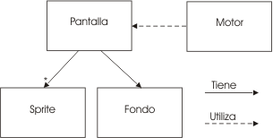
 


<!-- 
A continuación veremos con más detalle cada uno de estos componentes, 
  viendo como ejemplo las clases de Cocos2D con las que podemos implementar cada una de ellas.
 -->
A continuación veremos cómo implementar con Cocos2d-x cada uno de estos componentes.


## Pantallas

En el juego tenemos diferentes pantallas, cada una con un comportamiento distinto. La principal
será la pantalla en la que se desarrolla el juego, aunque también encontramos otras pantallas
para los menús y otras opciones. También podemos referirnos a estas pantallas como escenas o
estados del juego. Las más usuales son las siguientes:

* **Pantalla de presentación (_Splash screen_)**. 
    Pantalla que se muestra cuando cargamos el juego, con el logo de la compañía 
    que lo ha desarrollado y los créditos. Aparece durante un tiempo breve 
    (se puede aprovechar para cargar los recursos necesarios en este tiempo), 
    y pasa automáticamente a la pantalla de título.
  
* **Título y menú**. Normalmente tendremos una 
    pantalla de título principal del juego donde tendremos el menú 
    con las distintas opciones que tenemos. Podremos comenzar una 
    nueva partida, reanudar una partida anterior, ver las puntuaciones más 
    altas, o ver las instrucciones. No debemos descuidar el aspecto de los menús 
    del juego. Deben resultar atrativos y mantener
la estética deseada para nuestro videojuego. El juego es un producto en el que debemos cuidar
todos estos detalles.
  
* **Puntuaciones y logros**. Pantalla de puntuaciones más altas obtenidas. 
    Se mostrará el _ranking_ de puntuaciones, donde aparecerá 
    el nombre o iniciales de los jugadores junto a su puntuación obtenida.
    Podemos tener _rankings_ locales y globales. Además también podemos tener 
    logros desbloquables al conseguir determinados objetivos, que podrían darnos acceso
    a determinados "premios".  
  
* **Instrucciones**. Nos mostrará un texto, imágenes o vídeo con las instrucciones 
    del juego. También se podrían incluir las instrucciones en el propio juego, a modo de tutorial.
  
* **Juego**. Será la pantalla donde se desarrolle el juego, 
    que tendrá normalmente los componentes que hemos visto anteriormente.

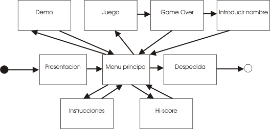


## Escena 2D

En Cocos2D cada pantalla se representa mediante un objeto de tipo `Scene`.
  En la pantalla del juego se dibujarán todos los elementos necesarios (fondos, _sprites_, etc) para construir 
  la escena del juego. De esta manera tendremos el fondo, nuestro personaje, los 
  enemigos y otros objetos que aparezcan durante el juego, además de marcadores 
  con el número de vidas, puntuación, etc. Todos estos elementos se representan
  en Cocos2D como nodos del tipo `Node`. La escena se compondrá de una
  serie de nodos organizados de forma jerárquica. Entre estos nodos podemos encontrar
  diferentes tipos de elementos para construir la interfaz del videojuego, como etiquetas
  de texto, menús, _sprites_, fondos, etc. Otro de estos tipos de nodos son las capas.

La escena se podrá componer de una o varias capas. Los _sprites_ y fondos 
  pueden organizarse en diferentes capas para construir la escena. Todas las capas 
  podrán moverse o cambiar de posición, para mover de esta forma 
  todo su contenido en la pantalla. Pondremos varios elementos en una misma capa
  cuando queramos poder moverlos de forma conjunta.

Las capas en Cocos2D se representan mediante la clase `Layer` o `Node` (en las últimas versiones del motor las diferencias entre ambas clases son mínimas, y se recomienda organizar el juego mediante nodos). Las escenas
podrán componerse de una o varias capas, y estas capas contendrán los distintos nodos
a mostrar en pantalla, que podrían ser a su vez otras capas. Es decir, la escena
se representará como un grafo, en el que tenemos una jerarquía de nodos, en la que
determinados nodos, como es el caso de la escena o las capas, podrán contener otros nodos.
Este tipo de representación se conoce como **escena 2D**.


Normalmente para cada pantalla del juego tendremos una capa principal, y encapsularemos
el funcionamiento de dicha pantalla en una subclase de `Layer`, por ejemplo:

```cpp
class MenuPrincipal : public cocos2d::Layer
{
public:
    virtual bool init();
    
    static cocos2d::Scene* scene();
    
    CREATE_FUNC(MenuPrincipal);
};
```

Crearemos la escena a partir de su capa principal. Todos los nodos, incluyendo
la escena, se instanciarán mediante el método de factoría `create`. 
Este método de factoría se genera de forma estática con la macro `CREATE_FUNC`, por
ese motivo está declarada en la interfaz de clase anterior. Podemos añadir
un nodo como hijo de otro nodo con el método `addChild`:

```cpp
Scene* MenuPrincipal::scene()
{
    Scene *scene = Scene::create();
    MenuPrincipal *layer = MenuPrincipal::create();
    scene->addChild(layer, 0);    
    return scene;
}
```

Cuando instanciamos un nodo mediante el método de factoría `create`, llamará
a su método `init` para inicializarse. Si sobrescribimos dicho método en la capa
podremos definir la forma en la que se inicializa:

```cpp
bool MenuPrincipal::init()
{
    // Inicializar primero la superclase
    if ( !Layer::init() )
    {
        return false;
    }
 
    // Inicializar componentes de la capa
    ...

	return true;
}
```

El orden en el que se mostrarán las capas es lo que se conoce como orden Z, 
  que indica la profundidad de esta capa en la escena. La primera capa será 
  la más cercana al punto de vista del usuario, mientras que la última 
  será la más lejana. Por lo tanto, las primeras capas que añadamos 
  quedarán por delante de las siguientes capas. Este orden Z se puede controlar
  mediante la propiedad `zOrder` de los nodos.


## Transiciones entre escenas

Mostraremos la escena inicial del juego con el método `runWithScene` del director:

```cpp
Director::getInstance()->runWithScene(MenuPrincipal::scene());
```

Con esto pondremos en marcha el motor del juego mostrando la escena indicada. Si el motor
ya está en marcha y queremos cambiar de escena, deberemos hacerlo con el método
`replaceScene`:

```cpp
Director::getInstance()->replaceScene(Puntuaciones::scene());
```

También podemos implementar transiciones entre escenas de forma animada utilizando como escena
una serie de clases todas ellas con prefijo `Transition-`, que heredan de `TransitionScene`,
que a su vez hereda de `Scene`. Podemos mostrar una transición animada reemplazando la
escena actual por una escena de transición:

```cpp
Scene *puntuacionesScene = Puntuaciones::scene();
TransitionCrossFade *transition = 
    TransitionCrossFade::create(0.5, gameScene);
Director::getInstance()->replaceScene(transition);
```

Podemos observar que la escena de transición se construye a partir de la duración de la 
transición, y de la escena que debe mostrarse una vez finalice la transición.


## Interfaz de usuario

Encontramos distintos tipos de nodos que podemos añadir a la escena para crear nuestra interfaz de
usuario, como por ejemplo menús y etiquetas de texto, que nos pueden servir por ejemplo para mostrar
el marcador de puntuación, o el mensaje _Game Over_. 

Tenemos dos formas alternativas de crear una etiqueta de texto:


* Utilizar una fuente _TrueType_ predefinida.
* Crear nuestro propio tipo de fuente _bitmap_.


La primera opción es la más sencilla, ya que podemos crear la cadena directamente a partir de un tipo
de fuente ya existen y añadirla a la escena con `addChild` (por ejemplo añadiéndola como hija
de la capa principal de la escena). Se define mediante la clase `LabelTTF`:

```cpp
LabelTTF* label = LabelTTF::create("Game Over", "Arial", 24);
this->addChild(label);
```

Sin embargo, en un videojuego debemos cuidar al máximo el aspecto y la personalización de los gráficos.
Por lo tanto, suele ser más adecuado crear nuestros propios tipos de fuentes. La mayoría de motores de
videojuegos soportan el formato `.fnt`, con el que podemos definir fuentes de tipo
_bitmap_ personalizadas. Para crear una fuente con dicho formato podemos utilizar herramientas
como **Angel Code** o **Hiero** (http://www.n4te.com/hiero/hiero.jnlp).
Una vez creada la fuente con este formato, podemos mostrar una cadena con dicha fuente mediante
la clase `LabelBMFont`:

```cpp
LabelBMFont *label = LabelBMFont::create("Game Over", "fuente.fnt");
this->addChild(label);
```

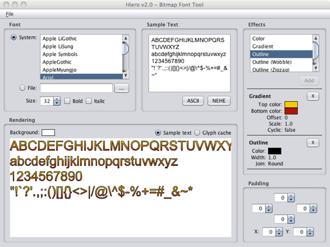


Por otro lado, también podemos crear menús de opciones. Normalmente en la pantalla principal del juego
siempre encontraremos un menú con todas las opciones que nos ofrece dicho juego. Los menús se crean con
la clase `Menu`, a la que añadiremos una serie de _items_, de tipo `MenuItem` (o subclases suyas), 
que representarán las opciones del menú. Estos _items_ pueden ser etiquetas de texto, pero también
podemos utilizar imágenes para darles un aspecto más vistoso. El menú se añadirá a la escena como cualquier
otro tipo de _item_:

```cpp
MenuItemImage *item1 = MenuItemImage::create(
      "nuevo_juego.png", "nuevo_juego_selected.png", CC_CALLBACK_1(MenuPrincipal::menuNuevoJuegoCallback, this));
      
MenuItemImage *item2 = MenuItemImage::create(
      "continuar.png", "continuar_selected.png", CC_CALLBACK_1(MenuPrincipal::menuContinuarCallback, this));

MenuItemImage *item3 = MenuItemImage::create(
      "opciones.png", "opciones_selected.png", CC_CALLBACK_1(MenuPrincipal::menuOpcionesCallback, this));
  
Menu* menu = Menu::create(item1, item2, item3, NULL);
menu->alignItemsVertically();    

this->addChild(menu);  
```

Vemos que para cada _item_ del menú añadimos dos imágenes. Una para su estado normal, y otra
para cuando esté pulsado. También propocionamos la acción a realizar cuando se pulse sobre cada opción,
mediante un par _target-selector_: el _target_ es el objeto sobre el que se 
va a llamar a la acción (normalmente nuestro propio objeto `this`), y el _selector_ es la forma de indicar
el método al que se va a invocar. Los métodos indicados como _selectores_ de tipo menú
deberán tener la siguiente forma:

```cpp
void MenuPrincipal::menuNuevoJuegoCallback(Ref* pSender)
{
    Director::getInstance()->replaceScene(Game::scene());
}
```

Una vez creadas las opciones, construirmos un menú a partir de ellas,
organizamos los _items_ (podemos disponerlos en vertical de forma automática como vemos en el ejemplo), y
añadimos el menú a la escena.


## Gestión de la memoria

La memoria en Cocos2d-x se gestiona mediante cuenta de referencias, siguiendo el mismo
mecanismo de gestión de memoria que utiliza Cocos2d al estar implementado en Objective-C. 
Este mecanismo consiste en que los objetos de la librería (todos aquellos derivan de
`Ref`) tienen un contador de referencias que existen hacia ellos. 
Cuando el contador de referencias llegue a cero, el objeto se eliminará de memoria.

Al instanciar un objeto (con `new`) el objeto se crea con 1 referencia.
Podemos incrementar el número de referencias sobre un objeto llamando a su método 
`retain`, y decrementarlo llamando a `release`. Deberemos asegurarnos
de que el número de llamadas a `new`/`retain` sobre un objeto sea
igual al número de llamadas a `release`. Si el primero fuese superior al segundo, 
entonces tendríamos una fuga de memoria. Si fuese inferior tendríamos un error de acceso a 
memoria cuando intentemos decrementar las referencias de un objeto que ha sido ya liberado. 
Si no organizamos bien el código de gestión de memoria puede ser complicado garantizar que
el número de llamadas esté equilibrado. Para evitar este problema la regla fundamental es
que la unidad que incremente el número de referencias (`new`/`retain`) 
será responsable de decrementarlo (`release`). Vemos a continuación con mayor
detalle las implicaciones que esta regla tiene en el uso de la librería:


* Cuando instanciamos un nodo con el método factoría `create` este método
crea una referencia, pero él mismo es responsable de eliminarla. Para conseguir esto
lo que hace es dejar programado que la referencia se librere automáticamente cuando
termine la llamada de la función en la que estamos. Es decir, si nadie retiene el objeto
que nos ha devuelto el objeto será eliminado de memoria automáticamente.

* Cuando añadimos un nodo como hijo de otro en la escena 2D, o cuando se añade a otras 
estructuras como el director, o alguna de las cachés de objetos que gestiona el motor, estas
estructuras se encargar de retener el objeto en memoria, y cuando se elimine de ellas 
lo liberarán. Es decir, podemos por ejemplo crear un nodo con `create` 
y en ese momento añadirlo como hijo a otro con `addChild`, y no tendremos 
que preocuparnos de retenerlo ni de liberarlo. El propio grafo de la escena será
el encargado de gestionar la memoria.

* Si queremos guardar un nodo como campo de nuestro objeto, tras instanciarlo con 
`create` deberemos reternarlo con `retain` para que no se
libere automáticamente. Nosotros seremos responsables de liberarlo, por lo que 
deberemos llamar a `release` sobre dicho campo cuando nuestro objeto
sea destruido, o cuando vayamos a cambiar el valor del campo y el antiguo deba ser
liberado. 

<!--

## Creación de la interfaz con CocosBuilder

Hemos visto cómo crear la interfaz para los menús de nuestro juego de forma programática con Cocos2D. 
Sin embargo, puede resultar algo complejo diseñar las interfaces de esta forma, ya que normalmente tendremos que 
probar distintas disposiciones de elementos en la pantalla, y ver cómo queda cada una de ellas. Esto
implicará cambiar en el código la posición de cada elemento, y volver a ejecutar para ver el efecto, lo
cual resulta poco productivo.

Para resolver este problema contamos con la herramienta CocosBuilder, que nos permite crear las
interfaces para los videojuegos de forma visual, haciendo mucho más sencillo el diseño de estas pantallas. 
La herramienta es gratuita y podemos descargarla de la siguiente URL:

```
http://cocosbuilder.com
```


### Creación de un proyecto

Una vez ejecutamos la aplicación, deberemos crear un nuevo proyecto. Crearemos en el disco un nuevo directorio
para el proyecto, y dentro de CocosBuilder seleccionaremos la opción _File > New > New Project ..._, 
y crearemos el nuevo proyecto en el directorio que hemos creado para él. Veremos que crea un fichero con extensión
`.ccbproj`, otro con extensión `.ccb`  y una serie de recursos predefinidos para el proyecto.

El fichero `.ccbproj` es el que contiene la definición del proyecto (es el que deberemos abrir
cuando queramos volver a abrir nuestro proyecto en CocosBuilder). Dentro del proyecto tendremos uno o varios
ficheros `.ccb`. Estos ficheros contendrán cada una de las pantallas u otros objetos del juego
que diseñemos con la herramienta. Por defecto nos habrá creado un fichero `HelloCocosBuilder.ccb`
que contiene una pantalla (`CCLayer`) de ejemplo.

Podemos crear nuevas pantallas u objetos si seleccionamos _File > New > New File ..._. Al hacer esto
nos preguntará el tipo de nodo raíz que queremos tener. En caso de querer crear una pantalla, utilizaremos
`CCLayer` y marcaremos la casilla para que la capa ocupe toda la pantalla del dispositivo. Además,
podemos especificar a qué tipos de dispositivos se podrá adaptar esta pantalla (tanto iOS como Android).

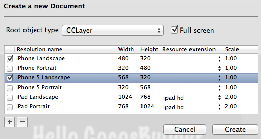

Una vez creado un documento de tipo `CCLayer` a pantalla completa, veremos en el editor la pantalla
del dispositivo, a la que podremos añadir diferentes elementos de forma visual. Podemos cambiar de dispositivo
con la opción _View > Resolution_.


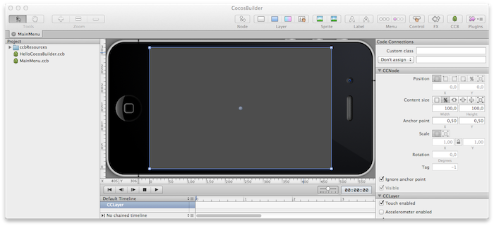


### Añadir nodos

En la parte superior del editor vemos los distintos tipos de objetos que podemos añadir a la pantalla:


* _Node_: Permite añadir nodos genéricos al grafo de la escena
* _Layer_: Permite añadir diferentes tipos de capas a la escena (derivadas de `CCLayer`), con color sólido, gradiente o _scroll_.
* _Sprite_: Nos será de utilidad para añadir imágenes. Con este elemento podemos incluso definir a los diferentes personajes del juego desde este entorno, aunque esto normalmente lo haremos de forma programada.
* _Label_: Permite añadir etiqueta de texto de tipo _TrueType_ o _BMFont_.
* _Menu_: Permite añadir un menú de opciones y los _items_ del menú (mediante imágenes).
* _Control_: Permite añadir botones independientes.
* _FX_: Permite añadir efectos de partículas (fuego, nieve, humo, etc).
* _CCB_: Permite añadir el contenido de otros fichero `.ccb` a la pantalla.


Cuando añadimos un nuevo elemento y lo seleccionamos en la parte derecha del editor veremos sus propiedades,
y podremos modificar su posición, ángulo o escala. Encontramos diferentes formas de especificar la posición
y tamaño de los objetos (vemos una serie de botones para ajustar esto). Por ejemplo, la posición la podemos
hacer relativa a una de las 4 esquinas de la pantalla, puede darse mediante un porcentaje en función del tamaño
de la pantalla, o podemos hacer que varíe según la escala asignada al tipo de dispositivo (estos datos los
especificaremos manualmente a la hora de cargar el documento desde nuestro juego).

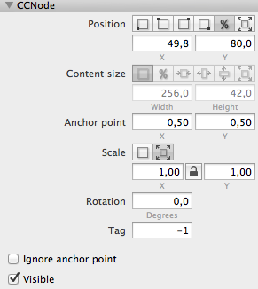


Vemos también que podemos especificar un _anchor point_. Este punto se especifica en coordenadas
relativas al tamaño del objeto ([0..1], [0..1]). Es decir, si ponemos (0.5, 0.5) hacemos referencia al 
punto central del objeto, independientemente de su tamaño. Con esto indicamos el punto del objeto que se
tomará como referencia a la hora de posicionarlo.

Según el tipo de nodo que tengamos seleccionado, podremos modificar en este panel una serie de propiedades
adicionales. Por ejemplo, en caso de un nodo de tipo etiqueta, deberemos indicar también la fuente y el
texto a mostrar. Si utilizamos una fuente de tipo _bitmap_, deberemos copiar los recursos de dicha 
fuente a nuestro proyecto para poder seleccionarlos en dicho panel. Esto lo haremos directamente copiando los recursos al directorio del proyecto
(no se hace desde dentro de la herramienta), y lo mismo haremos para borrar recursos. Una vez copiados los 
recursos, CocosBuilder los reconocerá automáticamente y podremos seleccionarlos en determinadas propiedades
de los nodos.


### Animar nodos

Con CocosBuilder también podemos definir animaciones basadas en fotogramas clave. Para crear estas animaciones
estableceremos los valores de las diferentes propiedades de los objetos en distintos instantes de tiempo
(posición, ángulo, escala). Estos son los denominados fotogramas clave (_keyframes_). El resto
de fotogramas se generarán de forma automática por interpolación.

Para crear un fotograma clave seleccionaremos el nodo que queramos animar y tras esto entraremos en el
menú _Animation > Insert Keyframe_. Veremos que 
podemos insertar distintos tipos de fotogramas clave, según la propiedad que queramos animar (posición, 
rotación, escala, etc). Al insertar un fotograma clave, lo veremos en la parte inferior del entorno, junto
al nodo seleccionado (podemos desplegar el nodo para ver los fotogramas clave para cada propiedad). Podemos
insertar varios fotogramas clave y moverlos en la escala de tiempo.

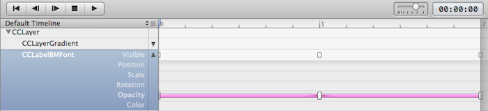


Haciendo _doble click_ sobre uno de los fotogramas clave lo seleccionaremos y podremos editar sus
propiedades en el panel de la derecha. Podremos reproducir la animación en el entorno para ver el efecto conseguido.
Por defecto el _timeline_ es de 10 segundos (espacio de tiempo total para definir las animaciones), pero
podemos modificarlo pulsando sobre el icono junto al texto _Default Timeline_. De esta forma se abrirá
un menú desde el cual podremos cambiar su duración o definir diferentes _timelines_.


### Conexiones con el código

Antes de poder probar la pantalla en nuestro juego Cocos2D, deberemos establecer la relación entre la
pantalla creada y las clases de nuestro juego, de forma similar al _File's Owner_ de iOS. Para ello
seleccionaremos el objeto raíz `CCLayer` y en el campo _Custom class_ del panel lateral
derecho especificaremos el nombre de la clase en la que cargaremos dicha pantalla. Con esto, cuando carguemos
esta pantalla desde el juego automáticamente instanciará la clase que hayamos indicado. Esta clase
se conocerá como _document root_.

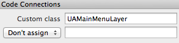


Si hemos definido también un menú con botones, deberemos conectar el evento de pulsación de estos botones
con nuestro código. Para ello seleccionaremos el botón para el que queremos definir el evento, y en su panel
de propiedades especificamos el nombre del método con el que queremos conectarlo.

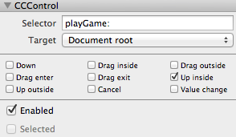


Deberemos implementar dicho método en la clase que hará de _document root_.

```cpp
class UAMainMenuLayer : public CCLayer
{
    public:
       ...    
       void playGame(CCObject * pSender, CCControlEvent pCCControlEvent);
       ...
}
```


### Cargar el diseño en el juego

Cuando queramos trasladar el diseño que hemos creado con CocosBuilder a nuestro juego Cocos2D, deberemos
publicarlo con la opción _File > Publish_. Esto generará en el directorio del proyecto un fichero
`.ccbi` por cada fichero `.ccb`. Estos ficheros `.ccbi` serán los que deberemos
copiar a Xcode.

Además de los ficheros `.ccbi`, deberemos copiar al proyecto todos los recursos utilizados
y las librerías de clases necesarias para cargar este tipo de ficheros. Estas últimas librerías se obtendrán
de los ejemplos publicados en la página de CocosBuilder.

Si descargados y descomprimimos el fichero de ejemplos (_CocosBuilder Examples_), veremos un directorio
_Add to Your Project_. Deberemos copiar el contenido de este directorio a nuestro proyecto Cocos2D.

Una vez hecho esto, podremos cargar la pantalla de la siguiente forma:

```cpp
#include "cocos-ext.h"

...

CCNodeLoaderLibrary* nodeLoaderLibrary = 
    CCNodeLoaderLibrary::newDefaultCCNodeLoaderLibrary();
CCBReader* ccbReader = new CCBReader(nodeLoaderLibrary);
 
CCScene *scene = 
    ccbReader->createSceneWithNodeGraphFromFile("MainMenu.ccbi");

CCDirector::sharedDirector()->runWithScene(scene);

delete ccbReader;
```

Si hemos especificado la posición o tamaño de los objetos en función de la resolución o escala del
dispositivo, al cargar el fichero deberíamos especificar esta información:

```cpp
CCSize screenSize = CCSizeMake(480.0f, 320.0f);
ccbReader->setResolutionScale(1.0);
CCScene *scene = 
    ccbReader->createSceneWithNodeGraphFromFile("MainMenu.ccbi", 
                                                NULL, 
                                                screenSize);
```

-->
