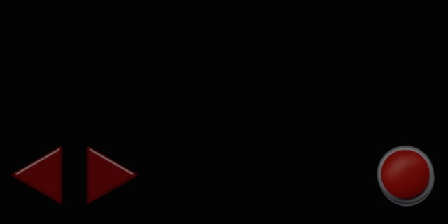
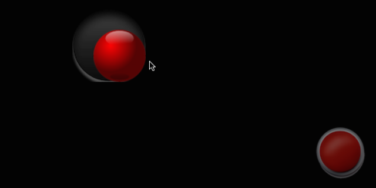
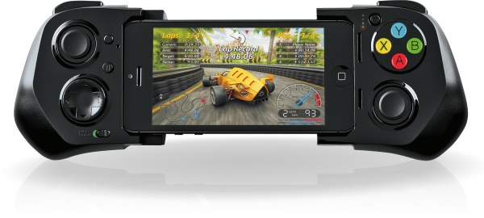
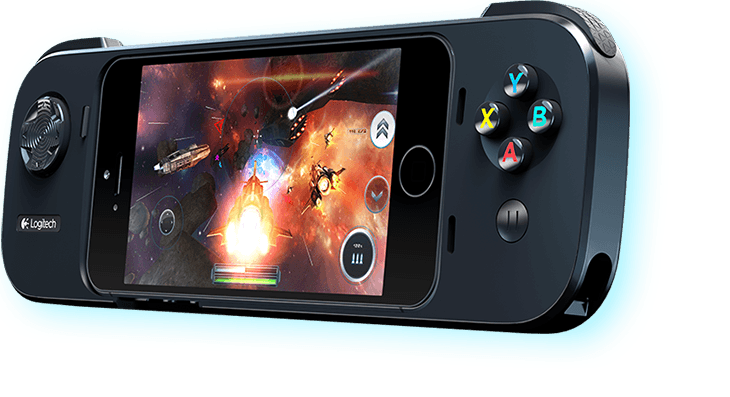
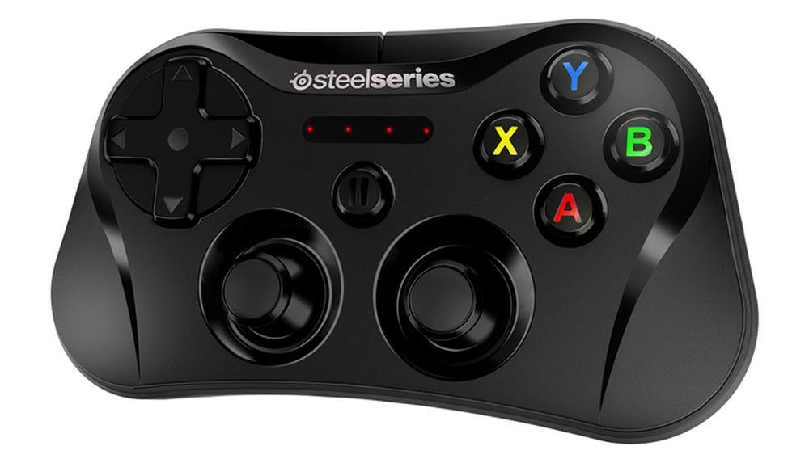
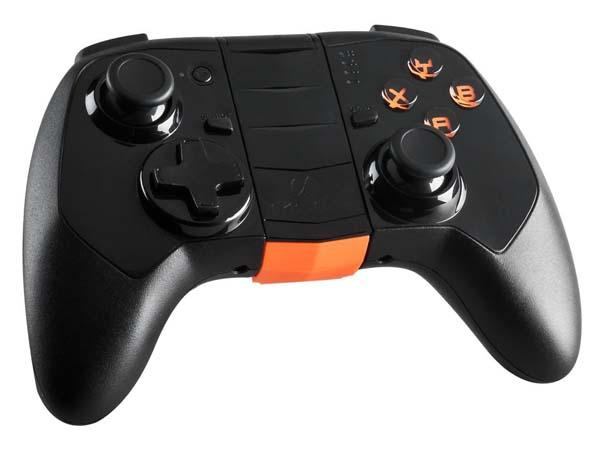
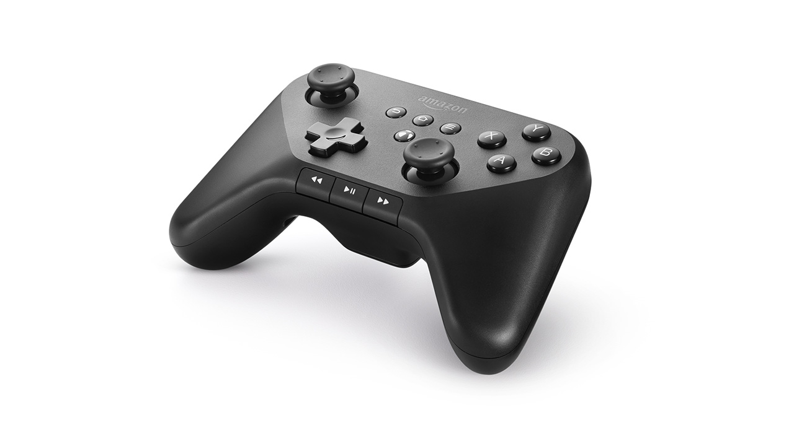
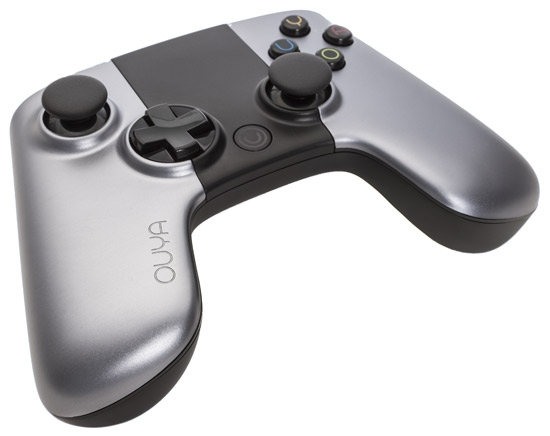
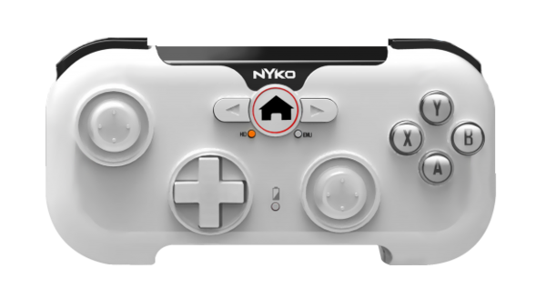
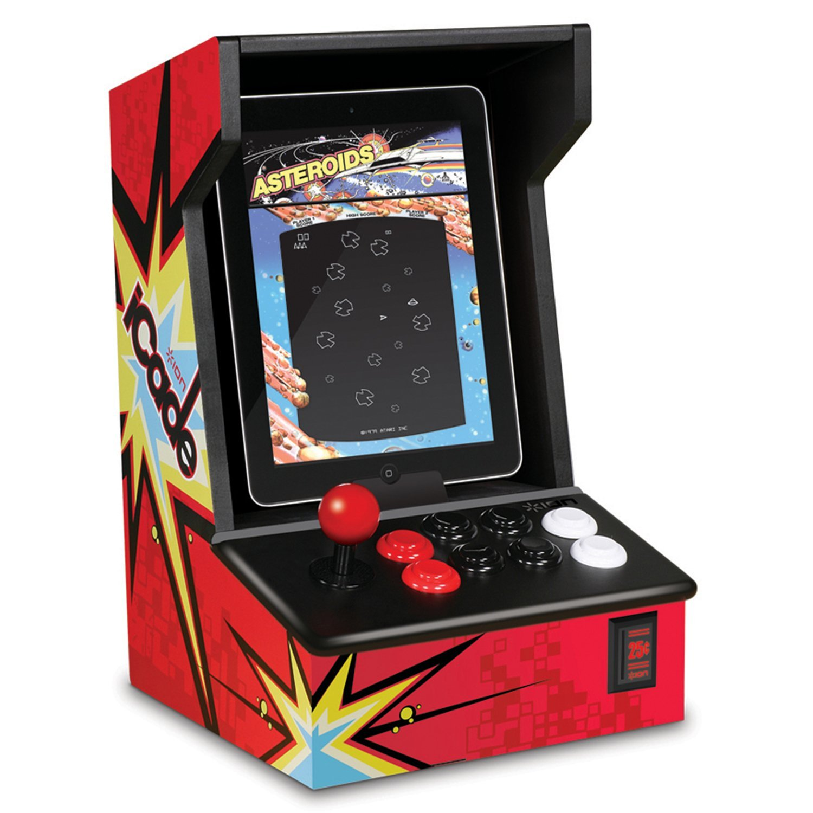

# Controles del videojuego

La principal forma de control del móvil es la pantalla táctil, por lo que los videojuegos diseñados específicamente para móviles normalmente se adaptan a esta forma de entrada. Encontramos también algunos juegos diseñados para ser manejados mediante el acelerómetro. Sin embargo, cuando se quiere trasladar a móvil un juego diseñado originalmente para otro sistema en el que contamos con teclado, ratón o _joystick_ deberemos adaptar su forma de manejo, ya que en la mayoría de casos no contamos con dichos mecanismos de entrada en móviles. 

Vamos a ver los diferentes mecanismos de entrada que podemos utilizar en los videojuegos para móviles, y una serie de buenas prácticas a la hora de implementar el control de estos videojuegos.

## Teclado en Cocos2d-x
 
Cocos2d-x soporta eventos de teclado, pero éstos no funcionan en plataformas móviles. Aunque nuestro proyecto esté orientado exclusivamente a estas plataformas, si el control de nuestro juego se realiza mediante mando es recomendable que implementemos también la posibilidad de controlarlo mediante teclado. Esto será de gran utilidad durante el desarrollo, ya que no existe forma de emular un mando, y la forma más parecida al mando para manejar nuestro juego en las pruebas que hagamos durante el desarrollo es el control mediante teclado. 
 
Para leer los eventos de teclado desde Cocos2d-x podemos utilizar la clase `EventListenerKeyboard` como se muestra a continuación: 

```cpp
bool MiEscena::init()
{
    if ( !Layer::init() )
    {
        return false;
    }       
    
    configuraTeclado();

    return true;
}

void MiEscena::configurarTeclado()
{
    _listener = EventListenerKeyboard::create();

    // Registramos callbacks
    _listener->onKeyPressed = CC_CALLBACK_2(MiEscena::onConnectController,this);
    _listener->onReleased = CC_CALLBACK_2(MiEscena::onDisconnectedController,this);

    // Añadimos el listener el mando al gestor de eventos
    _eventDispatcher->addEventListenerWithSceneGraphPriority(_listener, this);
}

void MiEscena::onKeyDown(EventKeyboard::KeyCode code, Event *event) { }   

void MiEscena::onKeyUp(EventKeyboard::KeyCode code, Event *event) { }
```

Por ejemplo, para reconocer los controles izquierda-derecha mediante las teclas A-D podríamos escribir los métodos `onKeyDown` y `onKeyUp` como se muestra a continuación:

```cpp
void MiEscena::onKeyDown(EventKeyboard::KeyCode code, Event *event) { 
    switch(keyCode){
        case EventKeyboard::KeyCode::KEY_A:
            _izquierdaPulsado = true;
            break;
        case EventKeyboard::KeyCode::KEY_D:
            _derechaPulsado = true;
            break;
    }
}  

void MiEscena::onKeyUp(EventKeyboard::KeyCode code, Event *event) { 
    switch(keyCode){
        case EventKeyboard::KeyCode::KEY_A:
            _izquierdaPulsado = false;
            break;
        case EventKeyboard::KeyCode::KEY_D:
            _derechaPulsado = false;
            break;
    }
}  
```

## Pantalla táctil

Como hemos comentado, es el mecanismo más habitual de entrada en los videojuegos para móviles. En muchos tipos de videojuegos esta es la forma de control más natural. Por ejemplo, tenemos _puzzles_ en los que tenemos que interactuar con diferentes elementos del escenario tocando sobre ellos. También en el género _tower defense_ resulta natural posicionar nuestras diferentes unidades tocando sobre la pantalla, o de forma más amplia en el género de la estrategia interactuar con nuestros recursos y unidades pulsando sobre ellos.

La pantalla táctil tiene ciertas similitudes con el control mediante ratón, pudiendo trasladar muchos juegos que originalmente se controlaban mediante ratón a dispositivos táctiles. Sin embargo, debemos tener en cuenta algunas diferencias importantes. Los juegos en los que el ratón se utiliza para el control de la cámara y para apuntar deslizándolo (como es el caso fundamentalmente de los _First Person Shooters_), encontraremos una pérdida al pasarlos a la pantalla táctil, y no será trivial implementarlo de forma correcta. Sin embargo, aquellos en los que se utilice para seleccionar elementos mediante el puntero ganarán con la pantalla táctil, ya que será más rápido pulsar sobre estos elementos con el dedo que tener que deslizar el puntero del ratón. Además, tenemos que tener en cuenta una ventaja muy importante de la pantalla táctil sobre el ratón: es multitáctil. Esto quiere decir que podemos tener al mismo tiempo varios contactos en pantalla, cosa que con el ratón no es posible. Esto nos da un gran abanico de posibilidades a la hora de implementar el control en nuestros videojuegos.

### Pantalla táctil en Cocos2d-x

Vamos a ver la forma de implementar este mecanismo de control en Cocos2d-x. Para la detección de eventos de la pantalla táctil crearemos un _listener_ de tipo `EventListenerTouch`:

Encontramos dos variantes:

* `EventListenerTouchOneByOne`: Procesa los eventos de la pantalla táctil de uno en uno. Cada vez que se reciba un evento será sobre un único contacto (`Touch`). Es más sencillo de implementar, y resultará adecuado para aquellos juegos en los que no necesitemos detectar más de un contacto al mismo tiempo.
* `EventListenerTouchAllAtOnce`: En este caso podremos recibir en cada evento información de varios contactos (recibiremos una lista de objetos `Touch`). Será más complicado de gestionar, pero nos permitirá implementar juegos que hagan uso de la pantalla multitáctil. 

Una vez seleccionado el _listener_ que más nos interese para nuestro videojuego, lo inicializaremos de la siguiente forma:

```cpp
auto listener = EventListenerTouchOneByOne::create();
```

### Eventos de la pantalla táctil en Cocos2d-x

Hablaremos de un **gesto** táctil para referirnos a la secuencia que consiste en tocar sobre la pantalla, deslizar el dedo, y levantarlo de la pantalla. Durante el gesto se producirán tres tipos de eventos:

* `onTouchBegan`: Evento de comienzo de un gesto. En este evento podemos decidir si queremos procesar el resto del gesto o no. En caso de no estar interesados en este gesto ya no recibiremos ningún evento más del mismo (ni de movimiento ni de finalización).
* `onTouchMoved`: Evento de continuación del gesto. Mientras desplacemos el contacto por la pantalla recibiremos eventos de movimiento con sus nuevas coordenadas.
* `onTouchEnded`: Evento de finalización del gesto. Al levantar el dedo de la pantalla el gesto finalizará. 

Podemos indicar _callbacks_ para estos eventos mediante funciones _lambda_, o utilizandos la macro `CC_CALLBACK_2`. 

Comenzamos con el evento de comienzo del gesto. La función _callback_ deberá devolver un _booleano_ indicando si estamos interesados en el gesto o no. Por ejemplo, podemos considerar que nos interesa el gesto si hemos pulsado sobre un determinado _sprite_, y que no nos interesa en caso contrario.  
```cpp
listener->onTouchBegan = [=](Touch* touch, Event* event){
    if(estaSobreSprite(touch)) {
        return true; 
    } else {
        return false; 
    }
};
```

De forma similar definiremos los eventos de movimiento y finalización, aunque en estos casos no deberemos devolver ningún valor:

```cpp
listener->onTouchMoved = [=](Touch* touch, Event* event){
    ...
};

listener->onTouchEnded = [=](Touch* touch, Event* event){
    ...
};
```

### Prioridad de los eventos

Una vez definidos los eventos, añadimos el _listener_ a la escena:

```cpp
m_node->getEventDispatcher()->addEventListenerWithSceneGraphPriority(listener, m_sprite);
```

En este caso `m_node` sería el nodo principal que contiene nuestra escena, y `m_sprite` el nodo que queremos que actúe como objetivo (_target_) de nuestro _listener_. 

Podemos añadir el _listener_  con dos sistemas de prioridad distintos:

* **Prioridad de grafo de la escena**: La prioridad en la que se ejecutan los diferentes _listeners_ viene determinada por el orden de los nodos en el grafo de la escena. El nodo que pasamos como _target_ al añadir el _listener_ será el que determine dicha prioridad. Se ejecutarán antes los eventos definidos sobre nodos que queden delante de otros en la pantalla (es decir, primero aquellos que tengan mayor Z). 
* **Prioridad fija**: En este caso la prioridad se especifica mediante un valor fijo al añadir el _listener_.
 

### Consumo de eventos

Al crear un _listener_ podemos indicar que consuma los eventos:

```cpp
listener->setSwallowTouches(true);
```

Si hacemos esto, en caso de que nuestro _listener_ devuelva `true` en `onTouchBegan` consumirá el evento y éste no pasará a otros _listeners_ de menor prioridad. En caso contrario, el evento se propagará al siguiente _listener_


### Nodo objetivo del _listener_

Hemos visto que al utilizar prioridad basada en el grafo de la escena cada _listener_ tiene un nodo objetivo. Podemos aprovechar esto para utilizar dicho nodo como nodo sobre el que estamos interesados en pulsar:

```cpp
listener->onTouchBegan = [=](Touch* touch, Event* event) {
            
    auto target = static_cast<Sprite*>(event->getCurrentTarget());
    Point locationInNode = target->convertToNodeSpace(touch->getLocation());
            
    Size s = target->getContentSize();
    Rect rect = Rect(0, 0, s.width, s.height);

    if(rect.containsPoint(locationInNode)) {
        return true;
    } else {
        return false;
    }
};
```

Con `Event::getCurrentTarget` podemos obtener el nodo que actúa de _target_. Podemos convertir las coordenadas globales del _touch_ a coordenadas locales del nodo _target_, y en caso de estar dentro del área que ocupa dicho nodo entonces devolvemos `true` para seguir procesando eventos de este gesto. De esta forma podemos hacer por ejemplo que al pulsar sobre nuestro _sprite_ podamos arrastrarlo por la pantalla, mientras que si pulsamos fuera este _listener_ no hará nada. 


### Pantalla multitáctil

Cocos2d-x soporta pantalla multitáctil, pero por defecto se encuentra deshabilitada en iOS. Para habilitar el soporte para recibir varios contactos simultáneos en esta plataforma, deberemos abrir el fichero `AppController.mm` y localizar la siguiente línea:

```objc 
[eaglView setMultipleTouchEnabled:NO];
```

La modificaremos de forma que si que esté habilitado el soporte para múltiples contactos:

```objc 
[eaglView setMultipleTouchEnabled:YES];
```

En Android no será necesario que hagamos nada, el soporte para pantalla multitáctil está habilitado por defecto.


## Acelerómetro

Encontramos también algunos juegos en los que el mecanismo de control más natural es el uso del acelerómetro. Por ejemplo juegos que cambian la gravedad en la escena según la inclinación del móvil, como es el caso de los juegos en los que manejamos una bola a través de un laberinto, o juegos de conducción en los que la inclinación del móvil hace de volante. 

En Cocos2d-x implementaremos soporte para el acelerómetro mediante un _listener_ de tipo `EventListenerAcceleration`. Para que este _listener_ funcione, en primer lugar deberemos activar el uso del acelerómetro:

```cpp
Device::setAccelerometerEnabled(true);
```

Una vez hecho esto, creamos el _listener_ especificando directamente un _callback_ mediante una función _lambda_:

```cpp
auto listener = EventListenerAcceleration::create([=](Acceleration* acc, Event* event) {
   ...
}
```

También podemos utilizar la macro `CC_CALLBACK_2`:

```cpp
auto listener = EventListenerAcceleration::create(CC_CALLBACK_2(Game::onAcceleration, this));
```

```cpp
void Game::onAcceleration(Acceleration* acc, Event* event)
{
    ...
}
```

Por último, añadiremos el _listener_ al gestor de eventos de la escena:

```cpp
m_node->getEventDispatcher()->addEventListenerWithSceneGraphPriority(listener, m_node);
```

Es importante tener en cuenta que en los juegos que se manejen mediante acelerómetro, al no ser necesario tocar la pantalla, no debemos permitir que esta se apague de forma automática por inactividad. Esto no se puede hacer directamente con Cocos2d-x, sino que tendremos que especificarlo de forma nativa para cada plataforma.

## Mandos

Los juegos diseñados para videoconsolas o máquinas recreativas se manejan normalmente mediante _joystick_ o _pad_. Al portar uno de estos juegos a móvil podemos optar por:

* Adaptar el control de videojuego a pantalla táctil. Esto implica grandes cambios en el diseño del juego y en el _gameplay_ y no siempre es posible hacerlo.
* Añadir un _pad_ virtual en pantalla. Permite mantener el mismo mecanismo de control que el juego original, pero resulta más complicado de manejar que con un mando real.
* Añadir soporte para mandos físicos. Nos permitirá trasladar la misma experiencia de juego que la versión de videoconsola/recreativa pero necesita que el usuario cuente con este dispositivo. Se pierde una de las ventajas de los juegos móviles, que es el llevarlos siempre con nosotros.  

Vamos ahora a centrarnos en este tipo de juegos y en la forma de diseñar un control adecuado para ellos. Veremos tanto la forma de incorporar un _pad_ virtual como la forma de añadir soporte para diferentes tipos de mandos físicos. Dentro de estos mandos encontramos tanto mandos soportados por las APIs oficiales de iOS y Android, como mandos con APIs de terceros, como por ejemplo iCade.

### Buenas prácticas para juegos basados en _control pad_

Si queremos implementar un juego cuyo manejo esté basado en _control pad_, será recomendable seguir las siguientes prácticas:

* Permitir el manejo del juego mediante _pad_ virtual en pantalla si no se dispone de mando real.
* Añadir compatibilidad con mandos reales. Se recomienda añadir soporte para las APIs oficiales y para aquellos mandos más utilizados, como iCade.
* En caso de tener conectado un mando real, ocultar el _pad_ virtual para que no moleste en pantalla.
* Respetaremos la función estándar de cada botón. El botón de _pausa_ del mando debe permitir pausar el juego en cualquier momento. Determinados botones se suelen utilizar para realizar las mismas acciones en todos los juegos (saltos, ataque, acción, etc). Deberemos intentar seguir estas convenciones.
* La pantalla del móvil no debe apagarse mientras utilizamos el juego con el mando externo.

## Mandos virtuales

Cuando la mecanica de nuestro juego exige que se controles mediante un mando tradicional, y no contamos con ningún mando _hardware_ que podamos utilizar, la única solución será introducir en nuestro juego un mando virtual en pantalla. 

Vamos a ver diferentes tipos de mandos que podemos implementar en pantalla, emulando controles tanto digitales como analógicos.

### Controles virtuales

Antes de implementar un mecanismo de control concreto, es conveniente generar una estructura de clases que haga de fachada y nos permita implementar el control del videojuego de forma genérica, sin hacer referencia expresa al teclado, mandos físicos, o mandos virtuales. 

En esta sección proponemos un sistema de control virtual basado en herencia. Implementaremos una clase `VirtualControls` que nos dará la información necesaria para leer los controles que necesite nuestro videojuego. Por ejemplo, si necesitamos un _joystick_ analógico con dos ejes (horizontal y vertical) y tres botones digitales, nuestra clase nos dará información sobre estos controles virtuales, sin determinar qué mecanismo concreto se utiliza para implementarlos. Esto será responsabilidad de las subclases de `VirtualControls`, que serán las que implementen el mapeo entre un mecanismo de control concreto y los controles virtuales definidos en `VirtualControls`. De esta forma, simplemente cambiando la subclase de `VirtualControls` que instanciamos podremos cambiar la forma de controlar el videojuego.

Vamos a ver un ejemplo de implementación de sistema genérico de control. En primer lugar definiremos los botones y ejes virtuales que necesitamos reconocer en el videojuego:

```cpp
#define kNUM_BUTTONS  3
#define kNUM_AXIS    2

enum Button {
    BUTTON_ACTION=0,
    BUTTON_LEFT=1,
    BUTTON_RIGHT=2
};

enum Axis {
    AXIS_HORIZONTAL=0,
    AXIS_VERTICAL=1
};
```

En este caso hemos definido tres botones (acción, izquierda y derecha), y dos ejes (horizontal y vertical), aunque podríamos adaptar esto a las necesidades de cada juego. Indicamos mediante constantes el número de botones y ejes, e identificamos cada uno mediante elementos mediante enumeraciones.

Los **botones** tendrán como estado un _booleano_ (pulsado o no pulsado), mientras que los **ejes** tendrán como valor un valor de tipo _float_ entre -1 y 1 (palanca totalmente inclinada en un sentido o en el contrario), y valdrá 0 si está en reposo. 

Mostramos a continuación la estructura completa que podría tener la clase que implemente el _control virtual_:

```cpp
class VirtualControls: public Ref {
public:
    
    bool init();
    
    virtual void preloadResources(){};
    virtual Node* getNode() {return NULL;};
    
    bool isButtonPressed(Button button);
    float getAxis(Axis axis);
    
    std::function<void(Button)> onButtonPressed;
    std::function<void(Button)> onButtonReleased;
    
    // Keyboard controls
    void onKeyPressed(EventKeyboard::KeyCode keyCode, cocos2d::Event *event);
    void onKeyReleased(EventKeyboard::KeyCode keyCode, cocos2d::Event *event);
    
    void addKeyboardListeners(cocos2d::Node *node);

    CREATE_FUNC(VirtualControls);
    
protected:

    bool buttonState[kNUM_BUTTONS];
    float axisState[kNUM_AXIS];
};
```

Como vemos, la clase controla el estado de los botones (pulsados o sin pulsar) y el de los ejes, que oscilará entre `-1` (totalmente a la izquierda) y `1` (totalmente a la derecha). Deberemos poder leer el estado de estos controles virtuales en cualquier momento. Para ello hemos incorporado las propiedades `buttonState` y `axisState`, en las que almacenamos este estado, y proporcionamos los métodos `isButtonPressed` y `getAxis` para consultarlos.

Definimos también los eventos `onButtonPressed` y `onButtonReleased` para los cuales podremos definir _callbacks_. De esta forma podremos tener constancia de que un botón ha sido pulsado o soltado, sin tener que comprobar continuamente su estado.

Además, incluimos la posibilidad de devolver un nodo (método `getNode`) que nos permita pintar controles virtuales en pantalla (de momento estará vacío), y también un método para cargar los recursos necesarios para pintar estos controles (`preloadResources`). Estos métodos se definirán en las subclases de `VirtualControls`.

Vamos a ver a continuación cómo implementar cada método de esta clase. En primer lugar, el método para su inicialización (`init`) simplemente establecerá el estado de los botones a "no pulsado" (`false`) y los ejes en reposo (`0`):

```cpp
bool VirtualControls::init(){
    for(int i=0;i<kNUM_BUTTONS;i++) {
        buttonState[i] = false;
    }
    
    for(int i=0;i<kNUM_AXIS;i++) {
        axisState[i] = 0.0f;
    }
    
    return true;
}
```

También será necesario definir los métodos para poder leer el estado de los controles (botones y ejes):

```cpp
bool VirtualControls::isButtonPressed(Button button) {
    return buttonState[button];
}

float VirtualControls::getAxis(Axis axis) {
    return clampf(axisState[axis], -1.0, 1.0);
}
```

De momento sólo hemos definido en esta clase los controles que se utilizarán en el juego y lo métodos para consultarlos, pero de momento no se ha establecido la forma de darles valor a estos controles. Esto es algo que deberá implementar cada subclase concreta. Sin embargo, para depuración puede ser conveniente poder activar al control por teclado.

Vamos a hacer que la clase base implemente controles de teclado para depuración. En primer lugar actualizamos la definición de la clase `VirtualControls`. Añadimos a ella los _callbacks_ necesarios para recibir los controles de teclado, y un método para activar el control por teclado en nuestro juego (`addKeyboardListeners`):

```cpp
class VirtualControls: public Ref {
public:
    ...    
    
    // Keyboard controls
    void onKeyPressed(EventKeyboard::KeyCode keyCode, cocos2d::Event *event);
    void onKeyReleased(EventKeyboard::KeyCode keyCode, cocos2d::Event *event);
    
    void addKeyboardListeners(cocos2d::Node *node);

    ...
};
```

A continuación, en la implementación de la clase introducimos el código de los _callbacks_ de los eventos de teclado: las teclas _Cursor Izquierda_ y _Cursor Derecha_ modificarán el valor del eje horizontal (al mismo tiempo que el estado de los botones `BUTTON_LEFT` y `BUTTON_RIGHT`), y la tecla espacio modificará el estado del botón `BUTTON_ACTION`:

```cpp
void VirtualControls::onKeyPressed(EventKeyboard::KeyCode keyCode, cocos2d::Event *event){
    
    if(onButtonPressed) {
        if (keyCode == EventKeyboard::KeyCode::KEY_LEFT_ARROW)
        {
            onButtonPressed(Button::BUTTON_LEFT);
            axisState[Axis::AXIS_HORIZONTAL] -= 1.0;
        }
        else if (keyCode == EventKeyboard::KeyCode::KEY_RIGHT_ARROW)
        {
            onButtonPressed(Button::BUTTON_RIGHT);
            axisState[Axis::AXIS_HORIZONTAL] += 1.0;
        }
        else if(keyCode==EventKeyboard::KeyCode::KEY_SPACE)
        {
            onButtonPressed(Button::BUTTON_ACTION);
        }
    }
    
}

void VirtualControls::onKeyReleased(EventKeyboard::KeyCode keyCode, cocos2d::Event *event){
    
    if(onButtonReleased) {
        if (keyCode == EventKeyboard::KeyCode::KEY_LEFT_ARROW)
        {
            onButtonReleased(Button::BUTTON_LEFT);
            axisState[Axis::AXIS_HORIZONTAL] += 1.0;
        }
        else if (keyCode == EventKeyboard::KeyCode::KEY_RIGHT_ARROW)
        {
            onButtonReleased(Button::BUTTON_RIGHT);
            axisState[Axis::AXIS_HORIZONTAL] -= 1.0;
        }
        else if(keyCode==EventKeyboard::KeyCode::KEY_SPACE)
        {
            onButtonReleased(Button::BUTTON_ACTION);
        }
    }
    
}
```

De esta forma mapeamos la lectura del teclado sobre nuestro sistema de control virtual. Debemos añadir también un método que cree el _listener_ necesario para escuchar los eventos de teclado, y programarlo para que avise a los _callbacks_ definidos anteriormente. Esto lo podemos hacer de la siguiente forma:

```cpp
void VirtualControls::addKeyboardListeners(cocos2d::Node *node) {
    //Creo listeners del teclado
    auto listener = cocos2d::EventListenerKeyboard::create();
    listener->onKeyPressed = CC_CALLBACK_2(VirtualControls::onKeyPressed,this);
    Director::getInstance()->getEventDispatcher()
       ->addEventListenerWithSceneGraphPriority(listener, node);
    
    listener = cocos2d::EventListenerKeyboard::create();
    listener->onKeyReleased = CC_CALLBACK_2(VirtualControls::onKeyReleased,this);
    Director::getInstance()->getEventDispatcher()
       ->addEventListenerWithSceneGraphPriority(listener, node);
```

Mostramos a continuación el código completo de la clase `VirtualControls`:

```cpp
// VirtualControls.h

#define kNUM_BUTTONS    1
#define kNUM_AXIS    2

enum Button {
    BUTTON_ACTION=0,
    BUTTON_LEFT=1,
    BUTTON_RIGHT=2
};

enum Axis {
    AXIS_HORIZONTAL=0,
    AXIS_VERTICAL=1
};

class VirtualControls: public Ref {
public:
    
    bool init();
    
    virtual void preloadResources(){};
    virtual Node* getNode(){return NULL;};
    
    bool isButtonPressed(Button button);
    float getAxis(Axis axis);
    
    std::function<void(Button)> onButtonPressed;
    std::function<void(Button)> onButtonReleased;
    
    // Keyboard controls
    void onKeyPressed(EventKeyboard::KeyCode keyCode, cocos2d::Event *event);
    void onKeyReleased(EventKeyboard::KeyCode keyCode, cocos2d::Event *event);
    
    void addKeyboardListeners(cocos2d::Node *node);

    CREATE_FUNC(VirtualControls);
    
protected:

    bool buttonState[kNUM_BUTTONS];
    float axisState[kNUM_AXIS];
};


// VirtualControls.cpp

bool VirtualControls::init(){
    for(int i=0;i<kNUM_BUTTONS;i++) {
        buttonState[i] = false;
    }
    
    for(int i=0;i<kNUM_AXIS;i++) {
        axisState[i] = 0.0f;
    }
    
    return true;
}

bool VirtualControls::isButtonPressed(Button button) {
    return buttonState[button];
}

float VirtualControls::getAxis(Axis axis) {
    return clampf(axisState[axis], -1.0, 1.0);
}

// Keyboard input support

void VirtualControls::addKeyboardListeners(cocos2d::Node *node) {
    //Creo listeners del teclado
    auto listener = cocos2d::EventListenerKeyboard::create();
    listener->onKeyPressed = CC_CALLBACK_2(VirtualControls::onKeyPressed,this);
    Director::getInstance()->getEventDispatcher()
        ->addEventListenerWithSceneGraphPriority(listener, node);
    
    listener = cocos2d::EventListenerKeyboard::create();
    listener->onKeyReleased = CC_CALLBACK_2(VirtualControls::onKeyReleased,this);
    Director::getInstance()->getEventDispatcher()
        ->addEventListenerWithSceneGraphPriority(listener, node);
}

void VirtualControls::onKeyPressed(EventKeyboard::KeyCode keyCode, cocos2d::Event *event){
    
    if(onButtonPressed) {
        if (keyCode == EventKeyboard::KeyCode::KEY_LEFT_ARROW)
        {
            onButtonPressed(Button::BUTTON_LEFT);
            axisState[Axis::AXIS_HORIZONTAL] -= 1.0;
        }
        else if (keyCode == EventKeyboard::KeyCode::KEY_RIGHT_ARROW)
        {
            onButtonPressed(Button::BUTTON_RIGHT);
            axisState[Axis::AXIS_HORIZONTAL] += 1.0;
        }
        else if(keyCode==EventKeyboard::KeyCode::KEY_SPACE)
        {
            onButtonPressed(Button::BUTTON_ACTION);
        }
    }
    
}

void VirtualControls::onKeyReleased(EventKeyboard::KeyCode keyCode, cocos2d::Event *event){
    
    if(onButtonReleased) {
        if (keyCode == EventKeyboard::KeyCode::KEY_LEFT_ARROW)
        {
            onButtonReleased(Button::BUTTON_LEFT);
            axisState[Axis::AXIS_HORIZONTAL] += 1.0;
        }
        else if (keyCode == EventKeyboard::KeyCode::KEY_RIGHT_ARROW)
        {
            onButtonReleased(Button::BUTTON_RIGHT);
            axisState[Axis::AXIS_HORIZONTAL] -= 1.0;
        }
        else if(keyCode==EventKeyboard::KeyCode::KEY_SPACE)
        {
            onButtonReleased(Button::BUTTON_ACTION);
        }
    }   
}
```

A continuación veremos cómo crear subclases de `VirtualControls` que nos permitan implementar formar alternativas de control, con un mando dibujado sobre pantalla. Además de incorporar un mando virtual en pantalla, podremos aprovechar esta estructura de clases para implementar otros mecanismos de control alternativos como acelerómetro o mandos físicos.


### Pad virtual

El _pad_ virtual consiste en dibujar la cruceta de control digital sobre la pantalla y mediante los eventos de la pantalla táctil detectar cuándo se pulsa sobre él. Esta es la forma más sencilla de implementar un control virtual, y será suficiente en el caso de juegos que sólo requieran controles digitales.

Aprovecharemos la clase `VirtualControls` introducida en el apartado anterior, y crearemos una subclase que lea la entrada a partir de un _pad_ virtual en pantalla, y mapee dicha entrada sobre los eventos de control virtuales genéricos definidos en la `VirtualControls` (ejes horizontal y vertical y estado de los botones).

```cpp
class VirtualPad: public VirtualControls {
public:
    
    bool init();

    void preloadResources();
    Node* getNode();
    
    CREATE_FUNC(VirtualPad);
    
private:
    ...
};
```

Crearemos los diferentes botones del _pad_ virtual como _sprites_, los posicionaremos en pantalla, y programaremos los eventos necesarios para detectar cuándo pulsamos sobre ellos. Vamos a ver un ejemplo sencillo con tres botones, un _pad_ direccional con botones para movernos a la izquierda y derecha, y un botón de acción:

```cpp
private: 
    cocos2d::Sprite *m_buttonAction;
    cocos2d::Sprite *m_buttonLeft;
    cocos2d::Sprite *m_buttonRight;
    ...
```

Además, añadimos un _listener_ para leer los eventos de la pantalla táctil que se produzcan sobre los controles anteriores: 

```cpp
private: 
    ...
    cocos2d::EventListenerTouchOneByOne *m_listener;
```

Vamos a pasar ahora a ver la implementación de la clase `VirtualPad`. En primer lugar, podemos proporcionar un método para cargar los recursos necesarios para dibujar el mando en pantalla. Podemos cargarlos desde un _sprite sheet_:

```cpp
void VirtualPad::preloadResources(){
    
    //Cache de sprites
    auto spriteFrameCache = SpriteFrameCache::getInstance();
    
    //Si no estaba el spritesheet en la caché lo cargo
    if(!spriteFrameCache->getSpriteFrameByName("boton-direccion.png")) {
        spriteFrameCache->addSpriteFramesWithFile("mando.plist");
    }
}
```

A continuación vamos a ver cómo crear la interfaz del _pad_ virtual en pantalla, posicionando de forma correcta los gráficos que hemos cargado y añadiendo los correspondiente _listeners_ de pantalla táctil sobre ellos. Algo que debemos tener en cuenta al posicionar los controles es que éstos siempre deben quedar en la parte visible de la pantalla. Por ejemplo, al inicializar nuestro _pad_ virtual podemos posicionar los botones de la siguiente forma:

```cpp
Size visibleSize = Director::getInstance()->getVisibleSize();
Vec2 visibleOrigin = Director::getInstance()->getVisibleOrigin();
        
m_buttonLeft = Sprite::createWithSpriteFrameName("boton-direccion.png");
m_buttonLeft->setAnchorPoint(Vec2(0,0));
m_buttonLeft->setPosition(visibleOrigin.x+kPAD_MARGIN, visibleOrigin.y+kPAD_MARGIN);
m_buttonLeft->setOpacity(127);
m_buttonLeft->setTag(Button::BUTTON_LEFT);

m_buttonRight = Sprite::createWithSpriteFrameName("boton-direccion.png");
m_buttonRight->setAnchorPoint(Vec2(1,0));
m_buttonRight->setScaleX(-1);
m_buttonRight->setOpacity(127);
m_buttonRight->setPosition(visibleOrigin.x+ kPAD_MARGIN + 
                           m_buttonLeft->getContentSize().width + 
                           kPAD_MARGIN, visibleOrigin.y+kPAD_MARGIN);
m_buttonRight->setTag(Button::BUTTON_RIGHT);

m_buttonAction = Sprite::createWithSpriteFrameName("boton-accion.png");
m_buttonAction->setAnchorPoint(Vec2(1,0));
m_buttonAction->setPosition(visibleOrigin.x + visibleSize.width - kPAD_MARGIN, 
                            visibleOrigin.y+kPAD_MARGIN);
m_buttonAction->setOpacity(127);
m_buttonAction->setTag(Button::BUTTON_ACTION);
```

En este ejemplo vemos además que hacemos los botones **semitransparentes**. Esta es una práctica habitual, que hará que los botones virtuales afecten menos al apartado visual de nuestro videojuego.



También podemos observar que hemos aprovechado la propiedad _tag_ de los botones para identificarlos mediante los elementos de la enumeración `Button`. Veremos que esto será de especial interés cuando procesemos los eventos, para saber a qué botón virtual corresponde cada botón en pantalla.

Una vez hemos creado los _sprites_ de los botones los añadiremos a la pantalla:

```cpp
m_node= Node::create();
m_node->addChild(m_buttonLeft,0);
m_node->addChild(m_buttonRight,0);
m_node->addChild(m_buttonAction,0);
m_node->setLocalZOrder(100);
```

Tras esto, debemos definir un _listener_ de eventos táctiles para detectar cuándo pulsamos sobre ellos: 

```cpp
m_listener = EventListenerTouchOneByOne::create();
m_listener->setSwallowTouches(true);
```

Aprovecharemos las funciones `onButttonPressed` y `onButtonReleased` definidas en la superclase `VirtualControls` para avisar al _callback_ que tuviesen asignado (si hubiese alguno) de que un botón ha sido pulsado o liberado, y actualizaremos también el estado de los botones (`buttonState`).

Empezamos detectando cuando comienza un contacto en pantalla. Si se ha pulsado sobre unos de los botones, lo marcaremos como _pulsado_ y llamamos a los _callbacks_ correspondientes (si no son `NULL`):

```cpp
m_listener->onTouchBegan = [=](Touch* touch, Event* event) {

    auto target = static_cast<Sprite*>(event->getCurrentTarget());
    Point locationInNode = target->convertToNodeSpace(touch->getLocation());
            
    Size s = target->getContentSize();
    Rect rect = Rect(0, 0, s.width, s.height);
            
    if(rect.containsPoint(locationInNode)) {
        buttonState[target->getTag()] = true;
        
        // Solo llama al callback si no es NULL
        if(onButtonPressed) {
            onButtonPressed((PadButton)target->getTag());
        }
        target->setOpacity(255);
        return true;
    }
            
    return false;
};
```

En este caso `target` se refiere al botón sobre el que se ha definido el _listener_. Comprobamos si hemos pulsado sobre el área del botón (`target`) y en tal caso anotamos que dicho botón está pulsado y avisamos al _callback_ correspondiente, en caso de que se haya asignado uno.

De forma similar podemos programar el evento de finalización del contacto, y en ese caso marcamos el botón como _no pulsado_ y llamamos al _callback_ correspondiente:

```cpp
m_listener->onTouchEnded = [=](Touch* touch, Event* event) {
    auto target = static_cast<Sprite*>(event->getCurrentTarget());
    target->setOpacity(127);
    buttonState[target->getTag()] = false;
    
    // Solo llama al callback si no es NULL
    if(onButtonReleased) {
        onButtonReleased((PadButton)target->getTag());
    }
};
```

Obtenemos el botón (`target`) sobre el que se ha definido el _listener_ y anotamos que el botón ya no está pulsado, además de llamar al _callback_ correspondiente en caso de estar asignado.

Por último, añadiremos el _listener_ sobre cada uno de los botones. Podemos observar que hay una instancia del _listener_ para cada botón, con lo que en cada uno de ellos el `target` será un único botón concreto:

```cpp
m_node->getEventDispatcher()->addEventListenerWithSceneGraphPriority(m_listener, m_buttonLeft);
m_node->getEventDispatcher()->addEventListenerWithSceneGraphPriority(m_listener->clone(), m_buttonRight);
m_node->getEventDispatcher()->addEventListenerWithSceneGraphPriority(m_listener->clone(), m_buttonAction);
```


Mostramos a continuación el código completo de esta implementación sencilla de un _pad_ virtual:

```cpp
// VirtualPad.h

#define kPAD_MARGIN   20

class VirtualPad: public VirtualControls {
public:
    
    bool init();

    void preloadResources();
    Node* getNode();
    
    CREATE_FUNC(VirtualPad);
    
private:
    cocos2d::Sprite *m_buttonAction;
    cocos2d::Sprite *m_buttonLeft;
    cocos2d::Sprite *m_buttonRight;
    
    cocos2d::EventListenerTouchOneByOne *m_listener;
};


// VirtualPad.cpp

bool VirtualPad::init(){
    VirtualControls::init();
    
    return true;
}

void VirtualPad::preloadResources(){
    
    //Cache de sprites
    auto spriteFrameCache = SpriteFrameCache::getInstance();
    
    //Si no estaba el spritesheet en la caché lo cargo
    if(!spriteFrameCache->getSpriteFrameByName("boton-direccion.png")) {
        spriteFrameCache->addSpriteFramesWithFile("mando.plist");
    }
}

Node* VirtualPad::getNode(){
    if(m_node==NULL) {
        
        Size visibleSize = Director::getInstance()->getVisibleSize();
        Vec2 visibleOrigin = Director::getInstance()->getVisibleOrigin();
        
        m_buttonLeft = Sprite::createWithSpriteFrameName("boton-direccion.png");
        m_buttonLeft->setAnchorPoint(Vec2(0,0));
        m_buttonLeft->setPosition(visibleOrigin.x+kPAD_MARGIN, 
                                  visibleOrigin.y+kPAD_MARGIN);
        m_buttonLeft->setOpacity(127);
        m_buttonLeft->setTag(Button::BUTTON_LEFT);
        
        m_buttonRight = Sprite::createWithSpriteFrameName("boton-direccion.png");
        m_buttonRight->setAnchorPoint(Vec2(1,0));
        m_buttonRight->setScaleX(-1);
        m_buttonRight->setOpacity(127);
        m_buttonRight->setPosition(visibleOrigin.x+ kPAD_MARGIN + 
                                   m_buttonLeft->getContentSize().width + 
                                   kPAD_MARGIN, visibleOrigin.y+kPAD_MARGIN);
        m_buttonRight->setTag(Button::BUTTON_RIGHT);

        m_buttonAction = Sprite::createWithSpriteFrameName("boton-accion.png");
        m_buttonAction->setAnchorPoint(Vec2(1,0));
        m_buttonAction->setPosition(visibleOrigin.x + visibleSize.width - 
                                    kPAD_MARGIN, visibleOrigin.y+kPAD_MARGIN);
        m_buttonAction->setOpacity(127);
        m_buttonAction->setTag(Button::BUTTON_ACTION);
        
        m_node= Node::create();
        m_node->addChild(m_buttonLeft,0);
        m_node->addChild(m_buttonRight,0);
        m_node->addChild(m_buttonAction,0);
        m_node->setLocalZOrder(100);
        
        m_listener = EventListenerTouchOneByOne::create();
        m_listener->setSwallowTouches(true);
        
        m_listener->onTouchBegan = [=](Touch* touch, Event* event) {

            auto target = static_cast<Sprite*>(event->getCurrentTarget());
            Point locationInNode = target->convertToNodeSpace(touch->getLocation());
            
            Size s = target->getContentSize();
            Rect rect = Rect(0, 0, s.width, s.height);
            
            if(rect.containsPoint(locationInNode)) {
                buttonState[target->getTag()] = true;
                if(onButtonPressed) {
                    onButtonPressed((Button)target->getTag());
                }
                target->setOpacity(255);
                return true;
            }
            
            return false;
        };
        
        m_listener->onTouchEnded = [=](Touch* touch, Event* event) {
            auto target = static_cast<Sprite*>(event->getCurrentTarget());
            target->setOpacity(127);
            buttonState[target->getTag()] = false;
            if(onButtonReleased) {
                onButtonReleased((Button)target->getTag());
            }
        };
        
        m_node->getEventDispatcher()->addEventListenerWithSceneGraphPriority(
           m_listener, m_buttonLeft);
        m_node->getEventDispatcher()->addEventListenerWithSceneGraphPriority(
           m_listener->clone(), m_buttonRight);
        m_node->getEventDispatcher()->addEventListenerWithSceneGraphPriority(
           m_listener->clone(), m_buttonAction);

    }
    
    return m_node;
}
```

### Stick virtual

El _stick_ virtual emula el _stick_ analógico de un mando. Podremos pulsar sobre él y arrastrar para así graduar cuánto queremos moverlo en una determinada dirección. En el caso del _pad_ por ejemplo la dirección izquierda puede estar pulsada o no estarlo. En el _stick_ podemos moverlo más o menos a la izquierda. Podremos leer el estado del _stick_ analógico a partir del valor de sus ejes vertical y horizontal, que tomarán valores reales entre `-1` y `1`.

Para crear el aspecto visual de nuestro _stick_ analógico utilizaremos dos _sprites_, uno para la base, que no se moverá nunca, y otro para la "palanca", que se desplazará conforme la arrastremos:

```cpp
private:
    cocos2d::Sprite *m_stickLeft;
    cocos2d::Sprite *m_stickLeftBase;
```

Además, para facilitar la gestión del _stick_ almacenaremos su posición central y el radio en el que puede moverse:

```cpp
private:
    ...
    
    cocos2d::Size m_radioStick;
    cocos2d::Point m_centerStick;
```


Una vez definidas estas propiedades de la clase de nuestro _stick_ vamos a pasar a implementar el código. Inicializaremos los _sprites_ que componen el _stick_ de la siguiente forma:

```cpp
Size visibleSize = Director::getInstance()->getVisibleSize();
Vec2 visibleOrigin = Director::getInstance()->getVisibleOrigin();
        
m_stickLeftBase = Sprite::createWithSpriteFrameName("base-stick.png");
m_stickLeftBase->setAnchorPoint(Vec2(0,0));
m_stickLeftBase->setPosition(visibleOrigin.x+kSTICK_MARGIN, visibleOrigin.y+kSTICK_MARGIN);
m_stickLeftBase->setOpacity(127);

m_stickLeft = Sprite::createWithSpriteFrameName("bola-stick.png");
m_stickLeft->setAnchorPoint(Vec2(0.5,0.5));
m_stickLeft->setOpacity(127);
        
m_radioStick = m_stickLeftBase->getContentSize() * 0.5 - m_stickLeft->getContentSize() * 0.5;
m_centerStick = m_stickLeftBase->getPosition() + m_stickLeftBase->getContentSize() * 0.5;
m_stickLeft->setPosition(m_centerStick);
```

Como podemos ver, posicionamos en primer lugar la base del _stick_ en la esquina inferior-izquierda de la pantalla, haciéndola semiopaca. Tras esto, creamos la palanca y la posicionamos justo en el centro de la base. Definimos `m_centerStick` como la posición central de la base de la palanca, y `m_radioStick` como el radio en el que la palanca podrá moverse. Este radio se obtiene a partir de la media anchura y altura de la base, restándole la media anchura y altura de la palanca, para que así esta última quede siempre dentro de la base al desplazarla.


Una vez creado y configurado el _stick_, lo añadimos a la pantalla:

```cpp
m_node= Node::create();
m_node->addChild(m_stickLeftBase,0);
m_node->addChild(m_stickLeft,1);
m_node->setLocalZOrder(100);
```

A continuación, definiremos un _listener_ de eventos táctiles para controlar el _stick_:

```cpp
EventListenerTouchOneByOne* listener = EventListenerTouchOneByOne::create();
listener->setSwallowTouches(true);
```

En el evento del comienzo del contacto comprobaremos si estamos tocando dentro de la palanca, y en tal caso devolveremos `true` para seguir procesando el gesto. En caso contrario, devolvemos `false` para ignorar los siguientes eventos de movimiento de dicho contacto.

```cpp
listener->onTouchBegan = [=](Touch* touch, Event* event) {
            
    auto target = static_cast<Sprite*>(event->getCurrentTarget());
    Point locationInNode = target->convertToNodeSpace(touch->getLocation());
            
    Size s = target->getContentSize();
    Rect rect = Rect(0, 0, s.width, s.height);
        
    if(rect.containsPoint(locationInNode)) {
        target->setOpacity(255);
        return true;
    }
    
    return false;
};
```

El evento más importante será el de movimiento del contacto:

```cpp
listener->onTouchMoved = [=](Touch* touch, Event* event) {
    auto target = static_cast<Sprite*>(event->getCurrentTarget());
    Point offset = touch->getLocation()-touch->getStartLocation();

    Point max(m_radioStick);
    Point min(Point::ZERO-m_radioStick);
    offset.clamp(min, max);
            
    axisState[Axis::AXIS_VERTICAL] = offset.y / max.y;
    axisState[Axis::AXIS_HORIZONTAL] = offset.x / max.x;
            
    target->setPosition(m_centerStick + offset);
};
```

En este caso calculamos el desplazamiento (_offset_) de la posición a la que hemos movido el dedo respecto a la posición del contacto que inició el gesto (`getStartLocation()`). En función de dicho desplazamiento calculamos el valor de cada uno de los ejes, no permitiendo que se salga nunca del radio permitido (esto lo hacemos con la función `clamp`, para hacer que `offset` nunca pueda ser mayor que la posición máxima ni menor que la mínima). 

Por último, en el evento de finalización del gesto volveremos a poner ambos ejes en la posición central (0,0):

```cpp
listener->onTouchEnded = [=](Touch* touch, Event* event) {
    auto target = static_cast<Sprite*>(event->getCurrentTarget());
    target->setOpacity(127);
    target->setPosition(m_centerStick);
            
    axisState[Axis::AXIS_VERTICAL] = 0;
    axisState[Axis::AXIS_HORIZONTAL] = 0;
};
```

Añadiremos el _listener_ al gestor de eventos:

```cpp
m_node->getEventDispatcher()->addEventListenerWithSceneGraphPriority(listener, m_stickLeft);
```

Para terminar incluimos el código completo de la clase que implementa el _stick_ analógico y un botón digital:

```cpp
// VirtualStick.h

#define kSTICK_MARGIN   20

class VirtualStick: public VirtualControls {
public:
    
    bool init();
    
    void preloadResources();
    Node* getNode();
        
    CREATE_FUNC(VirtualStick);
    
private:
    cocos2d::Sprite *m_buttonAction;
    cocos2d::Sprite *m_stickLeft;
    cocos2d::Sprite *m_stickLeftBase;
    
    cocos2d::Size m_radioStick;
    cocos2d::Point m_centerStick;    
};


// VirtualStick.cpp

bool VirtualStick::init(){
    VirtualControls::init();
        
    return true;
}

void VirtualStick::preloadResources(){
    
    //Cache de sprites
    auto spriteFrameCache = SpriteFrameCache::getInstance();
    
    //Si no estaba el spritesheet en la caché lo cargo
    if(!spriteFrameCache->getSpriteFrameByName("boton-direccion.png")) {
        spriteFrameCache->addSpriteFramesWithFile("mando.plist");
    }
}

Node* VirtualStick::getNode(){
    if(m_node==NULL) {
        
        Size visibleSize = Director::getInstance()->getVisibleSize();
        Vec2 visibleOrigin = Director::getInstance()->getVisibleOrigin();
        
        m_stickLeftBase = Sprite::createWithSpriteFrameName("base-stick.png");
        m_stickLeftBase->setAnchorPoint(Vec2(0,0));
        m_stickLeftBase->setPosition(visibleOrigin.x+kSTICK_MARGIN,
                                     visibleOrigin.y+kSTICK_MARGIN);
        m_stickLeftBase->setOpacity(127);

        m_stickLeft = Sprite::createWithSpriteFrameName("bola-stick.png");
        m_stickLeft->setAnchorPoint(Vec2(0.5,0.5));
        m_stickLeft->setOpacity(127);
        
        m_radioStick = m_stickLeftBase->getContentSize() * 0.5 - 
                       m_stickLeft->getContentSize() * 0.5;
        m_centerStick = m_stickLeftBase->getPosition() + 
                        m_stickLeftBase->getContentSize() * 0.5;
        m_stickLeft->setPosition(m_centerStick);
        
        m_buttonAction = Sprite::createWithSpriteFrameName("boton-accion.png");
        m_buttonAction->setAnchorPoint(Vec2(1,0));
        m_buttonAction->setPosition(visibleOrigin.x + visibleSize.width - 
                                    kSTICK_MARGIN, visibleOrigin.y+kSTICK_MARGIN);
        m_buttonAction->setOpacity(127);
        m_buttonAction->setTag(Button::BUTTON_ACTION);
        
        m_node= Node::create();
        m_node->addChild(m_stickLeftBase,0);
        m_node->addChild(m_stickLeft,1);
        m_node->addChild(m_buttonAction,0);
        m_node->setLocalZOrder(100);
        
        EventListenerTouchOneByOne* listener = EventListenerTouchOneByOne::create();
        listener->setSwallowTouches(true);
        
        listener->onTouchBegan = [=](Touch* touch, Event* event) {
            
            auto target = static_cast<Sprite*>(event->getCurrentTarget());
            Point locationInNode = target->convertToNodeSpace(touch->getLocation());
            
            Size s = target->getContentSize();
            Rect rect = Rect(0, 0, s.width, s.height);
            
            if(rect.containsPoint(locationInNode)) {
                buttonState[target->getTag()] = true;
                if(onButtonPressed) {
                    onButtonPressed((Button)target->getTag());
                }
                target->setOpacity(255);
                return true;
            }
            
            return false;
        };
        
        listener->onTouchEnded = [=](Touch* touch, Event* event) {
            auto target = static_cast<Sprite*>(event->getCurrentTarget());
            target->setOpacity(127);
            buttonState[target->getTag()] = false;
            if(onButtonReleased) {
                onButtonReleased((Button)target->getTag());
            }
        };
        
        m_node->getEventDispatcher()->addEventListenerWithSceneGraphPriority(
           listener, m_buttonAction);
        
        // Listener stick
        listener = EventListenerTouchOneByOne::create();
        listener->setSwallowTouches(true);

        listener->onTouchBegan = [=](Touch* touch, Event* event) {
            
            auto target = static_cast<Sprite*>(event->getCurrentTarget());
            Point locationInNode = target->convertToNodeSpace(touch->getLocation());
            
            Size s = target->getContentSize();
            Rect rect = Rect(0, 0, s.width, s.height);
            
            if(rect.containsPoint(locationInNode)) {
                target->setOpacity(255);
                return true;
            }
            
            return false;
        };
        
        listener->onTouchMoved = [=](Touch* touch, Event* event) {
            auto target = static_cast<Sprite*>(event->getCurrentTarget());
            Point offset = touch->getLocation()-touch->getStartLocation();

            Point max(m_radioStick);
            Point min(Point::ZERO-m_radioStick);
            offset.clamp(min, max);
            
            axisState[Axis::AXIS_VERTICAL] = offset.y / max.y;
            axisState[Axis::AXIS_HORIZONTAL] = offset.x / max.x;
            
            target->setPosition(m_centerStick + offset);
        };
        
        listener->onTouchEnded = [=](Touch* touch, Event* event) {
            auto target = static_cast<Sprite*>(event->getCurrentTarget());
            target->setOpacity(127);
            target->setPosition(m_centerStick);
            
            axisState[Axis::AXIS_VERTICAL] = 0;
            axisState[Axis::AXIS_HORIZONTAL] = 0;
        };
        
        m_node->getEventDispatcher()->addEventListenerWithSceneGraphPriority(
           listener, m_stickLeft);

    }
    
    return m_node;
}
```

### Stick virtual con posicionamiento automático

El _stick_ virtual tiene el problema de no tener _feedback_ físico, por lo que si tenemos la atención centrada en la escena del juego es posible que no sepamos si estamos tocando en el centro del mando o no, al intentar hacer un moviemiento. Para evitar esto podemos hacer que al tocar sobre la pantalla el _stick_ se sitúe automáticamente centrado en la posición donde hemos tocado. Así sabremos que siempre tocamos en el centro, y sólo tendremos que arrastrar.

Una posible estrategia para implementar este tipo de _sticks_ es dividir el tamaño de la pantalla en dos: el lado izquierdo dedicado al _stick_ analógico, y el lado derecho a los botones de acción. Al pulsar en cualquier lugar del lado izquierdo crearemos un _stick_ analógico en dicha posición, y al arrastrar moveremos sus ejes. Al pulsar en el lado derecho realizaremos una acción (por ejemplo saltar). Deberemos crear una variante adecuada para nuestro tipo de juego. 




Crearemos los _sprites_ necesarios para el _stick_ analógico autoposicionado de forma similar al caso anterior, pero con la diferencia de que en este caso los haremos invisibles y no les daremos ninguna posición inicial:

```cpp
Size visibleSize = Director::getInstance()->getVisibleSize();
Vec2 visibleOrigin = Director::getInstance()->getVisibleOrigin();
        
m_stickLeftBase = Sprite::createWithSpriteFrameName("base-stick.png");
m_stickLeftBase->setAnchorPoint(Vec2(0.5,0.5));
m_stickLeftBase->setVisible(false);
        
m_stickLeft = Sprite::createWithSpriteFrameName("bola-stick.png");
m_stickLeft->setAnchorPoint(Vec2(0.5,0.5));
m_stickLeft->setVisible(false);
        
m_radioStick = m_stickLeftBase->getContentSize() * 0.5 - m_stickLeft->getContentSize() * 0.5;
```

Los añadimos a la pantalla:

```cpp
m_node= Node::create();
m_node->addChild(m_stickLeftBase,0);
m_node->addChild(m_stickLeft,1);
m_node->setLocalZOrder(100);
```

Y creamos un _listener_ para los eventos de la pantalla táctil:

```cpp
EventListenerTouchOneByOne* listener = EventListenerTouchOneByOne::create();
listener->setSwallowTouches(true);
```

Donde si que introduciremos notables diferencias es en los eventos del _listener_. En primer lugar, `onTouchBegan` comprobará si tocamos en la mitad izquierda de la pantalla, y en tal caso hará aparecer el _stick_ en la posición donde hemos tocado y devolverá `true` para seguir procesando el gesto. En caso contrario devuelve `false` para ignorar los siguientes eventos de movimento de dicho gesto (en tal caso se deja que lo procese el _listener_ encargado de los botones de acción a la derecha):

```cpp
listener->onTouchBegan = [=](Touch* touch, Event* event) {
            
    auto target = static_cast<Sprite*>(event->getCurrentTarget());
    m_centerStick = target->convertToNodeSpace(touch->getLocation());
    Size winSize = Director::getInstance()->getWinSize();
            
    if(m_centerStick.x < winSize.width/2) {
        m_stickLeftBase->setPosition(m_centerStick);
        m_stickLeftBase->setVisible(true);
        m_stickLeft->setPosition(m_centerStick);
        m_stickLeft->setVisible(true);
                
        return true;
    } else {
        return false;
    }
};
```

Destacamos que en este caso utilizamos también la propiedad `m_centerStick`, pero no le damos una posición fija en la actualización, sino que la modificamos cada vez que comenzamos un nuevo gesto táctil en `onTouchBegan`.

En segundo lugar, `onTouchMoved` se comporará igual que en el caso del _stick_ con posición fija:

```cpp
listener->onTouchMoved = [=](Touch* touch, Event* event) {
    Point offset = touch->getLocation()-touch->getStartLocation();
            
    Point max(m_radioStick);
    Point min(Point::ZERO-m_radioStick);
    offset.clamp(min, max);
            
    axisState[StickAxis::AXIS_LEFT_VERTICAL] = offset.y / max.y;
    axisState[StickAxis::AXIS_LEFT_HORIZONTAL] = offset.x / max.x;
            
    m_stickLeft->setPosition(m_centerStick + offset);
};
```

Por último, `onTouchEnded` tiene como diferencia que en este caso volveremos a ocultar el _stick_:

```cpp
listener->onTouchEnded = [=](Touch* touch, Event* event) {
    m_stickLeftBase->setVisible(false);
    m_stickLeft->setVisible(false);
            
    axisState[StickAxis::AXIS_LEFT_VERTICAL] = 0;
    axisState[StickAxis::AXIS_LEFT_HORIZONTAL] = 0;
};
```

A continuación incluimos el código completo de las clases que incorporan el _stick_ analógico con posicionamiento automático, combinado con un botón de acción en la parte derecha:

```cpp
bool VirtualStickAuto::init(){
    GameEntity::init();
    
    for(int i=0;i<kNUM_BOTONES;i++) {
        buttonState[i] = false;
    }
    
    return true;
}

void VirtualStickAuto::preloadResources(){
    
    //Cache de sprites
    auto spriteFrameCache = SpriteFrameCache::getInstance();
    
    //Si no estaba el spritesheet en la caché lo cargo
    if(!spriteFrameCache->getSpriteFrameByName("boton-direccion.png")) {
        spriteFrameCache->addSpriteFramesWithFile("mando.plist");
    }
}

Node* VirtualStickAuto::getNode(){
    if(m_node==NULL) {
        
        Size visibleSize = Director::getInstance()->getVisibleSize();
        Vec2 visibleOrigin = Director::getInstance()->getVisibleOrigin();
        
        m_stickLeftBase = Sprite::createWithSpriteFrameName("base-stick.png");
        m_stickLeftBase->setAnchorPoint(Vec2(0.5,0.5));
        m_stickLeftBase->setVisible(false);
        
        m_stickLeft = Sprite::createWithSpriteFrameName("bola-stick.png");
        m_stickLeft->setAnchorPoint(Vec2(0.5,0.5));
        m_stickLeft->setVisible(false);
        
        m_radioStick = m_stickLeftBase->getContentSize() * 0.5 - m_stickLeft->getContentSize() * 0.5;
        
        m_buttonAction = Sprite::createWithSpriteFrameName("boton-accion.png");
        m_buttonAction->setAnchorPoint(Vec2(1,0));
        m_buttonAction->setOpacity(127);
        m_buttonAction->setPosition(visibleOrigin.x + visibleSize.width - kMARGEN_MANDO, 
                                    visibleOrigin.y+kMARGEN_MANDO);
        m_buttonAction->setTag(StickButton::BUTTON_ACTION);
        
        m_node= Node::create();
        m_node->addChild(m_stickLeftBase,0);
        m_node->addChild(m_stickLeft,1);
        m_node->addChild(m_buttonAction,0);
        m_node->setLocalZOrder(100);
        
        EventListenerTouchOneByOne* listener = EventListenerTouchOneByOne::create();
        listener->setSwallowTouches(true);
        
        listener->onTouchBegan = [=](Touch* touch, Event* event) {
            
            auto target = static_cast<Sprite*>(event->getCurrentTarget());
            Point locationInNode = target->convertToNodeSpace(touch->getLocation());
            
            Size s = target->getContentSize();
            Rect rect = Rect(0, 0, s.width, s.height);
            
            if(rect.containsPoint(locationInNode)) {
                buttonState[target->getTag()] = true;
                if(onButtonPressed) {
                    onButtonPressed((StickButton)target->getTag());
                }
                target->setOpacity(255);
                return true;
            }
            
            return false;
        };
        
        listener->onTouchEnded = [=](Touch* touch, Event* event) {
            auto target = static_cast<Sprite*>(event->getCurrentTarget());
            target->setOpacity(127);
            buttonState[target->getTag()] = false;
            if(onButtonReleased) {
                onButtonReleased((StickButton)target->getTag());
            }
        };
        
        m_node->getEventDispatcher()->addEventListenerWithSceneGraphPriority(listener, m_buttonAction);
        
        // Listener stick
        listener = EventListenerTouchOneByOne::create();
        listener->setSwallowTouches(true);
        
        listener->onTouchBegan = [=](Touch* touch, Event* event) {
            
            auto target = static_cast<Sprite*>(event->getCurrentTarget());
            m_centerStick = target->convertToNodeSpace(touch->getLocation());
            Size winSize = Director::getInstance()->getWinSize();
            
            if(m_centerStick.x < winSize.width/2) {
                m_stickLeftBase->setPosition(m_centerStick);
                m_stickLeftBase->setVisible(true);
                m_stickLeft->setPosition(m_centerStick);
                m_stickLeft->setVisible(true);
                
                return true;
            } else {
                return false;
            }
        };
        
        listener->onTouchMoved = [=](Touch* touch, Event* event) {
            Point offset = touch->getLocation()-touch->getStartLocation();
            
            Point max(m_radioStick);
            Point min(Point::ZERO-m_radioStick);
            offset.clamp(min, max);
            
            axisState[StickAxis::AXIS_LEFT_VERTICAL] = offset.y / max.y;
            axisState[StickAxis::AXIS_LEFT_HORIZONTAL] = offset.x / max.x;
            
            m_stickLeft->setPosition(m_centerStick + offset);
        };
        
        listener->onTouchEnded = [=](Touch* touch, Event* event) {
            m_stickLeftBase->setVisible(false);
            m_stickLeft->setVisible(false);
            
            axisState[StickAxis::AXIS_LEFT_VERTICAL] = 0;
            axisState[StickAxis::AXIS_LEFT_HORIZONTAL] = 0;
        };
        
        m_node->getEventDispatcher()->addEventListenerWithSceneGraphPriority(listener, m_node);
    }
    
    return m_node;
}

float VirtualStickAuto::axisValue(StickAxis axis) {
    return axisState[axis];
}

bool VirtualStickAuto::isButtonPressed(StickButton button) {
    return buttonState[button];
}
```

## Mandos físicos

Vamos a ver en esta sección diferentes tipos de mandos _hardware_ que podremos integrar en nuestros videojuegos.

### Tipos de mandos físicos

#### Controladores oficiales iOS

La especificación de mandos para dispositivos iOS aparece a partir de iOS 7. En dicha versión del SDK se incorpora el _framework_ `GameController` que nos permitirá añadir soporte para este tipo de mandos, que llevan la etiqueta MFI (_Made for iPhone/iPod/iPad_), la cual se refiere a todos los dispositivos _hardware_ diseñados para estos dispositivos iOS. 

https://developer.apple.com/library/ios/documentation/ServicesDiscovery/Conceptual/GameControllerPG/Introduction/Introduction.html






#### Controladores oficiales Android

El soporte para controladores de juego en Android está presente a partir de la API 9, aunque se han ido incorporando mejoras en APIs sucesivas.

http://developer.android.com/training/game-controllers/index.html

Encontramos en Android diferentes mandos que soportan el estándar definido en esta plataforma. También tenemos mandos que nos proporcionan su SDK específico para que podamos optimizar su integración en nuestro juego, como por ejemplo los mandos de OUYA TV, Moga y Nibiru.






#### Controladores iCade

Estos controladores no utilizan la API oficial, ya que salieron a la venta antes de que ésta existiese. Se comportan como un teclado _bluetooth_, por lo que para utilizarlos simplemente deberemos conocer a qué tecla está mapeado cada botón. Está diseñado para ser utilizado con el iPad, pero puede utilizarse en cualquier dispositivo móvil que lo reconozca como teclado _bluetooth_.

En los siguientes enlaces se puede encontrar documentación para integrar estos controladores en nuestras aplicaciones:

http://www.ionaudio.com/downloads/ION%20Arcade%20Dev%20Resource%20v1.5.pdf

http://www.raywenderlich.com/8618/adding-icade-support-to-your-game




### Controladores físicos en Cocos2d-x

Cocos2d-x soporta tanto los mandos oficiales de Android como los oficiales de iOS, ofreciéndonos una API única para utilizarlos en cualquiera de estas plataformas. 

Vamos a centrarnos en la API común de Cocos2d-x y en las cuestiones específicas para utilizarla en Android e iOS.

#### Eventos del mando

En Cocos2d-x encontramos el _listener_ `EventListenerController` que nos permite incorporar soporte para mandos físicos de forma sencilla. Este _listener_ nos permite recibir los siguientes eventos:

* `onConnected`: Se ha conectado un mando.
* `onDisconnected`: Se ha desconectado un mando.
* `onKeyDown`: Se ha pulsado un botón del mando.
* `onKeyUp`: Se ha soltado un botón del mando.
* `onKeyRepeat`: Se mantiene pulsado un botón.
* `onAxisEvent`: Notifica cambios en el _stick_ analógico.

A continuación vemos el esqueleto de la clase de una escena de nuestro juego en la que utilizamos como entrada el mando. Al iniciar la escena registraremos el _listener_ de eventos del mando y configuraremos los _callbacks_ necesarios para cada uno de los eventos anteriores:

```cpp
bool MiEscena::init()
{
    if ( !Layer::init() )
    {
        return false;
    }       
    
    configuraMandos();

    return true;
}

void MiEscena::configurarMando()
{
    _listener = EventListenerController::create();

    // Registramos callbacks
    _listener->onConnected = CC_CALLBACK_2(MiEscena::onConnectController,this);
    _listener->onDisconnected = CC_CALLBACK_2(MiEscena::onDisconnectedController,this);
    _listener->onKeyDown = CC_CALLBACK_3(MiEscena::onKeyDown, this);
    _listener->onKeyUp = CC_CALLBACK_3(MiEscena::onKeyUp, this);
    _listener->onAxisEvent = CC_CALLBACK_3(MiEscena::onAxisEvent, this);

    // Añadimos el listener el mando al gestor de eventos
    _eventDispatcher->addEventListenerWithSceneGraphPriority(_listener, this);

    // Inicia búsqueda de controladores (necesario en iOS)
    Controller::startDiscoveryController();
}

void MiEscena::onKeyDown(cocos2d::Controller *controller, int keyCode, cocos2d::Event *event) { }   

void MiEscena::onKeyUp(cocos2d::Controller *controller, int keyCode, cocos2d::Event *event) { }

void MiEscena::onAxisEvent(cocos2d::Controller* controller, int keyCode, cocos2d::Event* event) { }   

void MiEscena::onConnectController(Controller* controller, Event* event) { }

void MiEscena::onDisconnectedController(Controller* controller, Event* event) { }
```

A continuación veremos con más detalle estos eventos.

#### Conexión y desconexión del mando

Los mandos se conectarán de forma inalámbrica al móvil, por lo que deberemos poder conectar nuevos mandos, o desconectar los que tenemos conectados. 

Podemos estar al tanto de los eventos de conexión y desconexión de mandos. A partir del parámetros `Controller` que nos proporcionan estos eventos podremos saber además datos sobre el mando que se ha conectado:

```cpp
void MiEscena::onConnectController(Controller* controller, Event* event) { 
    CCLOG("Tag:%d", controller->getTag());
    CCLOG("Id:%d", controller->getDeviceId());
    CCLOG("Nombre:%s", controller->getDeviceName().c_str());
}

void MiEscena::onDisconnectedController(Controller* controller, Event* event) { 

}
```

Como vemos, una propiedad de los controladores es su etiqueta (_tag_). Podemos poner una etiqueta a los mandos para poder acceder a ellos de forma sencilla con `setTag` y consultarla con `getTag`. Esta etiqueta será un número entero. Por ejemplo, podríamos utilizar las etiquetas `1` y `2` para identificar los mandos para el primer y segundo jugador respectivamente. Podremos localizar uno de estos mandos de forma inmediata con el método estático `Controller::getControllerByTag`.

```cpp
Controller* primerJugador = Controller::getControllerByTag(1);
```


#### Pulsación de teclas

A partir de un objeto `Controller` podremos conocer el estado de sus botones con el método `getKeyStatus`. Este método recibe como parámetro el código del botón que queremos consultar. En la siguiente imagen mostramos los grupos de botones que encontramos en los mandos para móviles:


Los códigos para los botones de cada grupo se encuentran en la enumeración `Key` y son:

1. Analógico izquierdo: `JOYSTICK_LEFT_X`, `JOYSTICK_LEFT_Y`, `BUTTON_LEFT_THUMBSTICK`
2. Analógico derecho: `JOYSTICK_RIGHT_X`, `JOYSTICK_RIGHT_Y`, `BUTTON_RIGHT_THUMBSTICK`
3. Pad digital: `BUTTON_DPAD_UP`, `BUTTON_DPAD_DOWN`, 
`BUTTON_DPAD_LEFT`, `BUTTON_DPAD_RIGHT`, `BUTTON_DPAD_CENTER`
4. Botones frontales: `BUTTON_A`, `BUTTON_B`, `BUTTON_C`, `BUTTON_X`, `BUTTON_Y`, `BUTTON_Z`, `BUTTON_START`, `BUTTON_SELECT`, `BUTTON_PAUSE`
5. Gatillos: `AXIS_LEFT_TRIGGER`, `AXIS_RIGHT_TRIGGER`
6. Botones superiores: `BUTTON_LEFT_SHOULDER`, 
`BUTTON_RIGHT_SHOULDER`

Por ejemplo, si queremos consultar el estado del botón `A` en el mando del primer jugador haremos lo siguiente:

```cpp
KeyStatus estado = primerJugador->getKeyStatus(BUTTON_A);
```

El estado es una estructura que nos da la siguiente información:

* `isPressed`: Booleano que nos indica si está presionado el botón (para el caso de botones digitales).
* `isAnalog`: Nos indica si el botón es analógico (_sticks_ analógicos o gatillos).
* `value`: Nos indica el valor del estado del botón como número flotante. Dependerá del tipo de botón. Por ejemplo en caso de _sticks_ analógicos nos dará un valor entre `-1` y `1`. En caso de gatillos será entre `0` y `1`. En otros botones nos puede dar valores concretos como `0` ó `1`.

Por ejemplo, podemos hacer que al pulsar el botón `A` nuestro personaje dispare y que con el _stick_ izquierdo se mueva horizontalmente:

```cpp
KeyStatus estadoA = primerJugador->getKeyStatus(BUTTON_A);
if(estado.isPressed) {
    player->dispara();
}

KeyStatus estadoHorizontal = primerJugador->getKeyStatus(JOYSTICK_LEFT_X);
player->setVelocity(estadoHorizontal.value);
```

#### Configuración de mandos para Android

Cocos2d-x en Android soporta los mandos estándar para videojuegos, y también contiene optimizaciones para tipos concretos de mando como son los de tipo Ouya TV, Moga y Nibiru. Deberemos hacer algunos cambios en el proyecto Android para soportar cualquier tipo de mando _hardware_.

En primer lugar, deberemos añadir al _workspace_ de Eclipse la librería `libControllerManualAdapter` y añadirla como librería de nuestro proyecto Cocos2d-x. Esta librería la podremos encontrar en el directorio `$COCOS_HOME/platform/android/ControllerManualAdapter`.

Una vez añadida la librería, añadiremos los siguientes cambios a la actividad `AppActivity`:

* Haremos que la actividad herede de `GameControllerActivity`.
* En caso de querer utilizar internamente los SDK específicos para determinados tipos de mandos y optimizar la adaptación a ellos, deberemos especificarlo de forma explícita en `onCreate`:

```java
this.connectController(DRIVERTYPE_NIBIRU);
this.connectController(DRIVERTYPE_MOGA);
this.connectController(DRIVERTYPE_OUYA);
```
 
Por ejemplo, para dar soporte específico a controladores de tipo OUYA tendríamos:

```java
public class AppActivity extends GameControllerActivity {
    @Override
    protected void onCreate(Bundle savedInstanceState) {
        super.onCreate(savedInstanceState);
        this.connectController(DRIVERTYPE_OUYA);
    }
}
```
También será necesario que en nuestro dispositivo Android descarguemos los _drivers_ para el controlador que vayamos a utilizar y lo conectemos al dispositivo.

#### Configuración de mandos para iOS

En el caso de iOS, para que nuestro proyecto soporte los mandos oficiales aparecidos a partir de iOS 7, tendremos que añadir el _framework_ `GameController.Framework` a nuestro proyecto.

Además, será importante que en nuestro proyecto llamemos a `Controller::startDiscoveryController()` para que inicie la búsqueda de mandos y establezca una conexión con ellos, tal como hemos indicado anteriormente.

