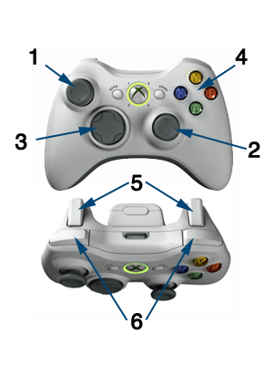

# Mandos

La principal forma de control del móvil es la pantalla táctil, por lo que los videojuegos diseñados específicamente para móviles se adaptan a esta forma de entrada. Sin embargo, cuando se quiere trasladar a móvil un juego diseñado originalmente para otro sistema deberemos adaptar su forma de manejo. 

Los juegos diseñados para videoconsolas o máquinas recreativas se manejan normalmente mediante _joystick_ o _pad_. Al portar uno de estos juegos a móvil podemos optar por:

* Adaptar el control de videojuego a pantalla táctil. Esto implica grandes cambios en el diseño del juego y en el _gameplay_ y no siempre es posible hacerlo.
* Añadir un _pad_ virtual en pantalla. Permite mantener el mismo mecanismo de control que el juego original, pero resulta más complicado de manejar que con un mando real.
* Añadir soporte para mandos físicos. Nos permitirá trasladar la misma experiencia de juego que la versión de videoconsola/recreativa pero necesita que el usuario cuente con este dispositivo. Se pierde una de las ventajas de los juegos móviles, que es el llevarlos siempre con nosotros.  

Vamos en esta sesión a centrarnos en este tipo de juegos y en la forma de diseñar un control adecuado para ellos. Veremos tanto la forma de incorporar un _pad_ virtual como la forma de añadir soporte para diferentes tipos de mandos físicos. Dentro de estos mandos encontramos tanto mandos soportados por las APIs oficiales de iOS y Android, como mandos con APIs de terceros, como por ejemplo iCade.

## Buenas prácticas para juegos basados en _control pad_

Si queremos implementar un juego cuyo manejo esté basado en _control pad_, será recomendable seguir las siguientes prácticas:

* Permitir el manejo del juego mediante _pad_ virtual en pantalla si no se dispone de mando real.
* Añadir compatibilidad con mandos reales. Se recomienda añadir soporte para las APIs oficiales y para aquellos mandos más utilizados, como iCade.
* En caso de tener conectado un mando real, ocultar el _pad_ virtual para que no moleste en pantalla.
* Respetaremos la función estándar de cada botón. El botón de _pausa_ del mando debe permitir pausar el juego en cualquier momento. Determinados botones se suelen utilizar para realizar las mismas acciones en todos los juegos (saltos, ataque, acción, etc). Deberemos intentar seguir estas convenciones.
* La pantalla del móvil no debe apagarse mientras utilizamos el juego con el mando externo.

## Soporte de mandos físicos

Vamos a ver en esta sección cómo integrar soporte para diferentes tipos de mandos _hardware_ en nuestros videojuegos.

### Controladores oficiales iOS

La especificación de mandos para dispositivos iOS aparece a partir de iOS 7. En dicha versión del SDK se incorpora el _framework_ `GameController` que nos permitirá añadir soporte para este tipo de mandos, que llevan la etiqueta MFI (_Made for iPhone/iPod/iPad_), la cual se refiere a todos los dispositivos _hardware_ diseñados para estos dispositivos iOS. 

https://developer.apple.com/library/ios/documentation/ServicesDiscovery/Conceptual/GameControllerPG/Introduction/Introduction.html

### Controladores oficiales Android

El soporte para controladores de juego en Android está presente a partir de la API 9, aunque se han ido incorporando mejoras en APIs sucesivas.

http://developer.android.com/training/game-controllers/index.html

### Controladores iCade

Estos controladores no utilizan la API oficial, ya que salieron a la venta antes de que ésta existiese. Se comportan como un teclado _bluetooth_, por lo que para utilizarlos simplemente deberemos conocer a qué tecla está mapeado cada botón. Está diseñado para ser utilizado con el iPad, pero puede utilizarse en cualquier dispositivo móvil que lo reconozca como teclado _bluetooth_.

En los siguientes enlaces se puede encontrar documentación para integrar estos controladores en nuestras aplicaciones:

http://www.ionaudio.com/downloads/ION%20Arcade%20Dev%20Resource%20v1.5.pdf
http://www.raywenderlich.com/8618/adding-icade-support-to-your-game

### Controladores en Cocos2d-x

Cocos2d-x soporta tanto los mandos oficiales de Android como los oficiales de iOS, ofreciéndonos una API única para utilizarlos en cualquiera de estas plataformas. 

Vamos a centrarnos en la API común de Cocos2d-x y en las cuestiones específicas para utilizarla en Android e iOS.

#### Eventos del mando

En Cocos2d-x encontramos el _listener_ `EventListenerController` que nos permite incorporar soporte para mandos físicos de forma sencilla. Este _listener_ nos permite recibir los siguientes eventos:

* `onConnected`: Se ha conectado un mando.
* `onDisconnected`: Se ha desconectado un mando.
* `onKeyDown`: Se ha pulsado un botón del mando.
* `onKeyUp`: Se ha soltado un botón del mando.
* `onKeyRepeat`: Se mantiene pulsado un botón.
* `onAxisEvent`: Notifica cambios en el _stick_ analógico.

A continuación vemos el esqueleto de la clase de una escena de nuestro juego en la que utilizamos como entrada el mando. Al iniciar la escena registraremos el _listener_ de eventos del mando y configuraremos los _callbacks_ necesarios para cada uno de los eventos anteriores:

```cpp
bool MiEscena::init()
{
    if ( !Layer::init() )
    {
        return false;
    }       
    
    configuraMandos();

    return true;
}

void MiEscena::configurarMando()
{
    _listener = EventListenerController::create();

    // Registramos callbacks
    _listener->onConnected = CC_CALLBACK_2(MiEscena::onConnectController,this);
    _listener->onDisconnected = CC_CALLBACK_2(MiEscena::onDisconnectedController,this);
    _listener->onKeyDown = CC_CALLBACK_3(MiEscena::onKeyDown, this);
    _listener->onKeyUp = CC_CALLBACK_3(MiEscena::onKeyUp, this);
    _listener->onAxisEvent = CC_CALLBACK_3(MiEscena::onAxisEvent, this);

    // Añadimos el listener el mando al gestor de eventos
    _eventDispatcher->addEventListenerWithSceneGraphPriority(_listener, this);

    // Inicia búsqueda de controladores (necesario en iOS)
    Controller::startDiscoveryController();
}

void MiEscena::onKeyDown(cocos2d::Controller *controller, int keyCode, cocos2d::Event *event) { }   

void MiEscena::onKeyUp(cocos2d::Controller *controller, int keyCode, cocos2d::Event *event) { }

void MiEscena::onAxisEvent(cocos2d::Controller* controller, int keyCode, cocos2d::Event* event) { }   

void MiEscena::onConnectController(Controller* controller, Event* event) { }

void MiEscena::onDisconnectedController(Controller* controller, Event* event) { }
```

A continuación veremos con más detalle estos eventos.

#### Conexión y desconexión del mando

Los mandos se conectarán de forma inalámbrica al móvil, por lo que deberemos poder conectar nuevos mandos, o desconectar los que tenemos conectados. 

Podemos estar al tanto de los eventos de conexión y desconexión de mandos. A partir del parámetros `Controller` que nos proporcionan estos eventos podremos saber además datos sobre el mando que se ha conectado:

```cpp
void MiEscena::onConnectController(Controller* controller, Event* event) { 
    CCLOG("Tag:%d", controller->getTag());
    CCLOG("Id:%d", controller->getDeviceId());
    CCLOG("Nombre:%s", controller->getDeviceName().c_str());
}

void MiEscena::onDisconnectedController(Controller* controller, Event* event) { 

}
```

Como vemos, una propiedad de los controladores es su etiqueta (_tag_). Podemos poner una etiqueta a los mandos para poder acceder a ellos de forma sencilla con `setTag` y consultarla con `getTag`. Esta etiqueta será un número entero. Por ejemplo, podríamos utilizar las etiquetas `1` y `2` para identificar los mandos para el primer y segundo jugador respectivamente. Podremos localizar uno de estos mandos de forma inmediata con el método estático `Controller::getControllerByTag`.

```cpp
Controller* primerJugador = Controller::getControllerByTag(1);
```


#### Pulsación de teclas

A partir de un objeto `Controller` podremos conocer el estado de sus botones con el método `getKeyStatus`. Este método recibe como parámetro el código del botón que queremos consultar. En la siguiente imagen mostramos los grupos de botones que encontramos en los mandos para móviles:



Los códigos para los botones de cada grupo se encuentran en la enumeración `Key` y son:

1. Analógico izquierdo: `JOYSTICK_LEFT_X`, `JOYSTICK_LEFT_Y`, `BUTTON_LEFT_THUMBSTICK`
2. Analógico derecho: `JOYSTICK_RIGHT_X`, `JOYSTICK_RIGHT_Y`, `BUTTON_RIGHT_THUMBSTICK`
3. Pad digital: `BUTTON_DPAD_UP`, `BUTTON_DPAD_DOWN`, 
`BUTTON_DPAD_LEFT`, `BUTTON_DPAD_RIGHT`, `BUTTON_DPAD_CENTER`
4. Botones frontales: `BUTTON_A`, `BUTTON_B`, `BUTTON_C`, `BUTTON_X`, `BUTTON_Y`, `BUTTON_Z`, `BUTTON_START`, `BUTTON_SELECT`, `BUTTON_PAUSE`
5. Gatillos: `AXIS_LEFT_TRIGGER`, `AXIS_RIGHT_TRIGGER`
6. Botones superiores: `BUTTON_LEFT_SHOULDER`, 
`BUTTON_RIGHT_SHOULDER`

Por ejemplo, si queremos consultar el estado del botón `A` en el mando del primer jugador haremos lo siguiente:

```cpp
KeyStatus estado = primerJugador->getKeyStatus(BUTTON_A);
```

El estado es una estructura que nos da la siguiente información:

* `isPressed`: Booleano que nos indica si está presionado el botón (para el caso de botones digitales).
* `isAnalog`: Nos indica si el botón es analógico (_sticks_ analógicos o gatillos).
* `value`: Nos indica el valor del estado del botón como número flotante. Dependerá del tipo de botón. Por ejemplo en caso de _sticks_ analógicos nos dará un valor entre `-1` y `1`. En caso de gatillos será entre `0` y `1`. En otros botones nos puede dar valores concretos como `0` ó `1`.

Por ejemplo, podemos hacer que al pulsar el botón `A` nuestro personaje dispare y que con el _stick_ izquierdo se mueva horizontalmente:

```cpp
KeyStatus estadoA = primerJugador->getKeyStatus(BUTTON_A);
if(estado.isPressed) {
    player->dispara();
}

KeyStatus estadoHorizontal = primerJugador->getKeyStatus(JOYSTICK_LEFT_X);
player->setVelocity(estadoHorizontal.value);
```