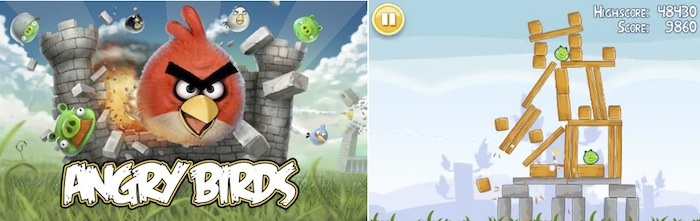
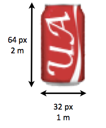
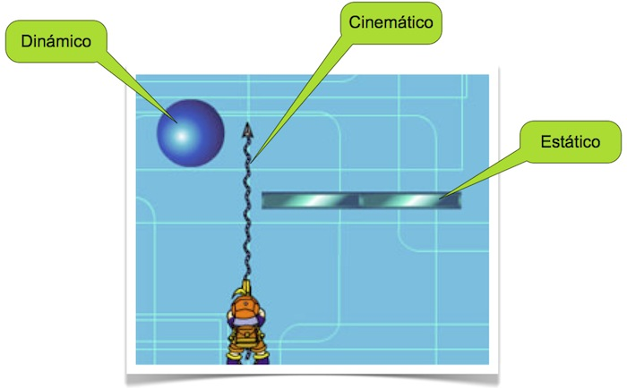
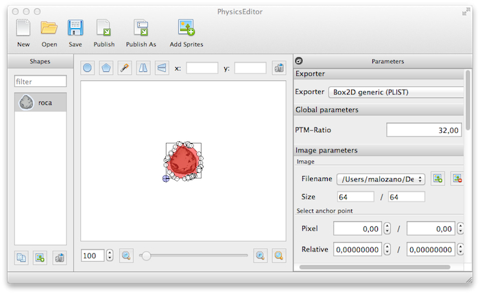

# Motores de físicas

Un tipo de juegos que ha tenido una gran proliferación en el mercado de aplicaciones
para móviles son aquellos juegos basados en físicas. Estos juegos son aquellos en los que
el motor realiza una simulación física de los objetos en pantalla, siguiendo las leyes
de la cinemática y la dinámica. Es decir, los objetos de la pantalla están sujetos a 
gravedad, cada uno de ellos tiene una masa, y cuando se produce una colisión entre ellos
se produce una fuerza de reacción que dependerá de su velocidad y su masa. El motor de físicas se 
encarga de realizar toda esta simulación, y nosotros sólo deberemos encargarnos de
proporcionar las propiedades de los objetos del mundo. Uno de los motores físicos más
utilizados es Box2D, originalmente implementado en C++. Se ha utilizado para implementar juegos tan conocidos y exitosos
como Angry Birds. Podemos encontrar ports de este motor para las distintas
plataformas móviles. Motores como Cocos2D, libgdx y Unity incluyen una implementación de este
motor de físicas.




	


## Motor de físicas Box2D

Vamos ahora a estudiar el motor de físicas Box2D. Es importante destacar que este motor sólo
	se encargará de simular la física de los objetos, no de dibujarlos. Será nuestra responsabilidad
	mostrar los objetos en la escena de forma adecuada según los datos obtenidos de la simulación física.
	Comenzaremos viendo los principales componentes de esta librería.

	
### Componentes de Box2D
	
Los componentes básicos que nos permiten realizar la simulación física con Box2D son:
	
	
* `Body`: Representa un cuerpo rígido. Estos son los tipos de objetos que tendremos en el 
	mundo 2D simulado. Cada cuerpo tendrá una posición y velocidad. Los cuerpos se verán afectados por
	la gravedad del mundo, y por la interacción con los otros cuerpos. Cada cuerpo tendrá una serie de
	propiedades físicas, como su masa o su centro de gravedad.
	
* `Fixture`: Es el objeto que se encarga de fijar las propiedades de un cuerpo, como su forma, coeficiente de rozamiento o densidad. Un cuerpo podría contener varias _fixtures_, para así poder crear formas más complejas combinando formas básicas.
	
* `Shape`: Sirve para especificar la forma de una _fixture_. Hay distintos tipos de formas (subclases de
	`Shape`), como por ejemplo `CircleShape` y `PolygonShape`, para crear cuerpos
	con formar circulares o poligonales respectivamente.
	
* `Constraint`: Nos permite limitar la libertad de un cuerpo. Por ejemplo podemos utilizar una 
	restricción que impida que el cuerpo pueda rotar, o para que se mueva siguiendo sólo una línea (por ejemplo
	un objeto montado en un rail).
	
* `Joint`: Nos permite definir uniones entre diferentes cuerpos.
	
* `World`: Representa el mundo 2D en el que tendrá lugar la simulación. Podemos añadir una serie
	de cuerpos al mundo. Una de las principales propiedades del mundo es la gravedad.
	
	
	
Todas las clases de la librería Box 2D tienen el prefijo `b2`. Hay que tener en cuenta
	que se trata de clases C++, y no Objective-C.
	
	
	
Lo primero que deberemos hacer es crear el mundo en el que se realizará la simulación física. Como parámetro
	deberemos proporcionar un vector 2D con la gravedad del mundo:
	
```cpp
b2Vec2 gravity;
gravity.Set(0, -10);
b2World *world = new b2World(gravity);
```

	
### Unidades de medida
	
Antes de crear cuerpos en el mundo, debemos entender el sistema de coordenadas de Box2D y sus unidades
	de medida. Los objetos de Box2D se miden en metros, y la librería está optimizada para objetos de 1m, por lo que
	deberemos hacer que los objetos que aparezcan con más frecuencia tengan esta medida. 
	
Sin embargo, los gráficos en pantalla se miden en píxeles (o puntos). Deberemos por lo tanto fijar
	el ratio de conversión entre pixeles y metros. Por ejemplo, si los objetos con los que trabajamos normalmente
	miden 32 pixeles, haremos que 32 pixeles equivalgan a un metro. Definimos el siguiente ratio de conversión:

```cpp
const float PTM_RATIO = 32.0;
```
	


	
	
Para todas las unidades de medida Box2D utiliza el sistema métrico. Por ejemplo, para la masa de los objetos
	utiliza Kg.
	
	
	
	
### Tipos de cuerpos
	
Encontramos tres tipos diferentes de cuerpos en Box2D según la forma en la que queremos que se realice 
	la simulación con ellos:
	
	
* **Dinámicos**: Están sometidos a las leyes físicas, y tienen una masa concreta y finita. Estos
	cuerpos se ven afectados por la gravedad y por la interacción con los demás cuerpos.
* **Estáticos**: Son cuerpos que permanecen siempre en la misma posición. Equivalen a cuerpos
	con masa infinita. Por ejemplo, podemos hacer que el escenario sea estático. Es importante no mover aquellos cuerpos que hayan sido marcados como estáticos, ya que el motor podría no responder de forma correcta.
* **Cinemáticos**: Al igual que los cuerpos estáticos tienen masa infinita y no se ven afectados
	por otros cuerpos ni por la gravedad. Sin embargo, en esta caso no tienen una posición fija, sino que podemos moverlos por el mundo. Nos son útiles por ejemplo para proyectiles.
	
	


	
	
	
	
	
### Creación de cuerpos
	
Con todo lo visto anteriormente ya podemos crear distintos cuerpos. Para crear un cuerpo
	primero debemos crear un objeto de tipo `BodyDef` con las propiedades del cuerpo
	a crear, como por ejemplo su posición en el mundo, su velocidad, o su tipo. Una vez hecho esto, 
	crearemos el cuerpo a partir del mundo (`World`) y 
	de la definición del cuerpo que acabamos de crear. Una vez creado el cuerpo, podremos asignarle
	una forma y densidad mediante _fixtures_. Por ejemplo, en el siguiente caso creamos un cuerpo dinámico con forma
	rectangular:
	
```cpp
b2BodyDef bodyDef;
bodyDef.type = b2_dynamicBody;	
bodyDef.position.Set(x / PTM_RATIO, y / PTM_RATIO);

b2Body *body = world->CreateBody(&bodyDef);
		
b2PolygonShape bodyShape;
bodyShape.SetAsBox((width/2) / PTM_RATIO, (height/2) / PTM_RATIO);

body->CreateFixture(&bodyShape, 1.0f);
```
	
	
Podemos también crear un cuerpo de forma circular con:
	
```cpp
b2BodyDef bodyDef;
bodyDef.type = b2_dynamicBody;
bodyDef.position.Set(x / PTM_RATIO, y / PTM_RATIO);
		
b2Body *body = world->CreateBody(&bodyDef);
		
b2CircleShape bodyShape;
bodyShape.m_radius = radius / PTM_RATIO;		

b2Fixture *bodyFixture = body->CreateFixture(&bodyShape, 1.0f);
```
	
También podemos crear los límites del escenario mediante cuerpos de tipo
	estático y combinando varios _fixtures_ con forma de arista (_edge_):
	
```cpp
b2BodyDef limitesBodyDef;
limitesBodyDef.position.Set(x, y);
				
b2Body *limitesBody = world->CreateBody(&limitesBodyDef);
b2EdgeShape limitesShape;
b2FixtureDef fixtureDef;
fixtureDef.shape = &limitesShape;

limitesShape.Set(b2Vec2(0.0f / PTM_RATIO, 0.0f / PTM_RATIO), 
                 b2Vec2(width / PTM_RATIO, 0.0f / PTM_RATIO));
limitesBody->CreateFixture(&fixtureDef);

limitesShape.Set(b2Vec2(width / PTM_RATIO, 0.0f / PTM_RATIO), 
                 b2Vec2(width / PTM_RATIO, height / PTM_RATIO));
limitesBody->CreateFixture(&fixtureDef);

limitesShape.Set(b2Vec2(width / PTM_RATIO, height / PTM_RATIO), 
                 b2Vec2(0.0f / PTM_RATIO, height / PTM_RATIO));
limitesBody->CreateFixture(&fixtureDef);

limitesShape.Set(b2Vec2(0.0f / PTM_RATIO, height / PTM_RATIO), 
                 b2Vec2(0.0f / PTM_RATIO, 0.0f / PTM_RATIO));
limitesBody->CreateFixture(&fixtureDef);
```
	
Los cuerpos tienen una propiedad `userData` que nos permite
	vincular cualquier objeto con el cuerpo. Por ejemplo, podríamos vincular a
	un cuerpo físico el `Sprite` que queremos utilizar para 
	mostrarlo en pantalla:
	
```cpp
bodyDef.userData = sprite;
```
	
De esta forma, cuando realicemos la simulación podemos obtener
	el _sprite_ vinculado al cuerpo físico y mostrarlo en pantalla
	en la posición que corresponda.
	
	
	
	
### Simulación
	
Ya hemos visto cómo crear el mundo 2D y los cuerpos rígidos. Vamos a ver ahora cómo realizar
	la simulación física dentro de este mundo. Para realizar la simulación deberemos llamar al
	método `step` sobre el mundo, proporcionando el _delta time_ transcurrido
	desde la última actualización del mismo:
	
```cpp
world->Step(delta, 6, 2);
world->ClearForces();
```

> **Recomendación**: Conviene utilizar un _delta time_ fijo para el motor de físicas, para así obtener resultados predecibles en la simulación (por ejemplo 60 fps). Si el _frame rate_ del _render_ es distinto podemos interpolar las posiciones.
	
Además, los algoritmos de simulación física son iterativos. Con cada iteración se busca resolver las colisiones y restricciones de los objetos del mundo para aproximar su posición y velocidad. Cuantas más iteraciones se realicen mayor precisión se obtendrá en los resultados, pero mayor coste tendrán. El segundo y el tercer	parámetro de `step` nos permiten establecer el número de veces que debe iterar el algoritmo	para resolver la posición y la velocidad de los cuerpos respectivamente. Tras hacer la simulación, deberemos limpiar las fuerzas acumuladas sobre los objetos, para que no se arrastren estos resultados a próximas simulaciones.

> **Recomendación**: Un valor recomendable para las iteraciones de posición y velocidad es 8 y 3 respectivamente.

Tras hacer la simulación deberemos actualizar las posiciones de los _sprites_ en pantalla y mostrarlos. Por ejemplo, si hemos vinculado el `Sprite` al cuerpo mediante la propiedad `userData`, podemos recuperarlo y actualizarlo de la siguiente forma:
	
```cpp
CCSprite *sprite = (CCSprite *)body->GetUserData();
b2Vec2 pos = body->GetPosition();
CGFloat rot = -1 * CC_RADIANS_TO_DEGREES(b->GetAngle());

sprite->setPosition(ccp(pos.x*PTM_RATIO, pos.y*PTM_RATIO));
sprite->setRotation(rot);
```

### Formas de los objetos

Hemos visto que mediante _fixtures_ podemos asignar diferentes formas a los objetos del mundo, como círculos, polígonos y aristas.
	
#### Círculos

Es la forma más sencilla. Se crea simplemente indicando su centro y su radio, y el cálculo de colisiones con ellos es muy eficiente.

```cpp
b2CircleShape circle; 
circle.m_p.Set(0.0f, 0.0f); // Centro
circle.m_radius = 0.5f;     // Radio
```

#### Polígonos

Nos permite crear formas arbitrarias convexas. Es importante destacar que los polígonos siempre serán convexos y cerrados, y sus vértices se definirán en sentido contrario a las agujas del reloj (CCW). El cálculo de colisiones con formas cóncavas es demasiado complejo para el motor de físicas.

```cpp
b2Vec2 vertices[kNUM_VERTICES];  // Vertices definidos en orden CCW
vertices[0].Set(-1.0f, 0.0f); 
vertices[1].Set(1.0f, 0.0f); 
vertices[2].Set(0.0f, 2.0f);

b2PolygonShape polygon; 
polygon.Set(vertices, kNUM_VERTICES);
```

Un caso particular de los polígonos son las cajas. Al ser este tipo de polígonos muy común, se proporciona un método para crearlas de forma automática a partir de su media altura y anchura:

```cpp
b2PolygonShape box;
bodyShape.SetAsBox(0.5, 0.5); // Crea una caja de 1m x 1m
```

#### Aristas

Las aristas (_edges_) son segmentos de línea que normalmente se utilizan para construir la geometría del escenario estático, que podrá tener una forma arbitraria. Podemos 
	
```cpp
b2Vec2 v1(0.0f, 0.0f); // Inicio del segmento
b2Vec2 v2(1.0f, 0.0f); // Fin del segmento

b2EdgeShape edge;
edge.Set(v1, v2);
```

#### Cadenas

Las cadenas nos permiten unir varias aristas para así definir la geometría estática del escenario y evitar que se puedan producir "baches" en las juntas entre diferentes aristas. 

```cpp 
b2Vec2 v[kNUM_VERTICES];
v[0].Set(0.0f, 0.0f);
v[1].Set(1.0f, 0.25f);
v[2].Set(2.0f, 1.0f);
v[3].Set(3.0f, 1.25f);

b2ChainShape chain; 
chain.CreateChain(vs, kNUM_VERTICES);
```

> **Cuidado**: Las aristas de la cadena no deben intersectar entre si. Esto no está previsto por el motor, por lo que puede producir efectos inesperados.

	
#### Formas compuestas

Si ninguno de los tipos anteriores de formas se adapta a nuestras necesidades, como por ejemplo en el caso de necesitar una forma cóncava, podemos definir la forma del cuerpo como una composición de formás básicas. Esto lo podemos conseguir añadiendo múltiples _fixtures_ a un cuerpo, cada una de ellas con una forma distinta. Esto será útil para cuerpos dinámicos con formas complejas.


### Propiedades de los cuerpos

Los cuerpos y _fixtures_ tienen una serie de propiedades que nos permiten definir su comportamiento en la simulación física. Hemos visto algunas básicas como la masa y la forma, que se indican en el momento de crear una _fixture_. Vamos a ver ahora otras propiedades físicas de los objetos.

#### Resistencia al aire

Para cada cuerpo podemos indicar una constante de resistencia al aire (_damping_), tanto lineal como angular. La resistencia al aire es la fuerza que hará que la velocidad del objeto disminuya, aunque no esté en contacto con ningún otro cuerpo. Cuánta mayor sea la velocidad, más fuerza ejercerá la resistencia al aire para pararlo. Es recomendable indicar una resistencia al aire para que los cuerpos no se muevan (o roten) de forma indefinida:

```cpp
bodyDef.linearDamping = 0.1f; 
bodyDef.angularDamping = 0.25f;
```

#### Fricción

La fricción es la fuerza que hace que un objeto se pare al deslizarse sobre otro, debido a rugosidades de la superficie. A diferencia de la resistencia al aire, esta fuerza sólo se ejercerá cuando dos _fixtures_ estén en contacto. La fricción se define a nivel de _fixture_:

```cpp
fixtureDef.friction = 0.25f;
```

#### Restitución

La restitución nos indica la forma en la que responderá un objeto al colisionar con otro, permitiendo que los objetos permanezcan juntos o reboten. Una restitución 0 indica que el objeto no rebotará el colisionar, mientras que el valor 1 indica que al colisionar rebota y en el rebote se restituye toda la velocidad que tenía en el momento previo a la colisión.

```cpp
fixtureDef.restitution = 0.5f;
```

### Fuerzas e impulsos

#### Fuerzas

Siguiendo la segunda ley de Newton, la fuerza que se debe aplicar sobre un objeto para producir una determinada aceleración se calcula de la siguiente forma:

$$\mathbf{f} = m\mathbf{a}$$

Sin embargo, en nuestro motor de físicas lo que realmente nos interesa es conocer la aceleración producida tras aplicar una fuerza, calculada como:

$$\mathbf{a} = \frac{1}{m}\mathbf{f}$$

Podemos ver que aquí multiplicamos la fuerza por la **inversa de la masa**. Dado que este cálculo es frecuente, para evitar tener que calcular la inversa en cada momento, será recomendable almacenar la masa inversa de los cuerpos, en lugar de almacenar la masa. 

Almacenar la masa inversa tiene una ventaja importante. Para hacer que un cuerpo sea estático (que no se vea afectado por las fuerzas que sobre él se ejerzan) lo que haremos es dar a ese cuerpo masa infinita. Este valor infinito podría crear dificultades en el código, y la necesidad de tratar casos especiales. Si trabajamos únicamente con masa inversa, bastará con darle un valor 0 a la masa inversa para hacer el cuerpo estático. 

Normalmente sobre un cuerpo actuarán varias fuerzas. Siguiendo el principio de D'Alembert,  un conjunto de fuerzas

$$F=\{f_1, f_2, ... f_{|F|}\}$$

actuando sobre un objeto pueden ser sustituidas por una única fuerza calculada como la suma de las fuerzas de $$F$$:

$$f = \sum^{|F|}_{i=1} f_i$$

Para ello, cada objeto contará con un acumulador de fuerzas f donde se irán sumando todas las fuerzas que actúan sobre él (gravedad, interacción con otros objetos, suelo, etc). Cuando llegue el momento de realizar la integración, la aceleración del objeto se calculará a partir de la fuerza que indique dicho acumulador $$f$$.

> **Poner a cero el acumulador.** Una vez finalizado un paso de la simulación deberemos poner a cero los acumuladores de fuerzas de cada objeto del mundo. Por este motivo Box2D tiene un método `clearForces` que deberemos llamar antes de realizar cada paso de la simulación.

Deberemos llevar cuidado con la discretización del tiempo. Si una gran fuerza se aplica durante un periodo de tiempo muy breve (por ejemplo para disparar una bala), si la aceleración producida se extiende a todo el _delta time_ el incremento de velocidad producido puede ser desmesurado. Por este motivo, estas fuerzas que se aplican en un breve instante puntual de tiempo se tratarán como impulsos.

El caso más común de fuerza aplicada a los objetos es la **gravedad**. Si queremos hacer una simulación realista deberíamos aplicar una fuerza que produzca una aceleración de

$$a_{gravedad}=-9.8 \frac{m}{s^2}$$

sobre nuestros objetos en el eje $$y$$ (normalmente se redondea en $$a_{gravedad}=10$$. Considerando el vector 

$$\mathbf{a}_{gravedad} = (0, a_{gravedad})$$

tenemos:

$$\mathbf{f}_{gravedad} = \mathbf{a}_{gravedad}m$$

Los cuerpos de Box2D tienen una propiedad `gravityScale` que nos permite aplicar una gravedad distinta a cada cuerpo. Podemos especificarlo al crear el cuerpo:

```cpp
bodyDef.gravityScale = 5.0; 
```

También se puede tratar como una fuerza la **"resistencia al aire"** (_damping_) que produce que los objetos vayan frenando y no se muevan indefinidamente. Un modelo simplificado para esta fuerza que se suele utilizar en videojuegos es el siguiente:

$$\mathbf{f}_{resistencia} = -\mathbf{\hat{v}}(k_{damping} |\mathbf{v}| $$

Donde $$k_{damping}$$ es la constante de _damping_ especificada para el cuerpo, y $$\mathbf{\hat{v}}$$ el vector de velocidad normalizado (vector unitario con la dirección de la velocidad). Podemos ver que la fuerza actúa en el sentido opuesto a la velocidad del objeto (lo frena), y con una magnitud proporcional a la velocidad.

A parte de las fuerzas de gravedad, resistencia al aire, y las fuerzas ejercidas entre cuerpos en contacto, también podemos aplicar una fuerza manualmente sobre un determinado cuerpo. Para ello deberemos indicar el vector de fuerza y el punto del objeto donde se aplicará dicha fuerza relativo a su centro de masas:

```cpp
body.ApplyForce(b2Vec(5.0, 2.0), b2Vec(0.0, 0.0));
```

Las unidades en las que especificaremos la fuerza son $$N$$ ($$\frac{kg·m}{s^2}$$). 

Si el punto del objeto al que aplicamos la fuerza no es su centro de masas, la fuerza producirá además que el objeto rote. Podemos también aplicar un par de fuerzas (_torque_) para producir una rotación del objeto alrededor de su centro de masas sin producir una traslación:

```cpp
body.ApplyTorque(2.0);
```

#### Impulsos

Los impulsos producen un cambio instantáneo en la velocidad de un objeto. Podemos ver los impulsos respecto a la velocidad como vemos a las fuerzas respecto a la aceleración. Si aplicar una fuerza a un cuerpo produce una aceleración, aplicar un impulso produce un cambio de velocidad. Una diferencia importante es que no puede haber aceleración si no se aplica ninguna fuerza, mientras que si que puede haber velocidad si no se aplican impulsos, un impulso lo que provoca es un cambio en la velocidad. El impulso $$g$$ necesario para producir un cambio de velocidad $$\Delta v$$ será proporcional a la masa del objeto:

\begin{equation}
g = m\Delta v
\end{equation}

Al igual que en el caso de las fuerzas, el cálculo que nos interesará realizar es la obtención del cambio de velocidad a partir del impulso:

\begin{equation}
\Delta v = \frac{1}{m}g
\end{equation}

Considerando $$\Delta v = v' - v$$, donde $$v$$ es la velocidad previa a la aplicación del impulso, y $$v'$$ es la velocidad resultante, tenemos:

\begin{equation}
v' = v + \frac{1}{m}g
\end{equation}


### Detección de colisiones
	
Hemos comentado que dentro de la simulación física existen interacciones entre los diferentes objetos del mundo. Encontramos diferentes formas de consultar las colisiones de los objetos del mundo con otros objetos y otros elementos.

#### Colisiona con un punto del mundo

Un _test_ sencillo consiste en comprobar si la forma de una _fixture_ ocupa un determinado punto del mundo. Esto es útil por ejemplo cuando tocamos sobre la pantalla táctil, para comprobar si en el punto sobre el que hemos pulsado hay un determinado objeto. Este método se aplica sobre una _fixture_ concreta:

```cpp
b2Transfrom transform;
transform.SetIdentity(); 
b2Vec2 point(touch_x / PTM_RATIO, touch_y / PTM_RATIO);

bool hit = fixture->TestPoint(transform, point);
```

#### Trazado de rayos
	
Otro _test_ disponible es el trazado de rayos. Consiste en lanzar un rayo desde una determinada posición del mundo en una determinada dirección y comprobar cuál es el primer objeto del mundo físico con el que impacta. 

Esto es especialmente útil para implementar por ejemplo los disparos de nuestro personaje. Al ser la bala un objeto extremadamente rápido, no es conveniente simular su movimiento con el motor de físicas, ya que podría producirse el efecto conocido como _tunneling_, atravesando objetos al dar un gran salto en su posición de una iteración a la siguiente. En este caso es mejor simplemente considerar la bala como algo instantáneo, y encontrar en el mismo momento en que se dispara el objeto con el que impactaría lanzando un rayo.

Puede aplicarse para una _fixture_ concreta para saber si el rayo impacta con ella:

```cpp
b2RayCastInput input; 
input.p1.Set(0.0f, 0.0f, 0.0f); // Punto inicial del rayo
input.p2.Set(1.0f, 0.0f, 0.0f); // Punto final del rayo
input.maxFraction = 1.0f; 

b2RayCastOutput output;
bool hit = fixture->RayCast(&output, input, 0); 
if (hit) {
    b2Vec2 hitPoint = input.p1 + output.fraction * (input.p2 – input.p1);
    b2Vec2 normal = output.normal;
}
```

Como salida tenemos la siguiente información del punto de impacto:

* _Fracción_: Tomando como referencia el vector desde el punto inicial al final del rayo, nos indica por cuánto debemos multiplicar dicho vector para encontrar el punto de impacto. Como entrada debemos especificar la fracción máxima hasta la que vamos a buscar el impacto. Por ejemplo, si la fracción es 1.0 el punto de impacto coincidirá con el punto final del rayo, mientras que si es 0.5 el impacto estaría justo a la mitad del vector del rayo.
* _Normal_: Nos indica la dirección normal de la superficie sobre la que ha impactado el rayo. De esta forma podremos saber si hemos impactado de lado o de frente, y así aplicar distinto nivel de daño en cada caso, o aplicar una fuerza al objeto en la dirección en la que haya recibido el impacto.

También podría aplicarse sobre el mundo, para buscar la primera _fixture_ con la que impacte. En este caso necesitaremos utilizar un objeto `b2RayCastCallback` para obtener la información del primer _fixture_ con el que impacte y los datos del impacto.

	
#### Colisiones entre cuerpos
	
Podemos recibir notificaciones cada vez que se produzca un contacto entre objetos del mundo, para así por ejemplo aumentar el daño recibido.
	
Podremos recibir notificaciones mediante un objeto que implemente la interfaz `ContactListener`. Esta interfaz nos forzará a definir los siguientes métodos:
	
```cpp
class MiContactListener : public b2ContactListener {

public:
    MiContactListener();
    ~MiContactListener();
    
    // Se produce un contacto entre dos cuerpos
	virtual void BeginContact(b2Contact* contact);

    // El contacto entre los cuerpos ha finalizado		
	virtual void EndContact(b2Contact* contact);

    // Se ejecuta antes de resolver el contacto. 
    // Podemos evitar que se procese	
	virtual void PreSolve(b2Contact* contact, 
	                      const b2Manifold* oldManifold);    

    // Podemos obtener el impulso aplicado sobre los cuerpos en contacto
	virtual void PostSolve(b2Contact* contact, 
	                       const b2ContactImpulse* impulse);    
};
```
	
	
	
Podemos obtener los cuerpos implicados en el contacto a partir del parámetro `Contact`.
	También podemos obtener información sobre los puntos de contacto mediante la información proporcionada
	por `WorldManifold`:
	
```cpp
void MiContactListener::BeginContact(b2Contact* contact) {
 
    b2Body *bodyA = contact.fixtureA->GetBody();
    b2Body *bodyB = contact.fixtureB->GetBody(); 
 		
    // Obtiene el punto de contacto
    b2WorldManifold worldManifold; 
    contact->GetWorldManifold(&worldManifold);
    
    b2Vec2 point = worldManifold.points[0];
		
    // Calcula la velocidad a la que se produce el impacto
    b2Vec2 vA = bodyA->GetLinearVelocityFromWorldPoint(point); 
    b2Vec2 vB = bodyB->GetLinearVelocityFromWorldPoint(point);

    float32 vel = b2Dot(vB - vA, worldManifold.normal);		
 
    ...
}
```
	
De esta forma, además de detectar colisiones podemos también saber la velocidad a la que han chocado,
	para así poder aplicar un diferente nivel de daño según la fuerza del impacto.

El objeto _manifold_ nos da el conjunto de puntos que define el contacto. En el caso de la colisión de una esfera con una superficie siempre será un único punto, pero en el caso de una caja puede ocurrir que toda una cara de la caja colisione con la superficie. En este caso el _manifold_ nos devolerá los puntos de los extremos de la cara que colisiones con la superficie. 

También podemos utilizar `PostSolve` para obtener el impulso ejercido sobre los cuerpos en contacto en cada instante:

```cpp
void MiContactListener::PostSolve(b2Contact* contact, 
                                  const b2ContactImpulse* impulse) {
	
    b2Body *bodyA = contact.fixtureA->GetBody();
    b2Body *bodyB = contact.fixtureB->GetBody(); 
		
    float impulso = impulse->GetNormalImpulses()[0];
}
```

Debemos tener en cuenta que `BeginContact` sólo será llamado una vez, al comienzo del contacto, mientras que `PostSolve` nos informa en cada iteración de las fuerzas ejercidas entre los cuerpos en contacto para mantener uno en reposo sobre otro.


#### Sensores

En el punto anterior hemos visto cómo detectar colisiones entre cuerpos que producen una respuesta (fuerza de reacción). En algunos casos nos interesa que en el motor de físicas se detecten colisiones con un cuerpo, pero que no produzcan una respuesta en la simulación física. Por ejemplo, podríamos tener una zona en la que al entrar algún cuerpo queramos que se abra alguna puerta. Esto podemos conseguirlo mediante sensores. Podemos hacer que una _fixture_ se comporte como sensor mediante su propiedad `isSensor`:

```cpp
fixtureDef.isSensor = TRUE;
```

Al ser un sensor otros objetos atravesará esta _fixture_, pero podremos detectar las colisiones mediante los métodos `BeginContact` y `EndContact` de una `ContactListener`.


## Gestión de físicas con PhysicsEditor

Hasta ahora hemos visto que es sencillo crear con Box 2D formas rectangulares y circulares, pero si
tenemos objetos más complejos la tarea se complicará notablemente. Tendremos que definir la forma
del objeto mediante un polígono, pero definir este polígono en código es una tarea altamente
tediosa.

Podemos hacer esto de forma bastante más sencilla con herramientas como **Physics Editor**.
Se trata de una aplicación de pago, pero podemos obtener de forma gratuita una versión limitada. La aplicación
puede descargarse de:

```
http://www.codeandweb.com/physicseditor
```

Con esta herramienta podremos abrir determinados _sprites_, y obtener de forma automática su
contorno. Cuenta con una herramienta similar a la "varita mágica" de Photoshop, con la que podremos
hacer que sea la propia aplicación la que determine el contorno de nuestros _sprites_. A
continuación vemos el entorno de la herramienta con el contorno que ha detectado automáticamente
para nuestro _sprite_:



	

En el lateral derecho podemos seleccionar el formato en el que queremos exportar el contorno detectado. 
En nuestro caso utilizaremos el formato de Box 2D genérico (se exporta como `plist`). También
debemos especificar el _ratio_ de píxeles a metros que queremos utilizar en nuestra aplicación
(_PTM-Ratio_).

En dicho panel también podemos establecer una serie de propiedades de la forma (_fixture_) que estamos
definiendo (densidad, fricción, etc).

Una vez establecidos los datos anteriores podemos exportar el contorno del objeto pulsando el botón
_Publish_. Con esto generaremos un fichero `plist` que podremos importar desde nuestro
juego Cocos2D. Para ello necesitaremos añadir la clase `GB2ShapeCache` a nuestro proyecto. 
Esta clase viene incluida en el instalador de Physics Editor (tenemos tanto versión para Cocos2D como
para Cocos2D-X).

Para utilizar las formas definidas primero deberemos cargar el contenido del fichero `plist`
en la caché de formas mediante la clase anterior:

```cpp
#include "GB2ShapeCache-x.h"

...

GB2ShapeCache::sharedGB2ShapeCache()->addShapesWithFile("formas.plist");
```

Una vez cargadas las formas en la caché, podremos asignar las propiedades de las _fixtures_
definidas a nuestros objetos de Box2D:

```cpp
b2Body *body = ... // Inicializar body

GB2ShapeCache::sharedGB2ShapeCache()->addFixturesToBody(body, "roca");
```

<!-- 
> Es importante utilizar en este editor la versión básica de nuestros _sprites_
(no la versión HD), para así obtener las coordenadas de las formas en puntos. Al
tratarse las coordenadas como puntos, será suficiente con hacer una única versión de este fichero.
 -->
