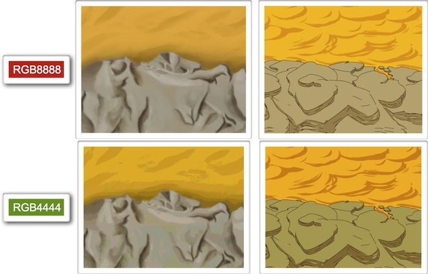

# Optimización para plataformas móviles

## Gráficos de los juegos

Un juego debe ser atractivo para el usuario. Debe mostrar gráficos detallados de forma fluida, lo cual hace casi imprescindible trabajar con OpenGL para
obtener un videojuego de calidad. Concretamente, en los dispositivos móviles se utiliza
OpenGL ES, una versión reducida de OpenGL pensada para este tipo de dispositivos. Según las
características del dispositivo se utilizará OpenGL ES 1.0 o OpenGL ES 2.0. Por ejemplo, 
las primeras generaciones de iPhone soportaban únicamente OpenGL ES 1.0, mientras que actualmente
se pueden utilizar ambas versiones de la librería.

Si no estamos familiarizados con dicha librería, podemos utilizar librerías que nos ayudarán
a implementar videojuegos sin tener que tratar directamente con OpenGL, como veremos a continuación.
Sin embargo, todas estas librerías funcionan sobre OpenGL, por lo que deberemos tener
algunas nociones sobre cómo representa los gráficos OpenGL.

Los gráficos a mostrar en pantalla se almacenan en memoria de vídeo como texturas. La memoria
de vídeo es un recurso crítico, por lo que deberemos optimizar las texturas para ocupar
la mínima cantidad de memoria posible. Para aprovechar al máximo la memoria, se recomienda que 
las texturas sean de tamaño cuadrado y potencia de 2 (por ejemplo 128x128, 256x256, 512x512, 1024x1024, 
o 2048x2048). En OpenGL ES 1.0 el tamaño máximo de las texturas es de 1024x1024, mientras que en 
OpenGL ES 2.0 este tamaño se amplía hasta 2048x2048.

Podemos encontrar diferentes formatos de textura:

* `RGB8888`: 32 bits por pixel. Contiene un canal _alpha_ de 8 bits, con el que 
podemos dar a cada pixel 256 posibles niveles de transparencia. Permite representar más de 16 millones
de colores (8 bits para cada canal RGB).
* `RGB4444`: 16 bits por pixel. Contiene un canal _alpha_ de 4 bits, con el que 
podemos dar a cada pixel 16 posibles niveles de transparencia. Permite representar 4.096 colores (4 bits para cada canal RGB). Esto 
permite representar colores planos, pero no será capaz de representar correctamente los degradados.
* `RGB565`: 16 bits por pixel. No permite transparencia. Permite representar 65.536 colores, con 
6 bits para el canal verde (G), y 5 bits para los canales rojo (R) y azul (B). Este tipo de textura será
la más adecuada para fondos.
* `RGB5551`: 16 bits por pixel. Permite transparencia de un sólo bit, es decir, que un pixel
puede ser transparente u opaco, pero no permite niveles intermedios. Permite representar 32.768 colores
(5 bits para cada canal RGB).

Debemos evitar en la medida de lo posible utilizar el tipo `RGB8888`, debido no sólo al espacio
que ocupa en memoria y en disco (aumentará significativamente el tamaño del paquete), sino también a que
el rendimiento del videojuego disminuirá al utilizar este tipo de texturas. Escogeremos un tipo u otro según
nuestras necesidades. Por ejemplo, si nuestros gráficos utilizan colores planos, `RGB4444` puede
ser una buena opción. Para fondos en los que no necesitemos transparencia la opción más adecuada sería
`RGB565`. Si nuestros gráficos tienen un borde sólido y no necesitamos transparencia parcial, pero
si total, podemos utilizar `RGB5551`.

En caso de necesitar utilizar `RGB4444` con texturas en las que tenemos degradado, podemos 
aplicar a la textura el efecto _dithering_ para que el degradado se represente de una forma más adecuada
utilizando un reducido número de colores. Esto se consigue mezclando píxeles de distintos colores y modificando
la proporción de cada color conforme avanza el degradado, evitando así el efecto de degradado escalonado
que obtendríamos al representar las texturas con un menor número de colores.

También tenemos la posibilidad de utilizar formatos de textura comprimidos para aprovechar al máximo el
espacio y obtener un mayor rendimiento. En iPhone el formato de textura soportado es PVRTC. Existen variantes de 2 y 4
bits de este formato. Se trata de un formato de compresión con pérdidas.

En Android los dispositivos con OpenGL ES 1.0 no tenían ningún formato estándar de compresión. Según el dispositivo
podíamos encontrar distintos formatos: ATITC, PVRTC, DXT. Sin embargo, todos los dispositivos con soporte para
OpenGL ES 2.0 soportan el formato ETC1. Podemos convertir nuestras texturas a este formato con la herramienta
`$ANDROID_SDK_HOME/tools/etc1tool`, incluida con el SDK de Android. Un inconveniente de este formato
es que no soporta canal _alpha_.

