# Redes sociales para videojuegos

Existen diferentes redes sociales específicas para videojuegos. Estas redes nos permiten ver por ejemplo a qué juegos están jugando nuestros amigos, y los **logros** y **puntuaciones** que han conseguido en ellos. También nos permitirán entrar en partidas multijugador con nuestros amigos o almacenar los datos de nuestra partida en la nube. 

Normalmente estas redes están ligadas a la plataforma que utilizamos para jugar (**Game Center** para las plataformas de Apple: iOS, Mac, Apple TV; **Xbox live** para las plataformas de Microsoft: Xbox y Windows; **PS Network** para las plataformas de Sony: PS3, PS4, PS Vita; **Steam** en PC, Linux y Mac), pero también encontramos redes que podemos utilizar en diferentes plataformas (**Google Play Games**, además de Android, puede utilizarse en iOS o plataformas Web). También existen plataformas sociales para videojuegos ofrecidas por terceros (por ejemplo _Game Sparks_, _Playphone_ o _OpenKit_), siendo la mayoría de ellos servicios de pago.

Vamos a ver cómo diseñar e implementar **logros** y **marcadores** con las principales redes sociales para juegos disponibles en las plataformas móviles.

## Diseño de logros y marcadores

### Logros

Los logros son recompensas que podremos obtener cumpliendo determinados retos dentro del juego. Cada logro tiene asociado un reto sobre algo que podemos realizar dentro del juego (por ejemplo, "Destruye 100 naves enemigas"). Una vez consigamos realizar el objetivo de este reto seremos recompensados con el logro. Normalmente veremos los logros conseguidos como medallas, y podremos ver también los logros obtenidos por otros jugadores y compararlos con los que hemos obtenido nosotros.


Bien diseñados, los logros podrán hacer que los jugadores tengan más incentivos para jugar a nuestro juego. 


#### Datos de un logro

Para cada logro deberemos proporcionar la siguiente información:

* **Título**: Texto que se mostrará cuando el usuario consiga el logro. Normalmente se indicará el reto asociado o algo relacionado con él. Por ejemplo, podríamos indicar de forma literal a qué corresponde el logro (por ejemplo "Consigue 1.000.000 de puntos"), o algo relacionado (por ejemplo "Millonario"). 
* **Puntos**: Cada logro tiene asociado un número de puntos. Cuanto más complejo sera conseguir un logro, más puntos le deberíamos asignar. El número total de puntos que podrán sumar todos los logros de nuestro juego será como **máximo de 1.000 puntos**, por lo que debemos repartir los puntos con cuidado. Deberemos evitar asignar todos los puntos en la primera versión del juego. A partir del análisis de la forma de jugar de los usuarios seguramente se determine la conveniencia de añadir nuevos logros que se adapten a su dinámica de juego.
* **Oculto**: Podemos marcar los logros como ocultos para que el usuario no pueda verlos hasta que los haya conseguido (por ejemplo para evitar _spoilers_ o crear _"huevos de pascua"_). Si el logro no es oculto, podremos ver si título en la lista de logros del juego, aunque todavía no lo hayamos obtenido, con lo que tendremos una indicación de qué tendríamos que hacer para conseguirlo.


#### Tipos de logros

Antes de ver una serie de consejos para el diseño de logros, vamos a realizar una clasificación de tipos de logros que podemos incluir:

* **Logros de progreso**: Logros que se conceden conforme progresamos en el juegos. Por ejemplo, _"Completa el nivel 1"_. Estos logros se obtendrán siempre que avancemos en el juego. No suponen un reto extra, pero son un buen incentivo para completar el juego.
* **Retos extra**: Suponen retos adicionales al mero avance en el juego. Por ejemplo, _"Completa un nivel sin recibir ningún daño"_. Estos logros aumentan la rejugabilidad y alargan la vida del juego. 
* **Logros ocultos**: Los logros ocultos pueden ser de cualquiera de los tipos anteriores, pero el reto para obtener el logro no es visible hasta que no se haya obtenido. Esto es especialmente últil en el caso de logros de progreso, para evitar _spoilers_.  


#### Consejos para el diseño de logros

El diseño de logros será una tarea que normalmente realizaremos en las fases finales del desarrollo del videojuego. Será importante tener muy bien definidas cuáles son las mecánicas y modos del juego y los contenidos que vamos a ofrecer. A continuación mostramos una serie de consejos para el diseño de logros:

* La lista de logros debe ser una buena **representación del juego**. Es decir, deberíamos tener logros que se consigan con cada modo de juego (por ejemplo, modo "Historia" y modo "Contrarreloj"), y con cada mecánica del juego (por ejemplo, matar enemigos, coger monedas, etc). 
* Deben existir logros para jugadores con **diferentes grados de experiencia**, desde logros que cualquier jugador pueda conseguir, hasta logros dirigidos a los jugadores más experimentados. Algunos juegos ofrecen como incentivo dar "logros fáciles", con lo cual pueden conseguir usuarios que desean ganar puntos de logros y así competir con sus amigos, pero esto no favorece la experiencia de juego.
* **Utilizar logros ocultos para eventos inesperados**, y conseguir así sorprender al jugador. Podemos hacer que estos logros aperezcan cuando se realizar algo que no está contemplado en la historia del juego, o cuando el jugador falla en algo. Por ejemplo, dar un logro cuando hemos muerto _N_ veces, o cuando hemos recorrido un escenario en dirección contraria.
* **No ofrecer todos los logros en la primera versión del juego**. Es conveniente observar el comportamiento de los jugadores una vez el juego ha sido lanzado, y así poder añadir nuevos logros que se adapten a lo que los jugadores buscan en el juego. Además, podremos añadir logros para nuevos contenidos que podamos incorporar.


### Marcadores

Los marcadores anotarán la **puntuación máxima** que hemos conseguido en el juego. Además, no sólo nos permitirán ver la puntuación que hemos obtenido, sino que podremos **compararla** con la de nuestros amigos y con la de otros jugadores de todo el mundo. Esta es una cuestión importante, ya que en un marcador mundial es muy difícil conseguir estar en puestos destacados, lo cual puede desanimar a la mayoría de jugadores. Sin embargo, si tenemos la opción de ver en el marcador sólo a nuestros amigos, es más probable que podamos "pelear" por los primeros puestos, y esto mejorará la **retención** de los usuarios, bien para conseguir llegar a ocupar las primeras posiciones, o para conservarlas.

Podremos tener **varios marcadores** en nuestro juego, con distintos tipos de datos (por ejemplo, _puntuaciones máximas_, _monedas recolectadas_, _mejores tiempos_, etc). Según el tipo de marcador, podremos indicar si la ordenación debe ser **ascendente o descendente**. Por ejemplo, para la _puntuación_ debería ser descendente (la máxima encabezará la lista), pero para _mejores tiempos_ deberíamos utilizar un marcador ascendente (el que menor tiempo haya hecho encabezará la lista).

Al igual que en el caso de los logros, la incorporación de los marcadores se suele hacer en las fases finales del desarrollo. Son algo independiente del juego, durante el transcurso de la partida no tendrán ningún efecto. Normalmente los veremos siempre en una pantalla independiente, ya fuera de la pantalla del juego, donde se mostrará la lista de las mejores puntuaciones. 


## Configuración de logros y marcadores

Antes de poder utilizar logros y marcadores en nuestros juegos, deberemos configurarlos en la plataforma que vayamos a utilizar (Game Center, Google Play Games, etc). Normalmente, cada plataforma nos proporcionará una interfaz web con la que introducir los datos de los logros y marcadores que vayamos a utilizar en nuestro juego. Vamos a ver cómo hacer esto en las principales plataformas para móviles.


### Game Center

Comenzaremos viendo cómo dar de alta logros y marcadores en Game Center, la plataforma de videojuegos de Apple. 

En primer lugar, deberemos crear un App ID para nuestra aplicación en la que esté activo el servicio Game Center. Para ello entramos en la aplicación _Certificates, Identifiers & Profiles_, que encontraremos dentro de las aplicaciones disponibles para los desarrolladores del _Apple Developer Program_.

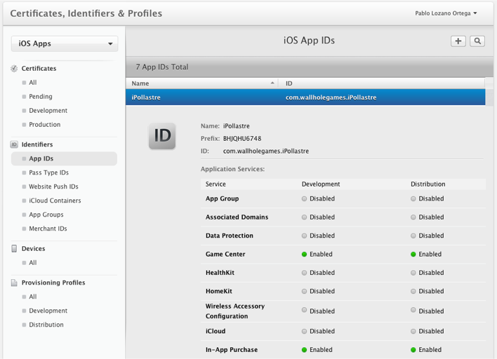

Una vez creado el App ID, entraremos en _iTunes Connect_ y crearemos la ficha de la aplicación para nuestro juego, utilizando el App ID definido en el paso anterior. Dentro de los datos de nuestra aplicación, veremos una pestaña _Prestaciones_, que contiene una sección _Game Center_ donde podremos configurar logros y marcadores.

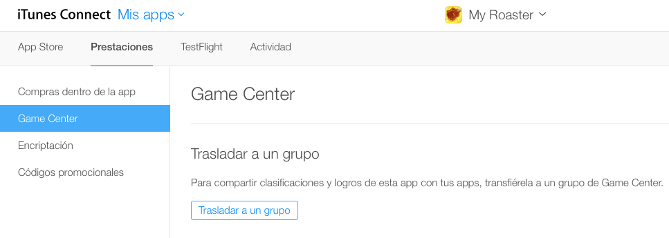

En la sección _Game Center_ veremos una lista de logros y de marcadores existentes, y podremos crear nuevos logros y marcadores tal como veremos a continuación.


#### Configuración de marcadores

En la lista de marcadores veremos todos los marcadores creados hasta el momento (inicialmente estará vacía), y tendremos un botón `+` que nos permitirá añadir nuevos marcadores a la aplicación.


Al pulsar sobre el botón para añadir un marcador nos preguntará si queremos una _Clasificación individual_ o _combinada_. Comenzaremos creando una _individual_ (sólo podemos crear _combinadas_ si ya contamos con clasificaciones _individuales_ que podamos combinar).


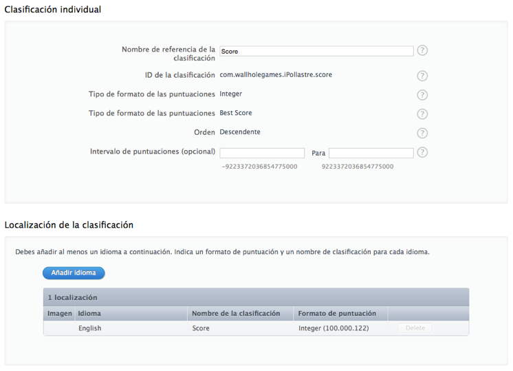

Para la clasificación deberemos dar:

* Un nombre descriptivo (sólo para identificarlo en la interfaz de la aplicación de gestión)
* Un identificador (con el que haremos referencia al marcador desde el código del juego)
* Un tipo de datos y formato con el que mostrar las puntuaciones
* Orden ascendente o descendente
* Valores máximo y mínimo que puede alcanzar la puntuación.

Además, en la parte inferior vemos que podemos localizar en varios idiomas el nombre y el formato de la puntuación. Esto es lo que el usuario del juego verá cuando se muestre la tabla de puntuaciones. 

#### Configuración de logros

De forma similar al caso de los marcadores, veremos también un listado de logros existentes con la posibilidad de añadir nuevos logros mediante el botón `+`.


Al añadir un nuevo logro, se nos presentará una interfaz donde introducir sus datos.

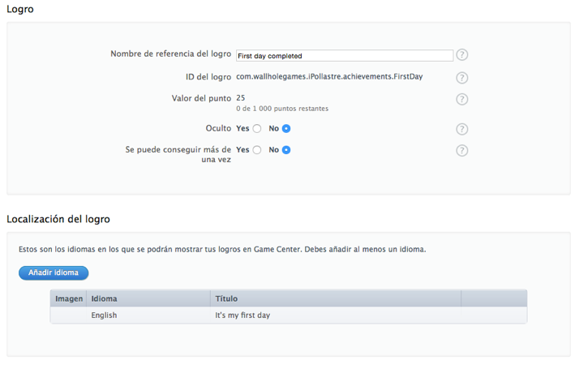
Los datos que debemos proporcionar de los logros son:

* Nombre descriptivo (sólo interno para la aplicación de gestión)
* Identificador (con el que haremos referencia a él desde el código)
* Valor del logro (en total pueden sumar como máximo 1000 puntos)
* Indicar si el logro es oculto o no
* Indicar si el logro se puede conseguir más de una vez (hay logros que se pueden conseguir gradualmente, hasta alcanzar su 100%)

En la parte inferior podemos localizar los textos de los logros a diferentes idiomas. Estos serán los textos que el usuario final verá cuando consigamos un logro o cuando se muestre el listado de logros del juego.

### Google Play Games

La plataforma Google Play Games (GPG) cuenta también con una interfaz similar para dar de alta logros y marcadores. Esta herramienta se encuentra integrada en la consola de desarrolladores de Android, en la sección _Servicios de juegos_

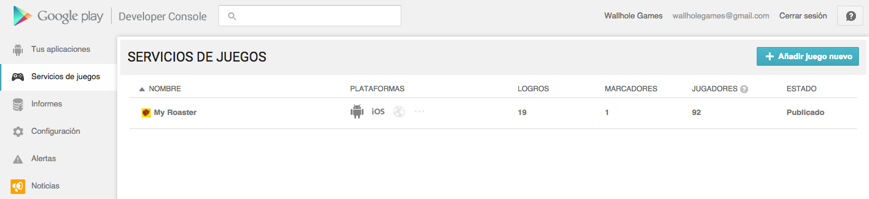

En dicha sección daremos de alta los juegos que queramos que puedan utilizar el servicio de GPG. Hay que remarcar que esto es algo totalmente independiente al alta de la aplicación Android (en _Tus aplicaciones_). En _Servicios de juegos_ simplemente creamos la ficha para nuestro juego en GPG, a la que se podrá acceder desde Android, iOS, u otras plataformas. Podríamos incluso crear aquí juegos que no estuvieran disponibles en Android.

En caso de querer crear la ficha del juego en GPG para un juego Android, será recomendable subir antes un APK, aunque se trate de una versión _alpha_. Si contamos con dicho APK, muchos de los datos necesarios para crear nuestra ficha los podrá obtener de forma automática a partir de dicho fichero, simplificando notablemente el proceso.

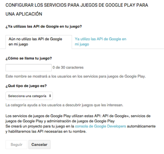

#### Configuración de logros

Una vez creado nuestro juego en los servicios de GPG, podremos acceder a su ficha y configurar logros y marcadores.

Entrando en la sección de _Logros_ veremos el listado de logros existentes, y un botón _Añadir nuevo logro_. En la lista podemos observar que cada logro tiene un ID que deberemos utilizar para hacer referencia a él desde el código de nuestro juego. A diferencia de Game Center, estos IDs no los introducimos nosotros, sino que son autogenerados. Esto nos obligará a tener que definir en nuestro juego dos listas de identificadores de logros diferentes, una para cada plataforma.

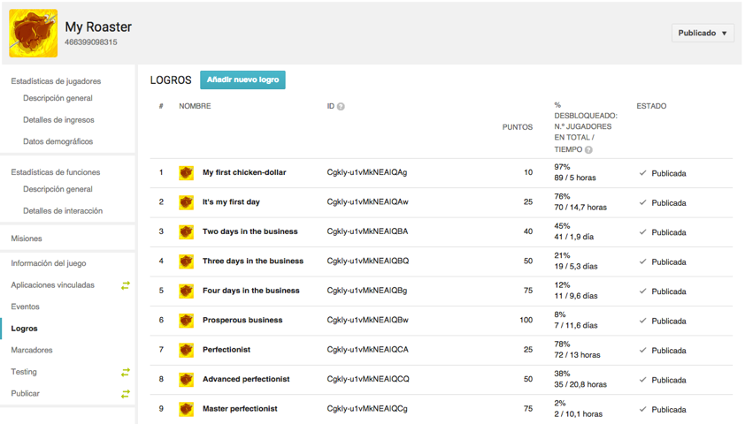

Si pulsamos sobre _Añadir nuevo logro_, o editamos uno de los existentes, veremos la pantalla para introducir datos del logro.


Para cada logro nos pide:

* Nombre (el que se le mostrará al usuario)
* Descripción
* Icono
* Indicar si es incremental (si podemos irlo consiguiendo a incrementos parciales)
* Puntos (con un máximo total de 1000 puntos, al igual que Game Center).

Estos datos pueden estar localizados a diferentes idiomas.

#### Configuración de marcadores

Dentro de la ficha de nuestro juego en GPG, también encontramos una sección _Marcadores_ donde podemos configurar los marcadores del juego. Veremos un listado de los marcadores existentes, cada uno de ellos con su ID autogenerado asociado, al igual que en el caso de los logros. También tendremos un botón _Añadir nuevo marcador_.

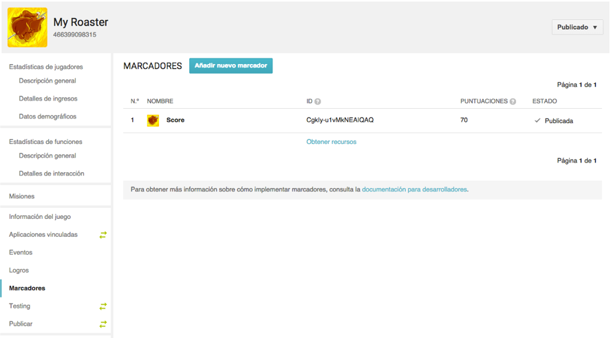

Pulsando sobre el botón _Añadir nuevo marcador_ o yendo a editar un marcador existente, veremos la pantalla para introducir los datos del marcador.

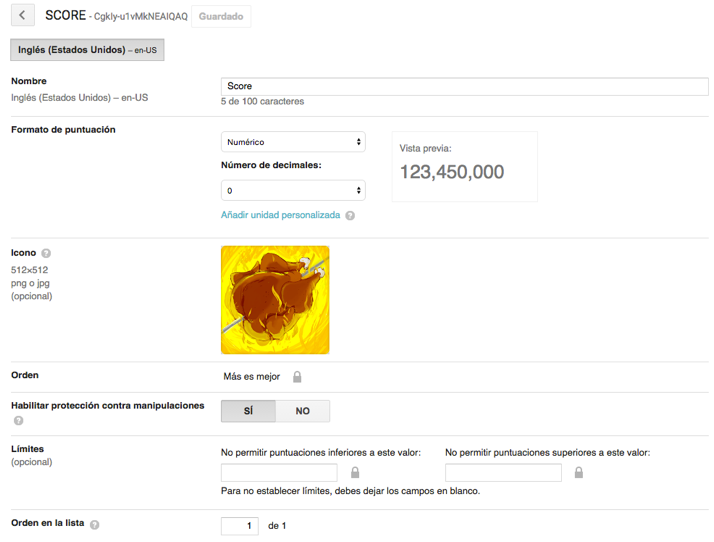

De cada marcador nos pide:

* Nombre (el que se le mostrará al usuario)
* Tipo de datos y formato de las puntuaciones
* Icono
* Límites inferior y superior de las puntuaciones

Al igual que en el caso anterior, podremos localizar la información de este formulario a diferentes idiomas.

## Implementación de logros y marcadores

Para implementar el soporte de logros y marcadores con Game Center contamos con el _framework_ `GameKit` nativo de la plataforma iOS. Por otro lado, para añadir soporte para Google Play Games en Android necesitaremos incluir en nuestro proyecto los Google Play Services, mientras que para iOS contamos con un SDK específico que podemos añadir al proyecto. Sin embargo, no contamos con soporte _"de serie"_ de logros y marcadores en Cocos2d-x. Para utilizar estas características con dicho motor, deberemos recurrir a las APIs nativas, o bien utilizar algún _plugin_ de terceros que haga esto por nosotros. Un _plugin_ que podemos utilizar para esta tarea es [GameSharing](http://www.cocos2d-x.org/hub/156). Éste nos proporciona una API C++ única que por debajo, dependiendo de la plataforma, utilizará Game Center (con `GameKit`) o Google Play Games (con los _Google Play Services_). 

Como veremos a continuación, las diferentes APIs para gestión de logros y marcadores son muy parecidas. Las interfaces multiplataforma que podemos encontrar en motores como Unity o en el _plugin_ GameSharing de Cocos2d-x se utilizan prácticamente de la misma forma que la API nativa `GameKit` de iOS. 

### Logros y marcadores con `GameKit`

Vamos a comenzar viendo cómo integrar Game Center mediante el _framework_ nativo `GameKit` de iOS. Para utilizarlo simplemente tendremos que añadir dicho _framework_ a nuestro proyecto de Xcode. Una vez añadido, podremos utilizar su API. Todas sus clases tienen el prefijo `GK`.

#### Inicialización

Para poder gestionar los logros y marcadores de nuestro juego en Game Center, lo primero que deberemos hacer es autenticar al usuario en dicha plataforma. Normalmente el usuario ya habrá configurado su cuenta de Game Center en el móvil, por lo que la autenticación será automática, sin tener que introducir _login_ ni _password_. En caso de que no hubiera configurado una cuenta de Game Center previamente, podremos invitarle a que lo haga en este momento.

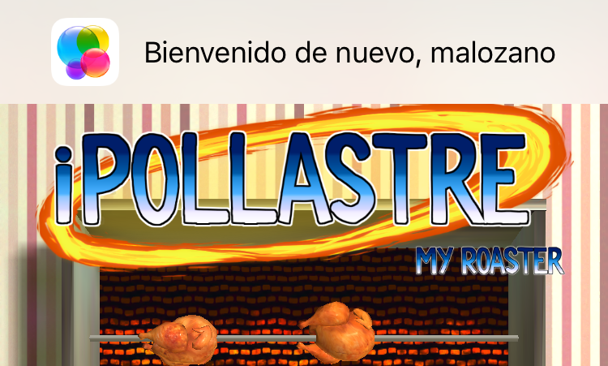

Para autenticar el usuario simplemente tendremos que obtener la instancia única (_singleton_) del objeto `GKLocalPlayer`, que hace referencia al usuario local configurado en el móvil, y asignar un bloque de código a su propiedad `authenticateHandler`. Con esto, la autenticación se hará de forma automática nada más establecer la propiedad, y volverá a autenticar al usuario cada vez que volvamos a abrir la aplicación.

```objc
GKLocalPlayer *player = [GKLocalPlayer localPlayer];
player.authenticateHandler = ^(UIViewController *viewController, NSError *error){
    if (viewController != nil)
    {
        // No hay usuario de GameCenter, presenta interfaz de autenticación
        [self presentViewController:viewController animated:YES completion:^{}];
    } else if(player.authenticated) {
        // Autenticación correcta
    } else {
        // Error en la autenticación
    }
};    
```

Podemos observar que pueden ocurrir tres cosas:

* Que se proporcione un `viewController`. Quiere decir que no hay usuario configurado en el dispositivo, y el `viewController` proporcionado nos sirve para invitar al usuario a que lo configure. Deberemos presentarlo como controlador modal.
* Que el usuario se autentique de forma correcta (se puede comprobar con la propiedad `player.authenticated`. 
* Que no se pueda autenticar al usuario. En este caso, debemos asegurarnos de que el uso de Game Center quede deshabilitado (no deberemos intenter publicar logros ni marcadores).

Podremos consultar la propiedad `player.authenticated` en cualquier momento para saber si podemos utilizar las funciones de Game Center en el juego.


#### Mostrar panel de logros y marcadores

Una vez tenemos al usuario autenticado en Game Center, podemos mostrar una pantalla estándar de la plataforma donde se muestra la ficha de Game Center para nuestro juego. En dicha pantalla podremos ver los marcadores y los logros conseguidos por el usuario hasta el momento:

```objc
GKGameCenterViewController* gkController = [[GKGameCenterViewController alloc] init];
gkController.gameCenterDelegate = self;

[self presentViewController:gkController animated:YES completion:^{}];
```

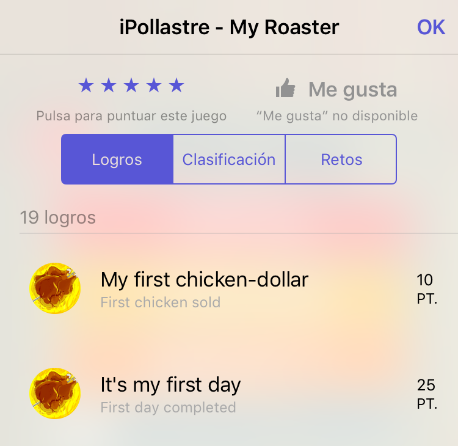

Si nuestro juego tiene varios marcadores, también podemos hacer que se muestre un marcador concreto estableciendo las siguientes propiedades del controlador anterior:

```objc
gkController.leaderboardIdentifier = ID_MARCADOR;
gkController.leaderboardTimeScope = GKLeaderboardTimeScopeAllTime;
```

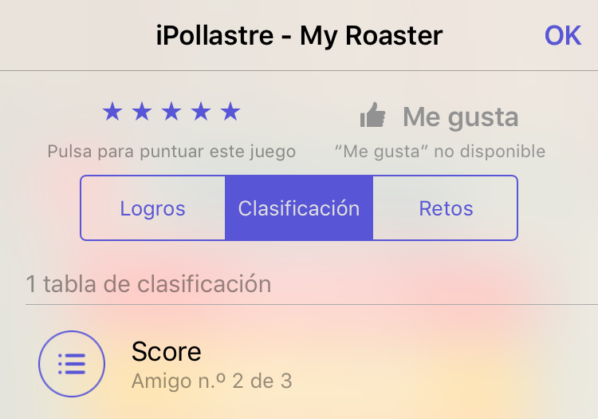

#### Gestión de puntuaciones

Cuando termine una partida, y nuestro jugador haya conseguido un nuevo récord, podemos subir dicha puntuación a su marcador global de Game Center. Deberemos crear un objeto `GKScore` con el identificador del marcador en el que publicar la puntuación, y asignar a su propiedad `value` el valor de la puntuación que queremos publicar:

```objc
GKScore *scoreReporter = [[GKScore alloc] initWithLeaderboardIdentifier: ID_MARCADOR];
scoreReporter.value = score;
scoreReporter.context = 0;

[GKScore reportScores:@[scoreReporter] withCompletionHandler:^(NSError *error) {
    if (error != nil) {
        // Error al enviar puntuacion
        // POSIBLE SOLUCION: Guardarlo en lista de pendientes de envio
    } else {
        // Puntuación enviada
    }
}];    
```

Hay que destacar que la publicación podría fallar, por ejemplo si la red está inaccesible en este momento. Una posible forma de solucionarlo es almacenar en nuestra aplicación una lista de puntuaciones pendientes de subir, para así poder volver a intentarlo la próxima vez que entremos en el juego.


#### Gestión de logros

La publicación de logros conseguidos se hará de forma similar a la de las puntuaciones de los marcadores. En este caso, para desbloquear un logro debemos proporcionar su identificador. Además, dado que podemos tener logros incrementales, debemos indicar el porcentaje de logro que queremos desbloquear (`percentComplete`). Si queremos desbloquear el logro completo, le daremos a esta propiedad el valor `100`. También podemos utilizar la propiedad `showsCompletionBanner` para que automáticamente muestre el _banner_ de desbloqueo de logro por defecto del sistema. Poniendo esta propiedad a `false` podríamos mostrar nuestro propio tipo de _banners_, si queremos personalizarlos.

```objc   
GKAchievement *achievement = [[GKAchievement alloc] initWithIdentifier: ID_LOGRO];
if (achievement){
    achievement.percentComplete = 100;
    achievement.showsCompletionBanner = true;
    [GKAchievement reportAchievements:@[achievement] withCompletionHandler:^(NSError *error) {
        if (error != nil) {
            // Error al publicar logro
            // POSIBLE SOLUCION: Guardarlo en lista de pendientes de envio
        } else {
            // Logro desbloqueado
        }
    }];
}
```

Al igual que en el caso de las puntuaciones, si obtenemos un error al desbloquear un logro, podemos guardarlo para intentarlo más adelante. Esto sólo debe hacerse como última instancia, ya que los logros deben ser desbloqueados de forma inmediata tras realizar la acción que los produce.

Es recomendable también sólo desbloquear logros cuando haya un progreso real del usuario en el juego, y evitar pedir desbloquear el mismo logro varias veces para evitar tráfico innecesario a través de la red. Para conseguir esto, podemos guardar una caché con los logros obtenidos, y así sólo intentar desbloquearlos cuando no estén en dicha caché. Para crearla podemos leer todos los logros obtenidos justo tras realizar la autenticación del usuario, mediante el método `loadAchievementsWithCompletionHandler` de la clase `GKAchievement`.

### Logros y marcadores con `GameSharing`

En caso de tener un proyecto multiplataforma Cocos2d-x podemos realizar llamadas a las APIs nativas de Game Center y Google Play Games para gestionar sus logros y marcadores, pero convendrá que hagamos esto de forma que el código del juego siga siendo multiplataforma. Podemos utilizar para ello un _plugin_ como _GameSharing_ que se encarga de "esconder" las llamadas a las APIs nativas tras una fachada C++. Dicha fachada se encuentra en la clase `GameSharing`, que no es necesario que instanciemos, ya que todos sus métodos son estáticos. Incluiremos dicha clase (`GameSharing.cpp` y `GameSharing.h`) en el directorio `Classes` del proyecto.

#### Configuración de _GameSharing_

Antes de poder utilizar dicha clase deberemos realizar una serie de tareas de configuración del proyecto. En el **caso de iOS** deberemos:

* Añadir el _framework_ `GameKit` al proyecto Xcode.
* Añadir las clases Objective-C nativas de la librería al proyecto Xcode (se encargan de hacer las llamadas nativas a GameCenter, y son utilizadas por la clase C++ `GameSharing`. Además, deberemos añadir la siguiente inicialización en la clase `AppDelegate`:

```objc
- (BOOL)application:(UIApplication *)application didFinishLaunchingWithOptions:(NSDictionary *)launchOptions {    
    ...
    
    // Init GameSharing
    GameSharing::initGameSharing_iOS((__bridge void *)_viewController);
    
    return YES;
}
```

* * Configurar la lista de logros y marcadores en un fichero `ios_ids.plist` dentro de los recursos del proyecto. Dicho fichero constará de un diccionario con dos claves: `Leaderboards` y `Achievements`. Cada una de ellas contendrá un _array_ con los identificadores de los marcadores y logros disponibles.

En el **caso de Android** deberemos realizar una serie de acciones similares:

* Incluir en el proyecto Android (directorio `libs`) las librerías de _Google Play Services_ y `android-support-v4`. 
* Incluir las clases Java nativas de la _GameSharing_ en el proyecto nativo y también una serie de recursos necesarios en el directorio `res`. Deberemos editar algunos de estos elementos para adaptarlos a nuestra aplicación, siguiendo las instrucciones indicadas en la documentación de la librería _GameSharing_.
* Añadimos a los ficheros de recursos dos recursos de tipo `string`: `leaderboards` y `achievements`, donde indicaremos los identificadores de marcadores y logros separados por `;`.

Hemos de destacar que en ambos casos hemos especificado una lista de marcadores y logros en ficheros de configuración externos. En el código siempre haremos referencia a estos elementos mediante el índice de la posición que ocupan en estas listas. Por ello es importante que en ambas listas se incluyan los logros y marcadores en el mismo orden, para así poder utilizar el mismo código para Android e iOS.

#### Uso de la API

Una vez realizada la configuración necesaria, podremos utilizar la API de _GameSharing_ en nuestro código de Cocos2d-x. En el caso de la versión iOS, deberemos inicializar la librería para autenticar al usuario local (esto no es necesario en Android):

```cpp
GameSharing::initGameSharing();
```

Podremos mostrar la pantalla estándar del sistema con los logros o marcadores del juego:

```cpp
GameSharing::ShowAchievementsUI();
GameSharing::ShowLeaderboards(indice);
```

También podemos desbloquear un logro dado su índice en el _array_ (siguiendo el orden en el que se especificaron en el fichero de configuración):

```cpp
GameSharing::UnlockAchivement(indice);
```

De la misma forma, podemos publicar la puntuación en uno de los marcadores (dado su índice en el _array_):

```cpp
GameSharing::SubmitScore(score,indice);
```


## Referencias

* Artículo sobre diseño de marcadores: 

[Leaderboards - The original social feature](http://www.gamesparks.com/blog/leaderboards/)

* Articulos sobre diseño de logros:

[Achievement Design 101](http://www.gamasutra.com/blogs/GregMcClanahan/20091202/86035/Achievement_Design_101.php)
[The Cake Is Not a Lie: How to Design Effective Achievements](http://www.gamasutra.com/view/feature/6360/the_cake_is_not_a_lie_how_to_.php?print=1)

* Artículo sobre juegos sociales:

[The social network game boom](http://www.gamasutra.com/view/feature/4009/the_social_network_game_boom.php)


