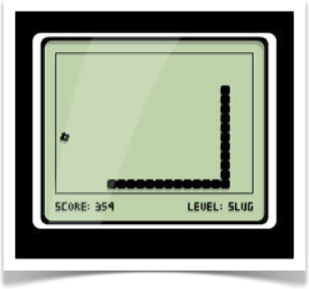

# Videojuegos para móviles

Sin duda uno de los tipos de aplicaciones que más famosos se han hecho en el mercado de los móviles son los videojuegos. Con estos teléfonos los usuarios pueden descargar juegos a través de
las diferentes tiendas online, normalmente a precios muy reducidos en relación a otras plataformas de videojuegos, y cuentan con la gran ventaja de que son dispositivos que siempre llevamos
con nosotros.

En este primer capítulo vamos a ver las características particulares de los videojuegos para móviles, y las herramientas y librerías que podemos utilizar para desarrollarlos y portarlos a las diferentes plataformas móviles, especialmente Android e iOS.
  

## Historia de los videojuegos en móviles

Los primeros juegos que podíamos encontrar en los móviles eran 
  normalmente juegos muy sencillos tipo puzzle o de mesa, o en todo caso juegos de acción muy simples similares a los primeros videojuegos aparecidos antes de los 80. El primer juego que apareció fue el Snake, que se incluyó preinstalado en
  determinados modelos de móviles Nokia (como por ejemplo el 3210) a partir de 1997. Se trataba de un juego monocromo, cuya versión original data de finales de los 70. Su traslado a los móviles Nokia supuso un enorme éxito, convirtiéndose en un icono de los dispositivos de esta compañía. Este era el único juego que venía preinstalado en estos móviles, y no contábamos con la posibilidad de descargar ningún otro.

  Con el avance de la tecnología, aparecieron móviles capaces de instalar nuevas aplicaciones. El sistema operativo más común era SymbianOS, pero casi todos los móviles, independientemente del sistema operativo que incorporasen, también soportaban la instalación de aplicación Java (plataforma Java ME). Esto, junto con el éxito que había cosechado _Snake_, dió lugar a la aparición de un gran número de videojuegos para las plataformas Symbian y Java ME.
  
  Con esto aparecieron juegos algo más complejos, similares a los que habían aparecido bastantes años antes para ordenadores 
  y consolas de 8 bits. Estos juegos irían mejorando conforme los teléfonos móviles evolucionaban, hasta llegar incluso a tener juegos sencillos en 3D. Los videojuegos fueron el tipo de aplicación Java más común para estos móviles, llegando al punto de que los móviles con soporte para Java ME comercialmente
  se vendían muchas veces como móvil con _Juegos Java_.
  
Además teníamos la ventaja de que en aquel momento ya existía una gran comunidad de programadores en Java, a los que no les costaría aprender a desarrollar este tipo de juegos para móviles, por lo que el número de juegos disponible crecería rápidamente. El poder descargar y añadir estos juegos al móvil de forma sencilla, como cualquier otra aplicación Java, hará estos juegos especialmente atractivos para los usuarios, permitiendo disponer continuamente de nuevos juegos en sus móviles.
  
Pero fue con la llegada del iPhone en 2007 y la App Store en 2008 cuando realmente se produjo el _boom_ de los videojuegos para móviles. La facilidad para obtener los contenidos en la tienda de Apple, junto a la capacidad de estos dispositivos para reproducir videojuegos causaron que en muy poco tiempo ésta pasase a ser la principal plataforma de videojuegos en móviles, incluso ganando terreno rápidamente a las videoconsolas portátiles.

En la actualidad las plataformas Android e iOS son el principal mercado de videojuegos para móviles, superando ya a las videoconsolas portátiles. Por detrás quedan otras plataformas como Windows Phone o Blackberry, en las que también podemos encontrar una gran cantidad de videojuegos disponibles. La capacidad de los dispositivos actuales permite que veamos videojuegos técnicamente cercanos a los que podemos encontrar en algunas videoconsolas de sobremesa.
  

## Motores para videojuegos

Normalmente los juegos consisten en una serie de niveles. Cada vez que superemos un nivel, entraremos en uno nuevo en el que se habrá incrementado la dificultad, y posiblemente encontremos algún elemento nuevo, como nuevos tipos de enemigos y nuevos poderes a utilizar, pero la mecánica del juego en esencia será la misma. 

Por este motivo, en el desarrollo de videojuegos es conveniente que el código fuente resulte lo más genérico y reutilizable posible, llevando la definición de los niveles a ficheros de datos (por ejemplo con formato xml o json), que contendrán la estructura del escenario, los enemigos que aparecerán en él, y otros elementos con los que podamos interactuar. De esta forma, cada vez que iniciemos un nuevo nivel, la cargarán los datos del fichero del nivel, y se aplicará sobre ellos la mecánica genérica del juego. Este código genérico capaz de leer, interpretar y reproducir los niveles de nuestro juego es lo que conoceremos como **motor del juego**.

Entre los ficheros de datos que podrá cargar nuestro motor (recursos conocidos habitualmente como **assets**) encontramos por ejemplo los gráficos del juego, fuentes, _clips_ de audio, la estructura de cada nivel, e incluso _scripts_ (programas en lenguajes de alto nivel que definen el comportamiento de las entidades del juego). 

En muchas ocasiones encontramos motores desarrollados para implementar un videojuego concreto. En estos casos, podremos añadir nuevos contenidos a nuestro juego (niveles, personajes, etc) añadiendo nuevos ficheros de datos que lea el motor sin tener que modificar el fuente. Sin embargo, conforme ha ido evolucionando la tecnología han ido apareciendo motores genéricos pensados para poder crear cualquier tipo de videojuego (o casi cualquiera). En estos casos ya no se lleva a los "datos" simplemente los contenidos del juego, sino también el comportamiento del mismo (normalmente mediante _scripting_). 

El uso de este tipo de motores nos proporcionará una serie de ventajas:
* **Independencia del _hardware_**: Esto es de especial importancia en el caso de las plataformas móviles. Si contamos con un motor genérico implementado para diferentes plataformas (Android, iOS, Windows Phone), podremos crear nuestro juego una única vez sobre dicho motor (con los tipos de ficheros de datos que soporte), y exportarlo a todas las plataformas soportadas.
* **Mejora del flujo de trabajo en el equipo de desarrollo**: Cada miembro del equipo de desarrollo trabajará sobre sus propios _assets_: el diseñador del juego con los datos de los niveles; el artista gráfico con las texturas, modelos, y animaciones 3D; músicos y técnicos de sonido con _clips_ de audio; y programadores con _scripts_. El motor se encargará de integrar todos estos elementos en el juego.
* **Centrarnos en lo que hace nuestro juego diferente**: El contar con estos motores nos permitirá crear juegos complejos centrándonos en el diseño y contenidos del juego, sin tener que implementar nosotros el motor genérico. Es decir, nos centramos en aquello que hace a nuestros juego distinto a los demás (contenidos), y no en aquello que es común a todos los juegos (motor).
* **Menor coste de desarrollo y _time to market_**: Evitar tener que implementar el motor a bajo nivel supondrá un notable ahorro en el coste del desarrollo, especialmente conforme el _hardware_ se hace más complejo, y nos permitirá llegar más rápidamente al mercado. 

## Motores y librerías para el desarrollo de videojuegos para móviles

Encontramos diferentes motores y librerías que nos permiten exportar videojuegos a distintas plataformas móviles. Vamos a realizar una revisión de las principales tecnologías disponibles que agruparemos en tres diferentes categorías:

* **Motores completos**: Motores completos que nos permitirán crear casi cualquier tipo de videojuego (2D y 3D) mediante sus propias herramientas de creación de contenidos. En estos casos la programación suele hacerse mediante lenguajes de _script_. En este grupo encontramos motores como **Unreal Engine 4** o **Unity**.
* **Herramientas de creación de videojuegos**: Herramientas visuales que nos permiten crear videojuegos de forma sencilla, en muchos casos sin la necesidad de saber programar. En estas herramientas suele estar más restringido el tipo de juegos que se pueden realizar, limitándose normalmente a juegos 2D. Dentro de este grupo encontramos herramientas como **Game Maker: Studio**, **Construct2** y **Gamesalad**.
* **Frameworks para el desarrollo de videojuegos**: En este grupo encontramos librerías multiplataforma (normalmente _Open Source_) orientadas al desarrollo de videojuegos. No cuentan con las herramientas de creación de contenidos de los casos anteriores, sino que casi todo lo tendremos que hacer mediante programación, pero nos permitirán escribir el juego una única vez y portarlo a diferentes plataformas móviles. En este grupo destacamos los _frameworks_ multiplataforma **Cocos2d-x** (desarrollo en C++) y **libgdx** (desarrollo en Java). Además, dentro de este grupo también encontramos los _frameworks_ nativos de la plataforma iOS **SpriteKit** (juegos 2D) y **SceneKit** (juegos 3D).

A continuación veremos más detalles de cada uno de los motores anteriores.

### Unreal Engine 4

Con este motor se han creado videojuegos como los juegos de la saga _Gears of War_, o _Daylight_, o _Street Fighter V_. Actualmente Unreal Engine 4 (UE4) es gratuito para todos los desarrolladores.  

Tiene un lenguaje de _scripting_ visual (_blueprints_) y también nos permite incorporar componentes en C++. Los videojuegos desarrollados con UE4 pueden empaquetarse como aplicaciones Android o iOS (además de PC, Mac, y videoconsolas como PS4 y Xbox One), y podemos distribuirlos en la App Store y en Google Play Market teniendo que pagar a Epic Games sólo un porcentaje de los _royalties_ en caso de que superemos cierto nivel de ganancias.

### Unity

Nos permite crear videojuegos para diferentes plataformas móviles como Android e iOS (además de otros tipos de plataformas). En este caso tenemos un motor capaz de realizar juegos tanto 3D como 2D, y resulta más accesible para desarrolladores noveles que el motor anterior. Además, permite realizar videojuegos de tamaño más reducido. 

### Cocos2d-x

A parte de los motores anteriores, que incorporan sus propias herramientas con las que podemos crear videojuegos de forma visual de forma independiente a la plataformas, también encontramos motores Open Source más sencillos que podemos utilizar para determinadas plataformas concretas. En este caso, no solemos contar con herramientas visuales completas para la creación del videojuego, como es el caso de los anteriores, sino simplemente con _frameworks_ y librerías que nos ayudarán a implementar los videojuegos, aislándonos de las capas de más bajo nivel como OpenGL o OpenAL, y ofreciéndonos un marco que nos simplificará la implementación del videojuego. Uno de estos motores es **Cocos2d-x**, que nos permite crear en C++ videojuegos para las principales plataformas móviles.

### SpriteKit y SceneKit

De forma alternativa, en iOS contamos con dos _frameworks_ nativos de la plataforma orientados a la creación de videojuegos: **SpriteKit** y **SceneKit**, para juegos 2D y 3D respectivamente. Al ser nativos, nos permitirán crear videojuegos optimizados para esta plataforma y reducir el tamaño del paquete de la aplicación, pero sólo podrán ser utilizados en iOS.

## Características de los videojuegos para móviles

Los dispositivos móviles presentan diferencias notables respecto a los equipos de sobremesa (ordenadores y consolas), en relación a la capacidad del _hardware_, la interfaz, y el tipo de uso que se les da. Esto tendrá importantes repercusiones en el diseño de videojuegos para estos dispositivos.

Vamos a revisar a continuación los principales aspectos que tendremos que tener en cuenta a la hora de diseñar videojuegos para dispositivos móviles:

* **Limitaciones de la memoria**. En los primeros dispositivos (Java ME) la memoría suponía una gran limitación, ya que en algunos dispositivos contábamos con tan solo 128kb para todo el juego. Con el avance de la tecnología esta limitación se ha ido atenuando y hoy en día ya no supone algo crítico. Sin embargo, deberemos llevar especial cuidado con la memoria de vídeo. Por este motivo será importante seleccionar un formato de textura adecuado (el más compacto que cumpla con las necesidades para el videojuego), y será común comprimir las texturas. También es importante empaquetar nuestros gráficos de forma óptima para así aprovechar al máximo el espacio de las texturas. Encontraremos herramientas como Texture Packer que se encargan de realizar esta tarea.
* **Tamaño de la aplicación**. Los videojuegos para plataformas de sobremesa habitualmente ocupan varios gigas. En un móvil la distribución de juegos siempre es digital, por lo que deberemos reducir este tamaño en la medida de lo posible, tanto para evitar tener que descargar un paquete demasiado grande a través de la limitada conexión del móvil, como para evitar que ocupe demasiado espacio en la memoria de almacenamiento del dispositivo (que en algunos dispositivos es escaso). Para poder descargar un juego vía conexión de datos no debería exceder los 20Mb, por lo que será recomendable conseguir empaquetarlo en un espacio menor, para que los usuarios puedan acceder a él sin necesidad de disponer de Wi-Fi. Esto nos dará una importante ventaja competitiva. Para esto es importante hacer una buena elección del motor a utilizar. Motores complejos como Unity 5 generan paquetes con un tamaño mínimo de unas 20Mb, mientras que otros motores como Cocos2d-x nos permitirían tener juegos a partir de unas 5Mb. Si nuestro juego no necesita gráficos 3D ni otras de las características que sólo se encuentren en Unity, puede ser conveniente seleccionar un motor más sencillo como Cocos2d-x.
* **Capacidad de procesamiento**. La CPU y GPU de los móviles en muchas ocasiones es más limitada que la de plataformas de sobremesa. Es importante que los juegos vayan de forma fluida, por lo que antes de distribuirlos deberemos probarlos en diferentes móviles reales para asegurarnos de que funcione bien, ya que muchas veces los emuladores funcionarán a velocidades distintas. Es conveniente empezar desarrollando un código claro y limpio, y posteriormente optimizarlo. Para optimizar el juego deberemos identificar el lugar donde tenemos el cuello de botella, que podría ser en el procesamiento, o en el dibujado de los gráficos. En el segundo caso podemos ajustar en el motor la calidad de los gráficos para cada plataforma.
* **Pantalla reducida**. Deberemos tener esto en cuenta en los 
juegos, y hacer que todos los objetos se vean correctamente. Podemos utilizar _zoom_ en determinadas zonas para poder visualizar mejor los objetos de la escena. Deberemos cuidar que todos los elementos de la interfaz puedan visualizarse correctamente y que tengan un tamaño adecuado para interactuar con ellos. Los botones u otros elementos con los que podamos interactuar en la pantalla táctil tendrán que tener al menos el tamaño de la yema del dedo. 
* **Diferente interfaz de entrada**. Actualmente los móviles no suelen tener teclado, y en aquellos que lo tienen este teclado es muy pequeño. Deberemos intentar proporcionar un manejo cómodo, adaptado a la interfaz de entrada con la que cuenta el móvil,
como el acelerómetro o la pantalla táctil, haciendo que el control sea lo más sencillo posible, con un número reducido de posibles acciones. En muchos casos el manejo del juego se reduce a hacer _tap_ en pantalla. Para mecánicas más complejas, se puede utilizar un mando virtual (hay que hacer un buen diseño del mismo para que sea usable), o soportar mandos externos.
* **Ancho de banda reducido e inestable**. Si desarrollamos juegos en red deberemos tener en determinados momentos velocidad puede ser baja, según la cobertura, y podemos tener también una elevada latencia de la red. Incluso es posible que en determinados momentos se pierda la conexión temporalmente. Deberemos minimizar el tráfico que circula por la red. 
* **Posibles interrupciones**. En el móvil es muy probable que se produzca una interrupción involuntaria de la partida, por ejemplo 
cuando recibimos una llamada entrante. Deberemos permitir que esto ocurra. Además también es conveniente que el usuario pueda pausar la partida fácilmente, ya que estos dispositivos se utilizan habitualmente para "hacer tiempo". Si estamos jugando mientras esperamos el autobús o esperamos nuestro turno en una tienda, cuando llegue nuestro turno deberemos poder interrumpir la partida inmediatamente sin perder nuestro progreso. Es fundamental hacer que cuando otra aplicación pase a segundo plano nuestro juego se pause automáticamente, para así no afectar al progreso que ha hecho el usuario. Incluso lo deseable sería que cuando salgamos de la aplicación en cualquier momento siempre se guarde el estado actual del juego, para que el usuario pueda continuar por donde se había quedado la próxima vez que juegue. Esto permitirá que el usuario pueda cerrar el juego en cualquier momento sin miedo de perder sus avances.

Ante todo, estos deben ser atractivos para los jugadores, ya que su principal finalidad es entretener. Debemos tener en cuenta que son videojuegos que normalmente se utilizarán para hacer tiempo, por lo que es deseable que la curva de aprendizaje sea suave y que permita partidas rápidas. Dos aspectos fundamentales son la adquisición y la retención de jugadores. Tenemos que conseguir que que los usuarios prueben nuestro juego y que continuen jugando a él. Para incentivar esto deberemos ofrecerle alguna recompensa por seguir jugando, y la posibilidad de que pueda compartir estos logros con otros jugadores.

