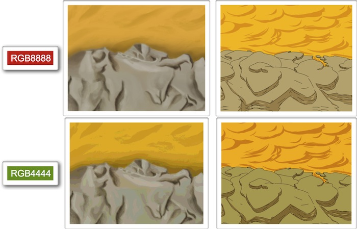
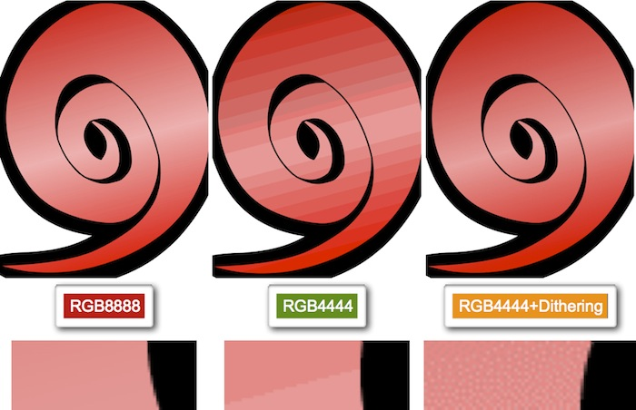
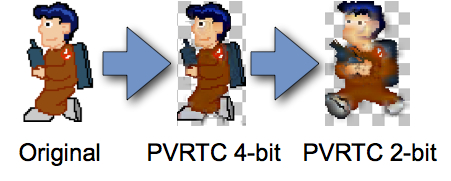
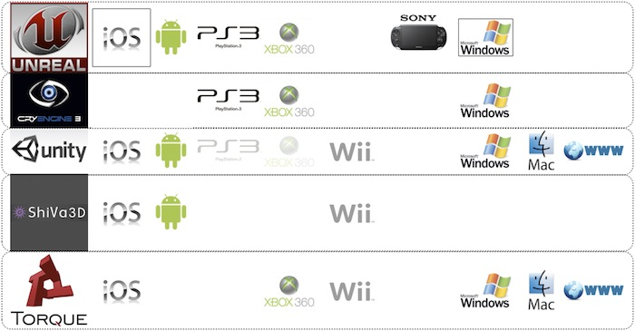
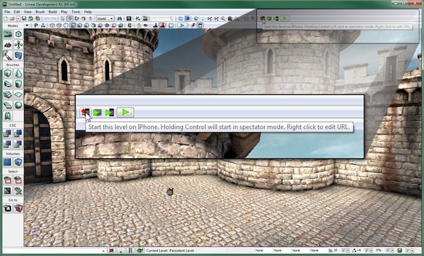
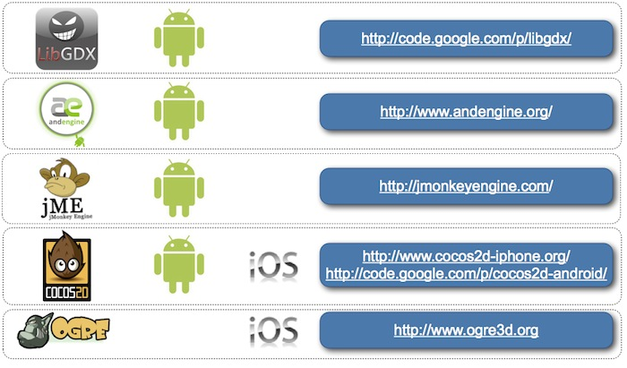

# Videojuegos para móviles

Sin duda el tipo de aplicaciones que más famoso se ha hecho en el mercado de los móviles
son los videojuegos. Con estos teléfonos los usuarios pueden descargar estos juegos a través de
las diferentes tiendas online, normalmente a precios muy reducidos en relación a otras plataformas
de videojuegos, y cuentan con la gran ventaja de que son dispositivos que siempre llevamos
con nosotros.

Vamos a ver los conceptos básicos de la programación de videojuegos y las  herramientas y 
librerías que podemos utilizar para desarrollar este tipo de aplicaciones para las plataformas
Android e iOS.
  

## Historia de los videojuegos en móviles

Los primeros juegos que podíamos encontrar en los móviles eran 
  normalmente juegos muy sencillos tipo puzzle o de mesa, o en todo caso juegos 
  de acción muy simples similares a los primeros videojuegos aparecidos 
  antes de los 80. El primer juego que apareció fue el Snake, que se incluyó preinstalado en
  determinados modelos de móviles Nokia (como por ejemplo el 3210) a partir de 1997. Se trataba
  de un juego monocromo, cuya versión original data de finales de los 70. Este era el único
  juego que venía preinstalado en estos móviles, y no contábamos con la posibilidad
  de descargar ningún otro.

  Con la llegada de los móviles con soporte para Java aparecieron 
  juegos más complejos, similares a los que se podían ver en los ordenadores 
  y consolas de 8 bits, y estos juegos irían mejorando conforme los teléfonos  
  móviles evolucionaban, hasta llegar incluso a tener juegos sencillos
  en 3D. Los videojuegos fueron el tipo de aplicación Java más común para estos
  móviles, llegando al punto de que los móviles con soporte para Java ME comercialmente
  se vendían muchas veces como móvil con _Juegos Java_.
  
Además teníamos las ventajas de que existía ya una gran comunidad de programadores 
  en Java, a los que no les costaría aprender a desarrollar este tipo de 
  juegos para móviles, por lo que el número de juegos disponible 
  crecería rápidamente. El poder descargar y añadir estos 
  juegos al móvil de forma sencilla, como cualquier otra aplicación 
  Java, hará estos juegos especialmente atractivos para los usuarios, ya 
  que de esta forma podrán estar disponiendo continuamente de nuevos juegos 
  en su móvil.
  
Pero fue con la llegada del iPhone y la App Store en 2008 cuando realmente se produjo
  el _boom_ de los videojuegos para móviles. La facilidad para obtener los
  contenidos en la tienda de Apple, junto a la capacidad de estos dispositivos
  para reproducir videojuegos causaron que en muy poco tiempo ésta pasase a ser
  la principal plataforma de videojuegos en móviles, e incluso les comenzó a 
  ganar terreno rápidamente a las videoconsolas portátiles.

En la actualidad la plataforma de Apple continua siendo el principal mercado para
  videojuegos para móviles, superando ya a videoconsolas portátiles como la PSP. 
  Comparte este mercado con las plataformas Android y Windows Phone, en las que
  también podemos encontrar una gran cantidad de videojuegos disponibles. La
  capacidad de los dispositivos actuales permite que veamos videojuegos técnicamente cercanos
  a los que podemos encontrar en algunas videoconsolas de sobremesa.
  

## Características de los videojuegos

Los juegos que se ejecutan en un móvil tendrán distintas características 
  que los juegos para ordenador o videoconsolas, debido a las peculiaridades de 
  estos dispositivos. 
  
Estos dispositivos suelen tener una serie de limitaciones. Muchas de ellas van desapareciendo
conforme avanza la tecnología:

* **Escasa memoria**. En móviles Java ME la memoria era un gran problema. 
    Debíamos controlar mucho el número de objetos en memoria, ya que en algunos casos
    teníamos únicamente 128Kb disponible para el juego. Esto nos obligaba 
    a rescatar viejas técnicas de programación de videojuegos de 
    los tiempos de los 8 bits a mediados/finales de los 80. En dispositivos actuales no
    tenemos este problema, pero aun así la memoria de vídeo es mucho más limitada que
    la de los ordenadores de sobremesa. Esto nos obligará a tener que llevar cuidado con el
    tamaño o calidad de las texturas. 
  
* **Tamaño de la aplicación**. Actualmente los videojuegos para plataformas
  de sobremesa ocupan varios Gb. En un móvil la distribución de juegos siempre es digital, por
  lo que deberemos reducir este tamaño en la medida de lo posible, tanto para evitar tener
  que descargar un paquete demasiado grande a través de la limitada conexión del móvil, como
  para evitar que ocupe demasiado espacio en la memoria de almacenamiento del dispositivo. 
  En dispositivos Java ME el tamaño del JAR con en el que empaquetamos el juego muchas 
  veces estaba muy limitado, incluso en algunos casos el tamaño máximo era de 64Kb. 
  En dispositivos actuales, aunque tengamos suficiente espacio, para
  poder descargar un juego vía 3G no podrá exceder de los 20Mb, por lo que será
  recomendable conseguir empaquetarlo en un espacio menor, para que los usuarios puedan
  acceder a él sin necesidad de disponer de Wi-Fi. Esto nos dará una importante ventaja
  competitiva.
* **CPU lenta**. La CPU de los móviles es más lenta 
    que la de los ordenadores de sobremesa y las videoconsolas. Es importante 
    que los juegos vayan de forma fluida, por lo que antes de distribuir nuestra 
    aplicación deberemos probarla en móviles reales para asegurarnos 
    de que funcione bien, ya que muchas veces los emuladores funcionarán 
    a velocidades distintas. En el caso de Android ocurre al contrario, ya que el emulador
    es demasiado lento como para poder probar un videojuego en condiciones. Es conveniente
    empezar desarrollando un código claro y limpio, y posteriormente optimizarlo. Para
    optimizar el juego deberemos identificar el lugar donde tenemos el cuello de botella, 
    que podría ser en el procesamiento, o en el dibujado de los gráficos. 
  
* **Pantalla reducida**. Deberemos tener esto en cuenta en los 
    juegos, y hacer que todos los objetos se vean correctamente. Podemos utilizar 
    _zoom_ en determinadas zonas para poder visualizar mejor los objetos 
    de la escena. Deberemos cuidar que todos los elementos de la interfaz puedan
    visualizarse correctamente, y que no sean demasiado pequeños como para poder verlos
    o interactuar con ellos.
  
* **Almacenamiento limitado**. En muchos móviles Java ME el espacio
    con el que contábamos para almacenar datos estaba muy limitado. 
    Es muy importante permitir guardar la partida, para que el usuario puede 
    continuar más adelante donde se quedó. Esto es especialmente 
    importante en los móviles, ya que muchas veces se utilizan estos juegos 
    mientras el usuario viaja en autobús, o está esperando, de forma 
    que puede tener que finalizar la partida en cualquier momento. Deberemos hacer 
    esto utilizando la mínima cantidad de espacio posible.
  
* **Ancho de banda reducido e inestable**. Si desarrollamos juegos en red deberemos 
    tener en determinados momentos velocidad puede ser baja, según la cobertura, y 
    podemos tener también una elevada latencia de la red. Incluso es posible que en
    determinados momentos se pierda la conexión temporalmente. Deberemos minimizar 
    el tráfico que circula por la red. 
  
* **Diferente interfaz de entrada**. Actualmente los móviles no suelen tener
    teclado, y en aquellos que lo tienen este teclado es muy pequeño. 
    Deberemos intentar proporcionar un manejo cómodo, adaptado a la interfaz de entrada con la que cuenta el móvil,
    como el acelerómetro o la pantalla táctil, haciendo que el control sea lo más sencillo 
    posible, con un número reducido de posibles acciones.
  
* **Posibles interrupciones**. En el móvil es muy probable 
    que se produzca una interrupción involuntaria de la partida, por ejemplo 
    cuando recibimos una llamada entrante. Deberemos permitir que esto ocurra. 
    Además también es conveniente que el usuario pueda pausar la 
    partida fácilmente. Es fundamental hacer que cuando otra aplicación pase
    a primer plano nuestro juego se pause automáticamente, para así no afectar al 
    progreso que ha hecho el usuario. Incluso lo deseable sería que cuando salgamos de la
    aplicación en cualquier momento siempre se guarde el estado actual del juego, 
    para que el usuario pueda continuar por donde se había quedado la próxima
    vez que juegue. Esto permitirá que el usuario pueda dejar utilizar el juego mientras
    está esperando, por ejemplo a que llegue el autobús, y cuando esto ocurra lo pueda
    dejar rápidamente sin complicaciones, y no perder el progreso.

Ante todo, estos videojuegos deben ser atractivos para los jugadores, ya que 
  su única finalidad es entretener. Debemos tener en cuenta que son videojuegos
  que normalmente se utilizarán para hacer tiempo, por lo que no deben requerir apenas de ningún
  aprendizaje previo para empezar a jugar, y las partidas deben ser rápidas. También
  tenemos que conseguir que el usuario continue jugando a nuestro juego. Para incentivar
  esto deberemos ofrecerle alguna recompensa por seguir jugando, y la posibilidad de que
  pueda compartir estos logros con otros jugadores.

## Gráficos de los juegos

Como hemos comentado, un juego debe ser atractivo para el usuario. Debe mostrar gráficos
detallados de forma fluida, lo cual hace casi imprescindible trabajar con OpenGL para
obtener un videojuego de calidad. Concretamente, en los dispositivos móviles se utiliza
OpenGL ES, una versión reducida de OpenGL pensada para este tipo de dispositivos. Según las
características del dispositivo se utilizará OpenGL ES 1.0 o OpenGL ES 2.0. Por ejemplo, 
las primeras generaciones de iPhone soportaban únicamente OpenGL ES 1.0, mientras que actualmente
se pueden utilizar ambas versiones de la librería.

Si no estamos familiarizados con dicha librería, podemos utilizar librerías que nos ayudarán
a implementar videojuegos sin tener que tratar directamente con OpenGL, como veremos a continuación.
Sin embargo, todas estas librerías funcionan sobre OpenGL, por lo que deberemos tener
algunas nociones sobre cómo representa los gráficos OpenGL.

Los gráficos a mostrar en pantalla se almacenan en memoria de vídeo como texturas. La memoria
de vídeo es un recurso crítico, por lo que deberemos optimizar las texturas para ocupar
la mínima cantidad de memoria posible. Para aprovechar al máximo la memoria, se recomienda que 
las texturas sean de tamaño cuadrado y potencia de 2 (por ejemplo 128x128, 256x256, 512x512, 1024x1024, 
o 2048x2048). En OpenGL ES 1.0 el tamaño máximo de las texturas es de 1024x1024, mientras que en 
OpenGL ES 2.0 este tamaño se amplía hasta 2048x2048.

Podemos encontrar diferentes formatos de textura:

* `RGB8888`: 32 bits por pixel. Contiene un canal _alpha_ de 8 bits, con el que 
podemos dar a cada pixel 256 posibles niveles de transparencia. Permite representar más de 16 millones
de colores (8 bits para cada canal RGB).
* `RGB4444`: 16 bits por pixel. Contiene un canal _alpha_ de 4 bits, con el que 
podemos dar a cada pixel 16 posibles niveles de transparencia. Permite representar 4.096 colores (4 bits para cada canal RGB). Esto 
permite representar colores planos, pero no será capaz de representar correctamente los degradados.
* `RGB565`: 16 bits por pixel. No permite transparencia. Permite representar 65.536 colores, con 
6 bits para el canal verde (G), y 5 bits para los canales rojo (R) y azul (B). Este tipo de textura será
la más adecuada para fondos.
* `RGB5551`: 16 bits por pixel. Permite transparencia de un sólo bit, es decir, que un pixel
puede ser transparente u opaco, pero no permite niveles intermedios. Permite representar 32.768 colores
(5 bits para cada canal RGB).

Debemos evitar en la medida de lo posible utilizar el tipo `RGB8888`, debido no sólo al espacio
que ocupa en memoria y en disco (aumentará significativamente el tamaño del paquete), sino también a que
el rendimiento del videojuego disminuirá al utilizar este tipo de texturas. Escogeremos un tipo u otro según
nuestras necesidades. Por ejemplo, si nuestros gráficos utilizan colores planos, `RGB4444` puede
ser una buena opción. Para fondos en los que no necesitemos transparencia la opción más adecuada sería
`RGB565`. Si nuestros gráficos tienen un borde sólido y no necesitamos transparencia parcial, pero
si total, podemos utilizar `RGB5551`.

En caso de necesitar utilizar `RGB4444` con texturas en las que tenemos degradado, podemos 
aplicar a la textura el efecto _dithering_ para que el degradado se represente de una forma más adecuada
utilizando un reducido número de colores. Esto se consigue mezclando píxeles de distintos colores y modificando
la proporción de cada color conforme avanza el degradado, evitando así el efecto de degradado escalonado
que obtendríamos al representar las texturas con un menor número de colores.

También tenemos la posibilidad de utilizar formatos de textura comprimidos para aprovechar al máximo el
espacio y obtener un mayor rendimiento. En iPhone el formato de textura soportado es PVRTC. Existen variantes de 2 y 4
bits de este formato. Se trata de un formato de compresión con pérdidas.

En Android los dispositivos con OpenGL ES 1.0 no tenían ningún formato estándar de compresión. Según el dispositivo
podíamos encontrar distintos formatos: ATITC, PVRTC, DXT. Sin embargo, todos los dispositivos con soporte para
OpenGL ES 2.0 soportan el formato ETC1. Podemos convertir nuestras texturas a este formato con la herramienta
`$ANDROID_SDK_HOME/tools/etc1tool`, incluida con el SDK de Android. Un inconveniente de este formato
es que no soporta canal _alpha_.

## Motores de juegos para móviles

Cuando desarrollamos juegos, será conveniente llevar a la capa de datos 
  todo lo que podamos, dejando el código del juego lo más sencillo y genérico que sea 
  posible. Por ejemplo, podemos crear ficheros de datos donde se especifiquen las características 
  de cada nivel del juego, el tipo y el comportamiento de los enemigos, los textos, 
  etc.
  
Normalmente los juegos consisten en una serie de niveles. Cada vez que superemos 
  un nivel, entraremos en uno nuevo en el que se habrá incrementado la 
  dificultad, pero la mecánica del juego en esencia será la misma. 
  Por esta razón es conveniente que el código del programa se encargue 
  de implementar esta mecánica genérica, lo que se conoce como **motor 
  del juego**, y que lea de ficheros de datos todas las características de cada 
  nivel concreto.
  
De esta forma, si queremos añadir o modificar niveles del juego, cambiar 
  el comportamiento de los enemigos, añadir nuevos tipos de enemigos, 
  o cualquier otra modificación de este tipo, no tendremos que modificar el código 
  fuente, simplemente bastará con cambiar los ficheros de datos. Por ejemplo,
  podríamos definir los datos del juego en un fichero XML, JSON o plist.
  
Esto nos permite por ejemplo tener un motor genérico implementado para diferentes 
   plataformas (Android, iOS, Windows Phone), y portar los videojuegos llevando
   los ficheros de datos a cada una de ellas.

Encontramos diferentes motores que nos permiten crear videojuegos destinados
a distintas plataformas. El contar con estos motores nos permitirá crear juegos complejos
centrándonos en el diseño del juego, sin tener que implementar nosotros el motor
a bajo nivel. Uno de estos motores es **Unreal Engine**, con el que se han
creado videojuegos como la trilogía de _Gears of War_, o _Batmat Arkham City_.
Existe una versión gratuita de las herramientas de desarrollo de este motor, conocida como
Unreal Development Kit (UDK). Entre ellas tenemos un editor visual de escenarios y 
plugins para crear modelos 3D de objetos y personajes con herramientas como 3D Studio Max. 
Tiene un lenguaje de programación visual para definir el comportamiento de los objetos
del escenario, y también un lenguaje de _script_ conocido como UnrealScript que
nos permite personalizar el juego con mayor flexibilidad. Los videojuegos desarrollados
con UDK pueden empaquetarse como aplicaciones iOS, y podemos distribuirlos en la App Store
previo pago de una reducida cuota de licencia anual (actualmente $99 para desarroladores
_indie_). En la versión de pago de este motor, se nos permite también crear
aplicaciones para Android  y para otras plataformas.

También encontramos otros motores como **Unity**, que también nos permite
crear videojuegos para diferentes plataformas móviles como Android e iOS (además de otros
tipos de plataformas). En este caso tenemos un motor capaz de realizar juegos 3D como
en el caso anterior, pero resulta más accesible para desarrolladores noveles. Además, 
permite realizar videojuegos de tamaño más reducido que con el motor anterior (en el caso
de Unreal sólo el motor ocupa más de 50Mb, lo cual excede por mucho el tamaño máximo que
debe tener una aplicación iOS para poder ser descargada vía Wi-Fi). También encontramos
otros motores como ShiVa o Torque 2D/3D.

A parte de los motores anteriores, que incorporan sus propias herramientas con las que
podemos crear videojuegos de forma visual de forma independiente a la plataformas, también
encontramos motores Open Source más sencillos que podemos utilizar para determinadas
plataformas concretas. En este caso, más que motores son _frameworks_ y librerías
que nos ayudarán a implementar los videojuegos, aislándonos de las capas de más bajo nivel
como OpenGL o OpenAL, y ofreciéndonos un marco que nos simplificará la implementación
del videojuego.

